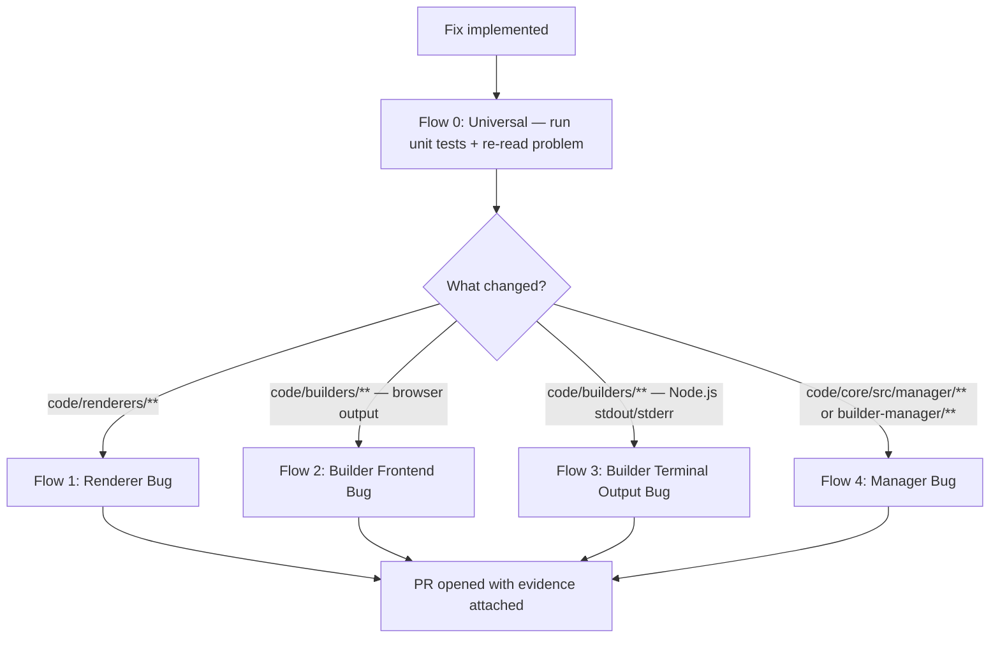

# GitHub Copilot Instructions for Storybook

This document provides comprehensive instructions for GitHub Copilot when working on the Storybook repository.

## Repository Overview

Storybook is a large monorepo built with TypeScript, React, and various other frameworks. The monorepo root is at the git root (not `code/`), with the main codebase in `code/` and build tooling in `scripts/`.

## System Requirements

- **Node.js**: 22.21.1 (see `.nvmrc`)
- **Package Manager**: Yarn 4.10.3
- **Operating System**: Linux/macOS (CI environment)

## Repository Structure

```
storybook/                        # Yarn monorepo root
├── .github/                      # GitHub configurations and workflows
├── .nx/                          # NX workflows and configuration
├── code/                         # Main codebase
│   ├── .storybook/               # Configuration for internal UI Storybook
│   ├── core/                     # Core Storybook package
│   ├── lib/                      # Core supporting libraries
│   ├── addons/                   # Core Storybook addons
│   ├── builders/                 # Builder integrations
│   ├── renderers/                # Renderer integrations
│   ├── frameworks/               # Framework integrations
│   ├── presets/                  # Preset packages for Webpack-based integrations
│   └── sandbox/                  # Internal build artifacts (ignore)
├── scripts/                      # Build and development scripts
├── docs/                         # Documentation
├── test-storybooks/              # Test repos
└── ../storybook-sandboxes/       # Generated sandbox environments (outside repo)
```

## Essential Commands and Build Times

All commands run from the **repository root** unless otherwise specified.

### Installation & Setup

```bash
yarn                              # Install all dependencies (~2.5 min)
```

### Compilation (Two Approaches)

**Using yarn task (custom task runner):**

```bash
yarn task compile                 # Compile all packages (~3 min)
```

**Using NX (recommended for better caching):**

```bash
yarn nx run-many -t compile -c production    # Compile all packages
yarn nx compile <package-name> -c production # Compile specific package
```

### Linting

```bash
yarn lint                         # Run all linting checks (~4 min)
```

Fix linting on all touched files by running the following command before commiting:

```bash
yarn --cwd code lint:js:cmd <file> --fix
```

### Type Checking

```bash
yarn task check                   # TypeScript type checking
# OR with NX:
yarn nx run-many -t check -c production
```

### Development Server

```bash
# Start Storybook UI development server
cd code && yarn storybook:ui      # Serves on http://localhost:6006/
# Requires compilation first!

# Build Storybook UI for production
cd code && yarn storybook:ui:build  # Output: code/storybook-static/
```

### Testing

```bash
cd code && yarn test              # Run all tests
cd code && yarn test:watch        # Watch mode
cd code && yarn storybook:vitest  # Storybook UI specific tests

# Task-based testing (with template sandboxes)
yarn task e2e-tests-dev --template react-vite/default-ts --start-from auto
yarn task e2e-tests-build --template react-vite/default-ts --start-from auto
yarn task test-runner-dev --template react-vite/default-ts --start-from auto
yarn task test-runner-build --template react-vite/default-ts --start-from auto
```

## NX Task Runner (Recommended)

The repository uses NX for task orchestration with better caching and dependency management. NX correctly invalidates compile/check steps when `scripts/` changes.

### yarn task vs NX equivalents

```bash
# Compilation
yarn task compile --no-link
yarn nx run-many -t compile -c production

# E2E tests on specific template
yarn task e2e-tests-dev --template react-vite/default-ts --start-from auto --no-link
yarn nx e2e-tests-dev react-vite/default-ts -c production

# Skip task dependencies (start from a specific step)
yarn task e2e-tests-dev --start-from e2e-tests --template react-vite/default-ts --no-link
yarn nx e2e-tests-dev -c production --exclude-task-dependencies
```

### Key NX Concepts

- `-c production` flag is **required** for sandbox-related commands
- `react-vite/default-ts` is the default project (can omit in NX commands)
- NX automatically handles task dependencies via `nx.json` configuration
- Uses NX Cloud for distributed caching in CI

## Important Warnings and Limitations

### Commands to Avoid

- **DO NOT RUN**: `yarn task dev` - This starts a permanent development server that runs indefinitely
- **DO NOT RUN**: `yarn start` - Also starts a long-running development server

### Sandbox Location Change

Sandboxes are now generated **outside** the repository at `../storybook-sandboxes/` by default.

- Set `STORYBOOK_SANDBOX_ROOT=./sandbox` for local sandbox directory (not recommended)
- The `./sandbox` directory exists only for NX outputs (not for CI tests)

### Available Task Commands

The repository includes task scripts in `scripts/tasks/`:

- `compile` - TypeScript compilation
- `check` - Package validation
- `build` - Package building
- `sandbox` - Sandbox creation
- `dev` - Development server (AVOID - runs indefinitely)
- `e2e-tests-build` / `e2e-tests-dev` - E2E tests
- `test-runner-build` / `test-runner-dev` - Test runner scenarios
- `chromatic` - Visual testing with Chromatic
- `publish` - Package publishing
- `run-registry` - Local npm registry (verdaccio)
- `smoke-test` - Basic functionality tests
- `vitest-test` - Vitest integration tests

## Recommended Development Workflow

### For Code Changes

1. Install dependencies: `yarn` (if needed)
2. Compile packages: `yarn nx run-many -t compile -c production`
3. Make your changes
4. Recompile changed packages
5. Test changes with: `cd code && yarn storybook:ui:build`
6. Run relevant tests: `cd code && yarn test`

### For Testing UI Changes

1. Generate a sandbox: `yarn task sandbox --template react-vite/default-ts --start-from auto`
   - Sandboxes are created at `../storybook-sandboxes/` by default
2. If sandbox generation fails, use Storybook UI: `cd code && yarn storybook:ui`
3. Access at http://localhost:6006/

### For Addon/Framework/Renderers Development

1. Navigate to the relevant package in `code/addons/`, `code/frameworks/` or `code/renderers/`
2. Make changes to source files
3. Recompile: `yarn nx compile <package-name> -c production`
4. Generate a sandbox matching the framework/renderer
5. Test with appropriate test tasks

## Bash Command Guidelines

### Timeout Settings

- **Short commands** (< 30s): Default timeout (120s) is sufficient
- **Dependency installation**: Use 300+ seconds timeout
- **Compilation**: Use 300+ seconds timeout
- **Linting**: Use 300+ seconds timeout
- **Development servers**: Use async mode or timeout commands

### Example Bash Commands

```bash
# Safe compilation with proper timeout
bash(command="cd /path/to/storybook && yarn nx run-many -t compile -c production", timeout=300, async=false)

# Start development server with timeout to prevent hanging
bash(command="cd /path/to/storybook/code && timeout 30s yarn storybook:ui", timeout=45, async=false)

# Use async for interactive or long-running commands
bash(command="cd /path/to/storybook/code && yarn storybook:ui", async=true)
```

## Sandbox Environments

### Generating New Sandboxes

Sandboxes are test environments that allow you to test Storybook changes with different framework combinations. **Note**: Sandboxes are now generated outside the repo by default at `../storybook-sandboxes/`.

```bash
# Generate a new sandbox (run from repository root)
yarn task sandbox --template react-vite/default-ts --start-from auto
# Creates: ../storybook-sandboxes/react-vite-default-ts/

# Using NX (with -c production flag required)
yarn nx sandbox react-vite/default-ts -c production
```

### Available Framework/Builder Templates

Common templates include:

- `react-vite/default-ts` - React with Vite and TypeScript
- `react-webpack/default-ts` - React with Webpack and TypeScript
- `angular-cli/default-ts` - Angular CLI with TypeScript
- `svelte-vite/default-ts` - Svelte with Vite and TypeScript
- `vue3-vite/default-ts` - Vue 3 with Vite and TypeScript
- `nextjs/default-ts` - Next.js with TypeScript
- And many more...

### Working with Generated Sandboxes

Once a sandbox is successfully generated, you can work with it:

```bash
# Navigate to the generated sandbox (now outside the repo)
cd ../storybook-sandboxes/react-vite-default-ts

# Install dependencies if needed
yarn install

# Start the sandbox Storybook
yarn storybook
```

### Current Limitations

- **Sandbox Location**: Sandboxes are generated at `../storybook-sandboxes/` by default, outside the repository
- **NX Outputs**: The `./sandbox` directory in the repo exists only for NX outputs, not for CI tests
- **Workaround**: For testing changes when sandbox generation fails, you can work directly with the Storybook UI instead

### Testing Changes Without Sandboxes

When sandbox generation is not available:

1. Make your changes to the relevant packages in `code/`
2. Compile: `yarn nx run-many -t compile -c production`
3. Test with Storybook UI: `cd code && yarn storybook:ui`
4. Access at http://localhost:6006/ to test your changes

## Package Management

### Adding Dependencies

```bash
# Add to specific workspace
cd code/frameworks/react-vite && yarn add <package>

# Add to root workspace
yarn add <package> -W
```

### Building Specific Packages

```bash
# Build specific package (run from code/ directory)
cd code && yarn build <package-name>
```

## Testing Strategy

### Unit Tests

```bash
cd code && yarn test
# Run specific test suites as needed
```

### Visual Testing

- Use Storybook UI for visual regression testing
- Chromatic integration available for visual reviews

### End-to-End Testing

- Playwright tests available (version 1.52.0 configured)
- E2E test tasks: `yarn task e2e-tests-build --start-from auto` or `yarn task e2e-tests-dev --start-from auto`
- Test runner scenarios: `yarn task test-runner-build --start-from auto` or `yarn task test-runner-dev --start-from auto`
- Smoke tests: `yarn task smoke-test --start-from auto`

### Watch Mode Commands

```bash
# Watch mode for unit tests
cd code && yarn test:watch

# Watch mode for affected tests only
yarn affected:test

# Storybook UI vitest watch mode
cd code && yarn storybook:vitest
```

## Troubleshooting

### Common Issues

1. **Build Failures**: Often resolved by running `yarn` followed by `yarn nx run-many -t compile -c production`
2. **Port Conflicts**: Storybook UI uses port 6006 by default
3. **Memory Issues**: Large compilation tasks may require increased Node.js memory limits
4. **Sandbox Directory Confusion**: Sandboxes are at `../storybook-sandboxes/`, not `./sandbox` or `code/sandbox/`

### Debug Information

- Storybook logs available in generated sandbox directories
- Use `--debug` flag with CLI commands for verbose output
- Check `.cache/` directories for build artifacts

## Performance Tips

1. **Incremental Builds**: Use compilation cache when possible
2. **Selective Building**: Build only changed packages during development
3. **Memory Management**: Monitor memory usage during large operations
4. **Parallel Processing**: Yarn commands use parallel processing by default

## Contributing Guidelines

### Code Style

- ESLint and Prettier configurations are enforced
- TypeScript strict mode is enabled
- Follow existing patterns in the codebase

### Code Quality Checks

After making file changes, always run both formatting and linting checks:

1. **Prettier**: Format code with `yarn prettier --write <file>`
2. **ESLint**: Check for linting issues with `yarn lint:js:cmd <file>`
   - The full eslint command is: `cross-env NODE_ENV=production eslint --cache --cache-location=../.cache/eslint --ext .js,.jsx,.json,.html,.ts,.tsx,.mjs --report-unused-disable-directives`
   - Use the `lint:js:cmd` script for convenience
   - Fix any errors or warnings before committing

### Testing Guidelines

When writing unit tests:

1. **Export functions for testing**: If functions need to be tested, export them from the module
2. **Write meaningful tests**: Tests should actually import and call the functions being tested, not just verify syntax patterns
3. **Use coverage reports**: Run tests with coverage to identify untested code
   - Run coverage: `yarn vitest run --coverage <test-file>`
   - Aim for high coverage of business logic (75%+ for statements/lines)
   - Use coverage reports to identify missing test cases
   - Focus on covering:
     - All branches and conditions
     - Edge cases and error paths
     - Different input variations
4. **Mock external dependencies**: Use `vi.mock()` to mock file system, loggers, and other external dependencies
5. **Run tests before committing**: Ensure all tests pass with `yarn test` or `yarn vitest run`

### Logging

When adding logging to code, always use the appropriate logger:

- **Server-side code** (Node.js): Use `logger` from `storybook/internal/node-logger`

  ```typescript
  import { logger } from 'storybook/internal/node-logger';
  
  logger.info('Server message');
  logger.warn('Warning message');
  logger.error('Error message');
  ```

- **Client-side code** (browser): Use `logger` from `storybook/internal/client-logger`

  ```typescript
  import { logger } from 'storybook/internal/client-logger';
  
  logger.info('Client message');
  logger.warn('Warning message');
  logger.error('Error message');
  ```

- **DO NOT** use `console.log`, `console.warn`, or `console.error` directly unless in isolated files where importing loggers would significantly increase bundle size

### Git Workflow

- Work on feature branches
- Ensure all builds and tests pass before submitting PRs
- Include relevant documentation updates

### Documentation

- Update relevant README files for significant changes
- Include code examples in addon/framework documentation
- Update migration guides for breaking changes

## Verification Strategies by Bug Type

When fixing bugs in Storybook, the verification approach depends on what changed. Use the decision tree below to determine which verification flow to follow:



### Flow 0 — Universal Verification Checklist

Always perform these steps before opening any PR:

1. Run `cd code && yarn test` and wait for results.
2. Fix any failing tests before proceeding.
3. Re-read the original problem description in full.
4. Trace through your fix: does it address the root cause described, not just a symptom?
5. If the fix is incomplete or misaligned with the problem, revise before opening a PR.

### Flow 1 — Renderer Bug Verification

**Trigger**: Changes in `code/renderers/**`

**Reference example**: `code/renderers/react/template/stories/copilot-verification-example.stories.tsx` is a minimal example demonstrating the template story structure. Template stories from `code/renderers/<renderer>/template/stories/` are symlinked into the sandbox's `src/stories/renderers/<renderer>/` directory after sandbox generation.

1. Create or update a template story in the affected renderer's `code/renderers/<renderer>/template/stories/` directory that demonstrates the bug and the fix.
2. Heuristically select the most relevant sandbox template based on the renderer and bug context:
   - React: `react-vite/default-ts`
   - Vue 3: `vue3-vite/default-ts`
   - Svelte: `svelte-vite/default-ts`
   - HTML: `html-vite/default-ts`
   - Preact: `preact-vite/default-ts`
   - Web Components: `web-components-vite/default-ts`
   - (Choose based on context if not listed above)
3. Generate the sandbox: `yarn nx sandbox <template> -c production` (creates `../storybook-sandboxes/<sandbox-dir>/`)
4. Start the sandbox dev server as a background task: `cd ../storybook-sandboxes/<sandbox-dir> && yarn storybook --ci`
   - **Startup time**: The sandbox dev server typically takes **30–90 seconds** on first cold start; wait for the console to emit `"Storybook X.Y started"` before opening the browser.
   - **Known failure — port in use**: If port 6006 is occupied, kill the incumbent process:
     ```bash
     lsof -ti :6006 | xargs kill -9
     ```
     Then retry starting the dev server.
5. Wait for the port to be ready (check the console output for "Storybook started").
6. Use the Browser MCP to open the running Storybook instance, navigate to your story, and take a screenshot.
7. If the bug is resolved, attach the screenshot to the PR description.

**Story URL pattern**: The story URL follows the pattern `http://localhost:6006/?path=/story/<title-prefix>-<story-name>--<export-name>`. For example, a story exported as `Primary` in `code/renderers/react/template/stories/visual-render-verification.stories.tsx` would be at `http://localhost:6006/?path=/story/renderers-react-visual-render-verification--primary`.

**Fallback path** (if the story still shows the bug):

1. Kill the dev server.
2. Recompile the affected package: `yarn nx compile <package-name> -c production`
3. Copy the fresh `dist/` from the compiled package into the sandbox:
   - Source: `code/<package-path>/dist/`
   - Destination: `../storybook-sandboxes/<sandbox-dir>/node_modules/@storybook/<package-name>/dist/`
4. Restart the dev server: `cd ../storybook-sandboxes/<sandbox-dir> && yarn storybook --ci`
5. Re-verify the fix with a new screenshot.

**Multi-scenario PRs**: For PRs that fix multiple distinct scenarios, use one primary template and include one screenshot per distinct scenario type.

### Flow 2 — Builder Bug Verification (Browser Output)

**Trigger**: Changes in `code/builders/**` that affect browser-visible output

Follow the same pattern as Flow 1:

1. Template hints:
   - `builder-vite` changes: use `react-vite/default-ts`
   - `builder-webpack5` changes: use `react-webpack/18-ts`
2. Create or update a template story that demonstrates the affected behaviour.
3. Generate the sandbox: `yarn nx sandbox <template> -c production`
4. Start dev server as a background task: `cd ../storybook-sandboxes/<sandbox-dir> && yarn storybook --ci`
   - **Startup time**: Expect **30–90 seconds** on first cold start; wait for `"Storybook X.Y started"` in the console.
   - **Known failure — port in use**: If port 6006 is occupied:
     ```bash
     lsof -ti :6006 | xargs kill -9
     ```
     Then retry the dev server start.
5. Wait for the port to be ready.
6. Use the Browser MCP to take a screenshot of the affected area.
7. Attach the screenshot to the PR description.

**Fallback path** (if the bug persists after initial verification):

1. Kill the dev server.
2. Recompile: `yarn nx compile <package-name> -c production`
3. Copy fresh `dist/`:
   - Source: `code/<package-path>/dist/`
   - Destination: `../storybook-sandboxes/<sandbox-dir>/node_modules/@storybook/<package-name>/dist/`
4. Restart: `cd ../storybook-sandboxes/<sandbox-dir> && yarn storybook --ci`
5. Re-verify with a new screenshot.

### Flow 3 — Builder Bug Verification (Terminal Output)

**Trigger**: Changes in `code/builders/**` that affect Node.js stdout/stderr output

1. Run the capture script: `jiti scripts/capture-terminal-output.ts --builder <builder-name>` (e.g., `builder-vite` or `builder-webpack5`)
2. The output is compared against `scripts/terminal-output-snapshots/<builder-name>-build.snap.txt`.

**If no baseline exists**:

- The script automatically creates a provisional baseline file.
- Add the following to your PR description:
  ```
  <!-- PROVISIONAL BASELINE — requires reviewer approval before merge -->
  ```
- Commit the provisional snapshot file for review.

**If the diff is consistent with your fix**:

- Run: `jiti scripts/capture-terminal-output.ts --builder <builder-name> --update`
- Commit the updated snapshot file.

**If the diff is noisy or unexpected**:

- Diagnose the output changes and iterate on your fix before opening the PR.

**PR description**: Always include a summary of what terminal output changed so reviewers can see the exact impact of your builder modifications.

### Flow 4 — Manager Bug Verification

**Trigger**: Changes in `code/core/src/manager/**` or `code/core/src/builder-manager/**`

1. Write or update an E2E test in `code/e2e-tests/manager.spec.ts` that asserts the specific affected interaction.
2. Build the Storybook UI: `cd code && yarn storybook:ui:build`
3. Start the dev server as a background task: `cd code && yarn storybook:ui` (this serves on port **6006**). When running E2E tests against this server, set `STORYBOOK_URL=http://localhost:6006` because the Playwright tests default to port 8001.
4. Use the Browser MCP to open `http://localhost:6006` (dev server) or `http://localhost:8001` (default task-based setup), navigate to the affected area, and take a screenshot.
5. Run the full E2E suite: `cd code && yarn playwright test`
6. Confirm that your new or updated test passes.
7. Attach the screenshot to the PR description as visual evidence of the fix.

**Reference example**: See `code/e2e-tests/manager.spec.ts` — the `'Copilot verification example — Manager UI smoke test'` test inside the Desktop describe block is a minimal, self-contained example of what a Manager E2E test looks like. Use it as a starting point when writing new Manager tests.

### Flow Summary Table

| Flow                   | Trigger                                                    | Key Actions                                                 | PR Evidence                         |
| ---------------------- | ---------------------------------------------------------- | ----------------------------------------------------------- | ----------------------------------- |
| 0 — Universal          | Always                                                     | Unit tests + re-read problem                                | Tests pass                          |
| 1 — Renderer           | `code/renderers/**` changed                                | Template story → heuristic sandbox → Browser MCP screenshot | Screenshot of story in sandbox      |
| 2 — Builder (frontend) | `code/builders/**` changed, browser impact                 | Template story → heuristic sandbox → Browser MCP screenshot | Screenshot of story in sandbox      |
| 3 — Builder (terminal) | `code/builders/**` changed, Node.js output impact          | Capture script → diff → update snapshot                     | Diff output in PR description       |
| 4 — Manager            | `code/core/src/manager/**` or `builder-manager/**` changed | E2E test → start UI → Browser MCP screenshot                | E2E pass + screenshot of Manager UI |

This document should be updated as the repository evolves and new build requirements or limitations are discovered.
