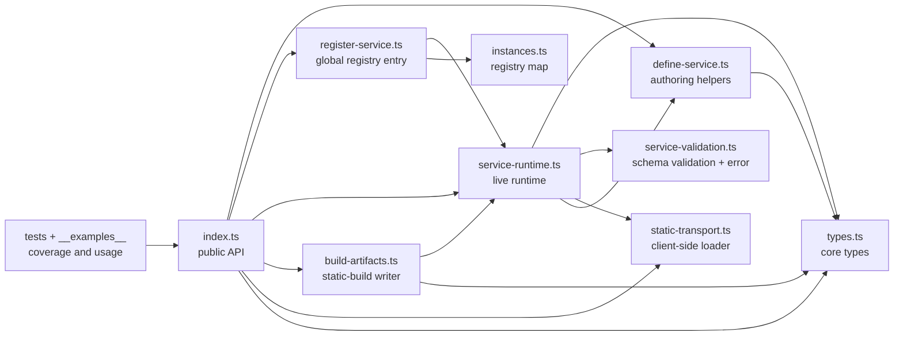
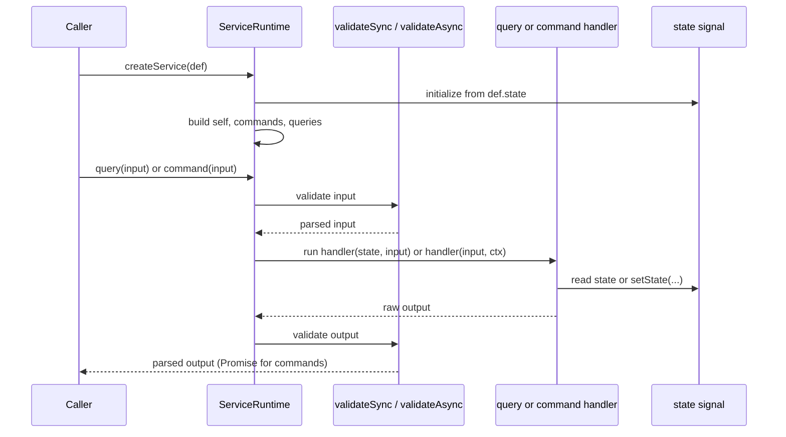
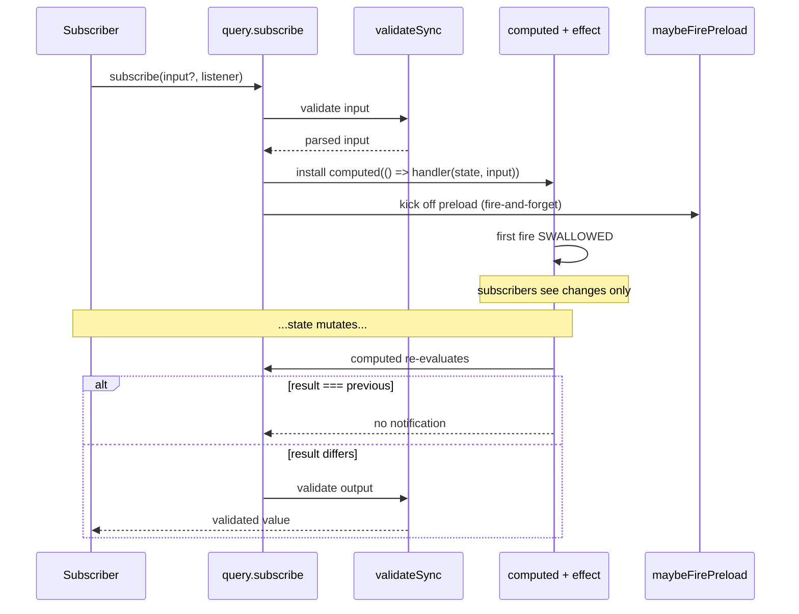
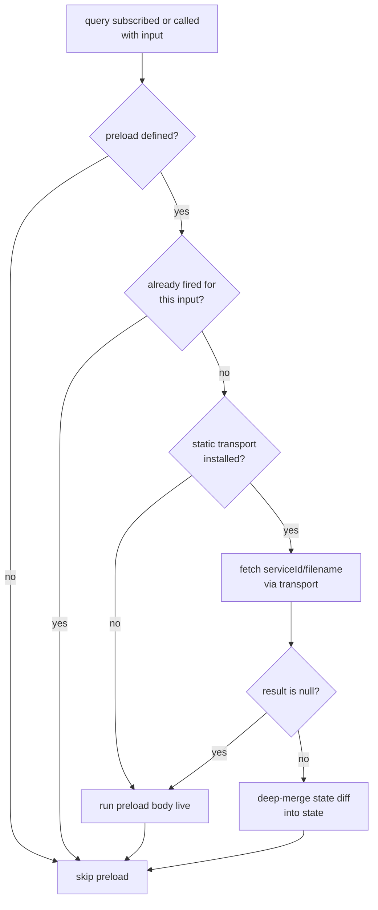
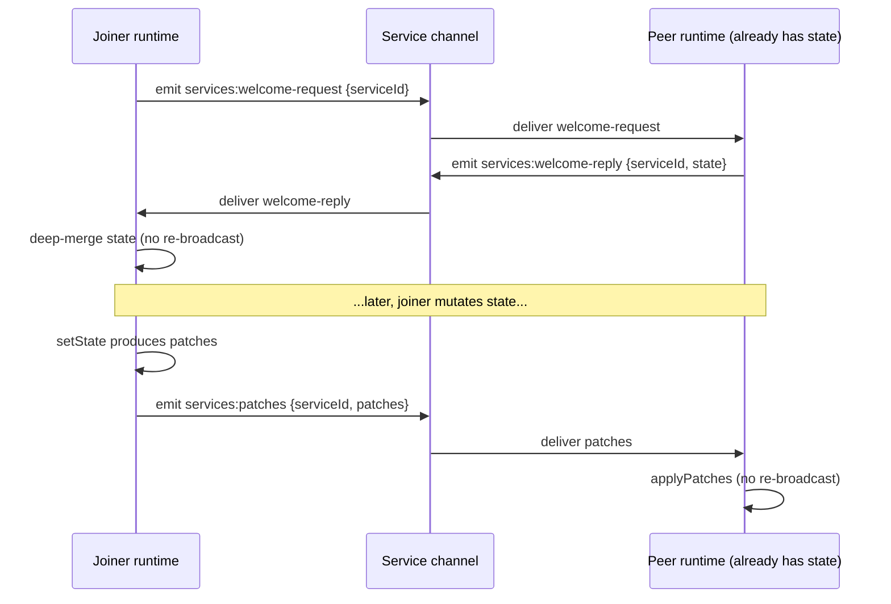

# Service Architecture

A small schema-driven service system for Storybook internals. A service is a state container with a stable id, a private state object, a set of read-only queries, and a set of state-mutating commands. Queries may optionally declare static-build hooks (`preload` + `inputs` + `path`) so their state can be pre-rendered to JSON at build time and re-hydrated lazily on the client.

The main audience for this README is agents and maintainers who need to understand how the pieces fit together, where behavior lives, and how to define new services correctly.

> [!NOTE]
> This document covers stages 1–4: definition, runtime, query subscriptions, static-build writer, static-load transport, service registration with abstract-command overrides, cross-runtime channel sync, and the React hook (`useServiceQuery`).

## Goals

- Declare a stateful service in one object: `state` + `queries` + `commands`.
- Strong TypeScript inference for query selectors and command handlers from Standard Schema v1 schemas.
- Validate every query and command input/output through the schema.
- Reactive query subscriptions via `alien-signals` — fire only when the selected slice actually changes.
- Persist service state as JSON at build time; re-hydrate lazily on the client.

## Public Surface

External callers should import from [index.ts](./index.ts).

The public API consists of:

- `defineService` (with the `query` / `command` helpers exposed via the callback form).
- `registerService(def, registration?)` — activate the definition; returns a public-only `ServiceStore`. Idempotent on the definition reference; supplies handlers for abstract commands. `__resetServiceRegistry()` for tests.
- `getService(def)` (or `getService(id)`) — look up an already-registered service.
- `createService(def, registration?)` — build a fresh runtime without touching the global registry. Prefer `registerService` for production code.
- `buildServiceArtifacts(def)` — produce the JSON-shaped state diffs for a service's preloads.
- `setStaticTransport` / `clearStaticTransport` / `createBrowserStaticTransport` — install the runtime-side loader.
- `setServiceChannel` / `clearServiceChannel` — install the cross-runtime sync channel.
- `useServiceQuery` — React hook for consuming a service query.
- `ServiceValidationError` and the exported type aliases from [types.ts](./types.ts).

Internal tests and implementation code may import from the individual modules directly.

## File Layout

- [index.ts](./index.ts) — public barrel for service authors outside this directory.
- [types.ts](./types.ts) — core type model for definitions, contexts, query/command shapes, runtime instances.
- [define-service.ts](./define-service.ts) — `defineService` curried builder plus the `query` / `command` per-entry helpers.
- [service-validation.ts](./service-validation.ts) — Standard Schema validation, `ServiceValidationError`, sync and async paths.
- [service-runtime.ts](./service-runtime.ts) — the `ServiceRuntime` class. Owns state, runs commands, fires query preloads, drives subscriptions.
- [register-service.ts](./register-service.ts) — `registerService`, `getService`, `__resetServiceRegistry`. The public entry into the global registry.
- [instances.ts](./instances.ts) — the global registry map. Separate module so it can be mocked in tests.
- [build-artifacts.ts](./build-artifacts.ts) — `buildServiceArtifacts`. The static-build writer.
- [static-transport.ts](./static-transport.ts) — the global static-load transport.
- [channel-transport.ts](./channel-transport.ts) — `setServiceChannel` / `clearServiceChannel`, event constants, payload types for cross-runtime sync.
- [use-service-query.ts](./use-service-query.ts) — `useServiceQuery(store, queryName, input?)` React hook.
- [__examples__/docgen-service.ts](./__examples__/docgen-service.ts) — worked example for the docgen pattern.
- `*.test.ts` — focused tests for runtime behavior, validation behavior, and static builds. Tests assert against the public API only, so they double as usage examples.



## Core Concepts

### The encapsulation rule

> State is private to a service. Everything inside operates on the same state object. The outside world only sees queries and commands.

Concretely:

- The public `ServiceStore` returned from `registerService` / `getService` exposes `id`, `definition`, `queries`, `commands`. State, mutation, and whole-state subscription are infrastructure-facing (used by the build pipeline and transport sync) and never appear on the public surface.
- Inside a command body or a query's `preload`, `ctx.self.getState()` and `ctx.self.setState(...)` are how handlers touch state.
- To read from another service, use its queries — not its state. (Cross-service composition via `ctx.runtime[serviceId]` is planned; not built yet.)
- A related feature that needs a different on-disk shape is a different service. There is no "different file format for the same service."

The rule is what makes the static-build story tractable. When state is private and only commands mutate it, "save the state" and "load the state" are well-defined symmetric operations.

### State

One object per service, shape chosen by the author. The runtime stores it as an immutable value (Immer) and treats every mutation as a transition that produces a new value plus a list of Immer patches describing what changed.

Two conventions:

- Model collections as `{ byId: Record<string, ...> }`, not as arrays. Records compose cleanly under patches and deep-merge; arrays do not.
- State must be JSON-serialisable. No functions, class instances, or DOM nodes.

### Queries

Every query is an object with required `input` and `output` schemas plus a `handler` selector. The runtime validates caller input before calling `handler`, and validates the handler result before returning it.

```ts
// no input — use z.void() / v.void() for the input schema
getCount: query({ input: z.void(), output: z.number(), handler: (state) => state.count })

// input-keyed — `id` is inferred from `input: z.string()`
getById: query({
  input: z.string(),
  output: z.string().optional(),
  handler: (state, id) => state.byId[id],
})
```

A query `handler` must not call commands or perform I/O — it's read-only by contract. If a query needs to trigger loading on first read, add optional `preload`, `inputs`, and `path` fields (see *Static Build*).

Queries are the unit of subscription. Every `query.subscribe(...)` builds an `alien-signals` `computed(() => handler(state, input))`. The computed memoises by reference equality on its output, so subscribers re-fire only when this query's result actually changes.

### Commands

A command is a schema-validated writer. The handler receives optional parsed input and a `ctx`:

```ts
bump: command({
  input: z.void(),
  output: z.void(),
  handler: (ctx) => { ctx.self.setState((d) => { d.count += 1; }); },
}),
```

`ctx.self` is how a command touches state:

- `ctx.self.getState()` — read.
- `ctx.self.setState((draft) => { ... })` — mutate via an Immer draft. Assign, push, delete; the runtime captures a minimal patch list.
- `ctx.self.commands.<name>(...)` — call another command on this service.
- `ctx.self.queries.<name>(...)` — read via this service's own queries.

Commands can be async. A no-op `setState` (empty patch list) is detected and skips all notifications.

#### Abstract vs concrete commands

- **Concrete** — `handler` is present on the definition object. The definition owns the implementation; registration **cannot** override it. The key is excluded from `CommandOverrides` at the type level, and the runtime throws if an override slips through.
- **Abstract** — `handler` is omitted from the definition. A registration **may** supply a handler, but isn't required to: the same definition is registered in multiple runtimes (manager, preview, server) and typically only one of them implements a given abstract command. Calling an abstract command in a runtime that has no local handler throws today; once cross-runtime command routing lands it will defer to a peer runtime that does.

The use case is one shared definition imported into multiple environments, with environment-specific bodies provided per environment for the **abstract** commands. Concrete commands have a single shared body that lives in the definition.

### Validation

Every query and command must declare both `input` and `output` schemas. Both must be Standard Schema v1 compatible (zod, valibot, arktype). The runtime validates:

- caller input before a handler runs;
- handler output before the result is returned to the caller or emitted to a subscriber.

Failures throw `ServiceValidationError`, whose message includes:

- whether the failure was on input or output;
- whether the failing operation is a query or command;
- the full `serviceId.operationName`;
- one line per issue with field path and the schema's expectation text.

Validation has two entry points: `validateSync` (fast path for query selectors) and `validateAsync` (command boundaries, async-schema friendly).

> Note: handling of unexpected object fields depends on the schema implementation. Both zod's `z.object()` and valibot's `v.object()` accept extra fields by default; use `z.object(...).strict()` / valibot `objectStrict(...)` to reject them.

## Runtime Flow

When `registerService(def, registration?)` is called for the first time for a given `def.id`:

1. [service-runtime.ts](./service-runtime.ts) creates a signal-backed state container from `def.state`.
2. It resolves command handlers — registration overrides beat definition handlers for **abstract** commands. Concrete commands cannot be overridden; the runtime throws if an override is supplied.
3. It builds the `ctx.self` reference around the state (`getState`, `setState`, `commands`, `queries`).
4. It builds commands that validate input, run the resolved handler (sync or async), and validate output. Abstract commands with no resolved handler throw with an actionable message at call time.
5. It builds queries with a callable form and a `.subscribe` form. Both validate input and route through the same internal `_runQuery(name, input)` that runs the query `handler` and validates output.
6. It freezes a `publicStore` view exposing only `id`, `definition`, `queries`, `commands`. That's what callers see.

The registry keeps one instance per `definition.id` within the current process. Tests should call `__resetServiceRegistry()` in teardown to avoid cross-test leakage. Re-registering a different definition under the same id throws.



## Subscription Flow

Subscriptions are powered by `alien-signals`:

1. The query's input is validated once (captured in the subscription closure).
2. A `computed(() => handler(state, input))` re-runs whenever the state signal changes.
3. An `effect(() => listener(comp()))` observes the computed. The first synchronous fire is **swallowed** so subscribers see changes only — read the initial value via the callable form of the query.
4. Output validation runs each time the listener is about to be notified.
5. Reference-equality memoisation on the computed gives "result didn't change → don't re-notify" for free.

Two signatures:

- `query.subscribe(input, listener)` — input-keyed queries.
- `query.subscribe(listener)` — no-input queries (single-argument overload).



## Static Build

A statically-built Storybook serialises service state to JSON at build time and re-hydrates it lazily on the client. Queries with a `preload` are the only mechanism — a service whose queries are all selector-only doesn't persist anything.

### Mental model

A service in static-build mode has the same API as a service in dev mode. The runtime hides where the data came from.

Two halves:

- **Build (Node).** [`buildServiceArtifacts(def)`](./build-artifacts.ts) iterates the service's preload-bearing queries, runs each enumerated input in a sandboxed runtime, captures the resulting state diff in a JSON-friendly nested-object shape (`{a:{b:1}}`), and returns a `Map<filename, value>`. The caller writes those to disk.
- **Load (browser).** One transport is installed at app startup via `setStaticTransport(...)`. When a query subscription fires the query's preload, the runtime asks the transport for the per-input file. On a hit, the fetched diff is deep-merged into state and the preload body is *not* called. On null (no file present), the runtime runs the body live as a fall-through.

Services never see the transport. They declare relative filenames via the query's `path` callback (or accept the default); the transport composes those into URLs or Map keys.

### Two query shapes

How you structure query preloads determines how state is split on disk.

**Per-id chunking.** A query keyed by an input, enumerated over many ids. One file per id, fetched only when that id is asked about. The docgen pattern:

```ts
queries: {
  getComponentDocgenInfo: query({
    input: z.string(),
    output: docgenSchema.nullable(),
    handler: (state, id) => state.byComponentId[id] ?? null,
    preload: async (id, ctx) => { await ctx.self.commands.generateDocgen(id); },
    inputs: async () => listAllComponentIds(),
    path: (_ctx, id) => `docgen-${id}.json`,
  }),
}
```

**Single-file whole-service load.** A no-input query with `inputs` omitted, populating the whole state in one go. One file for the service, fetched when any subscriber asks for the matching query. The StoryStatusService pattern:

```ts
queries: {
  allStatuses: query({
    input: z.void(),
    output: z.record(z.string(), z.string()),
    handler: (state) => state.byStoryId,
    preload: async (ctx) => {
      const data = await fetchAllStatusesAtBuildTime();
      ctx.self.setState((d) => { d.byStoryId = data; });
    },
    path: () => 'statuses.json',
  }),
}
```

Both shapes use identical machinery. The choice is whether you have one no-input query with a preload or many input-keyed ones.

### Writing

```ts
import { buildServiceArtifacts } from 'storybook/internal/service';

const artifacts = await buildServiceArtifacts(DocgenService);
// artifacts is Map<filename, value>:
//   'docgen-Button.json' → { byComponentId: { Button: { description: '...' } } }
//   'docgen-Tabs.json'   → { byComponentId: { Tabs:   { description: '...' } } }
//   ...one per enumerated input of every preload-bearing query

for (const [filename, value] of artifacts) {
  await fs.writeFile(path.join(outDir, filename), JSON.stringify(value));
}
```

Each query-input pair runs against a fresh sandboxed runtime so its captured diff is isolated. Filename comes from the query's `path` callback or the default (`<name>.json` for no-input, `<name>-<input>.json` for string inputs; non-string inputs hash to `<name>-<8 hex chars>.json`).

When multiple query-input pairs resolve to the same filename, their diffs are deep-merged at build time and written as a single artifact.

A service with no preload-bearing queries returns an empty Map — nothing to write.

The build rejects two patch shapes that can't be expressed as a clean state diff: **array-index mutations** (when a preload pushes/splices array elements directly) and **deletions**. Both throw at build time with an actionable error. Preloads should produce data, and collections should be records.

### Loading

Install the transport once, at app startup:

```ts
import { setStaticTransport, createBrowserStaticTransport } from 'storybook/internal/service';

if (isStaticBuild) {
  setStaticTransport(createBrowserStaticTransport());
}
```

`createBrowserStaticTransport(baseUrl?)` builds a transport that fetches `${baseUrl}/${serviceId}/${filename}` via `globalThis.fetch`. Default base is `/services`. If `globalThis.fetch` isn't available (non-browser host), every call resolves to null — safe to install unconditionally.

Only `404` and `410` responses are treated as "artifact not present" (fall through to the live loader). Other non-OK responses (5xx, proxy errors, auth failures) throw, so server outages don't silently degrade to live data.

In dev mode, don't install a transport. Without one, every preload runs its body live; no fetches are attempted.

Nothing is loaded eagerly. Every preload fetch is lazy, triggered by a query subscription or callable read.

### Loader branching

When a query subscription fires its preload, the runtime applies:

1. No transport installed → run the body live.
2. Transport installed → compute the query's filename and fetch it.
3. Non-null result → deep-merge the fetched diff into state. Body is *not* called.
4. Null result → run the body live.

A service with preloads behaves identically across dev and static deployments. Fall-through-on-null also means a partial build still works — files that exist are used, files that don't are recomputed live.



### Loader files are lazy

Three guarantees verified by tests:

- Service creation triggers no fetches.
- Subscribing to `queries.foo(input)` triggers exactly one fetch — the file for *this* query and *this* input. Other inputs of the same query are untouched.
- A second subscription for the same input does *not* refetch. A per-(query, input) "has fired" set suppresses it; concurrent firings dedupe through an in-flight map.

For a docgen service with 1000 enumerated components, browsing only "Button" pulls `docgen-Button.json` and nothing else. The other 999 files are never requested.

### State-shaped diffs

Artifact files contain JSON-friendly nested-object diffs — the shape of the state slice a preload produced — not Immer patch lists. The runtime applies them via deep-merge. Multiple preloads writing to disjoint state slices (e.g. `byComponentId.Button` and `byComponentId.Tabs`) compose cleanly because their object trees only touch their own paths.

The build still uses Immer's `produceWithPatches` to capture what each preload changed; the patches are converted to a nested object before serialisation so files are inspectable and don't require Immer to read.

### Mock transport pattern (tests)

For tests, the transport is a `Map<key, value>` keyed by `${serviceId}/${filename}`:

```ts
function mockTransport(files: Map<string, unknown> = new Map()): ServiceStaticTransport & {
  files: Map<string, unknown>;
} {
  return {
    files,
    fetch: async (serviceId, filename) => {
      const key = `${serviceId}/${filename}`;
      return files.has(key) ? files.get(key) : null;
    },
  };
}
```

Install in `beforeEach`, clear in `afterEach`:

```ts
afterEach(() => clearStaticTransport());

it('reads from a pre-built artifact file', async () => {
  const transport = mockTransport();
  transport.files.set(`${MyService.id}/docgen-Button.json`, {
    byComponentId: { Button: { description: '...' } },
  });
  setStaticTransport(transport);

  const service = registerService(MyService);
  const listener = vi.fn();
  service.queries.getComponentDocgenInfo.subscribe('Button', listener);
  await new Promise((r) => setTimeout(r, 0));

  expect(listener).toHaveBeenCalledWith({ description: '...' });
});
```

`createBrowserStaticTransport` composes the same `${serviceId}/${filename}` key in production and asks `globalThis.fetch` with it. The transport receives `(serviceId, filename)` as separate arguments — the runtime never composes URLs or paths; it passes the pair to whatever transport is installed.

## Definition vs Registration

### Definition

```ts
const DocgenService = defineService<DocgenState>()(({ query, command }) => ({
  id: 'core/docgen',
  state: { byComponentId: {}, somethingElse: 42 },
  queries: {
    getComponentDocgenInfo: query({ /* ...with preload+inputs+path... */ }),
    somethingElse: query({ input: z.void(), output: z.number(), handler: (s) => s.somethingElse }),
  },
  commands: {
    generateDocgen: command({ input: z.string(), output: z.void() }),       // abstract
    modifySomethingElse: command({
      input: z.void(),
      output: z.void(),
      handler: (ctx) => { /* ... */ },                                       // concrete
    }),
  },
}));
```

A definition is environment-agnostic — shape only, no running runtime. It can be imported into manager, preview, server, or test code. Definitions are singletons: re-importing the same module yields the same reference, and the registry's identity check is based on definition reference (not just `id`).

### Registration

```ts
const store = registerService(DocgenService, {
  commands: {
    generateDocgen: async (componentId, ctx) => {
      const result = await callTheAnalyzer(componentId);
      ctx.self.setState((d: DocgenState) => {
        d.byComponentId[componentId] = result;
      });
    },
  },
});
```

Registration activates the definition and returns the `ServiceStore`. It supplies:

- **Abstract command implementations.** Any command without a `handler` in the definition that this runtime needs to invoke must be implemented here.
- Per-environment behaviour that's specific to where the runtime runs.

Whether a service loads from JSON is decided architecture-wide via `setStaticTransport`, not per-service. Re-registering the same definition returns the same `ServiceStore`.

## How To Define A Service

Recommended — the callback form, where `query` and `command` per-entry helpers infer types from each entry's schemas:

```ts
import { z } from 'zod';

import { defineService, registerService } from 'storybook/internal/service';

type ExampleState = {
  values: Record<string, string | undefined>;
};

const entryIdSchema = z.object({ entryId: z.string() });
const valueSchema = z.string().nullable();

export const ExampleService = defineService<ExampleState>()(({ query, command }) => ({
  id: 'example/service',
  description: 'Example service used in documentation.',
  state: { values: {} },
  queries: {
    getValue: query({
      description: 'Returns one value by id.',
      input: entryIdSchema,
      output: valueSchema,
      handler: (state, input) => state.values[input.entryId] ?? null,
      preload: async (input, ctx) => {
        if (!(input.entryId in ctx.self.getState().values)) {
          await ctx.self.commands.preloadValue(input);
        }
      },
      inputs: async () => [{ entryId: 'a' }, { entryId: 'b' }],
    }),
  },
  commands: {
    preloadValue: command({
      description: 'Fills state for one id.',
      input: entryIdSchema,
      output: z.void(),
      handler: async (input, ctx) => {
        ctx.self.setState((draft) => {
          draft.values[input.entryId] = 'ready';
        });
      },
    }),
  },
}));

const service = registerService(ExampleService);
service.queries.getValue({ entryId: 'a' });
```

### Alternative forms

```ts
// Bare object literal — explicit state, no callback. Handlers inside the queries/commands maps
// lose contextual typing; either annotate them or wrap with the standalone `query()` / `command()`
// helpers.
defineService<ExampleState>()({ id, state, queries, commands });

// State inferred from the `state:` literal (extra `()`, no `<…>`).
defineService()({ id, state, queries, commands });
```

All forms produce the same `ServiceDefinition`. The callback form is preferred because it gives the strongest inference without explicit type annotations.

## Worked example

[`__examples__/docgen-service.ts`](./__examples__/docgen-service.ts) implements docgen against the current API: curried definition with schema-validated queries and commands, a selector-only query alongside one with full `preload` / `inputs` / `path` static-build hooks, and concrete inline-handler commands.

Read it alongside [`service-runtime.test.ts`](./service-runtime.test.ts) and [`build-artifacts.test.ts`](./build-artifacts.test.ts) — those test against the public surface only, so they double as usage examples.

## Design Rules

- Always declare both `input` and `output` schemas on every query and command.
- Use query `preload` for read-side warming, not state mutation in the handler.
- Use commands for all state mutation. Commands are the only way state changes.
- Bias state toward record-shaped slices (`{ byId: {...} }`) rather than arrays. Records compose under patches and deep-merge; arrays are replaced wholesale.
- Keep state JSON-serialisable. Diffs go through `JSON.stringify`.
- Treat commands as async (they always return `Promise<output>`). Queries return synchronously.
- Keep public imports on [index.ts](./index.ts). Import internal modules directly only from tests or implementation code in this directory.

## Testing Guidance

- Runtime behavior belongs in [service-runtime.test.ts](./service-runtime.test.ts).
- Validation behavior belongs in [service-validation.test.ts](./service-validation.test.ts).
- Static build + load behavior belongs in [build-artifacts.test.ts](./build-artifacts.test.ts).
- Tests assert against the public API only. Inline-defined services keep each test self-contained and double as usage examples.

When adding validation tests, prefer asserting the full exact error message — that keeps the tests useful as executable documentation for callers and agents.

## Cross-runtime sync

A single architecture-global channel — typically Storybook's existing manager↔preview↔server channel — lets peer runtimes converge on the same state view. Install it once at app startup:

```ts
import { setServiceChannel } from 'storybook/internal/service';

setServiceChannel(channel); // any { on, off, emit } shape
```

Without a channel, sync is disabled — each runtime runs with whatever state local activity produces (plus any static-build JSON the static transport pulls in). This is the *isolation* case: iframe popouts, unit tests, CLI scripts.

Two parts:

1. **Welcome handshake.** On registration, a runtime emits `services:welcome-request` for its service id. Any peer that already has a runtime for the same id replies with `services:welcome-reply` carrying its current state. The joiner deep-merges that state in. Multiple replies are idempotent (deep-merge of identical state is a no-op).
2. **Ongoing patch broadcast.** Every `setState` that produces patches emits a `services:patches` event carrying the Immer patch list. Peers receive the patches and apply them via Immer's `applyPatches` so removals and other patch ops are preserved (the state-shaped diff format used for files would lose them). Loop suppression: applying remote patches sets an `_applyingRemote` flag so the resulting `setState` does NOT re-broadcast.



All sync events are scoped by `serviceId` and prefixed with `services:` so other channel traffic is unaffected. Runtimes ignore events for service ids they don't own.

## React

`useServiceQuery(store, queryName, input?)` is a thin React hook over a service query. It's built on `useSyncExternalStore` so it works in any React 18+ tree without a Babel transform or `useSignals()` opt-in.

```tsx
import { useServiceQuery } from 'storybook/internal/service';

import { DocgenService } from './docgen-service';

function ComponentDocs({ componentId }: { componentId: string }) {
  const docgen = useServiceQuery(DocgenService, 'getComponentDocgenInfo', componentId);
  return <pre>{JSON.stringify(docgen, null, 2)}</pre>;
}
```

Under the hood the hook wraps `query(input)` in a `computed(() => query(input))`. `computed` memoises by reference equality on its output, so the component re-renders only when *this query's* result actually changes — no extra dedup layer needed. Unrelated mutations to the same service (a different slice, a structurally-equal write) don't cause re-renders.

**Memoise object inputs at the call site.** The input is a hook dep; passing a new object literal each render rebuilds the computed and the subscription. For complex inputs wrap them in `useMemo`, or pass primitives.

The hook has a no-input overload that mirrors the runtime — `useServiceQuery(store, 'count')` for `input: z.void()` queries.

## Agent Notes

- If you need to change runtime behavior, start in [service-runtime.ts](./service-runtime.ts).
- If you need to change validation wording, start in [service-validation.ts](./service-validation.ts).
- If you need to change service authoring ergonomics, start in [define-service.ts](./define-service.ts) and [types.ts](./types.ts).
- If you need to change registration semantics or registry lookup, start in [register-service.ts](./register-service.ts).
- If you need to change static-preload artifact generation, start in [build-artifacts.ts](./build-artifacts.ts).
- If you need to change how artifacts are loaded on the client, start in [static-transport.ts](./static-transport.ts).
