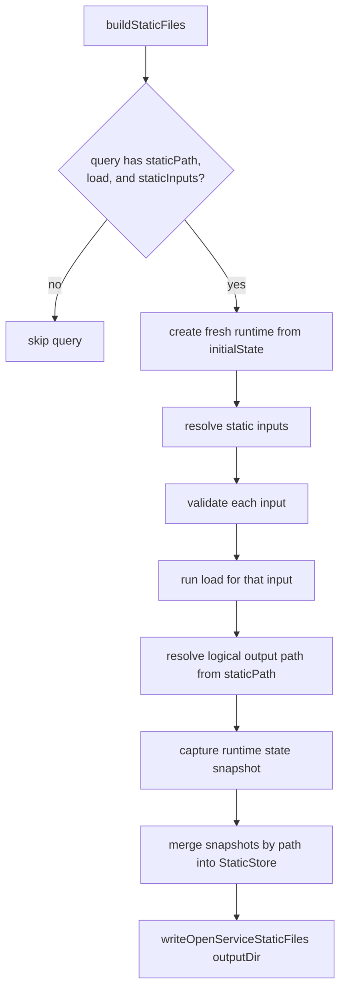

# Open Service

`open-service` is a small schema-driven service system for Storybook internals.

Its goals are:

- define stateful services in one declarative object
- expose synchronous queries and async commands with strong TypeScript inference
- validate all query and command input/output through Standard Schema (schemas may transform/coerce)
- support fine-grained reactive query subscriptions through deep signals (`deepsignal` +
  `@preact/signals-core`)
- support server-side static state snapshots driven by query `load` hooks

The main audience for this README is agents and maintainers who need to understand how the pieces
fit together, where behavior lives, and how to define new services correctly.

## Public Surface

External callers should import from one of two entrypoints:

- [index.ts](./index.ts) for environment-agnostic definition helpers and shared types
- [server.ts](./server.ts) for server-only registration, discovery, and static snapshot writing

The environment-agnostic API consists of:

- `defineService`
- the exported type aliases from [types.ts](./types.ts)

The server-only API consists of:

- `registerService`
- `listServices`
- `describeService`
- `getService`
- `getRegisteredServices`
- `buildStaticFiles`
- `writeOpenServiceStaticFiles`

Internal tests and implementation code may import from the individual modules directly.

## File Layout

- [index.ts](./index.ts): environment-agnostic barrel for definition helpers and shared types
- [server.ts](./server.ts): server-only entrypoint that re-exports registration APIs and owns static snapshot building/writing
- [types.ts](./types.ts): core type model for definitions, contexts, runtime instances, and static build data
- [service-definition.ts](./service-definition.ts): `defineService()` typing that preserves inline inference when declaring services
- [service-validation.ts](./service-validation.ts): sync + async schema validation helpers and error wrapping
- [errors.ts](./errors.ts): validation metadata formatting helpers
- [service-runtime.ts](./service-runtime.ts): signal-backed runtime construction, in-flight load registry, drain logic, and subscriptions
- [service-registration.ts](./service-registration.ts): server-side global registry implementation and the shared registry API passed into runtimes
- [fixtures.ts](./fixtures.ts): scenario fixtures used by the test suite
- `*.test.ts`: focused tests for runtime behavior, validation behavior, server registration, and server static builds

## Core Concepts

### Service

A service is a state container with:

- a stable `id`
- an `initialState`
- a `queries` map
- a `commands` map
- optional descriptions on the service and each operation

Use `defineService()` to preserve the concrete query and command map types.

### Query

A query is:

- **synchronous at call time**: `service.queries.foo(input)` returns the validated handler result immediately
- **read-only**: the handler receives `{ state, queries }` and cannot mutate state or call commands
- **load-coupled**: calling a query also fires its optional `load` hook in the background, deduped per `(service, query, input)` while one is already in flight
- **subscribable** through `query.subscribe(input, callback)`
- **awaitable in full** through `query.loaded(input)`, which returns a promise that settles once the load and every transitively touched dependency have completed
- **statically buildable** when the query declares `staticPath` and `staticInputs`

Query handlers receive a `QueryCtx`:

- `ctx.self.state`
- `ctx.self.queries`
- `ctx.getService(serviceId)` — synchronous

Query handlers do **not** receive `commands` or `setState`. Mutations belong in commands; load-time preparation belongs in `load`.

### Load

`load` is an optional async hook on each query definition. It receives a `LoadCtx`:

- `ctx.self.state`
- `ctx.self.queries` — wrapped versions of the service's own queries; calling them inside `load` registers transitively triggered loads into the current drain
- `ctx.self.commands` — declared commands, used for all state mutation (load contexts do not receive `setState` directly)
- `ctx.getService(serviceId)` — synchronous

`load` mutations must go through commands. Cross-service `getService(...).queries.*` calls inside a load body are not auto-tracked for the drain; use `await ctx.getService(id).queries.foo.loaded(input)` when you need a cross-service dependency awaited before your own load completes.

**`load` is a reactive, idempotent warming step.** For an active subscription, `load` re-fires whenever the external signals it reads synchronously change — same-service fields and cross-service reads via `getService(...).queries.*` alike — turning a query into a reactive async resource (like a TanStack Query / SolidJS `createResource` / Vue async `watchEffect`). This means:

- **`load` must be idempotent.** Re-running it with the same dependencies must produce the same state. Any genuinely one-shot side effect belongs in a command invoked conditionally, never in `load` itself.
- **Read dependencies synchronously, up front.** Only reads in the load's synchronous prefix (before the first `await`) are tracked. Read the values you depend on first, then do async work — the same idiom every signal-based resource uses.
- **Loads that read no external signal fire exactly once** (the common case: `await ctx.self.commands.x(input)`), so existing loads are unaffected.
- Direct `query()` / `.loaded()` calls are **not** reactive — they keep one-shot-per-call semantics. Reactivity is scoped to subscriptions and is torn down when the last subscriber unsubscribes.

The runtime guards re-firing: a superseded run (its dependencies changed again before it finished) cannot overwrite a newer run's state, and changes batched together produce a single re-load.

**Keep `load` bodies as small as possible.** Almost always, `load` should be a one-liner that calls a command — the real work (input resolution, side effects, validation, state mutation) belongs in the command. This pays off for three reasons:

- **Reusability.** Anyone can call the command directly (other services, tests, integrations) without going through the query's load path. Logic stuck inside a load is unreachable from outside the drain.
- **Testability.** Commands have a typed input/output contract you can assert against. Load bodies don't return anything useful.
- **Clear contract.** A query says "read state". A command says "do work that produces state". A bloated load blurs the line and makes the service harder to reason about.

A good rule of thumb: if `load` does anything more than `await ctx.self.commands.someCommand(input)`, ask whether that "more" belongs in the command instead.

### Command

A command is:

- always async at call time
- allowed to mutate state through `ctx.self.setState(...)`
- validated on both input and output

Commands receive a `CommandCtx` whose `self` includes `state`, `queries`, `commands`, and `setState`.

### Cross-service composition

Handlers resolve other registered services through `ctx.getService(serviceId)`. Without a type
parameter, the return type is `RuntimeService` — query and command results are erased to
`unknown`.

Pass the source service definition as a generic to recover the full typed runtime surface:

```ts
import type { mutableRecordLookupServiceDef } from './mutable-record-lookup.ts';

handler: (input, ctx) => {
  const lookup = ctx.getService<typeof mutableRecordLookupServiceDef>(
    'internal-fixture/mutable-record-lookup'
  );

  const record = lookup.queries.getRecordFields({ entryId: input.entryId });
  // record is fully typed — do not cast individual query results

  return record?.marker === 'match';
};
```

Guidelines:

- Import the source definition **type-only** when it is only needed for the generic parameter
- Pair the generic with the correct service id — TypeScript cannot verify they match at compile time
- Omit the generic when the target service is not known statically; the untyped `RuntimeService`
  surface is the correct fallback
- Do **not** cast individual query or command results; type the service handle once instead

The exported `ServiceInstanceOf<typeof sourceDef>` alias is available for named handle types when
a service is referenced from many call sites.

### Validation

Every query and command must declare:

- `input`
- `output`

Both must be Standard Schema compatible.

The runtime validates:

- caller input before a handler runs
- handler output when a value is produced for a consumer — a direct `query()` call, `query.loaded()`,
  the static build, and a subscription emission

Output validation reads the whole value, so it is kept out of the part of a subscription that
determines reactive dependencies: for a `selector` subscriber it runs without tracking, so it cannot
expand the deep-signal dependency footprint. (See "Subscription Flow".)

Queries validate **synchronously**. Their input and output schemas must produce sync results. If a Standard Schema returns a Promise during a query validation, the runtime throws `OpenServiceAsyncSchemaError` immediately.

Commands validate asynchronously and accept async schemas.

Validation failures become `OpenServiceValidationError` with a message that includes:

- whether the failure happened on input or output
- whether the failing operation is a query or command
- the full `serviceId.operationName`
- one line per issue, including path and the schema's expectation text

Handling of extra object fields depends on the schema implementation you choose. The current test fixtures use Valibot `object(...)` schemas, which accept unexpected extra fields rather than rejecting them.

## Server Registration Flow

Server-side registration happens through the `services` preset hook. Storybook calls `await presets.apply('services')` during both dev startup and static builds, and each service author's preset implementation is responsible for calling `registerService(...)` directly.

That split is intentional:

- [index.ts](./index.ts) stays environment-agnostic so preview, manager, and server code can share
  one definition surface
- [server.ts](./server.ts) owns the concrete registry and static snapshot writing for the current
  server process

`registerService(definition)` throws `OpenServiceDuplicateRegistrationError` if a service with the
same id is already registered. The default `services` preset hook in
[common-preset.ts](../../../core-server/presets/common-preset.ts) also throws if the preset is applied
more than once in the same process, which catches duplicate registration paths early.

The internal Storybook config registers an example debug service through a dedicated preset file
([`code/.storybook/services-preset.ts`](../../../../.storybook/services-preset.ts)), gated on
`STORYBOOK_OPEN_SERVICE_DEBUG=true`. The flag stays unset by default so normal `yarn storybook:ui`
and `yarn storybook:ui:build` runs do not register the debug service.

## Runtime Flow

When a server registers a service definition:

1. [service-registration.ts](./service-registration.ts) merges any registration-time handler overrides.
2. It passes the shared registry API into [service-runtime.ts](./service-runtime.ts).
3. [service-runtime.ts](./service-runtime.ts) creates a signal-backed state container from `initialState`.
4. It builds a writable `commandSelf` reference around that state.
5. It builds commands that validate input, run handlers, and validate output.
6. It builds queries that validate input synchronously, fire any pending `load` in the background (deduped while in flight), run the handler synchronously, and validate the output.
7. [service-registration.ts](./service-registration.ts) stores the resulting runtime behind the server registry entry for later lookup.

## In-flight Load Registry

`service-runtime.ts` owns one process-global in-flight load registry keyed by `${serviceId}::${queryName}::${stableHash(parsedInput)}`. The hash uses stable JSON (sorted keys) computed from the post-validation parsed input, so inputs are expected to be JSON-safe. Two concurrent callers for the same key share one load; once it settles, the entry is removed so future calls can refire it. There is no caller-facing invalidation API.

## `.loaded()` Drain

`query.loaded(input)` returns a promise that settles only when the load body and every dependency the handler transitively reads are fully populated. Implementation lives in `runLoaded` in [service-runtime.ts](./service-runtime.ts).

### Algorithm

1. **Setup.** Validate input. Build a `LoadedSession`:
   - `ancestorChain` — the set of load keys we are currently nested inside (used to break cycles). Inherits from any parent `.loaded()` chain and is extended with this query's own key.
   - `collector` — load promises waiting to be drained.
   - `settledKeys` — load keys that have already settled in this session (do not refire them).
2. **Fire own load.** If this query has a `load` hook, push its promise into the collector via the in-flight registry. Skip if the key is already on the parent ancestor chain.
3. **Drain + discover loop** (capped at 32 iterations):
   - **Drain**: while `collector` has entries, snapshot them, clear, `Promise.allSettled` them, mark their keys settled, surface the first rejection (others attached as `cause.aggregated`).
   - **Discovery**: run the sync handler under `activeHandlerLoadSession = session`. Sync reads of dependencies fire and register their loads into `collector` — provided the dep is not already on the ancestor chain (cycle) and not already settled this session (already loaded).
   - If discovery added new entries, loop. Otherwise exit.
4. **Final read.** Run the handler one last time without the session and return the validated output.

If iteration count exceeds 32, throw `OpenServiceLoadedDrainExceededError`. This catches pathological cases (e.g. a handler that reads a query with an ever-changing input key) instead of hanging.

### Worked example

`bar.loaded(input)` where `bar.handler` reads `foo` and `foo` has its own `load`:

| Step | What happens |
|------|--------------|
| Setup | `session = { ancestorChain: {barKey}, collector: ∅, settledKeys: ∅ }`. `bar.load` is undefined → no own load fired. |
| Iter 1, drain | Collector empty, skip. |
| Iter 1, discovery | Handler runs. Reads `ctx.self.queries.foo(...)`. Default `foo` query sees the session, sees `fooKey` is not in ancestor or settled, fires `foo.load` and pushes promise into `collector`. Handler returns (state still empty). |
| Iter 2, drain | `await Promise.allSettled([fooPromise])`. Mark `fooKey` settled. State now populated by `foo.load`. |
| Iter 2, discovery | Handler runs again. `foo` is in `settledKeys` → fires nothing. Collector stays empty. |
| Exit | Final handler call (no session): returns the now-populated value. |

### Inside a `load` body

When the discovery handler runs, sync reads via `ctx.self.queries.*` go through the *default* query map (the same one consumers see) and register against `activeHandlerLoadSession`. That works for sync code because module-scoped state is stable across one synchronous handler call.

When an **async** `load` body runs, it instead gets a *wrapped* `ctx.self.queries.*` from `buildLoadWrappedQueries`. Each wrapper closes over the load's own ancestor chain and local collector, so reads inside the body register dependencies regardless of how many `await`s the body has between them. After the body resolves, the load promise waits for its local collector to drain before settling — which is what gives `.loaded()` its transitive guarantee through async load bodies.

Cross-service `ctx.getService(id).queries.*` calls inside a load body are **not** wrapped; authors must use `.loaded()` explicitly when they need a cross-service dep awaited from inside a load. From a sync handler, cross-service queries are tracked because they consult the module-scoped session like any other call.

## State and reactivity

State is a **deep reactive proxy** (`deepSignal` from `deepsignal`, backed by `@preact/signals-core`)
created in [service-runtime.ts](./service-runtime.ts). There is no top-level state atom and no Immer:

- Reading a field through `ctx.self.state` tracks a fine-grained signal for exactly that field
  (including not-yet-present record keys, which fire when the key is later added).
- `setState((state) => …)` mutates the proxy **in place** inside a batch, so one command notifies
  subscribers once, and only the fields it actually changed are invalidated.
- The proxy is internal and does not escape:
  - Query/`.loaded()` results are the schema-validated value. For object and array schemas that
    rebuild a plain value, this also detaches the result from the proxy.
  - Subscription emissions are detached to plain values (validated for whole-value subscribers, or
    JSON-stripped for `selector` slices).
  - The whole-state snapshot for the static build uses `structuredClone` of the plain backing
    object. (`structuredClone` cannot clone a proxy, so proxy-slice stripping uses a JSON round-trip;
    state must be JSON-serializable, the same constraint the static-build pipeline relies on.)

## Subscription Flow

Subscriptions are implemented in [service-runtime.ts](./service-runtime.ts):

1. `subscribe(input, callback)` (or `subscribe(input, selector, callback)`) defers all work to a microtask.
2. The microtask validates the input synchronously. If the query has a `load`, it is run inside its own `effect()` so the external signals it reads synchronously are tracked: when they change, the effect re-runs and the load re-fires (see "Load"). Writes from a superseded run are dropped (each run carries an epoch; `setState` is gated on it), so a slow stale load can't clobber a newer result. The effect is torn down with the subscription.
3. A `computed()` runs the synchronous handler against the deep-signal proxy, so its dependency footprint is exactly what it reads. The output is always validated, but where validation runs depends on the subscription:
   - **No selector:** the value is validated here and emitted. Reading the whole value to validate it is the correct footprint for a whole-value subscriber, and it keeps the emitted value identical to a direct `query()` pull.
   - **With a selector:** validation runs untracked (so it does not register dependencies) and only `selector(value)` is read (then detached to a plain snapshot), so a sibling field the selector ignores never re-runs the handler.
4. An `effect()` runs the computed immediately (delivering the current value) and re-runs only when the computed's tracked fields change. A write to an unrelated key or field never re-runs the handler.
5. Subscribers receive the current state right away, then a follow-up emission once the load settles and state changes. UI consumers that want to suppress the pre-load emission should branch on the value (e.g. show a spinner for `null`).
6. Emissions are deduped by value: the effect compares the new value with the last emitted one via `es-toolkit` `isEqual` and skips the callback when they are equal. So a load that rewrites a deeply-equal value does not re-fire subscribers.
7. The optional `selector` is the `universal-store` pattern: the callback receives the selected slice and fires only when that slice changes by value — and, because the selector drives the computed's reads, an unselected field change does not even re-run the handler.

Tests should use `vi.waitFor(...)` when asserting the first emission or follow-up emissions.

## Static Snapshot Flow

`buildStaticFiles()` in [server.ts](./server.ts) iterates every registered service and looks for
queries that define:

- `staticPath` at definition time
- `load` (definition or registration)
- `staticInputs` (definition or registration)

For each static input it:

1. creates a fresh runtime from `initialState`
2. validates the static input using the query's `input` schema
3. runs the runtime's `runLoadOnce(queryName, validatedInput)` helper, which drives the load body (and any loads it triggers via wrapped self queries) to completion
4. resolves the normalized logical output path as `<serviceId>/<staticPath(input)>`
5. stores the resulting runtime state in the final `StaticStore`

`staticPath` is declared on the definition layer as `(input) => string`, relative to the service's
own output folder. The static build always prepends the service id so two services cannot write to
the same JSON path. It is exposed to callers through `describeService()` as `staticPath: true` on the
matching query descriptor. Manager code can use that flag to choose between live runtime queries
and prebuilt JSON snapshots.

`staticInputs` may be declared in the definition when the input list has no runtime dependencies.
Registration may override or supply `staticInputs` when the enumerator needs registry access,
story-index data, or other server context.

Cross-service `ctx.getService(...)` lookups during load resolve through the same registry the
dev server uses, so a load sees the same set of services that any other handler in the process
would see.

If multiple tasks resolve to the same path, their states are deep-merged.

`writeOpenServiceStaticFiles(outputDir)` then writes those logical paths underneath `<outputDir>/services`, converting slash-separated logical keys into native filesystem paths for the current operating system.

These snapshots are currently only a build artifact for the server-side static build flow. This slice does not implement a separate runtime mode that consumes prebuilt snapshot stores instead of running `load` normally.

Static path rules:

- `staticPath` values are relative to the service; the build prepends `<serviceId>/` automatically
- authors should think in forward-slash logical paths such as `nested/file.json` or `${input.entryId}.json`
- leading `./` and `/` are normalized away
- backslashes are normalized to `/`
- `..` segments are rejected so snapshots cannot escape the service folder



## How To Define A Service

Define queries and commands inline inside `defineService()` so the service-level schema maps can contextually type every handler, load hook, and `ctx.self.commands.*` call:

```ts
import * as v from 'valibot';

import { defineService } from './index.ts';
import { registerService } from './server.ts';

type ExampleState = {
  values: Record<string, string | undefined>;
};

const entryIdSchema = v.object({ entryId: v.string() });
const valueSchema = v.nullable(v.string());

export const exampleServiceDef = defineService({
  id: 'example/service',
  description: 'Example service used in documentation.',
  initialState: { values: {} } satisfies ExampleState,
  queries: {
    getValue: {
      description: 'Returns one value by id.',
      input: entryIdSchema,
      output: valueSchema,
      handler: (input, ctx) => ctx.self.state.values[input.entryId] ?? null,
      load: async (input, ctx) => {
        if (!(input.entryId in ctx.self.state.values)) {
          await ctx.self.commands.preloadValue(input);
        }
      },
      staticPath: () => 'state.json',
      staticInputs: async () => [{ entryId: 'a' }, { entryId: 'b' }],
    },
  },
  commands: {
    preloadValue: {
      description: 'Fills state for one id.',
      input: entryIdSchema,
      output: v.void(),
      handler: async (input, ctx) => {
        ctx.self.setState((state) => {
          state.values[input.entryId] = 'ready';
        });
      },
    },
  },
});

const exampleService = registerService(exampleServiceDef);

// Sync read — returns current state (null if load hasn't run yet) and fires load in the background.
const current = exampleService.queries.getValue({ entryId: 'a' });

// Awaited variant — waits for load (and any transitive deps) to settle, then returns the value.
const ready = await exampleService.queries.getValue.loaded({ entryId: 'a' });
```

## Design Rules

- Always declare both `input` and `output` schemas on every query and command.
- Use `load` for read-side warming. The hook is async and must mutate via commands.
- **Keep `load` bodies minimal — ideally one line that calls a command.** Push input resolution, side effects, and state mutation into the command itself so it stays callable, testable, and reusable on its own.
- Query handlers are strict readers: sync, no commands, no `setState`.
- Use commands for all state mutation.
- Keep environment-agnostic imports on [index.ts](./index.ts) and server-only imports on [server.ts](./server.ts). Import internal modules directly only from tests or implementation code in this directory.
- Use `.loaded()` when a caller wants to await the full state; use the sync form when "current best" is fine.

## Testing Guidance

- Runtime behavior belongs in [service-runtime.test.ts](./service-runtime.test.ts)
- Validation behavior belongs in [service-validation.test.ts](./service-validation.test.ts)
- Server registration and static snapshot behavior belong in [server.test.ts](./server.test.ts)
- Reusable scenario definitions belong in [fixtures.ts](./fixtures.ts)

When adding validation tests, prefer asserting the full exact error message. That keeps the tests useful as executable documentation for callers and agents.

## Agent Notes

- If you need to change runtime behavior, start in [service-runtime.ts](./service-runtime.ts).
- If you need to change server registration, start in [service-registration.ts](./service-registration.ts).
- If you need to change static snapshot building or writing, start in [server.ts](./server.ts).
- If you need to change validation wording, start in [errors.ts](./errors.ts).
- If you need to change schema handling, start in [service-validation.ts](./service-validation.ts).
- If you need to change service authoring ergonomics, start in [service-definition.ts](./service-definition.ts) and [types.ts](./types.ts).
