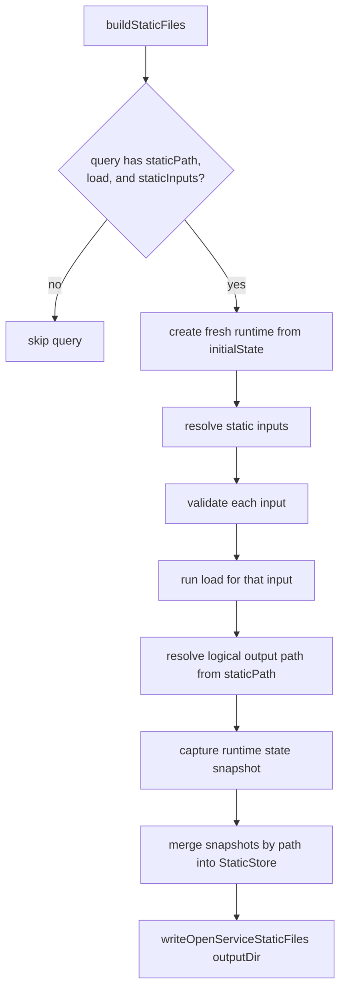

# Open Service

`open-service` is a small schema-driven service system for Storybook internals.

Its goals are:

- define stateful services in one declarative object
- expose synchronous queries and async commands with strong TypeScript inference
- validate all query and command input/output through Standard Schema (schemas may transform/coerce)
- support fine-grained reactive query subscriptions through deep signals (`deepsignal` +
  `@preact/signals-core`)
- support server-side static state snapshots driven by query `load` hooks

The main audience for this README is agents and maintainers who need to understand how the pieces
fit together, where behavior lives, and how to define new services correctly.

## Public Surface

External callers import from one of these entrypoints:

- `storybook/open-service` for environment-agnostic service definitions — `defineService` and shared types (no React, no registration)
- `storybook/manager-api` for manager addons — `registerService` (relay hub), `useServiceQuery`, `useServiceCommand`, and shared types
- `storybook/preview-api` for preview code — `registerService` (leaf) and shared types (no React hooks)
- [server.ts](./server.ts) for server-side registration, discovery, and static snapshot writing

`registerService` is the **single** registration function across every runtime. It lives in
[service-registry.ts](./service-registry.ts) and is re-exported from each entrypoint with the right
`relay` default — server and manager are relay hubs, the preview is a leaf. There is no separate
client/server registration API.

The environment-agnostic API consists of:

- `defineService`
- the exported type aliases from [types.ts](./types.ts)

The server-only API consists of:

- `registerService`
- `listServices`
- `describeService`
- `getService`
- `getRegisteredServices`
- `buildStaticFiles`
- `writeOpenServiceStaticFiles`

The browser API consists of:

- `registerService` — creates a local runtime and joins the channel sync protocol
- `unregisterService` — tears down one service's channel listeners and removes it from the registry
- `clearRegistry` — removes all registrations (use in `afterEach` in tests)
- `useServiceQuery` — React hook backed by `useSyncExternalStore` (manager entrypoint)
- `useServiceCommand` — React hook returning a stable command reference (manager entrypoint)

Internal tests and implementation code may import from the individual modules directly.

## File Layout

- [index.ts](./index.ts): environment-agnostic barrel for definition helpers and shared types
- [server.ts](./server.ts): server entrypoint that re-exports registration APIs (relay hub) and owns static snapshot building/writing
- [manager.ts](./manager.ts): manager entrypoint (`relay: true`) re-exported via `storybook/manager-api`; adds `useServiceQuery` and `useServiceCommand`
- [preview.ts](./preview.ts): preview entrypoint (`relay: false`, leaf) re-exported via `storybook/preview-api`; registration only, no React hooks
- [types.ts](./types.ts): core type model for definitions, contexts, runtime instances, and static build data
- [service-definition.ts](./service-definition.ts): `defineService()` typing that preserves inline inference when declaring services
- [service-validation.ts](./service-validation.ts): sync + async schema validation helpers and error wrapping
- [errors.ts](./errors.ts): validation metadata formatting helpers
- [service-runtime.ts](./service-runtime.ts): signal-backed runtime construction (state, commands, static loader) that assembles one service instance
- [query-runtime.ts](./query-runtime.ts): the query surface (`.get()` / `.loaded()` / `.subscribe()`), the in-flight load registry, the `.loaded()` drain logic, and subscriptions
- [service-registry.ts](./service-registry.ts): the single `registerService`, the realm-global registry, and the shared registry API passed into runtimes — used identically by server, manager, and preview
- [service-channel.ts](./service-channel.ts): `ServiceChannel` interface, event name constants, and payload types
- [service-error-serialization.ts](./service-error-serialization.ts): transport-safe (de)serialization of thrown errors and their `cause` chains, used by remote command replies
- [channel-slot.ts](../../channels/channel-slot.ts): `getChannel` / `setChannel` — the shared channel install surface
- [service-transport.ts](./service-transport.ts): shared channel transport — wraps commands to broadcast, wires the sync-start initialization + patch listeners (hub or leaf), and runs the remote-command-execution protocol
- [service-sync.ts](./service-sync.ts): last-write-wins ordering, `applyStatePatch` structural state application, and the per-service snapshot reconciler
- [use-service-query.ts](./use-service-query.ts): `useServiceQuery` React hook backed by `useSyncExternalStore`
- [use-service-command.ts](./use-service-command.ts): `useServiceCommand` React hook returning a stable command reference
- [fixtures.ts](./fixtures.ts): scenario fixtures used by the test suite
- `*.test.ts` / `*.test.tsx`: focused tests for runtime behavior, validation, registration, static builds, channel sync, and React hooks

## Core Concepts

### Service

A service is a state container with:

- a stable `id`
- an `initialState` — **must be a plain object** (see [State must be an object](#state-must-be-an-object))
- a `queries` map
- a `commands` map
- optional descriptions on the service and each operation

Use `defineService()` to preserve the concrete query and command map types.

### Query

A query is:

- **synchronously readable**: `service.queries.foo.get(input)` returns the validated handler result immediately and **never** fires the query's `load`. It is a pure read of current state.
- **read-only**: the handler receives `{ state, queries }` and cannot mutate state or call commands
- **load-coupled only through `loaded()` / `subscribe()`**: the optional `load` hook fires when you `await query.loaded(input)` or hold an active `query.subscribe(input, ...)` — not on a bare `.get()` read. Inside a `load` body or a `.loaded()` discovery pass, a `.get()` read of a dependency *does* warm that dependency's load (see [Load](#load)), deduped per `(service, query, input)` while one is in flight.
- **subscribable** through `query.subscribe(input, callback)`, where the callback receives a [`QueryState`](#query-state) (the current `data` plus its `load` lifecycle), not a bare value. The first emission is **synchronous** — the callback is invoked once before `subscribe` returns.
- **awaitable in full** through `query.loaded(input)`, which returns a promise that settles once the load and every transitively touched dependency have completed
- **statically buildable** when the query declares `staticPath` and `staticInputs`

Query handlers receive a `QueryCtx`:

- `ctx.self.state`
- `ctx.self.queries`
- `ctx.getService(serviceId)` — synchronous

Query handlers do **not** receive `commands` or `setState`. Mutations belong in commands; load-time preparation belongs in `load`.

### Load

`load` is an optional async hook on each query definition. It receives a `LoadCtx`:

- `ctx.self.state`
- `ctx.self.queries` — wrapped versions of the service's own queries; calling them inside `load` registers transitively triggered loads into the current drain
- `ctx.self.commands` — declared commands, used for all state mutation (load contexts do not receive `setState` directly)
- `ctx.getService(serviceId)` — synchronous

`load` mutations must go through commands. Cross-service `getService(...).queries.*` calls inside a load body are not auto-tracked for the drain; use `await ctx.getService(id).queries.foo.loaded(input)` when you need a cross-service dependency awaited before your own load completes.

**`load` is a reactive, idempotent warming step.** For an active subscription, `load` re-fires whenever the external signals it reads synchronously change — same-service fields and cross-service reads via `getService(...).queries.*` alike — turning a query into a reactive async resource (like a TanStack Query / SolidJS `createResource` / Vue async `watchEffect`). This means:

- **`load` must be idempotent.** Re-running it with the same dependencies must produce the same state. Any genuinely one-shot side effect belongs in a command invoked conditionally, never in `load` itself.
- **Read dependencies synchronously, up front.** Only reads in the load's synchronous prefix (before the first `await`) are tracked. Read the values you depend on first, then do async work — the same idiom every signal-based resource uses.
- **Loads that read no external signal fire exactly once** (the common case: `await ctx.self.commands.x(input)`), so existing loads are unaffected.
- A bare `query.get()` read never fires a load and is never reactive. A `.loaded()` call fires loads but keeps one-shot-per-call semantics. Reactivity is scoped to subscriptions and is torn down when the last subscriber unsubscribes.

The runtime guards re-firing: a superseded run (its dependencies changed again before it finished) cannot overwrite a newer run's state, and changes batched together produce a single re-load.

**Keep `load` bodies as small as possible.** Almost always, `load` should be a one-liner that calls a command — the real work (input resolution, side effects, validation, state mutation) belongs in the command. This pays off for three reasons:

- **Reusability.** Anyone can call the command directly (other services, tests, integrations) without going through the query's load path. Logic stuck inside a load is unreachable from outside the drain.
- **Testability.** Commands have a typed input/output contract you can assert against. Load bodies don't return anything useful.
- **Clear contract.** A query says "read state". A command says "do work that produces state". A bloated load blurs the line and makes the service harder to reason about.

A good rule of thumb: if `load` does anything more than `await ctx.self.commands.someCommand(input)`, ask whether that "more" belongs in the command instead.

### Query state

Subscribers (and the `useServiceQuery` hook) receive a `QueryState<TData>`, not a bare value. It pairs the query's current `data` with its `load` lifecycle, so a UI can show loading/error states that the synchronous value alone cannot express. It is inspired by TanStack Query's status model, translated into the `load` vocabulary (this system's slow step is any `load` — a computation, a command, a remote call — not specifically a network "fetch").

```ts
type QueryState<TData> = {
  data: TData | undefined; // last successful value; undefined before the first success
  error: Error | undefined; // set when status === 'error'
  status: 'pending' | 'error' | 'success'; // the primary load lifecycle
  loadStatus: 'loading' | 'idle'; // whether a load is in flight (foreground OR background)
  isPending: boolean; // status === 'pending'
  isSuccess: boolean; // status === 'success'
  isError: boolean; // status === 'error'
  isLoading: boolean; // loadStatus === 'loading' (ANY load in flight)
  isInitialLoading: boolean; // isPending && isLoading (first-ever load, no data yet)
  isRefreshing: boolean; // isLoading && !isPending (background re-load over existing data)
};
```

Two independent axes:

- **`status`** tracks the `load` lifecycle. A query with no `load` is born `success` (nothing to load); a query with a `load` starts `pending` and flips to `success` once the load settles, or `error` if it rejects.
- **`loadStatus`** tracks whether a load is currently in flight, so `pending` (first load, no data yet → `isInitialLoading`) is distinguishable from a background re-load over existing data (`success` + `loading` → `isRefreshing`). The two-axis split mirrors TanStack's `status` / `fetchStatus`.

`data` and `status` are independent: `data` always reflects the synchronous handler result (the last successful value), and is retained across an `error` so the last good value stays visible. Three things map to `status: 'error'` (each keeping the last `data`): input-validation failure, a synchronous handler / output-validation throw, and a `load` rejection — surfacing a debuggable error state instead of a silently dead subscription.

`status` is tracked **per subscription** (it rides alongside the existing per-subscription reactive-load effect and epoch gating); subscription deduplication is an orthogonal optimization left for later.

### Command

A command is:

- always async at call time
- allowed to mutate state through `ctx.self.setState(...)`
- validated on both input and output

Commands receive a `CommandCtx` whose `self` includes `state`, `queries`, `commands`, and `setState`.

A command handler may be implemented in only **some** runtimes — most often a handler supplied at
server registration that needs Node APIs or server context. A runtime that lacks a local handler does
not throw when the command is called; it requests **remote command execution** from a peer that does
implement it (see [Remote Command Execution](#remote-command-execution)). Queries stay local-only and
still throw `OpenServiceUnimplementedOperationError` when no handler exists.

### Discovery visibility

Services and operations can be hidden from discovery APIs without disabling them at runtime:

- Set `internal: true` on a **service** to omit it from `listServices()`. `describeService(id)` and
  `getService(id)` still work when the id is known.
- Set `internal: true` on a **query or command** to omit it from `describeService()` output (and
  therefore from `queryNames` / `commandNames` in `listServices()` summaries). Runtime callers can
  still invoke the operation through a service handle, and TypeScript types remain available.

`internal` defaults to `false` when omitted. It is part of the definition contract only — it cannot
be overridden at `registerService()` time. Static snapshot building is unaffected.

### Internal operation naming

Internal queries and commands must use a `_` prefix (for example `_debugState`). `defineService()`
enforces this bidirectionally at compile time:

- `internal: true` requires a `_`-prefixed name
- a `_`-prefixed name requires `internal: true`

Public operations must not use a `_` prefix unless they are internal.

### Cross-service composition

Handlers resolve other registered services through `ctx.getService(serviceId)`. Without a type
parameter, the return type is `RuntimeService` — query and command results are erased to
`unknown`.

Pass the source service instance type as a generic to recover the full typed runtime surface:

```ts
import type { MutableRecordLookupService } from './mutable-record-lookup.ts';

handler: (input, ctx) => {
  const lookup = ctx.getService<MutableRecordLookupService>(
    'internal-fixture/mutable-record-lookup'
  );

  const record = lookup.queries.getRecordFields.get({ entryId: input.entryId });
  // record is fully typed — do not cast individual query results

  return record?.marker === 'match';
};
```

`getService` is a cheap synchronous registry lookup and always returns the same instance for a given id for the lifetime of the registration. Do not wrap it in `useMemo` — call it directly in render (or in a handler/effect when that is clearer). Memoize inputs and selectors passed to `useServiceQuery` / `useQuerySubscription` instead; those are what drive re-subscription.

Guidelines:

- Import the source definition **type-only** when it is only needed for the generic parameter
- Pair the generic with the correct service id — TypeScript cannot verify they match at compile time
- Omit the generic when the target service is not known statically; the untyped `RuntimeService`
  surface is the correct fallback
- Do **not** cast individual query or command results; type the service handle once instead
- Prefer `await service.queries.foo.loaded(input)` for cross-service reads in operational code. A
  direct `service.queries.foo.get(input)` read returns the current state immediately and does **not**
  start that query's load, so it can return stale or empty data if the load has never run. Use the
  direct sync form only when "current best effort" is the intended behavior, or when you are testing
  the synchronous query contract itself.

The exported `ServiceInstanceOf<typeof sourceDef>` alias is available for named handle types when
a service is referenced from many call sites.

### Core service typing

Core services under `services/` are typed at the module-level `getService` entrypoints
(`storybook/manager-api`, `storybook/preview-api`, and the server import). Known ids such as
`getService('core/docgen')` resolve to the correct instance type without an explicit generic;
unknown ids still fall back to `RuntimeService`, and addon services can keep using
`getService<MyService>('my-addon/service')`.

Each core service registers in a runtime-specific file next to its definition:

- `services/<name>/manager.tsx` — manager registration
- `services/<name>/preview.ts` — preview registration
- `services/<name>/server.ts` — dev-server registration

When you add a new core service or register an existing one in a new runtime, you must:

1. Add or update the registrar file for that runtime (`manager.tsx`, `preview.ts`, or `server.ts`).
2. Add the service definition to the matching list in `core-service-types.ts`
   (`managerCoreServiceDefs`, `previewCoreServiceDefs`, or `serverCoreServiceDefs`).

Those def lists are the single source of truth: the `getService` overload types
(`ManagerCoreServices`, `PreviewCoreServices`, `ServerCoreServices`) derive their ids from each
definition, so there is no separate id list to keep in sync. A unit test in
`core-service-types.test.ts` compares the lists against the registrar-file convention (every listed
service has a matching `services/<name>/<runtime>.{ts,tsx}` file, and vice versa) and fails with
actionable guidance when they drift apart. The test guards the convention, not the actual call site,
so still confirm the registrar is invoked (e.g. from `common-preset.ts` on the server). Handler-context
`ctx.getService(...)` is unchanged and still requires an explicit generic when full typing is needed.

### Validation

Every query and command must declare:

- `input`
- `output`

Both must be Standard Schema compatible.

The runtime validates:

- caller input before a handler runs
- handler output when a value is produced for a consumer — a direct `query.get()` read, `query.loaded()`,
  the static build, and a subscription emission

Output validation reads the whole value, so it is kept out of the part of a subscription that
determines reactive dependencies: for a `selector` subscriber it runs without tracking, so it cannot
expand the deep-signal dependency footprint. (See "Subscription Flow".)

Queries validate **synchronously**. Their input and output schemas must produce sync results. If a Standard Schema returns a Promise during a query validation, the runtime throws `OpenServiceAsyncSchemaError` immediately.

Commands validate asynchronously and accept async schemas.

Validation failures become `OpenServiceValidationError` with a message that includes:

- whether the failure happened on input or output
- whether the failing operation is a query or command
- the full `serviceId.operationName`
- one line per issue, including path and the schema's expectation text

Handling of extra object fields depends on the schema implementation you choose. The current test fixtures use Valibot `object(...)` schemas, which accept unexpected extra fields rather than rejecting them.

## Server Registration Flow

Server-side registration happens through the `services` preset hook. Storybook calls `await presets.apply('services')` during both dev startup and static builds, and each service author's preset implementation is responsible for calling `registerService(...)` directly.

That split is intentional:

- [index.ts](./index.ts) stays environment-agnostic so preview, manager, and server code can share
  one definition surface
- [server.ts](./server.ts) exposes server-side registration (a relay hub) and owns static snapshot
  writing for the current server process; the registry itself lives in
  [service-registry.ts](./service-registry.ts), shared with the browser entrypoints

`registerService(definition)` is idempotent by id: registering an id that already exists returns the
existing runtime instead of throwing. This keeps core services safe to register from a `beforeAll`
annotation, which CSF4 composes twice (once in `definePreview`, once in `StoryStore`) and which also
re-runs on HMR. The default `services` preset hook in
[common-preset.ts](../../../core-server/presets/common-preset.ts) still throws if the preset is applied
more than once in the same process, which catches misconfigured preset wiring early.

The internal Storybook config registers an example debug service through a dedicated preset file
([`code/.storybook/services-preset.ts`](../../../../.storybook/services-preset.ts)), gated on
`STORYBOOK_OPEN_SERVICE_DEBUG=true`. The flag stays unset by default so normal `yarn storybook:ui`
and `yarn storybook:ui:build` runs do not register the debug service.

## Runtime Flow

When any runtime registers a service definition:

1. [service-registry.ts](./service-registry.ts) merges any registration-time `staticInputs` overrides for queries and handler overrides for commands.
2. It passes the shared registry API into [service-runtime.ts](./service-runtime.ts).
3. [service-runtime.ts](./service-runtime.ts) creates a signal-backed state container from `initialState`.
4. It builds a writable `commandSelf` reference around that state.
5. It builds commands that validate input, run handlers, and validate output.
6. It builds queries whose `.get()` validates input synchronously, runs the handler synchronously, and validates the output — without firing `load`. Loads fire only through `.loaded()`, an active `subscribe()`, or a dependency `.get()` read made from within a load/`.loaded()` context (deduped while in flight).
7. [service-registry.ts](./service-registry.ts) wraps the commands to broadcast post-mutation snapshots, joins the channel sync protocol when a channel is present (as a hub or leaf), and stores the resulting instance behind the registry entry for later lookup.

## In-flight Load Registry

`query-runtime.ts` owns one process-global in-flight load registry keyed by `${serviceId}::${queryName}::${stableHash(parsedInput)}`. The hash uses stable JSON (sorted keys) computed from the post-validation parsed input, so inputs are expected to be JSON-safe. Two concurrent callers for the same key share one load; once it settles, the entry is removed so future calls can refire it. There is no caller-facing invalidation API.

## `.loaded()` Drain

`query.loaded(input)` returns a promise that settles only when the load body and every dependency the handler transitively reads are fully populated. Implementation lives in `runLoaded` in [query-runtime.ts](./query-runtime.ts).

### Algorithm

1. **Setup.** Validate input. Build a `LoadedSession`:
   - `ancestorChain` — the set of load keys we are currently nested inside (used to break cycles). Inherits from any parent `.loaded()` chain and is extended with this query's own key.
   - `collector` — load promises waiting to be drained.
   - `settledKeys` — load keys that have already settled in this session (do not refire them).
2. **Fire own load.** If this query has a `load` hook, push its promise into the collector via the in-flight registry. Skip if the key is already on the parent ancestor chain.
3. **Drain + discover loop** (capped at 32 iterations):
   - **Drain**: while `collector` has entries, snapshot them, clear, `Promise.allSettled` them, mark their keys settled, surface the first rejection (others attached as `cause.aggregated`).
   - **Discovery**: run the sync handler under `activeHandlerLoadSession = session`. Sync reads of dependencies fire and register their loads into `collector` — provided the dep is not already on the ancestor chain (cycle) and not already settled this session (already loaded).
   - If discovery added new entries, loop. Otherwise exit.
4. **Final read.** Run the handler one last time without the session and return the validated output.

If iteration count exceeds 32, throw `OpenServiceLoadedDrainExceededError`. This catches pathological cases (e.g. a handler that reads a query with an ever-changing input key) instead of hanging.

### Worked example

`bar.loaded(input)` where `bar.handler` reads `foo` and `foo` has its own `load`:

| Step | What happens |
|------|--------------|
| Setup | `session = { ancestorChain: {barKey}, collector: ∅, settledKeys: ∅ }`. `bar.load` is undefined → no own load fired. |
| Iter 1, drain | Collector empty, skip. |
| Iter 1, discovery | Handler runs. Reads `ctx.self.queries.foo.get(...)`. Because an `activeHandlerLoadSession` is set, the default `foo` query sees the session, sees `fooKey` is not in ancestor or settled, fires `foo.load` and pushes promise into `collector`. Handler returns (state still empty). |
| Iter 2, drain | `await Promise.allSettled([fooPromise])`. Mark `fooKey` settled. State now populated by `foo.load`. |
| Iter 2, discovery | Handler runs again. `foo` is in `settledKeys` → fires nothing. Collector stays empty. |
| Exit | Final handler call (no session): returns the now-populated value. |

### Inside a `load` body

When the discovery handler runs, sync `.get()` reads via `ctx.self.queries.*` go through the *default* query map (the same one consumers see) and register against `activeHandlerLoadSession`. That works for sync code because module-scoped state is stable across one synchronous handler call.

When an **async** `load` body runs, it instead gets a *wrapped* `ctx.self.queries.*` from `buildLoadWrappedQueries`. Each wrapper's `.get()` closes over the load's own ancestor chain and local collector, so reads inside the body register dependencies regardless of how many `await`s the body has between them. After the body resolves, the load promise waits for its local collector to drain before settling — which is what gives `.loaded()` its transitive guarantee through async load bodies.

A **reactive subscription** load body (re-fired when its tracked signals change) gets a third wrapper from `buildReactiveLoadQueries`: a `.get()` read of a dependency fires that dependency's load fire-and-forget (and tracks the state the read touches), so a subscribed query that derives from another query still warms its dependencies even though a bare consumer `.get()` would not.

Cross-service `ctx.getService(id).queries.*` calls inside a load body are **not** wrapped; authors must use `.loaded()` explicitly when they need a cross-service dep awaited from inside a load. From a sync handler, cross-service queries are tracked because they consult the module-scoped session like any other call.

## State and reactivity

### State must be an object

A service's `initialState` (and therefore its whole state) **must be a plain object**. Primitives,
`null`, `undefined`, and arrays are rejected at the `defineService` authoring boundary by the
`ServiceState` type (see [types.ts](./types.ts)). This is enforced for two structural reasons, not as
an arbitrary style choice:

- **Reactivity.** State is wrapped in a `deepSignal` proxy for fine-grained per-field tracking, and
  `deepSignal` throws (`"this object can't be observed"`) on scalars, `null`, and `undefined` — there
  are no fields to track on a scalar.
- **Sync.** Cross-peer reconciliation (`applyStatePatch` in [service-sync.ts](./service-sync.ts)) merges
  state by walking object keys; it has no concept of replacing a whole scalar.

Arrays are a special case: `deepSignal` *can* observe them, but `applyStatePatch` replaces arrays
wholesale rather than merging by key, so a **top-level** array state would silently fail to sync
between peers. They are therefore rejected too. Wrap collections in a field instead:

```ts
// ❌ not allowed
initialState: [] as Item[],
// ✅ wrap it
initialState: { items: [] as Item[] },
```

Nested arrays *inside* the state object are completely fine — only the top-level state must be a
keyed object. The `extends object` bound still accepts both `interface` and `type` state shapes.

State is a **deep reactive proxy** (`deepSignal` from `deepsignal`, backed by `@preact/signals-core`)
created in [service-runtime.ts](./service-runtime.ts). There is no top-level state atom and no Immer:

- Reading a field through `ctx.self.state` tracks a fine-grained signal for exactly that field
  (including not-yet-present record keys, which fire when the key is later added).
- `setState((state) => …)` mutates the proxy **in place** inside a batch, so one command notifies
  subscribers once, and only the fields it actually changed are invalidated.
- The proxy is internal and does not escape:
  - Query/`.loaded()` results are the schema-validated value. For object and array schemas that
    rebuild a plain value, this also detaches the result from the proxy.
  - Subscription emissions are detached to plain values (validated for whole-value subscribers, or
    JSON-stripped for `selector` slices).
  - The whole-state snapshot for the static build uses `structuredClone` of the plain backing
    object. (`structuredClone` cannot clone a proxy, so proxy-slice stripping uses a JSON round-trip;
    state must be JSON-serializable, the same constraint the static-build pipeline relies on.)

## Subscription Flow

Subscriptions are implemented in [query-runtime.ts](./query-runtime.ts):

1. `subscribe(input, callback)` (or `subscribe(input, selector, callback)`) runs synchronously and emits the first `QueryState` **before it returns** — there is no microtask deferral. Callers that need to react only to *later* changes must ignore the first synchronous emission themselves.
2. Setup validates the input synchronously. If the query has a `load`, it is run inside its own `effect()` so the external signals it reads synchronously are tracked: when they change, the effect re-runs and the load re-fires (see "Load"). Writes from a superseded run are dropped (each run carries an epoch; `setState` is gated on it), so a slow stale load can't clobber a newer result. The effect is torn down with the subscription.
3. A `computed()` runs the synchronous handler against the deep-signal proxy, so its dependency footprint is exactly what it reads. The output is always validated, but where validation runs depends on the subscription:
   - **No selector:** the value is validated here and emitted. Reading the whole value to validate it is the correct footprint for a whole-value subscriber, and it keeps the emitted value identical to a direct `query.get()` pull.
   - **With a selector:** validation runs untracked (so it does not register dependencies) and only `selector(value)` is read (then detached to a plain snapshot), so a sibling field the selector ignores never re-runs the handler.
4. A per-subscription **lifecycle signal** carries `status` / `loadStatus` / `error` (see [Query state](#query-state)). The reactive-load effect writes it: it flips to `loading` when a load starts (preserving `pending` vs `success` so the first load reads as `isInitialLoading` and a re-load as `isRefreshing`), then to `success`/`idle` or `error`/`idle` as the load settles — all gated on the same epoch so a superseded run can't write a stale lifecycle.
5. An `effect()` reads **both** the lifecycle signal and the data computed, builds a `QueryState`, and emits it. It runs immediately (delivering the current state) and re-runs when the computed's tracked fields change **or** the lifecycle changes — so a status-only change (e.g. a background re-load over an unchanged selected slice) still fires the callback. A write to an unrelated key or field never re-runs the handler. A synchronous handler / output-validation throw is caught here and emitted as `status: 'error'` keeping the last good `data`.
6. Emissions are deduped on the **whole `QueryState`**: the effect compares the new state with the last emitted one via `es-toolkit` `isEqual` and skips the callback when they are equal. So a load that rewrites a deeply-equal value with no status change does not re-fire subscribers, but a status change always does.
7. The optional `selector` is the `universal-store` pattern: the callback receives a `QueryState` whose `data` is the selected slice, and fires only when that slice or the lifecycle changes — and, because the selector drives the computed's reads, an unselected field change does not even re-run the handler.

Tests should use `vi.waitFor(...)` when asserting the first emission or follow-up emissions.

## Static Snapshot Flow

`buildStaticFiles()` in [server.ts](./server.ts) iterates every registered service and looks for
queries that define:

- `staticPath` at definition time
- `load` on the definition
- `staticInputs` (definition or registration)

For each static input it:

1. creates a fresh runtime from `initialState`
2. validates the static input using the query's `input` schema
3. runs the runtime's `runLoadOnce(queryName, validatedInput)` helper, which drives the load body (and any loads it triggers via wrapped self queries) to completion
4. resolves the normalized logical output path as `<serviceId>/<staticPath(input)>`
5. stores the resulting runtime state in the final `StaticStore`

`staticPath` is declared on the definition layer as `(input) => string`, relative to the service's
own output folder. The static build always prepends the service id so two services cannot write to
the same JSON path. It is exposed to callers through `describeService()` as `staticPath: true` on the
matching query descriptor. Manager code can use that flag to choose between live runtime queries
and prebuilt JSON snapshots.

`staticInputs` may be declared in the definition when the input list has no runtime dependencies.
Registration may override or supply `staticInputs` when the enumerator needs registry access,
story-index data, or other server context.

Cross-service `ctx.getService(...)` lookups during load resolve through the same registry the
dev server uses, so a load sees the same set of services that any other handler in the process
would see.

If multiple tasks resolve to the same path, their states are deep-merged.

`writeOpenServiceStaticFiles(outputDir)` then writes those logical paths underneath `<outputDir>/services`, converting slash-separated logical keys into native filesystem paths for the current operating system.

In a static Storybook build (`CONFIG_TYPE === 'PRODUCTION'`), manager and preview runtimes pass a browser static loader into `registerService`. For every query that declares `staticPath`, the runtime swaps the authored `load` hook for a fetch of `./services/<serviceId>/<staticPath>` relative to the served HTML root (the same convention as `./index.json`), then applies the JSON snapshot via `applyStatePatch(..., { preserveMissingKeys: true })` so snapshots for one query input do not delete state populated by other inputs. Development mode keeps running `load` normally against the dev server.

Static path rules:

- `staticPath` values are relative to the service; the build prepends `<serviceId>/` automatically
- authors should think in forward-slash logical paths such as `nested/file.json` or `${input.entryId}.json`
- leading `./` and `/` are normalized away
- backslashes are normalized to `/`
- `..` segments are rejected so snapshots cannot escape the service folder



## Client Architecture (Multi-Master)

Browser processes (manager and preview) each run their own full `ServiceRuntime` — identical in shape to the server-side one. State is reconciled peer-to-peer through Storybook's existing manager↔preview channel using a sync-start initialization + patch-broadcast protocol.

```text
┌─────────────────────────┐     channel (services:*)     ┌─────────────────────────┐
│  Manager process        │  ◄────────────────────────►  │  Preview process        │
│                         │                               │                         │
│  registerService        │                               │  registerService        │
│  ┌─────────────────┐    │                               │  ┌─────────────────┐    │
│  │  ServiceRuntime │    │                               │  │  ServiceRuntime │    │
│  │  (deep signals) │    │                               │  │  (deep signals) │    │
│  └─────────────────┘    │                               │  └─────────────────┘    │
└─────────────────────────┘                               └─────────────────────────┘
```

### Channel setup

There is no open-service-specific channel install step. `getChannel()` from `storybook/internal/channels`
reads the live channel — the manager sets it via `addons.setChannel`, both builders inject it into the
preview iframe, and the dev server installs it in the `services` preset before any service registers.

Until a channel is installed, service runtimes operate in isolation — all reads and writes are local
only. Unit tests can install a mock channel with `setChannel(mock)` (or `clearChannel()` to assert
registration fails without one).

### `registerService`

Creates a local `ServiceRuntime` from the service definition (identical across runtimes) and wires it into the sync protocol:

1. **On registration** — emits `services:sync-start` so any existing peer can reply with its current snapshot.
2. **On sync-start-reply** — applies the received snapshot into the local runtime so the new peer bootstraps from existing state.
3. **After each local command** — broadcasts the full post-mutation state as `services:patches` so all peers stay in sync.
4. **On incoming patches** — applies the received state into the local runtime via `commandSelf.setState`, which triggers fine-grained signal updates and re-renders subscribed components.

### Loop prevention

Every channel event carries the emitter's `clientId` (generated per `registerService` call). Listeners silently ignore events whose `clientId` matches their own, so peers never re-apply state they just emitted.

### State application without re-broadcast

Incoming state (from sync-start-reply or patches) is applied via `serviceRuntime.commandSelf.setState(...)` directly — not through the wrapped commands — so no broadcast is triggered for received state.

### `applyStatePatch`

Rather than replacing the entire state object on each patch (which would invalidate all signal subscriptions), `applyStatePatch` (in [service-sync.ts](./service-sync.ts)) recursively merges plain-object values in place: arrays and primitives are replaced directly, `__proto__`/`constructor`/`prototype` are skipped to block prototype pollution, and `preserveMissingKeys` controls whether missing keys are deleted. Cross-peer sync passes `false` so deletions propagate from full snapshots; static JSON loading passes `true` because each static file is a partial snapshot. This keeps fine-grained subscriptions on unaffected nested fields from firing spuriously.

### State sync sequence

```text
Peer A (manager)            Channel              Peer B (preview)
─────────────────────────────────────────────────────────────────
registerService()
  └─ emit sync-start ──────────────────────────────────────►
                                                (no peer yet; silence)

                                                registerService()
◄─────────────────────────── emit sync-start ──────────────
  └─ reply with snapshot ──────────────────────────────────────►
                                                  └─ apply snapshot

service.commands.foo()
  └─ local runtime mutates
  └─ emit patches ─────────────────────────────────────────────►
                                                  └─ apply state
```

### Server participation

The dev server is a full peer, not a passive observer. `registerService` on the server registers as a relay hub (`relay: true`): it wraps commands to broadcast their post-mutation snapshots, responds to sync-starts, applies incoming patches, and re-broadcasts every adopted snapshot so peers on its other transports (each connected manager tab) converge. This is wired automatically at registration once the `services` preset has installed the channel — there is no separate connect step.

## Remote Command Execution

Queries are local-only, but commands are not. A command's handler can be supplied in only **some**
runtimes — the canonical case is a handler added at server registration that needs Node APIs or
server context. The runtimes that lack the handler must still be able to invoke the command (from
`useServiceCommand`, a test, or another service), so they ask a peer that can run it.

`registerService` decides this **per command at registration time** by checking whether the resolved
definition has a `handler`:

- **Has a local handler** → the command runs locally and broadcasts its post-mutation state as usual
  (the normal multi-master path), **and** the runtime listens for invoke requests so it can run the
  command on behalf of peers that cannot.
- **No local handler** → the command becomes a **remote invoker**: calling it sends a request over
  the channel and returns a promise that settles when a peer answers.

The protocol lives in [service-transport.ts](./service-transport.ts) (`connectCommandTransport`) and
is covered by the command transport tests.

### Roles

Every registered runtime plays **both** roles at once, decided per command:

- **Requester** (no local handler): calling the command emits `services:command-invoke` carrying a
  freshly generated `callId` and returns a promise. The promise resolves with the `result` of the
  first `services:command-result` for that `callId`, or rejects with the reconstructed error from the
  first `services:command-error`.
- **Responder** (has a local handler): on a matching `services:command-invoke` it emits
  `services:command-ack` **immediately** (before running), executes the command locally — which
  validates input, mutates state, and broadcasts the post-mutation snapshot through the normal command
  wrappers so every peer converges — then emits `services:command-result` or `services:command-error`.

A runtime never requests a command it implements (it runs that locally), so a responder never answers
its own invoke echo: `onInvoke` only acts on commands in its `implementedCommandNames` set.

### Events

All four events are namespaced under `services:` and carry the `serviceId` so a runtime that hosts
several services routes them correctly.

| Event | Direction | Payload |
| ------------------------- | ------------------------ | ----------------------------------------------------- |
| `services:command-invoke` | requester → implementers | `{ serviceId, commandName, input, callId, clientId }` |
| `services:command-ack`    | implementer → requester  | `{ serviceId, callId, clientId }`                     |
| `services:command-result` | implementer → requester  | `{ serviceId, callId, result, clientId }`             |
| `services:command-error`  | implementer → requester  | `{ serviceId, callId, error, clientId }`              |

- `callId` is the per-invocation correlation id (see [Correlation and parallel calls](#correlation-and-parallel-calls)).
- `clientId` is the id of the runtime that emitted the envelope — the requester on an invoke, the
  responder on a reply.
- `error` is a transport-safe serialization of the thrown value, including its full `cause` chain (and
  arrays such as the `.loaded()` drain's `cause.aggregated`) plus Storybook fields like
  `code`/`fromStorybook`. See [service-error-serialization.ts](./service-error-serialization.ts);
  `Error` instances cannot cross a websocket (JSON) or postMessage (structured clone) boundary intact,
  so they are flattened to a plain shape and rebuilt into a real `Error` on the requester.

### Sequence

One runtime calls a command implemented only on the dev server:

```text
Requester                        Channel               Server (responder)
──────────────────────────────────────────────────────────────────────────
service.commands.example(...)
  └─ new callId
  └─ emit command-invoke ───────────────────────────────────►
                                                  └─ emit command-ack ──┐
  ◄───────────────────────────────────────────────────────────────────┘
                                                  └─ run command locally
                                                       └─ mutate + emit patches ──►
  ◄── apply patches (state converges) ───────────────────────────────────
                                                  └─ emit command-result ──┐
  ◄───────────────────────────────────────────────────────────────────────┘
  └─ promise resolves with result
```

State still flows through the normal patch-broadcast path, so the requester gets the new state via
`services:patches` and the resolved value via `services:command-result` — two independent channels of
truth that both converge.

### Awaiting

A command can be awaited from any runtime, even when it runs remotely: the returned promise resolves
on success and rejects on failure exactly as if the handler had been local. Callers never need to know
where the handler lives.

### Correlation and parallel calls

`callId` is generated fresh (`generateClientId()`) for **every** call, so it is effectively a unique
execution id. This is what makes concurrent calls safe:

- Two parallel calls — even with identical input — get two distinct `callId`s, two `pending` promise
  entries, and two independent invoke envelopes. Replies are matched strictly by `callId`, so they can
  never cross-wire and resolving one call never settles the other.
- A reply whose `callId` is unknown (already settled, or for a different runtime's call) or whose
  `serviceId` does not match is ignored.

`callId` correlates **replies**; it does not make a command idempotent. Each invoke triggers a real
execution on every responder that receives it.

### Multiple implementers (at-most-once is not guaranteed)

If several peers implement the same command, each one runs it (side effects and all) and replies. The
requester keeps the **first** reply per `callId` and ignores the rest — so the *promise* is deduped,
but the *execution* is not. A command can therefore legitimately run in more than one runtime.

This is intentional for now and constrained by convention, not enforced by the protocol: **implement a
command in exactly one runtime when its effects must not be duplicated.** Guaranteeing at-most-once
across implementers would require electing a single executor per call, which this slice does not do.

### Topology limits and timeouts

Replies travel back over the same channel the invoke went out on, and command events are **not**
relayed across a hub's other transports (unlike `services:patches`, which a relay hub re-broadcasts).
The manager is connected to both the dev server and the preview, so it can invoke a command implemented
in either; but a preview cannot directly invoke a server-only command, and vice versa — route such
calls through the manager, or implement the command on a directly-connected peer.

If no peer emits `services:command-ack` within a short window, the requester
rejects with `OpenServiceRemoteCommandUnhandledError` — the common case in a static build when a
query's `load` calls a server-only command. Once a peer acknowledges, the requester waits for
`services:command-result` or `services:command-error` as before. Unregistering the service still
rejects outstanding calls with `OpenServiceRemoteCommandDisconnectedError`.

## React Hooks

### `useServiceQuery`

Subscribes to a service query and returns its [`QueryState`](#query-state) (the current `data` plus the `load` lifecycle), re-rendering when the state changes. Pass the **query directly** so its input/output types infer per query.

```tsx
import { useServiceQuery } from 'storybook/manager-api';

// With input
const { data, isInitialLoading, isError, error } = useServiceQuery(service.queries.getRecordFields, {
  entryId: 'a',
});

// Void-input query (no input argument, no selector)
const { data } = useServiceQuery(service.queries.getSummary);

// With a selector the input is always positional; `data` is the selected slice.
const { data: name } = useServiceQuery(service.queries.getRecordFields, { entryId: 'a' }, (r) => r?.name);
// A void-input query passes `undefined` for the input when it needs a selector.
const { data: count } = useServiceQuery(service.queries.getSummary, undefined, (s) => s?.count);
```

The signature is `useServiceQuery(query, input?, selector?)`. The input argument is required for input queries and omittable only for void-input queries that pass no selector — `void` is just sugar for `undefined`, so there is no separate lone-selector shorthand (unlike `query.subscribe`). Backed by `useSyncExternalStore`. The subscription is torn down and recreated when the `query`, `input`, or `selector` changes.

The first render is seeded synchronously: `useSyncExternalStore` reads `getSnapshot` during render but only runs `subscribe` in a post-paint passive effect, so a snapshot must already exist. The hook reads the current value with `query.get(input)` (a pure synchronous read that fires no load) and wraps it in a synthetic `pending`/`loading` state. The real lifecycle arrives moments later from the subscription's first (synchronous) emission and corrects `pending` to `success`/`error`.

**The service must exist.** The hook does not special-case an absent service. A caller whose service may be missing (e.g. a docs block behind a feature flag) must guard at a parent and conditionally render a child component that calls this hook.

**Referential stability:** inputs are compared with `isEqual` (so inline object literals are safe), while the query and selector are compared by reference — memoize selectors (`useCallback` / module scope) to avoid re-subscribing every render. The hook does **not** dedup emissions: it re-renders on every emission and trusts the runtime, which already skips deeply-equal emissions (see [reactive load](#load)). A hook-level deep-equal check was deliberately removed because it could mask in-place mutations of deeply-nested state.

### `useServiceCommand`

Returns a stable reference to a service command. The reference is stable as long as `service` and `commandName` do not change, so it is safe to pass to child components or include in effect dependency arrays.

```tsx
import { useServiceCommand } from 'storybook/manager-api';

const assignField = useServiceCommand(service, 'assignRecordField');

return (
  <button onClick={() => assignField({ entryId: 'a', fieldKey: 'x', fieldValue: 'y' })}>
    Update
  </button>
);
```

Fire-and-forget: the returned function returns a Promise. Callers manage their own loading and error state with `useState`, `useReducer`, TanStack Query, or whatever fits.

## How To Define A Service

Define queries and commands inline inside `defineService()` so the service-level schema maps can contextually type every handler, load hook, and `ctx.self.commands.*` call:

```ts
import * as v from 'valibot';

import { defineService } from 'storybook/open-service';
import { registerService } from './server.ts';

type ExampleState = {
  values: Record<string, string | undefined>;
};

const entryIdSchema = v.object({ entryId: v.string() });
const valueSchema = v.nullable(v.string());

export const exampleServiceDef = defineService({
  id: 'example/service',
  description: 'Example service used in documentation.',
  initialState: { values: {} } satisfies ExampleState,
  queries: {
    getValue: {
      description: 'Returns one value by id.',
      input: entryIdSchema,
      output: valueSchema,
      handler: (input, ctx) => ctx.self.state.values[input.entryId] ?? null,
      load: async (input, ctx) => {
        if (!(input.entryId in ctx.self.state.values)) {
          await ctx.self.commands.preloadValue(input);
        }
      },
      staticPath: () => 'state.json',
      staticInputs: async () => [{ entryId: 'a' }, { entryId: 'b' }],
    },
  },
  commands: {
    preloadValue: {
      description: 'Fills state for one id.',
      input: entryIdSchema,
      output: v.void(),
      handler: async (input, ctx) => {
        ctx.self.setState((state) => {
          state.values[input.entryId] = 'ready';
        });
      },
    },
  },
});

const exampleService = registerService(exampleServiceDef);

// Sync read — returns current state (null if the load has never run). Does NOT fire the load.
const current = exampleService.queries.getValue.get({ entryId: 'a' });

// Awaited variant — fires the load, waits for it (and any transitive deps) to settle, then returns the value.
const ready = await exampleService.queries.getValue.loaded({ entryId: 'a' });
```

## Design Rules

- State must be a plain object — no primitives, `null`, or top-level arrays (see [State must be an object](#state-must-be-an-object)). Wrap collections in a field: `{ items: [] }`.
- Always declare both `input` and `output` schemas on every query and command.
- Use `load` for read-side warming. The hook is async and must mutate via commands.
- **Keep `load` bodies minimal — ideally one line that calls a command.** Push input resolution, side effects, and state mutation into the command itself so it stays callable, testable, and reusable on its own.
- Query handlers are strict readers: sync, no commands, no `setState`.
- Use commands for all state mutation.
- Manager addons import from `storybook/manager-api`; preview code imports from `storybook/preview-api`. Server presets use [server.ts](./server.ts). Import modules in this directory directly only from tests or implementation code.
- Use `.loaded()` when a caller wants to fire the load and await the full state; use `.get()` when a synchronous "current best" read (no load) is fine.
- No channel install is needed in manager/preview — `getChannel()` returns the channel `addons.setChannel` installed.
- Call `clearRegistry()` in `afterEach` in tests that register services. Use `setChannel(mock)` before `registerService` when a test needs sync. Node bootstraps a noop channel at import; browser preview gets the real channel from builders before `preview.ts` loads.

## Testing Guidance

- Runtime behavior belongs in [service-runtime.test.ts](./service-runtime.test.ts)
- Validation behavior belongs in [service-validation.test.ts](./service-validation.test.ts)
- Server registration and static snapshot behavior belong in [server.test.ts](./server.test.ts)
- Leaf channel sync (`relay: false`, preview path) belongs in [service-transport-leaf.test.ts](./service-transport-leaf.test.ts); hub channel sync (dev server) in [service-registration-sync.test.ts](./service-registration-sync.test.ts)
- Remote command execution (requester/responder protocol) belongs in [service-command-transport.test.ts](./service-command-transport.test.ts); error (de)serialization in [service-error-serialization.test.ts](./service-error-serialization.test.ts)
- React hook behavior belongs in [use-service-query.test.tsx](./use-service-query.test.tsx) and [use-service-command.test.tsx](./use-service-command.test.tsx)
- Reusable scenario definitions belong in [fixtures.ts](./fixtures.ts)

When adding validation tests, prefer asserting the full exact error message. That keeps the tests useful as executable documentation for callers and agents.

React hook tests must include `// @vitest-environment happy-dom` as the first line and add `clearRegistry()` in `afterEach`. Use `waitFor(...)` (not `act`) when asserting state changes that flow through preact signals — `act` only flushes React's scheduler and is unaware of the signal effect queue.

## Agent Notes

- If you need to change runtime assembly (state, commands, static loader), start in [service-runtime.ts](./service-runtime.ts); for query reads, loads, the drain, or subscriptions, start in [query-runtime.ts](./query-runtime.ts).
- If you need to change registration or the registry (any runtime), start in [service-registry.ts](./service-registry.ts).
- If you need to change static snapshot building or writing, start in [server.ts](./server.ts).
- If you need to change validation wording, start in [errors.ts](./errors.ts).
- If you need to change schema handling, start in [service-validation.ts](./service-validation.ts).
- If you need to change service authoring ergonomics, start in [service-definition.ts](./service-definition.ts) and [types.ts](./types.ts).
- If you need to change channel transport, relay behavior, or remote command execution, start in [service-transport.ts](./service-transport.ts).
- If you need to change how thrown errors cross the channel for remote commands, start in [service-error-serialization.ts](./service-error-serialization.ts).
- If you need to change last-write-wins ordering or the structural merge, start in [service-sync.ts](./service-sync.ts).
- If you need to change the channel protocol (event names, payloads, channel reader), start in [service-channel.ts](./service-channel.ts).
- If you need to change the React query hook, start in [use-service-query.ts](./use-service-query.ts).
- If you need to change the React command hook, start in [use-service-command.ts](./use-service-command.ts).
