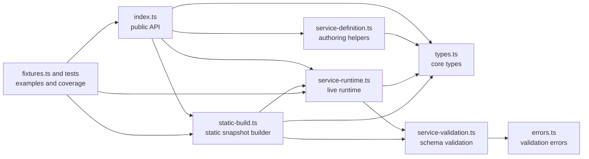
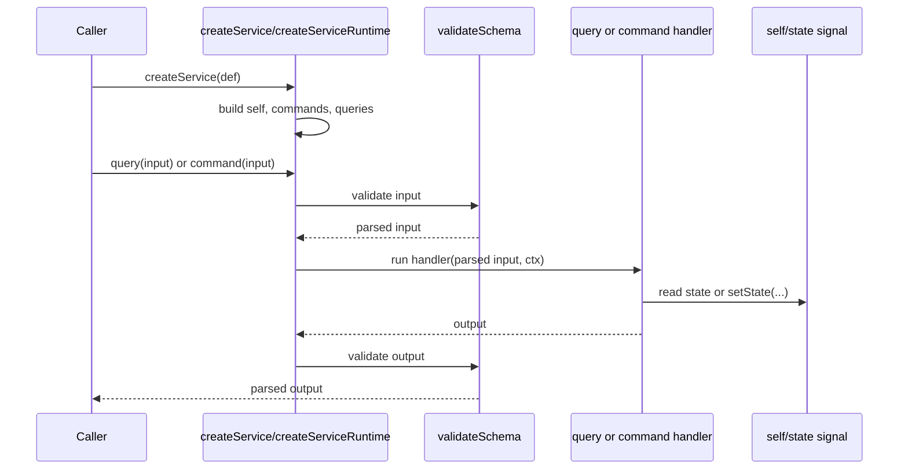
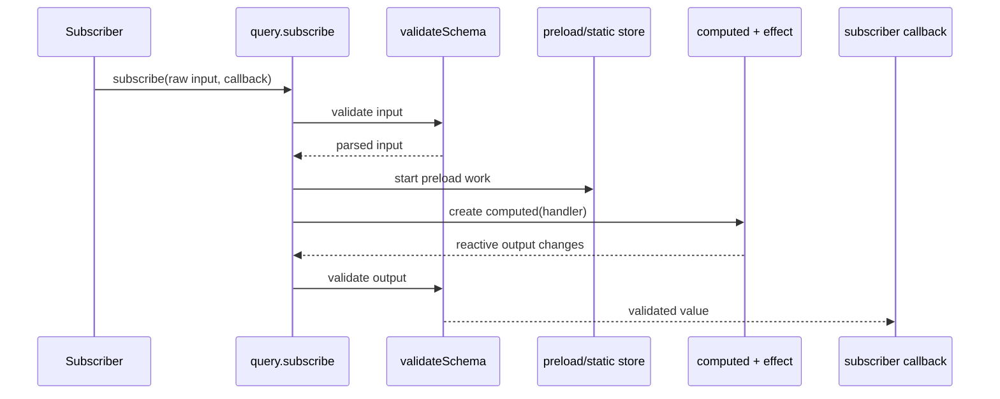
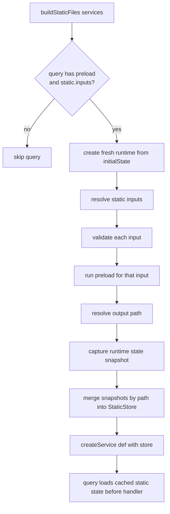

# Open Service

`open-service` is a small schema-driven service system for Storybook internals.

Its goals are:

- define stateful services in one declarative object
- expose queries and commands with strong TypeScript inference
- validate all query and command input/output through Standard Schema
- support reactive query subscriptions through `alien-signals`
- support static preloading into serialized state snapshots

The main audience for this README is agents and maintainers who need to understand how the pieces
fit together, where behavior lives, and how to define new services correctly.

## Public Surface

External callers should import from [index.ts](./index.ts).

That public API consists of:

- `defineService`
- `defineQuery`
- `defineCommand`
- `createService`
- `buildStaticFiles`
- the exported type aliases from [types.ts](./types.ts)

Internal tests and implementation code may import from the individual modules directly.

## File Layout

- [index.ts](./index.ts): public barrel for service authors outside this directory
- [types.ts](./types.ts): core type model for definitions, contexts, runtime instances, and static build data
- [service-definition.ts](./service-definition.ts): helpers that preserve inference when declaring services
- [service-validation.ts](./service-validation.ts): async schema validation helpers and error wrapping
- [errors.ts](./errors.ts): categorized Storybook errors for validation failures
- [service-runtime.ts](./service-runtime.ts): runtime creation, singleton registry, subscriptions, and store-backed preload handling
- [static-build.ts](./static-build.ts): static snapshot generation for preload-enabled queries
- [fixtures.ts](./fixtures.ts): scenario fixtures used by the test suite
- `*.test.ts`: focused tests for runtime behavior, validation behavior, and static builds



## Core Concepts

### Service

A service is a state container with:

- a stable `id`
- an `initialState`
- a `queries` map
- a `commands` map
- optional descriptions on the service and each operation

Use `defineService()` to preserve the concrete query and command map types.

### Query

A query is:

- always async at call time
- read-only with respect to service state
- optionally subscribable through `query.subscribe(...)`
- validated on both input and output
- optionally preloadable before execution
- optionally statically preloadable through `static.inputs`

Query handlers receive:

- parsed schema output for their input
- `ctx.self.state`
- `ctx.self.queries`
- `ctx.self.commands`

But query handlers do not receive `setState` because queries are read-only.

### Command

A command is:

- always async at call time
- allowed to mutate state through `ctx.self.setState(...)`
- validated on both input and output

Commands receive a writable `ctx.self`.

### Validation

Every query and command must declare:

- `input`
- `output`

Both must be Standard Schema compatible.

The runtime validates:

- caller input before a handler runs
- handler output before the result is returned or emitted

Validation failures become `OpenServiceValidationError` with a message that includes:

- whether the failure happened on input or output
- whether the failing operation is a query or command
- the full `serviceId.operationName`
- one line per issue, including path and the schema's expectation text

Important: handling of extra object fields depends on the schema implementation you choose. The
current test fixtures use Valibot `object(...)` schemas, which accept unexpected extra fields rather
than rejecting them.

## Runtime Flow

When `createService(def)` is called:

1. [service-runtime.ts](./service-runtime.ts) creates a signal-backed state container from `initialState`.
2. It builds a mutable `self` reference around that state.
3. It builds commands that validate input, run handlers, and validate output.
4. It builds queries that validate input, optionally run preload, run handlers, and validate output.
5. It returns a `ServiceInstance` containing only runtime `queries` and `commands`.

The singleton helper `getService(def)` keeps one instance per service id within the current process.
Tests should call `clearRegistry()` in teardown to avoid cross-test leakage.



## Subscription Flow

Subscriptions are implemented with `alien-signals` in [service-runtime.ts](./service-runtime.ts):

1. query input is validated
2. preload work is started
3. a computed value wraps the query handler
4. an effect re-runs whenever the handler's tracked state dependencies change
5. each emitted value is output-validated before the subscriber callback runs

Subscriptions are async in delivery semantics. Tests should use `vi.waitFor(...)` when asserting the
first emission or follow-up emissions.



## Static Preload Flow

`buildStaticFiles(services)` in [static-build.ts](./static-build.ts) looks for queries that define:

- `preload`
- `static.inputs`

For each such query input it:

1. creates a fresh runtime from `initialState`
2. validates the static input using the query's `input` schema
3. runs the query's preload step
4. resolves the output file path
5. stores the resulting runtime state in the final `StaticStore`

If multiple tasks resolve to the same path, their states are deep-merged.

At runtime, `createService(def, { store })` can preload from that store. The runtime caches pending
merges per path so one static snapshot is only merged once even if multiple concurrent query calls
request it.



## How To Define A Service

Use the helpers in this order:

```ts
import * as v from 'valibot';

import {
  createService,
  defineCommand,
  defineQuery,
  defineService,
} from './index.ts';

type ExampleState = {
  values: Record<string, string | undefined>;
};

const entryIdSchema = v.object({ entryId: v.string() });
const valueSchema = v.nullable(v.string());

export const exampleServiceDef = defineService({
  id: 'example/service',
  description: 'Example service used in documentation.',
  initialState: { values: {} } satisfies ExampleState,
  queries: {
    getValue: defineQuery<ExampleState>()({
      description: 'Returns one value by id.',
      input: entryIdSchema,
      output: valueSchema,
      handler: (input, ctx) => ctx.self.state.values[input.entryId] ?? null,
      preload: async (input, ctx) => {
        if (!(input.entryId in ctx.self.state.values)) {
          await ctx.self.commands.preloadValue(input);
        }
      },
      static: {
        inputs: async () => [{ entryId: 'a' }, { entryId: 'b' }],
      },
    }),
  },
  commands: {
    preloadValue: defineCommand<ExampleState>()({
      description: 'Fills state for one id.',
      input: entryIdSchema,
      output: v.void(),
      handler: async (input, ctx) => {
        ctx.self.setState((draft) => {
          draft.values[input.entryId] = 'ready';
        });
      },
    }),
  },
});

const exampleService = createService(exampleServiceDef);
await exampleService.queries.getValue({ entryId: 'a' });
```

## Design Rules

- Always declare both `input` and `output` schemas on every query and command.
- Use query `preload` for read-side warming, not state mutation in the handler.
- Use commands for all state mutation.
- Treat queries and commands as async, even if the current implementation path is fast.
- Keep public imports on [index.ts](./index.ts). Import internal modules directly only from tests or implementation code in this directory.

## Testing Guidance

- Runtime behavior belongs in [service-runtime.test.ts](./service-runtime.test.ts)
- Validation behavior belongs in [service-validation.test.ts](./service-validation.test.ts)
- Static snapshot behavior belongs in [static-build.test.ts](./static-build.test.ts)
- Reusable scenario definitions belong in [fixtures.ts](./fixtures.ts)

When adding validation tests, prefer asserting the full exact error message. That keeps the tests
useful as executable documentation for callers and agents.

## Agent Notes

- If you need to change runtime behavior, start in [service-runtime.ts](./service-runtime.ts).
- If you need to change validation wording, start in [errors.ts](./errors.ts).
- If you need to change schema handling, start in [service-validation.ts](./service-validation.ts).
- If you need to change service authoring ergonomics, start in [service-definition.ts](./service-definition.ts) and [types.ts](./types.ts).
- If you need to change static preload generation, start in [static-build.ts](./static-build.ts).
