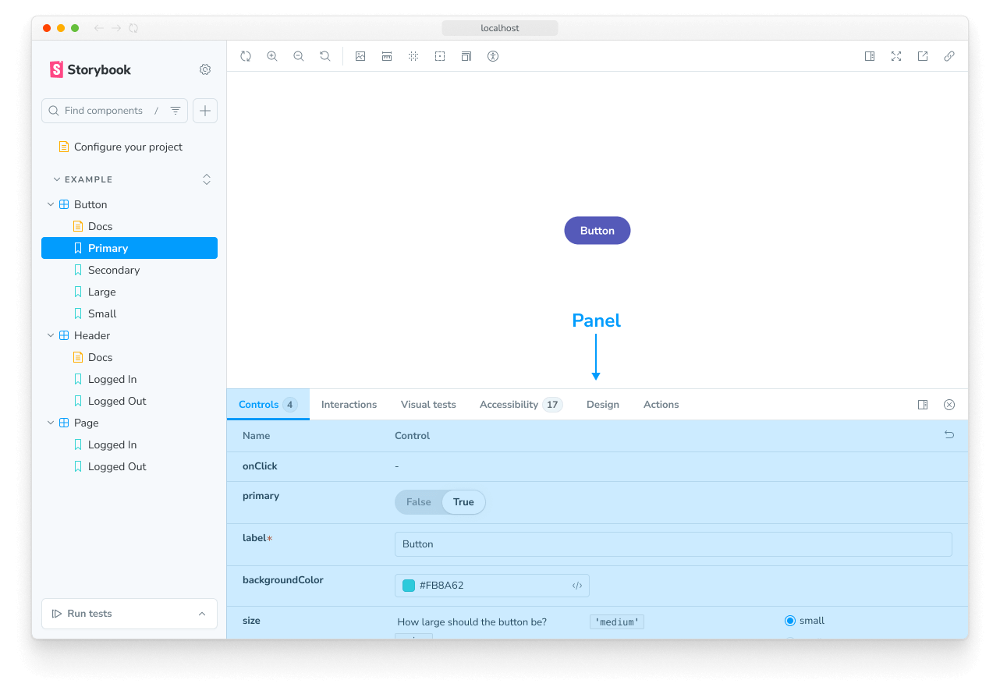
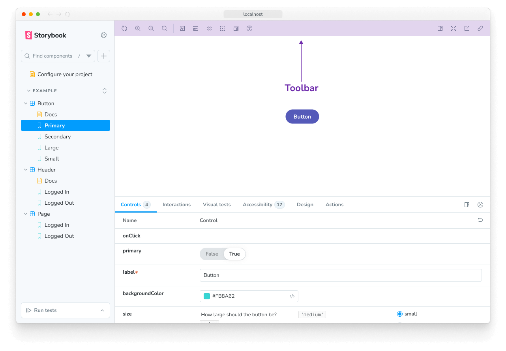
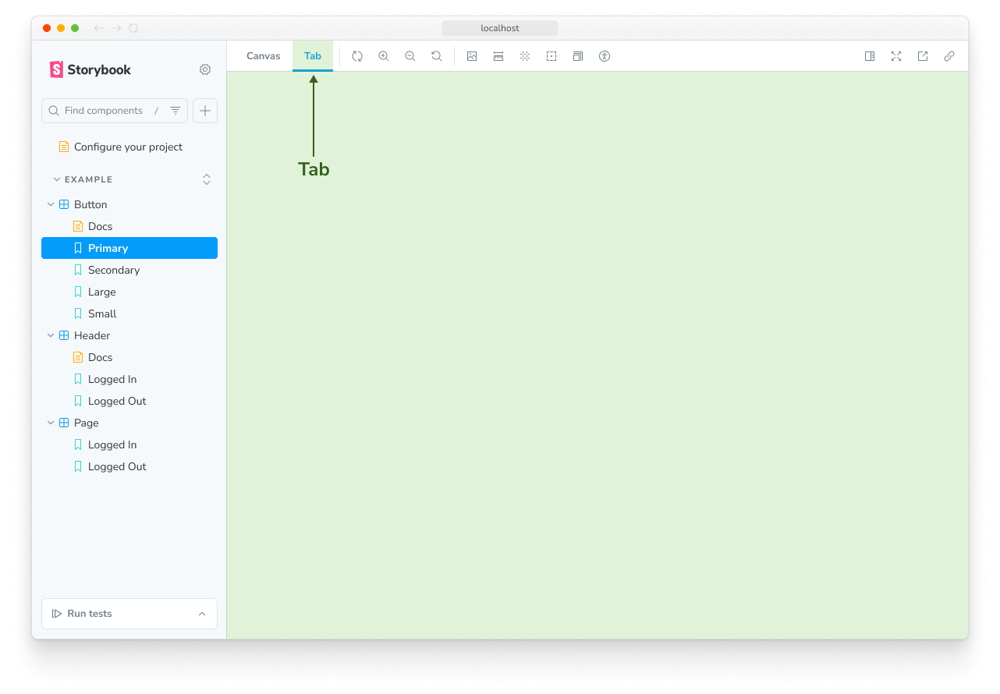

Each Storybook addon is classified into two general categories, UI-based or Presets. Each type of addons feature is documented here. Use this as a reference when creating your addon.

## UI-based addons

UI-based addons allow you to customize Storybook's UI with the following elements.

### Panels

Panel addons allow you to add your own UI in Storybook's addon panel. This is the most common type of addon in the ecosystem. For example, the official [`@storybook/addon-a11y`](https://github.com/storybookjs/storybook/tree/next/code/addons/a11y) uses this pattern.

Use this boilerplate code to add a new `Panel` to Storybook's UI:

<CodeSnippets path="storybook-addon-panel-example.md" />

### Toolbars

Toolbar addons allow you to add your own custom tools in Storybook's Toolbar. For example, the official [`@storybook/addon-themes`](https://storybook.js.org/addons/@storybook/addon-themes) uses this pattern.

Use this boilerplate code to add a new `button` to Storybook's Toolbar:

<CodeSnippets path="storybook-addon-toolbar-example.md" />

<Callout variant="info">

The `match` property allows you to conditionally render your toolbar addon, [based on the current view](./writing-addons.mdx#conditionally-render-the-addon). The `icon` element used in the example loads the icons from the `storybook/internal/components` module. See [here](../faq.mdx#what-icons-are-available-for-my-toolbar-or-my-addon) for the list of available icons that you can use.

</Callout>

### Tabs

Tab addons allow you to create your own custom tabs in Storybook.

Use this boilerplate code to add a new `Tab` to Storybook's UI:

<CodeSnippets path="storybook-addon-tab-example.md" />

### Context menu entries

Context menu addons allow you to add your own entries to the menu attached to sidebar items. Your addon can add actions targeting
stories, docs entries, components or groups in the sidebar.

<Callout variant="info" icon="🧪">

This addon type is [experimental](../releases/features.mdx#experimental).
Its API may change in future releases, and we welcome feedback to help shape it.

</Callout>

Use this boilerplate code to add your own entries to the sidebar context menu:

<CodeSnippets path="storybook-addon-context-menu-example.md" />

Storybook calls `items` with the sidebar entry the menu belongs to, and renders the array of menu items you return. Return an empty array for entries you don't want to extend. Menu items are made of an `id`, a `title`, `icon`, `disabled` state and `onClick` handler.

When the user selects a menu item, Storybook calls its `onClick` handler and closes the menu. The handler receives `triggerRef`, a ref to the button that opened the menu. Use it to anchor your own floating UI, such as a dialog or a popover, next to the sidebar entry the user acted on.

Sidebar context menus are only available while running Storybook in development mode, as Storybook does not render context menus in production.

<Callout variant="info">

Learn how to write your own addon that includes these UI elements [here](./writing-addons.mdx).

</Callout>

## Preset addons

Storybook preset addons are grouped collections of `babel`, `webpack`, and `addons` configurations to integrate Storybook and other technologies. For example the official [`@storybook/preset-react-webpack`](https://github.com/storybookjs/storybook/tree/next/code/presets/react-webpack).

Use this boilerplate code while writing your own preset addon.

<CodeSnippets path="storybook-preset-full-config-object.md" />

**Learn more about the Storybook addon ecosystem**

- Types of addons for other types of addons
- [Writing addons](./writing-addons.mdx) for the basics of addon development
- [Presets](./writing-presets.mdx) for preset development
- [Integration catalog](./integration-catalog.mdx) for requirements and available recipes
- [API reference](./addons-api.mdx) to learn about the available APIs
