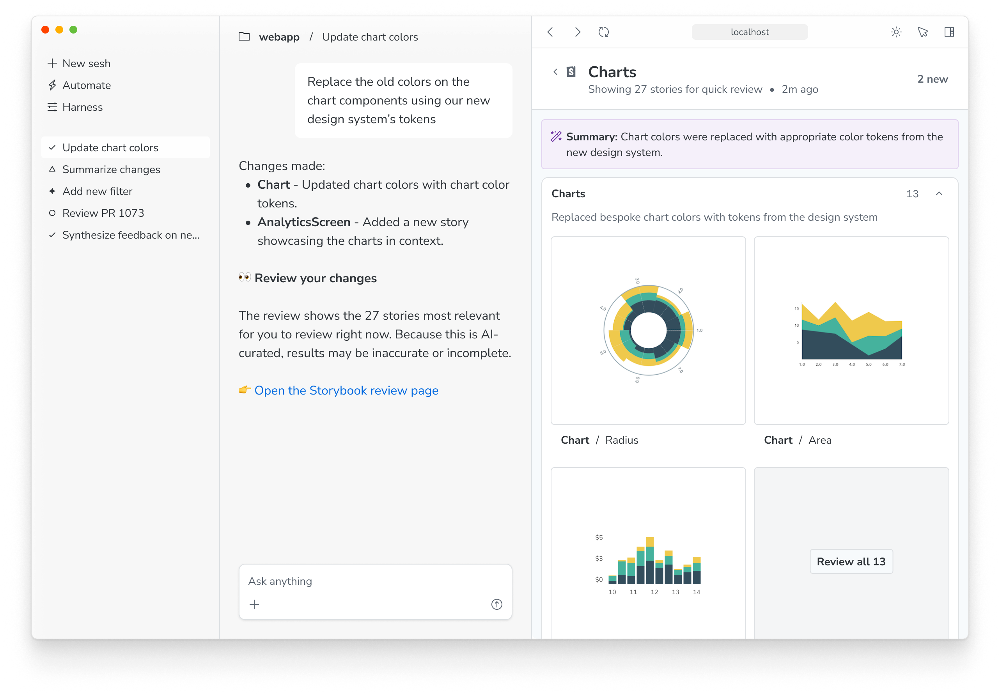

<Callout variant="info" icon="🧪">

Agentic review is currently [experimental](../releases/features.mdx#experimental). The experience may change in future releases. We welcome feedback and contributions to help improve this feature.

</Callout>

When working with an agent, it can be hard to keep track of UI changes it has made. Agentic review allows agents to generate a summary of their work, including a curated selection of stories that have been affected by their changes.

This gives you a single, focused view of the work the agent has done, so you can quickly understand and review it.

## Requirements

- Storybook 10.5 or later
- [`experimentalReview` feature flag](../api/main-config/main-config-features.mdx#experimentalreview) enabled in your Storybook configuration
  - This is automatically enabled if you are using a Storybook [ADE plugin]
- [MCP server](./mcp/overview.mdx) running and connected to your agent or [ADE plugin] installed

## Reviewing changes

Open the review summary by either clicking the link provided by the agent, requesting a review from your agent in a prompt, or clicking the review widget that appears in the Storybook sidebar when a review is available.

Note: If you are also using [change detection](../configure/user-interface/change-detection.mdx), the review widget will take precedence. You can still use the change detection filters to view new and modified stories, but the review widget will always be visible when a review is available.

Everything on this page is generated or curated by the agent, to help you understand and review the work it has done. Stories are grouped into collections of related work, with a helpful title and summary. It's important to note that this is _not_ a comprehensive list of all affected stories, but rather a curated selection of the most relevant ones.

To see a story in more detail, click its thumbnail. You can inspect the component using Storybook features and browser tools, and even [run tests](../writing-tests/integrations/vitest-addon/index.mdx) if your Storybook is configured to do so.

When in this view, you can use the next and previous buttons in the top right corner to navigate through the other stories in the review. You can also click the "Back to review" button to return to the summary page.

If you do some work after a review is generated, you'll see a banner informing you that the review may be stale. You can use the provided prompt to request a new review from your agent at any time.

Once you're finished reviewing the work, you can return to your Storybook by clicking the Storybook logo in the top left corner of the page.

**More AI resources**

- [Agentic setup](./setup.mdx)
- [MCP server overview](./mcp/overview.mdx)
- [MCP server API](./mcp/api.mdx)
- [Sharing your MCP server](./mcp/sharing.mdx)
- [Best practices for using Storybook with AI](./best-practices.mdx)
- [Manifests](./manifests.mdx)

[ADE plugin]: https://github.com/storybookjs/mcp#testing-the-claude-and-codex-plugins-from-github
