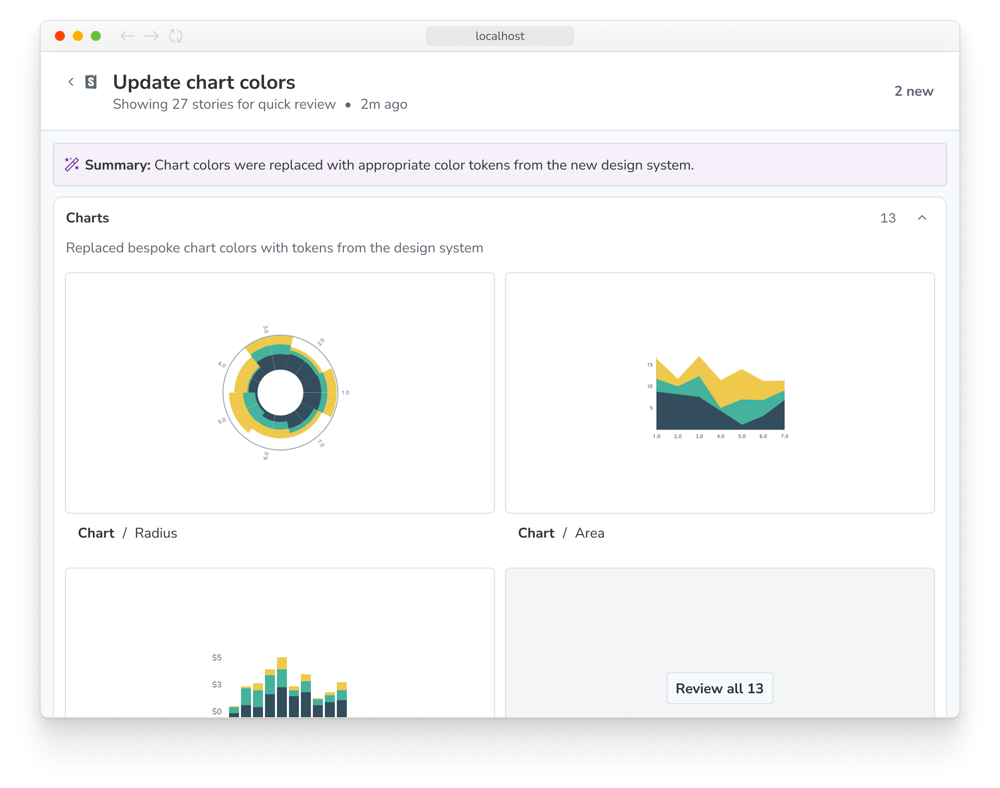
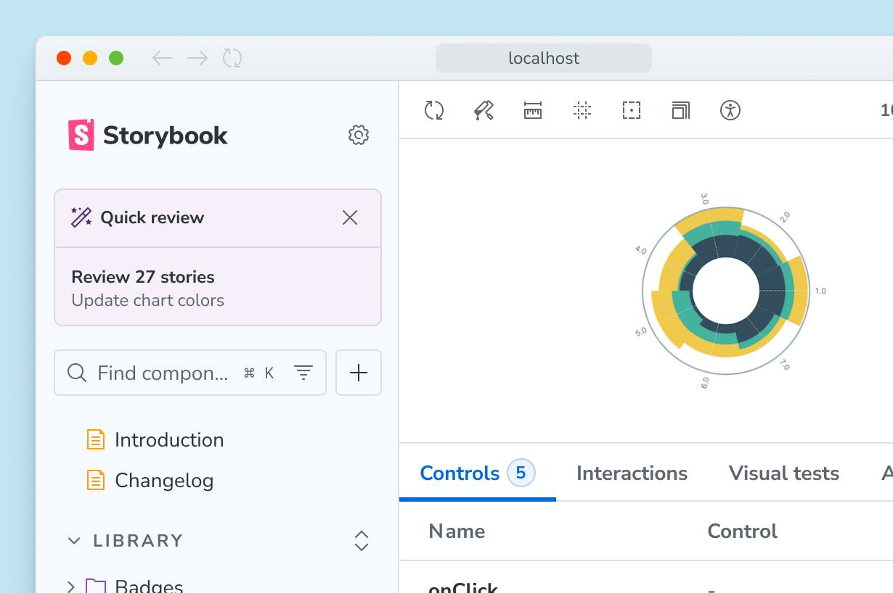
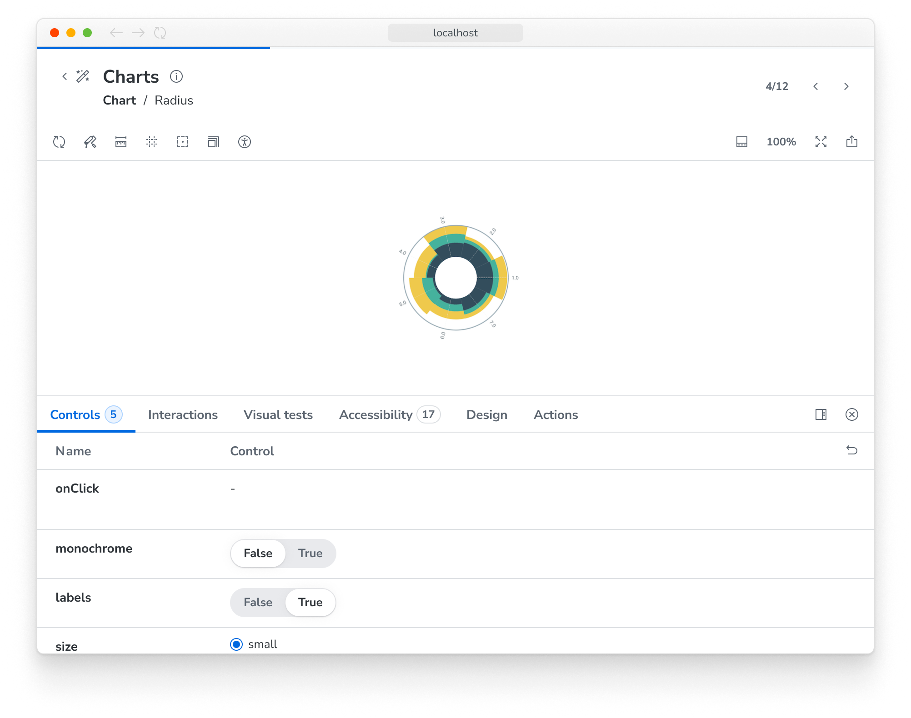
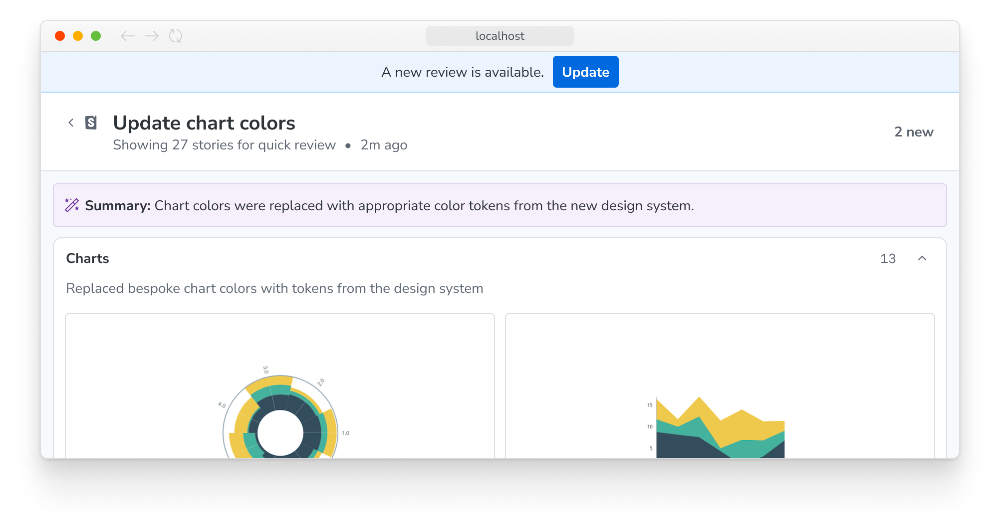

<Callout variant="info" icon="🧪">

Storybook's AI capabilities are currently in [preview](../releases/features.mdx#preview). The experience may change in future releases. We welcome feedback and contributions to help improve this feature.

</Callout>

Storybook allows AI agents to produce a review of the UI work they've done. After the work is completed, the agent will provide a link to the review summary, which can be opened in a browser. It includes agent-curated collections of stories demonstrating the work, along with a summary of the changes made. Each thumbnail can be clicked to open the story directly, where you can inspect the component and its code.

[TK - image - Review summary page]

## Requirements

- [MCP server](./mcp/overview.mdx) running (directly or via a [plugin](#TK)) and accessible to the agent.

## Reviewing changes

Open the review summary by either clicking the link provided by the agent, requesting a review from your agent, or clicking the review widget that appears in the Storybook sidebar when a review is available.

[TK - image - Review widget in sidebar]

Note: If you are also using [change detection](../configure/user-interface/change-detection.mdx), the review widget will take precedence. You can still use the change detection filters to view new and modified stories, but the review widget will always be visible when a review is available.

Everything on this page is generated or curated by the agent, to help you understand and review the work it has done. Stories are grouped into collections of related work, with a helpful title and summary. It's important to note that this is _not_ a comprehensive list of all affected stories, but rather a curated selection of the most relevant ones.

To look at a thumbnail in more detail, click the thumbnail to open the full story. You can inspect the component and its code, and even run tests if your Storybook is configured to do so.

[TK - image - Review detail page]

When in this view, you can use the next and previous buttons in the top right corner to navigate through the other stories in the review. You can also click the "Back to review" button to return to the summary page.

If you do some work after a review is generated, you'll see a banner informing you that the review may be stale. You can use the provided prompt to request a new review from your agent at any time.

[TK - image - Stale review banner]

Once you're finished reviewing the work, you can return to your Storybook by clicking the Storybook logo in the top left corner of the page.

{/* TODO: Update these across other pages */}
**More AI resources**

- [Agentic setup](./setup.mdx)
- [MCP server overview](./mcp/overview.mdx)
- [MCP server API](./mcp/api.mdx)
- [Sharing your MCP server](./mcp/sharing.mdx)
- [Best practices for using Storybook with AI](./best-practices.mdx)
- [Manifests](./manifests.mdx)