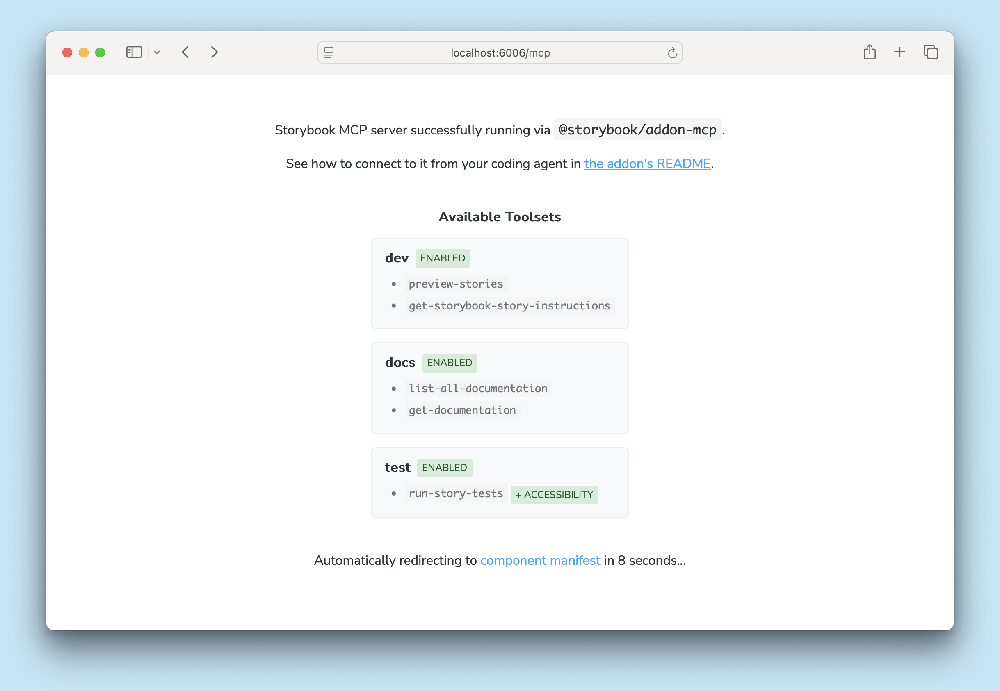

<If notRenderer={['react']}>
  
<Callout variant="info">
  While they are in [preview](../releases/features.mdx#preview), Storybook's AI capabilities (specifically, the manifest and MCP server) are currently only supported for [React](?renderer=react) projects.
</Callout>

</If>
{/* End non-supported renderers */}

<If renderer={['react']}>

<Callout variant="warning" icon="🧪">
  This is a [**preview**](../releases/features.mdx#preview) feature and (though unlikely) the API may change in future releases. We welcome feedback and contributions to help improve this feature.
</Callout>

With Storybook's AI capabilities, you can leverage the power of AI agents to speed up your development workflow. By connecting your Storybook to an AI agent via the MCP server, you can enable your agent to understand your components and documentation, generate stories, run tests, and more.

## Get started

First, run this command to install and register the Storybook MCP addon:

<CodeSnippets path="addon-mcp-add.md" />

After restarting your Storybook, you can access the MCP server at `http://localhost:6006/mcp` (your port may be different). When viewed in the browser, you'll see a splash page that will redirect to the [manifest debugger](./manifests.mdx#debugging) after a few seconds.



Second, configure your agent to use the MCP server's tools:

<CodeSnippets path="mcp-add.md" />

_You should update both the `name` and `url` values to match your project's name and Storybook's MCP server URL._

[`mcp-add`](https://github.com/paoloricciuti/mcp-add) is a CLI tool built to simplify the process of adding MCP servers to various agents.

You can also follow your agent's documentation to add the MCP server as a tool provider manually, e.g. [Claude Code](https://code.claude.com/docs/en/mcp#option-1-add-a-remote-http-server), [VS Code Copilot](https://code.visualstudio.com/docs/copilot/customization/mcp-servers#_configure-the-mcpjson-file), [Google Gemini CLI](https://geminicli.com/docs/tools/mcp-server/#adding-an-http-server), etc.

Next, guide your agent to use your MCP server, you should adjust your [`AGENTS.md`](https://agents.md/) (or [`CLAUDE.md`](https://code.claude.com/docs/en/memory#claude-md-files), if you're using Claude). The specifics will depend on your project and how you use agents in your development process, but something like this is a good starting point:

<details>
<summary>AGENTS.md</summary>

```md title="AGENTS.md"
Leverage the following Storybook MCP tools for guidance and best practices when working with component stories:

- Use the `your-project-sb-mcp` tool `get-storybook-story-instructions` to fetch the latest instructions for creating or updating stories. This will ensure you follow current conventions and recommendations.

**CRITICAL: Never hallucinate component properties!** Before using ANY property on a component from a design system (including common-sounding ones `shadow`, etc.), you MUST use the `your-project-sb-mcp` MCP server:

1. Query `list-all-documentation` to get a list of all components
2. Query `get-documentation` for that component to see all available properties and examples
3. Only use properties that are explicitly documented or shown in example stories
4. If a property isn't documented, do not assume properties based on naming conventions or common patterns from other libraries. Check back with the user in these cases.

Remember: A story name might not reflect the property name correctly, so always verify properties through documentation or example stories before using them.

Check your work by running `run-story-tests`.
```

</details>

Finally, test your agent's access to the MCP server by running a prompt like "List all documented components". You should see a call to the `list-all-documentation` tool with a response listing components from your Storybook.

## Key concepts

Understanding these concepts will help you make the most of Storybook's AI capabilities and guide you in using the MCP server to enhance your development workflow.

### Manifests

Storybook collects all of the metadata about your components, stories, and docs into [manifests](./manifests.mdx). Each manifest is a JSON object that serves as a comprehensive map of your Storybook's content and structure. There are manifests for components, based on stories files, and for documentation, based on MDX files.

These manifests are automatically generated and updated as you work on your Storybook, ensuring that your agent always has access to the latest information about your project.

### MCP server

[Model Context Protocol](https://modelcontextprotocol.io/) (MCP) is a standard for communication between AI agents and external tools. Storybook's [MCP server](./mcp/index.mdx) exposes your Storybook's content and functionality as a set of tools that your agent can call to retrieve component information, generate stories, run component tests, and more.

**More AI resources**

- [MCP server overview](./mcp/overview.mdx)
- [MCP server API](./mcp/api.mdx)
- [Sharing your MCP server](./mcp/sharing.mdx)
- [Best practices for using Storybook with AI](./best-practices.mdx)
- [Manifests](./manifests.mdx)

</If>
{/* End supported renderers */}
