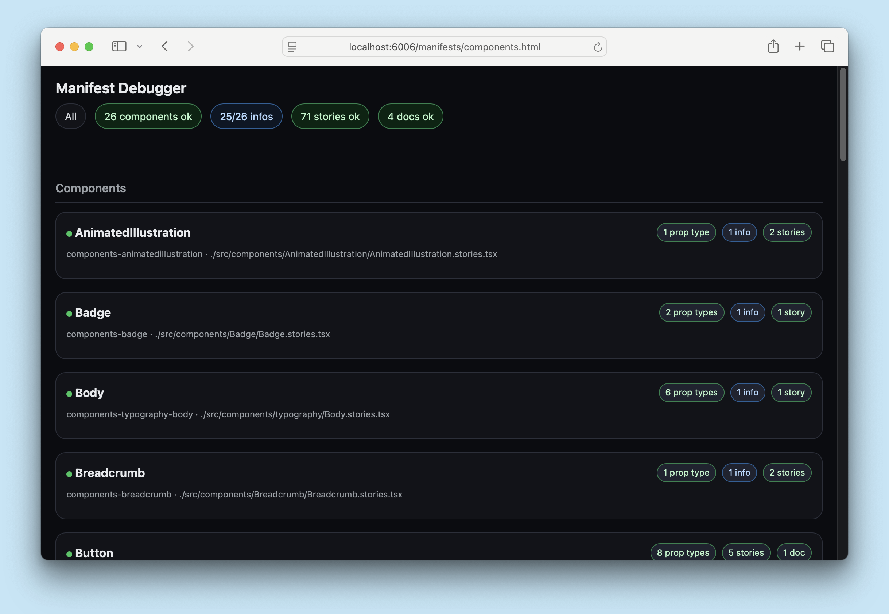

<If notRenderer={['react']}>
  
<Callout variant="info">
  While they are in [preview](../releases/features.mdx#preview), Storybook's AI capabilities (specifically, the manifest and MCP server) are currently only supported for [React](?renderer=react) projects.
</Callout>

</If>
{/* End non-supported renderers */}

<If renderer={['react']}>

<Callout variant="warning" icon="🧪">
  This is a [**preview**](../releases/features.mdx#preview) feature and (though unlikely) the API may change in future releases. We welcome feedback and contributions to help improve this feature.
</Callout>

Your Storybook holds a wealth of information about your components: their names, descriptions, API, usage examples, and more. Manifests are JSON objects that describe the contents of your Storybook in a concise, structured way that is easy for AI agents to understand and use. The manifests are generated automatically from your Storybook's CSF and MDX files, and they are designed to be comprehensive and up-to-date representations of your Storybook's contents.

There are two types of manifests generated by Storybook: component and docs.

## Component manifest

The component manifest is generated from static analysis of the CSF files in your Storybook and prop type extraction from their associated component source code. It contains information about the components you have documented, such as their names, descriptions, props, and usage examples. This manifest is designed to help AI agents understand which components are available and how to use them.

For prop type extraction, the manifest generation will use whatever is specified in the [`reactDocgen`](../api/main-config/main-config-typescript.mdx#reactdocgen) option, or `react-docgen-typescript` by default. `react-docgen-typescript` provides a more comprehensive set of metadata in the manifest, but can be slower to generate. If you prefer a faster manifest generation and are okay with a more limited set of metadata, you can set the `reactDocgen` option to `react-docgen`, which uses a simpler approach to extract prop types.

While the types themselves provide a basic level of information, JSDoc comments in your component source code can provide additional metadata for the manifest, which can be helpful for AI agents. We highly recommend adding JSDoc comments to your components and their props to provide as much context as possible for the agents. For example:

```ts title="Button.tsx"
import React from 'react';

type ButtonProps = {
  /**
   * Optional click handler
   */
  onClick?: () => void;
};

/**
 * Primary UI component for user interaction
 */
export const Button: React.FC<ButtonProps> = ({ onClick }) => { /* ... */ };
```

<Callout icon="💡">
  Check the [best practices](./best-practices.mdx) guide for tips on writing effective JSDoc comments for your components and other ways to provide helpful context for the agents.
</Callout>

The raw JSON component manifest can be accessed at `http://localhost:6006/manifests/components.json` (your port may vary) when your Storybook is running.

<details>
<summary>Example component manifest entry</summary>

```json
{
  "components": {
    "components-button": {
      "id": "components-button",
      "name": "Button",
      "path": "./src/components/Button/Button.stories.tsx",
      "stories": [
        {
          "id": "components-button--default",
          "name": "Default",
          "snippet": "const Default = () =\u003E \u003CButton\u003EButton\u003C/Button\u003E;"
        },
        {
          "id": "components-button--disabled",
          "name": "Disabled",
          "snippet": "const Disabled = () =\u003E \u003CButton disabled\u003EButton\u003C/Button\u003E;"
        },
      ],
      "import": "import { Button } from \"@mealdrop/ui\";",
      "jsDocTags": {

      },
      "description": "Primary UI component for user interaction",
      "reactDocgen": {
        "description": "Primary UI component for user interaction",
        "methods": [],
        "displayName": "Button",
        "definedInFile": "/Users/kylegach/projects/kylegach/mealdrop/packages/ui/src/components/Button/Button.tsx",
        "actualName": "Button",
        "exportName": "Button",
        "props": {
          "clear": {
            "required": false,
            "tsType": {
              "name": "boolean"
            },
            "description": "Clear button styles leaving just a text",
            "defaultValue": {
              "value": "false",
              "computed": false
            }
          },
          "round": {
            "required": false,
            "tsType": {
              "name": "boolean"
            },
            "description": "",
            "defaultValue": {
              "value": "false",
              "computed": false
            }
          },
          "large": {
            "required": false,
            "tsType": {
              "name": "boolean"
            },
            "description": "Is the button large?",
            "defaultValue": {
              "value": "false",
              "computed": false
            }
          },
          "icon": {
            "required": false,
            "tsType": {
              "name": "union",
              "raw": "| 'arrow-right'\n| 'arrow-left'\n| 'cross'\n| 'cart'\n| 'minus'\n| 'plus'\n| 'moon'\n| 'sun'\n| 'star'",
              "elements": [
                {
                  "name": "literal",
                  "value": "'arrow-right'"
                },
                {
                  "name": "literal",
                  "value": "'arrow-left'"
                },
                {
                  "name": "literal",
                  "value": "'cross'"
                },
                {
                  "name": "literal",
                  "value": "'cart'"
                },
                {
                  "name": "literal",
                  "value": "'minus'"
                },
                {
                  "name": "literal",
                  "value": "'plus'"
                },
                {
                  "name": "literal",
                  "value": "'moon'"
                },
                {
                  "name": "literal",
                  "value": "'sun'"
                },
                {
                  "name": "literal",
                  "value": "'star'"
                }
              ]
            },
            "description": "Does the button have an icon?"
          },
          "iconSize": {
            "required": false,
            "tsType": {
              "name": "number"
            },
            "description": "Size of the icon"
          },
          "disabled": {
            "required": false,
            "tsType": {
              "name": "boolean"
            },
            "description": "Is the button disabled?"
          },
          "children": {
            "required": false,
            "tsType": {
              "name": "union",
              "raw": "string | React.ReactNode",
              "elements": [
                {
                  "name": "string"
                },
                {
                  "name": "ReactReactNode",
                  "raw": "React.ReactNode"
                }
              ]
            },
            "description": "Does the button have an icon?"
          },
          "onClick": {
            "required": false,
            "tsType": {
              "name": "signature",
              "type": "function",
              "raw": "() =\u003E void",
              "signature": {
                "arguments": [],
                "return": {
                  "name": "void"
                }
              }
            },
            "description": "Optional click handler"
          }
        }
      }
    }
  }
}
```
</details>

## Docs (MDX) manifest

The docs manifest is generated from the [MDX files](../writing-docs/mdx.mdx) in your Storybook. These files are used to document specific components or to create standalone documentation pages (e.g. a "Getting Started" guide, accessibility guidelines, design tokens, etc.), all of which can offer helpful context to the agent.

Storybook generates this docs manifest through static analysis of your MDX files, which means it is limited to the information that is explicitly present in those files. For example, the manifest will _not_ include the color tokens in the document below, because their values are not in explicitly in the source:

```jsx title="Colors.mdx"
import { Meta, ColorPalette, ColorItem } from '@storybook/addon-docs/blocks';
import { colors } from '../src/tokens/colors';

<Meta title="Design Tokens/Colors" />

# Colors

{/* 👇 These colors are *not* included in the manifest, because their values are not explicitly in the source */}
<ColorPalette>
  {colors.map((color) => (
    <ColorItem key={color.name} color={color.value} name={color.name} />
  ))}
</ColorPalette>
```

We hope to improve this in the future, possibly by evaluating the MDX files and including the result in the manifest.

The raw JSON docs manifest can be accessed at `http://localhost:6006/manifests/docs.json` (your port may vary) when your Storybook is running.

<details>
<summary>Example docs manifest entry</summary>

```json
{
  "docs": {
    "design-system-typography--docs": {
      "id": "design-system-typography--docs",
      "name": "Docs",
      "path": "./src/docs/Typography.mdx",
      "title": "Design System/Typography",
      "content": "import { Meta, Typeset } from '@storybook/addon-docs/blocks'\n\n\u003CMeta title=\"Design System/Typography\" /\u003E\n\n# Typography\n\n## Font: Hind\n\nUsed for body texts, descriptions and general info\n\n**Weight:** 400(regular)\n\n\u003CTypeset\n  sampleText=\"Feel like having pizza, sushi or your favourite dish from Tatooine?\"\n  fontSizes={[12, 14, 18, 24]}\n  fontWeight={400}\n  fontFamily=\"Hind\"\n/\u003E\n\n**Weight:** 500(medium)\n\n\u003CTypeset\n  sampleText=\"Feel like having pizza, sushi or your favourite dish from Tatooine?\"\n  fontSizes={[12, 14, 18, 24]}\n  fontWeight={500}\n  fontFamily=\"Hind\"\n/\u003E\n\n## Font: Montserrat\n\nUsed for headings and titles\n\n**Weight:** 400 (regular)\n\n\u003CTypeset\n  sampleText=\"Feel like having pizza, sushi or your favourite dish from Tatooine?\"\n  fontSizes={[12, 14, 18, 24]}\n  fontWeight={400}\n  fontFamily=\"Montserrat\"\n/\u003E\n\n**Weight:** 500 (medium)\n\n\u003CTypeset\n  sampleText=\"Feel like having pizza, sushi or your favourite dish from Tatooine?\"\n  fontSizes={[12, 14, 18, 24]}\n  fontWeight={500}\n  fontFamily=\"Montserrat\"\n/\u003E\n\n**Weight:** 700 (bold)\n\n\u003CTypeset\n  sampleText=\"Feel like having pizza, sushi or your favourite dish from Tatooine?\"\n  fontSizes={[12, 14, 18, 24]}\n  fontWeight={700}\n  fontFamily=\"Montserrat\"\n/\u003E\n\n**Weight:** 900 (black)\n\n\u003CTypeset\n  sampleText=\"Feel like having pizza, sushi or your favourite dish from Tatooine?\"\n  fontSizes={[12, 14, 18, 24]}\n  fontWeight={900}\n  fontFamily=\"Montserrat\"\n/\u003E\n"
    }
  }
}
```
</details>

## Debugging

To help you get a better picture of what is and is not in the manifests, Storybook provides a combined manifest debugger at `http://localhost:6006/manifests/components.html` (your port may vary). This page shows the contents of both the component and docs manifests in a human-readable format, along with any errors or warnings that were encountered during manifest generation.



At the top of page, you can see any errors or warnings that were encountered during manifest generation. You can click on these buttons to filter the manifest contents to only show the relevant entries, which can be helpful for debugging.

## Curating

By default, all stories and independent docs pages have the `manifest` tag applied, which means they will be included in the manifests. You can curate what is included in the manifests by adding or removing the `manifest` tag from your stories and docs pages. For example, if you have a story that is for instructional purposes only and the agent should not be aware of it, you can remove the `manifest` tag from that story to exclude it from the manifests:

<CodeSnippets path="tag-manifest-remove-in-story.md" />

You can also remove an entire component from the manifest, by removing the tag in the meta (or default export) of the file, which will exclude all stories in that file from the manifests.

Similarly, to exclude an entire MDX docs page from the manifests, you can remove the `manifest` tag from the page's metadata:

```jsx title="DocForHumansOnly.mdx"
import { Meta } from '@storybook/addon-docs/blocks';

<Meta title="Doc for Humans Only" tags={['!manifest']} />
```

**More AI resources**

- [MCP server overview](./mcp/overview.mdx)
- [MCP server API](./mcp/api.mdx)
- [Sharing your MCP server](./mcp/sharing.mdx)
- [Best practices for using Storybook with AI](./best-practices.mdx)

</If>
{/* End supported renderers */}
