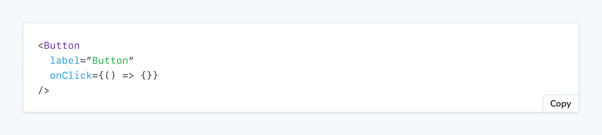

The `Source` block is used to render a snippet of source code directly.



```mdx title="ButtonDocs.mdx"
import { Meta, Source } from '@storybook/addon-docs/blocks';
import * as ButtonStories from './Button.stories';

<Meta of={ButtonStories} />

<Source of={ButtonStories.Primary} />
```

## Source

```js
import { Source } from '@storybook/addon-docs/blocks';
```

<details>
<summary>Configuring with props <strong>and</strong> parameters</summary>

ℹ️ Like most blocks, the `Source` block is configured with props in MDX. Many of those props derive their default value from a corresponding [parameter](../../writing-stories/parameters.mdx) in the block's namespace, `parameters.docs.source`.

The following `language` configurations are equivalent:

<CodeSnippets path="api-doc-block-source-parameter.md" />

```mdx title="ButtonDocs.mdx"
<Source of={ButtonStories.Basic} language="tsx" />
```

The example above applied the parameter at the [story](../../writing-stories/parameters.mdx#story-parameters) level, but it could also be applied at the [component](../../writing-stories/parameters.mdx#component-parameters) (or meta) level or [project](../../writing-stories/parameters.mdx#global-parameters) level.

</details>

### `code`

Type: `string`

Default: `parameters.docs.source.code`

Provides the source code to be rendered.

```mdx title="ButtonDocs.mdx"
import { Meta, Source } from '@storybook/addon-docs/blocks';
import * as ButtonStories from './Button.stories';

<Meta of={ButtonStories} />

<Source
  code={`const thisIsCustomSource = true;
if (isSyntaxHighlighted) {
  console.log('syntax highlighting is working');
}`}
/>
```

### `dark`

Type: `boolean`

Default: `parameters.docs.source.dark`

Determines if the snippet is rendered in dark mode.

<Callout variant="info" icon="💡">

Light mode is only supported when the `Source` block is rendered independently. When rendered as part of a [`Canvas` block](./doc-block-canvas.mdx)—like it is in [autodocs](../../writing-docs/autodocs.mdx)—it will always use dark mode.

</Callout>

<If renderer={['angular', 'react', 'html', 'web-components' ]}>

### `excludeDecorators`

Type: `boolean`

Default: `parameters.docs.source.excludeDecorators`

Determines if [decorators](../../writing-stories/decorators.mdx) are rendered in the source code snippet.

</If>

### `language`

Type:

{/* prettier-ignore-start */}
```ts
'jsextra' | 'jsx' | 'json' | 'yml' | 'md' | 'bash' | 'css' | 'html' | 'tsx' | 'typescript' | 'graphql'
```
{/* prettier-ignore-end */}

Default: `parameters.docs.source.language` or `'jsx'`

Specifies the language used for syntax highlighting.

### `of`

Type: Story export

Specifies which story's source is rendered.

### `transform`

Type: `(code: string, storyContext: StoryContext) => string | Promise<string>`

Default: `parameters.docs.source.transform`

An async function to dynamically transform the source before being rendered, based on the original source and any story context necessary. The returned string is displayed as-is.
If both [`code`](#code) and `transform` are specified, `transform` will be ignored unless [`transformCode`](#transformcode) is enabled.

<CodeSnippets path="parameters-docs-source-transform-in-preview.md" />

This example shows how to use Prettier to format all source code snippets in your documentation. The transform function is applied globally through the preview configuration, ensuring consistent code formatting across all stories.

### `transformCode`

Type: `boolean`

Default: `parameters.docs.source.transformCode` or `false`

When set to `true`, the [`transform`](#transform) function will also be applied to the [`code`](#code) prop. By default, the `code` prop is rendered as-is and `transform` is not applied to it.

### `type`

Type: `'auto' | 'code' | 'dynamic'`

Default: `parameters.docs.source.type` or `'auto'`

Specifies how the source code is rendered.

- **auto**: Same as **dynamic**, if the story's `render` function accepts args inputs and **dynamic** is supported by the framework in use; otherwise same as **code**
- **code**: Renders the value of [`code` prop](#code), otherwise renders static story source
- **dynamic**: Renders the story source with dynamically updated arg values

<Callout variant="info" icon="💡">

Note that dynamic snippets will only work if the story uses [`args`](../../writing-stories/args.mdx) and the [`Story` block](./doc-block-story.mdx) for that story is rendered along with the `Source` block.

</Callout>
