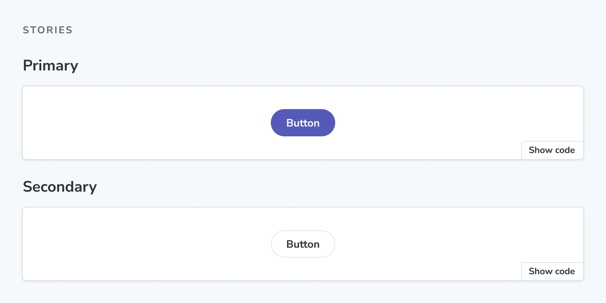

The `Stories` block renders the full collection of stories in a stories file.



```mdx title="ButtonDocs.mdx"
import { Meta, Stories } from '@storybook/addon-docs/blocks';
import * as ButtonStories from './Button.stories';

<Meta of={ButtonStories} />

<Stories />
```

## Stories

```js
import { Stories } from '@storybook/addon-docs/blocks';
```

`Stories` is configured with the following props:

### `includePrimary`

Type: `boolean`

Default: `true`

Determines if the collection of stories includes the primary (first) story.

<Callout variant="info" icon="💡">

Set `includePrimary={false}` to omit the primary story from the rendered collection. If the primary story is the only story in the file, the `Stories` block will render nothing.

</Callout>

### `title`

Type: `string`

Default: `'Stories'`

Sets the heading content preceding the collection of stories.
