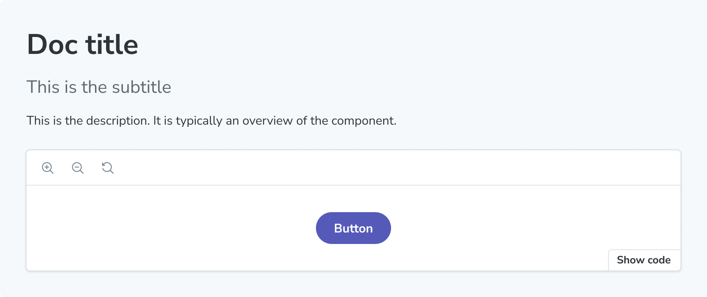

The `Subtitle` block can serve as a secondary heading for your docs entry.



{/* prettier-ignore-start */}

```md title="ButtonDocs.mdx"
import { Subtitle } from '@storybook/addon-docs/blocks';

<Subtitle>This is the subtitle</Subtitle>
```

{/* prettier-ignore-end */}

## Subtitle

```js
import { Subtitle } from '@storybook/addon-docs/blocks';
```

`Subtitle` is configured with the following props:

### `children`

Type: `JSX.Element | string`

Default: `parameters.docs.subtitle`

Provides the content.

### `of`

Type: CSF file exports

Specifies which meta's subtitle is displayed.
