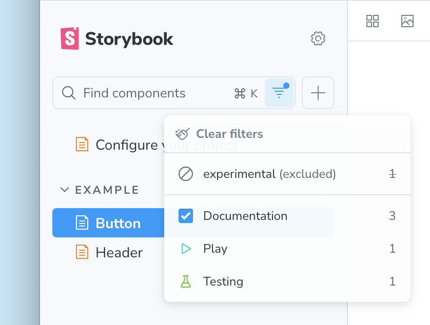

Parent: [main.js|ts configuration](./main-config.mdx)

Type: `{ [tagName: string]: { defaultFilterSelection?: 'include' | 'exclude' } }`

Define custom [tags](../../writing-stories/tags.mdx) for your stories, or alter the default configuration of built-in tags.

<CodeSnippets path="main-config-tags.md" />

## `[tagName]`

Type: `string`

The name of the tag. This can be any static (i.e. not created dynamically) string, either a built-in tag or a custom tag of your own design.

### `[tagName].defaultFilterSelection`

Type: `'include' | 'exclude'`

Set the default filter selection state for a tag in the Storybook sidebar. If set to `include`, stories with this tag are selected as included. If set to `exclude`, stories with this tag are selected as excluded, and must be explicitly included by selecting the tag in the sidebar filter menu. If not set, the tag has no default selection.

