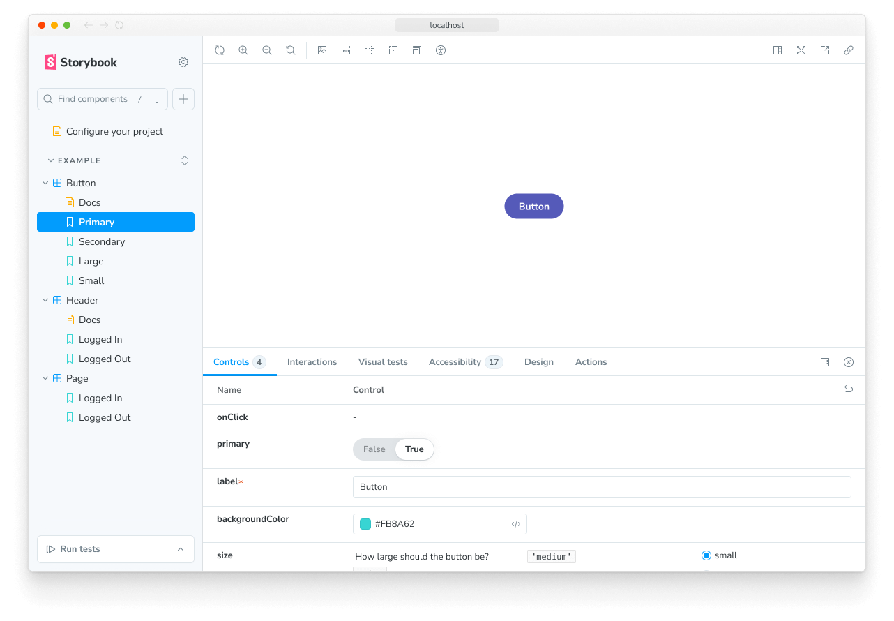

The `layout` [parameter](../writing-stories/parameters.mdx) allows you to configure how stories are positioned in Storybook's Canvas tab.

## Global layout

You can add the parameter to your [`./storybook/preview.js`](./index.mdx#configure-story-rendering), like so:

<CodeSnippets path="storybook-preview-layout-param.md" />

In the example above, Storybook will center all stories in the UI. `layout` accepts these options:

- `centered`: center the component horizontally and vertically in the Canvas
- `fullscreen`: allow the component to expand to the full width and height of the Canvas
- `padded`: _(default)_ Add extra padding around the component

## Component layout

You can also set it at a component level like so:

<CodeSnippets path="storybook-component-layout-param.md" />

## Story layout

Or even apply it to specific stories like so:

<CodeSnippets path="storybook-story-layout-param.md" />
