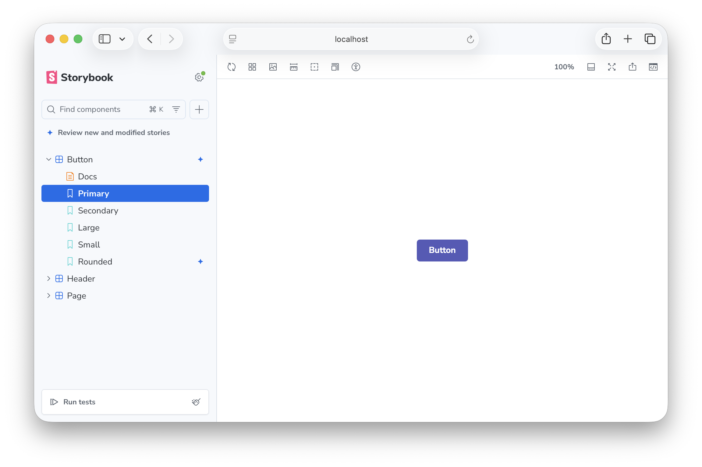
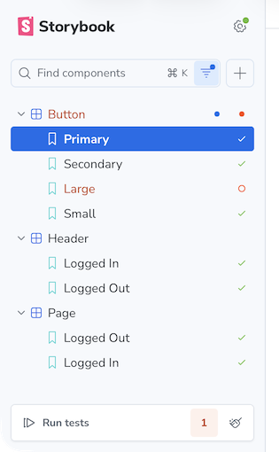
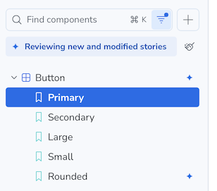
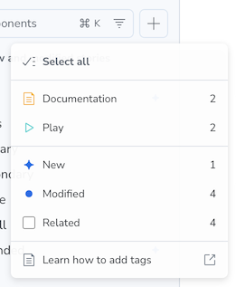

During development, Storybook monitors your git working tree and the builder's module graph to identify which stories are related to your changes. A Review button at the top of the sidebar announces new and modified stories and lets you filter the tree to just those entries with one click. Status icons appear next to new stories and modified components so you can spot them at a glance.



## Requirements

Change detection is a **development-only** feature. It is active when running `storybook dev` and is not available in static builds (`storybook build`).

The following are required for change detection to work:

- **Git repository**: Storybook uses `git diff` to detect changed files.
- **Supported builder**: Storybook traces changed files through the builder's module import graph to identify all affected stories. Both Vite and webpack5 builders are supported. Other builders can gain support by implementing a change-detection adapter.

If change detection status indicators never appear in your sidebar, check that both requirements above are met and that the feature has not been [disabled](#configuration).

## Status indicators

When a change is detected, Storybook shows one of the following status icons next to the relevant stories in the sidebar:

| Icon                      | Status       | Definition                                                                            |
| ------------------------- | ------------ | ------------------------------------------------------------------------------------- |
| ✦&nbsp;Sparkle            | **new**      | The story file is untracked or newly added in git.                                    |
| ●&nbsp;Filled&nbsp;circle | **modified** | The story's own file, or a file it directly imports, was changed.                     |
|                           | **related**  | A file further up the story's dependency chain was changed (a transitive dependency). |

When multiple statuses apply to the same story, the highest priority wins: **new** > **modified** > **related**.

Change detection statuses are displayed alongside [test statuses](../../writing-tests/integrations/vitest-addon/index.mdx#storybook-ui) in the sidebar.



## Reviewing changes

A **Review** button appears between the search bar and the story tree whenever you have at least one new or modified story. The button toggles both the **new** and **modified** filters together with one click.



<Callout variant="info" icon="💡">

**Why are change detection filters off by default?**

The heuristics that Storybook uses to determine modified and related stories are designed to be fast and work without any configuration, but they aren't perfect. They can produce false positives (marking stories as modified or related when they aren't), which can be distracting if you have a large repository with many shared dependencies. For example, if you change a widely used utility function, Storybook might mark dozens of stories as related even if the change doesn't actually affect them. To avoid overwhelming you with status icons, Storybook keeps the modified and related filters off by default, so you only see these statuses when you choose to review your changes.

</Callout>

## Filtering

For more granular control (e.g., to view only new stories) open the filter menu next to the search bar and check or uncheck the individual statuses.



## Configuration

Change detection is enabled by default. To disable it, set [`features.changeDetection`](../../api/main-config/main-config-features.mdx#changedetection) to `false` in your Storybook configuration:

<CodeSnippets path="main-config-features-change-detection.md" />

## Troubleshooting

If status icons don't appear in your sidebar, check the following:

- The dev server terminal log for messages prefixed with `Change detection:` — startup errors, unsupported builder warnings, and parse failures all surface there.
- That you are running `storybook dev` against a supported builder (Vite or webpack5).
- That your project is inside a git repository.
- That `features.changeDetection` is not set to `false` in your Storybook configuration.

### Workspace sibling packages not tracked in monorepos

In a monorepo, when a story imports a workspace sibling package (e.g., `@myorg/ui` declared as `"workspace:*"` in `package.json`), the dependency may not be tracked, meaning changes to that sibling won't trigger a story reload. There are two root causes:

**Built output missing at dev time.** Workspace packages typically point their `exports` or `main` fields to compiled output (`./dist/index.js`, `./esm/index.mjs`, etc.) that doesn't exist until the package is built. Storybook's resolver finds the symlink in `node_modules` but can't resolve the entry file, so it treats the import as untrackable. Even when the package has been built, its output directories are usually `.gitignore`d, meaning the resolved files are outside the set of watched source files and changes to them would never trigger a story reload.

**Per-package `tsconfig.json` blocking root paths.** Many monorepos define workspace path aliases in the root `tsconfig.json` (e.g., `"@myorg/*": ["./packages/@myorg/*/src"]`) so that bundlers resolve imports directly to source. If a package has its own `tsconfig.json` that doesn't extend root, Storybook's resolver finds that file first during its directory walk-up and never sees the root-level path mappings.

To ensure cross-workspace dependencies are tracked correctly, add `paths` entries to your root `tsconfig.json` pointing to the source directories of your workspace packages:

```json title="tsconfig.json"
{
  "compilerOptions": {
    "paths": {
      "@myorg/*": ["./packages/@myorg/*/src"]
    }
  }
}
```

Storybook uses these mappings as a fallback when per-file resolution does not find the module.

### Many unrelated stories marked as related after a single change

If a change to one component (e.g., `Breadcrumb`) causes every story that imports from a shared package (e.g., `@myorg/ui`) to be marked as **related**, the package is likely using a barrel file — a single `index.ts` that re-exports everything.

Storybook performs **barrel-aware named import resolution**: when a story does `import { Button } from '@myorg/ui'`, Storybook traces through the barrel to find the actual source file (`Button.tsx`) and tracks that file instead of the barrel itself. This means a change to `Breadcrumb.tsx` will only mark stories that actually import `Breadcrumb` as related, not every story that imports from the barrel.

**Supported barrel patterns** (Storybook resolves these to the underlying source file):

- Direct named re-exports: `export { Button } from './Button'`
- Wildcard re-exports: `export * from './Button'`

**Patterns not fully supported** (Storybook falls back to tracking the barrel file itself):

- Two-step re-exports: `import { Button } from './Button'; export { Button }`
- Namespace re-exports: `export * as components from './components'`

If your barrel uses unsupported patterns, or if you need the most precise tracking possible, you can still import components from their direct source paths:

```ts
// Instead of the barrel import:
import { Button } from '@myorg/ui';

// Import directly from the component's source:
import { Button } from '@myorg/ui/Button';
```

Whether this is practical depends on the library. Libraries that publish deep-import paths (or that you own and can restructure) support this; libraries that intentionally expose only a barrel do not.

### Debugging the dependency graph

Set the `STORYBOOK_CHANGE_DETECTION_DEBUG` environment variable to dump a JSON snapshot of the dependency graph when Storybook starts:

- `STORYBOOK_CHANGE_DETECTION_DEBUG=1` — writes `storybook-graph-debug.json` in the project root
- `STORYBOOK_CHANGE_DETECTION_DEBUG=/path/to/output.json` — writes to the specified path

The snapshot includes:

- All story-to-dependency edges tracked at startup
- The reverse index (which stories depend on each dep file, with BFS depth)
- A barrel resolution trace showing which named imports were resolved to which source files

This is useful for diagnosing why a specific story is or is not being marked as modified when you change a file.

## How it works

When you run `storybook dev`, Storybook builds its own dependency graph by parsing each story file (and its imports) with [oxc](https://oxc.rs/) and resolves module specifiers through the builder's resolve config. The builder ships a small change-detection adapter that forwards file-system events into Storybook so the graph stays current. A git diff provider watches your working tree for changes and runs `git diff` to identify modified or new files. Storybook then traces each changed file through the dependency graph to find all story files that depend on it — directly or transitively. Stories with the shortest import distance are marked **modified**; those at greater distance are marked **related**. New untracked files are marked **new**.
