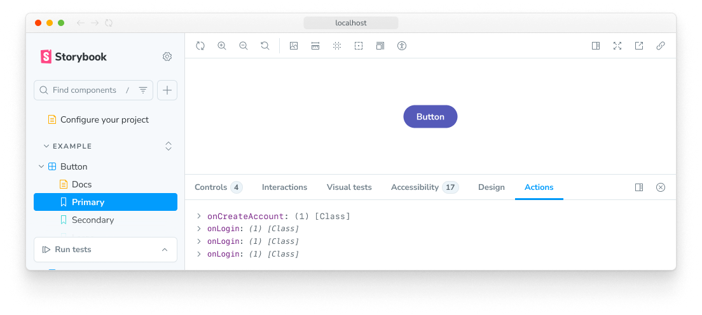

Actions are used to show that an event handler (callback) has been called, and to display its arguments. The actions panel can show both story args and other function calls.

<Video src="../_assets/essentials/addon-actions-demo-optimized.mp4" />

## Story args

Actions work via supplying special Storybook-generated mock functions to your story's event handler args. There are two ways to get an action arg:

### Via `storybook/test` `fn` spies

The recommended way is to assign `fn()` to an arg, which creates a mock function that is automatically spied on by Storybook. This is very useful for writing [interaction tests](../writing-tests/interaction-testing.mdx).

<CodeSnippets path="button-story-onclick-action-spy.md" />

When your component calls an arg (because of either the user's interaction or the `play` function) with an `fn()` assignment, the event will show up in the actions panel:



If you are defining a mock function with `fn()` outside of `args`, you must provide a name for it to automatically log to the actions panel:

```js
const handleClick = fn().mockName('handleClick');
```

### Automatically matching args

Another option is to use a global parameter to match all [argTypes](../api/arg-types.mdx) that match a certain pattern. The following configuration automatically creates actions for each `on` argType (which you can either specify manually or can be [inferred automatically](../api/arg-types.mdx#automatic-argtype-inference)).

This is quite useful when your component has dozens (or hundreds) of methods and you do not want to manually apply the `fn` utility for each of those methods. However, **this is not the recommended** way of writing actions. That's because automatically inferred args **are not available as spies in your play function**. If you use `argTypesRegex` and your stories each have a play function, you will need to also define args with the `fn` utility to test them in your play function.

<CodeSnippets path="storybook-preview-matching-argtypes.md" />

If you need more granular control over which `argTypes` are matched, you can adjust your stories and include the `argTypesRegex` parameter. For example:

<CodeSnippets path="button-story-matching-argtypes.md" />

This will bind a standard HTML event handler to the outermost HTML element rendered by your component and trigger an action when the event is called for a given selector. The format is `<eventname> <selector>`. The selector is optional; it defaults to all elements.

## Non-story function calls

You can still use the actions panel if you need to log function calls that are unrelated to any story. This can be helpful for debugging or logging purposes. There are two main ways to do this: `spyOn` from `storybook/test` or the `action` function from `storybook/actions`. For basic logging, we recommend creating a function spy, and for more complex scenarios, you can use the `action` function directly.

### Via `storybook/test` `spyOn`

Mocks and spies from `storybook/test` are automatically logged as actions (when [applied as `arg` values or when given a name](#via-storybooktest-fn-spies)). The easiest way to show function calls in the actions panel is to use the `spyOn` utility function. Spies appear with a default name, which you can customize by calling the `mockName` method.

<CodeSnippets path="actions-spyon-basic-example.md" />

### Via the `action` function

To filter which function calls are logged, you can override the `spyOn` function's behavior by providing a custom implementation that calls the `action` function from `storybook/actions` only if it matches a specific condition to prevent it from logging all calls to the function it spies on.

<CodeSnippets path="actions-filtering-example.md" />

## API

### Parameters

This contributes the following [parameters](../writing-stories/parameters.mdx) to Storybook, under the `actions` namespace:

#### `argTypesRegex`

Type: `string`

Create actions for each arg that matches the regex. Please note the significant [limitations of this approach](#automatically-matching-args), as described above.

#### `disable`

Type: `boolean`

Disable the action panel.

This parameter is most useful to allow overriding at more specific levels. For example, if this parameter is set to `true` at the project level, it could then be re-enabled by setting it to `false` at the meta (component) or story level.

#### `expandLevel`

Type: `number`

Default: `1`

Controls how many levels deep the action tree is initially expanded. Useful when action arguments contain nested objects and you want to see more detail by default.

### Exports

```js
import { action } from 'storybook/actions';
```

#### `action`

Type: `(name?: string) => void`

Allows you to create an action that appears in the actions panel of the Storybook UI when clicked. The action function takes an optional name parameter, which is used to identify the action in the UI.

<CodeSnippets path="addon-actions-action-function.md" />

#### `configureActions`

```js
import { configureActions } from 'storybook/actions';
```

Type: `(options?: ActionOptions) => void`

Configures the global behavior of the actions addon. Call this in your `.storybook/preview.*` file or anywhere before actions are used. Available options:

- **`limit`** (`number`, default: `50`): Maximum number of action entries to display. When the limit is reached, the oldest actions are discarded.
- **`clearOnStoryChange`** (`boolean`, default: `true`): Clear the actions panel when navigating to a different story.
- **`depth`** (`number`, default: `10`): Serialization depth for action arguments.

```js title=".storybook/preview.ts|tsx"
import { configureActions } from 'storybook/actions';

configureActions({
  limit: 20,
  clearOnStoryChange: false,
});
```
