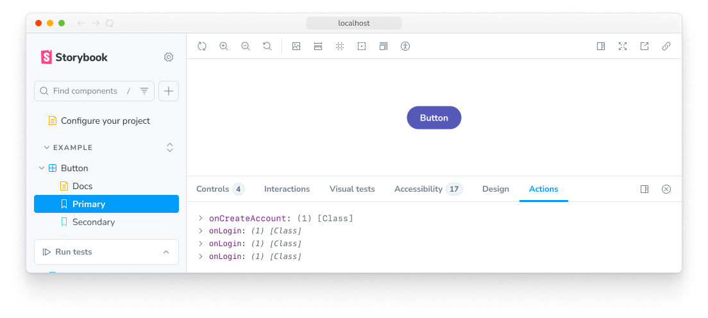

Actions are used to display data received by event handler (callback) arguments in your stories.

<Video src="../_assets/essentials/addon-actions-demo-optimized.mp4" />

## Action args

Actions work via supplying special Storybook-generated “action” arguments (referred to as "args" for short) to your stories. There are two ways to get an action arg:

### Via storybook/test fn spy function

The recommended way to write actions is to use the `fn` utility from `storybook/test` to mock and spy args. This is very useful for writing [interaction tests](../writing-tests/interaction-testing.mdx). You can mock your component's methods by assigning them to the `fn()` function:

{/* prettier-ignore-start */}

<CodeSnippets path="button-story-onclick-action-spy.md" />

{/* prettier-ignore-end */}

If your component calls an arg (because of either the user's interaction or the `play` function) and that arg is spied on , the event will show up in the action panel:



### Automatically matching args

Another option is to use a global parameter to match all [argTypes](../api/arg-types.mdx) that match a certain pattern. The following configuration automatically creates actions for each `on` argType (which you can either specify manually or can be [inferred automatically](../api/arg-types.mdx#automatic-argtype-inference)).

This is quite useful when your component has dozens (or hundreds) of methods and you do not want to manually apply the `fn` utility for each of those methods. However, **this is not the recommended** way of writing actions. That's because automatically inferred args **are not available as spies in your play function**. If you use `argTypesRegex` and your stories have play functions, you will need to also define args with the `fn` utility to test them in your play function.

{/* prettier-ignore-start */}

<CodeSnippets path="storybook-preview-matching-argtypes.md" />

{/* prettier-ignore-end */}

If you need more granular control over which `argTypes` are matched, you can adjust your stories and include the `argTypesRegex` parameter. For example:

{/* prettier-ignore-start */}

<CodeSnippets path="button-story-matching-argtypes.md" />

{/* prettier-ignore-end */}

## Action event handlers

It is also possible to detect if your component is emitting the correct HTML events using the `parameters.actions.handles` [parameter](../writing-stories/parameters.mdx).

{/* prettier-ignore-start */}

<CodeSnippets path="button-story-action-event-handle.md" />

{/* prettier-ignore-end */}

This will bind a standard HTML event handler to the outermost HTML element rendered by your component and trigger an action when the event is called for a given selector. The format is `<eventname> <selector>`. The selector is optional; it defaults to all elements.

## API

### Parameters

This contributes the following [parameters](../writing-stories/parameters.mdx) to Storybook, under the `actions` namespace:

#### `argTypesRegex`

Type: `string`

Create actions for each arg that matches the regex. Please note the significant [limitations of this approach](#automatically-matching-args), as described above.

#### `disable`

Type: `boolean`

Disable the action panel.

This parameter is most useful to allow overriding at more specific levels. For example, if this parameter is set to `true` at the project level, it could then be re-enabled by setting it to `false` at the meta (component) or story level.

#### `handles`

Type: `string[]`

Binds a standard HTML event handler to the outermost HTML element rendered by your component and triggers an action when the event is called for a given selector. The format is `<eventname> <selector>`. The selector is optional; it defaults to all elements.

See the [action event handlers](#action-event-handlers) section, above, for more information.

### Exports

```js
import { action } from 'storybook/actions';
```

#### `action`

Type: `(name?: string) => void`

Allows you to create an action that appears in the actions panel of the Storybook UI when clicked. The action function takes an optional name parameter, which is used to identify the action in the UI.

{/* prettier-ignore-start */}

<CodeSnippets path="addon-actions-action-function.md" />

{/* prettier-ignore-end */}
