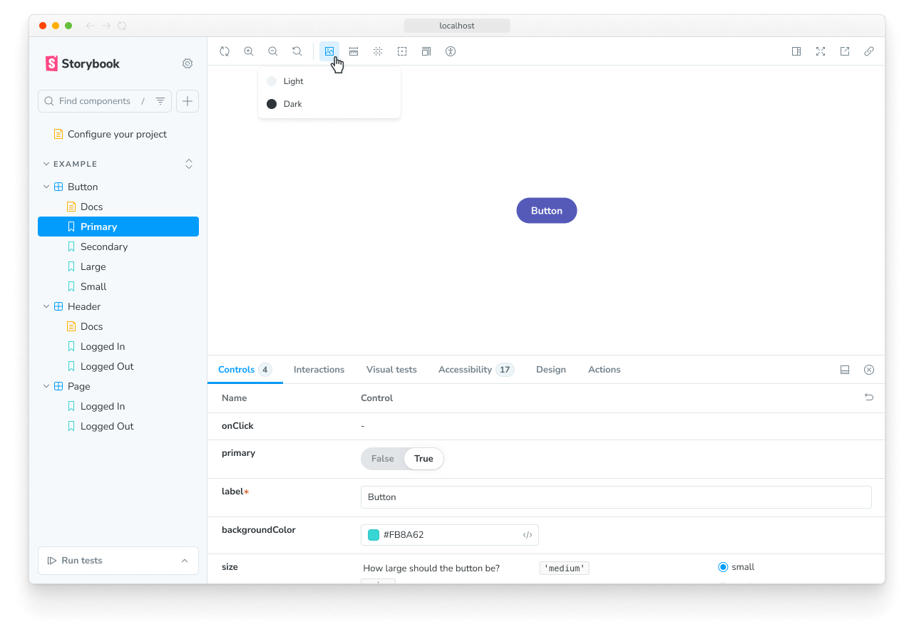

The backgrounds feature allows you to set the background color on which the story renders in the UI:



## Configuration

By default, the backgrounds feature includes a light and dark background.

But you're not restricted to these backgrounds. You can configure your own set of colors with the `backgrounds` [parameter](../writing-stories/parameters.mdx) in your [`.storybook/preview.js|ts`](../configure/index.mdx#configure-story-rendering).

You can define the available background colors using the [`options` property](#options) and set the initial background color using the `initialGlobals` property:

{/* prettier-ignore-start */}

<CodeSnippets path="addon-backgrounds-options-in-preview.md" />

{/* prettier-ignore-end */}

## Defining the background for a story

The backgrounds feature enables you to change the background color applied to a story by selecting from the list of predefined background colors in the toolbar. If needed, you can set a story to default to a specific background color, by using the `globals` option:

{/* prettier-ignore-start */}

<CodeSnippets path="addon-backgrounds-define-globals.md" usesCsf3 />

{/* prettier-ignore-end */}


<Callout variant="info">

  When you specify a background color for a story (or a component's stories) using `globals`, the color is applied and cannot be changed using the toolbar. This is useful to ensure a story is always rendered on a specific background color.

</Callout>

## Extending the configuration

You can also configure backgrounds on a per-component or per-story basis through [parameter inheritance](../writing-stories/parameters.mdx#component-parameters).

To set the available background colors, use the [`options` property](#options). In this example, we'll adjust the colors for all of the Button component's stories:

{/* prettier-ignore-start */}

<CodeSnippets path="addon-backgrounds-options-in-meta.md" />

{/* prettier-ignore-end */}


## Disable backgrounds

If you want to turn off backgrounds in a story, you can do so by configuring the `backgrounds` parameter like so:

{/* prettier-ignore-start */}

<CodeSnippets path="addon-backgrounds-disabled.md" usesCsf3/>

{/* prettier-ignore-end */}

## Grid

The backgrounds feature also includes a Grid selector, which allows you to quickly see if your components are aligned.

You don't need additional configuration to get started. But its properties are fully customizable; if you don't supply any value to any of its properties, they'll default to the following values:

{/* prettier-ignore-start */}

<CodeSnippets path="addon-backgrounds-grid.md" />

{/* prettier-ignore-end */}

## API

### Globals

This module contributes the following globals to Storybook, under the `backgrounds` namespace:

#### `grid`

Type: `boolean`

Whether the [grid](#grid) is displayed.

#### `value`

Type: `string`

When set, the background color is applied and cannot be changed using the toolbar. Must match the key of one of the [available colors](#options).

### Parameters

This module contributes the following [parameters](../writing-stories/parameters.mdx) to Storybook, under the `backgrounds` namespace:

#### `disable`

Type: `boolean`

Disable this feature's behavior. If you wish to disable this feature for the entire Storybook, you should [do so in your main configuration file](./index.mdx#disabling-features).

This parameter is most useful to allow overriding at more specific levels. For example, if this parameter is set to `true` at the project level, it could then be re-enabled by setting it to `false` at the meta (component) or story level.

#### `grid`

Type:

```ts
{
  cellAmount?: number;
  cellSize?: number;
  disable?: boolean;
  offsetX?: number;
  offsetY?: number;
  opacity?: number;
}
```

Configuration for the [background grid](#grid).

##### `grid.cellAmount`

Type: `number`

Default: `5`

Specify the size of the minor grid lines.

##### `grid.cellSize`

Type: `number`

Default: `20`

Specify the size of the major grid lines.

##### `grid.disable`

Type: `boolean`

Turn off the grid.

##### `grid.offsetX`

Type: `number`

Default: `0` if [story layout](../api/parameters.mdx#layout) is `'fullscreen'`; `16` if story layout is `'padded'`

Horizontal offset of the grid.

##### `grid.offsetY`

Type: `number`

Default: `0` if [story layout](../api/parameters.mdx#layout) is `'fullscreen'`; `16` if story layout is `'padded'`

Vertical offset of the grid.

##### `grid.opacity`

Type: `number`

Default: `0.5`

The opacity of the grid lines.

#### `options`

(Required, see description)

Type:

```ts
{
  [key: string]: {
    name: string;
    value: string;
  };
}
```

Available background colors. See above for a [usage example](#configuration).
