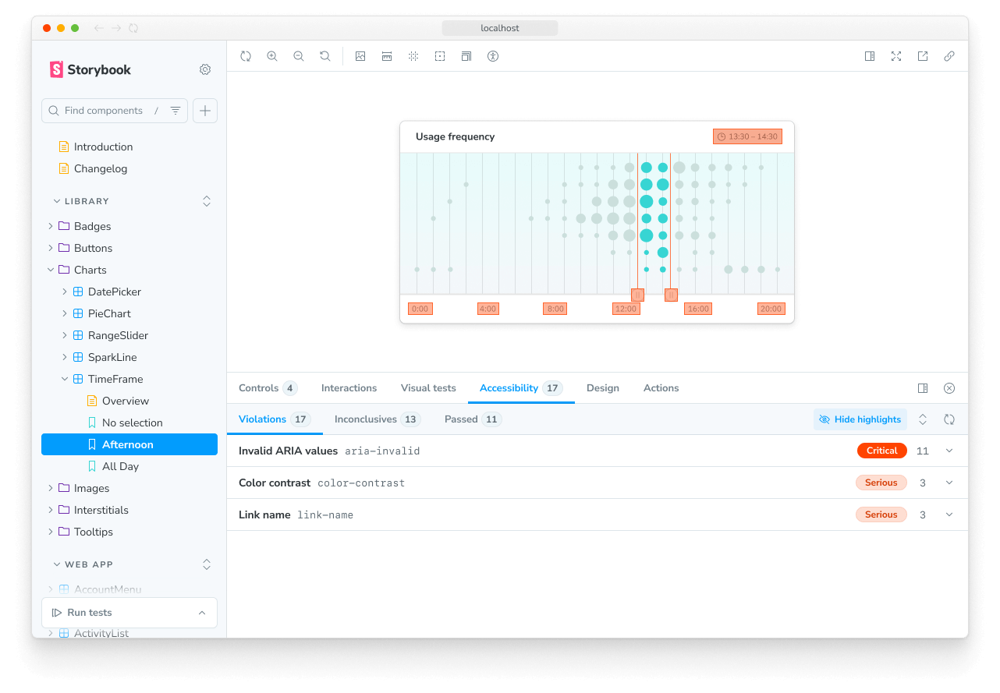

Storybook's Highlight feature is a helpful tool for visually debugging your components, allowing you to highlight specific DOM nodes within your story when used directly or enhancing addons such as the [Accessibility addon](https://storybook.js.org/addons/@storybook/addon-a11y/) to inform you of accessibility issues within your components.



## Highlighting DOM Elements

To highlight DOM elements with the feature, you'll need to emit the `HIGHLIGHT` event from within a story or an addon. The event payload must contain a `selectors` property assigned to an array of selectors matching the elements you want to highlight. For example:

{/* prettier-ignore-start */}

<CodeSnippets path="component-story-highlight-addon.md" />

{/* prettier-ignore-end */}

<Callout variant="info" icon="💡">
  We recommend choosing the most specific selector possible to avoid highlighting elements other addons use. This is because the feature tries to match selectors against the entire DOM tree.
</Callout>

### Remove highlights

To be able to remove a highlight, provide an `id` property when creating the highlight. Then, emit the `REMOVE_HIGHLIGHT` event with the same `id` to remove it. For example:

{/* prettier-ignore-start */}

<CodeSnippets path="addon-highlight-remove.md" />

{/* prettier-ignore-end */}

<Callout variant="info">
  The `emit` function derived from the `useChannel` API hook creates a communication channel in Storybook's UI to listen for events and update the UI accordingly. The Highlight feature uses this channel to listen to custom events and update the highlighted elements (if any) accordingly.
</Callout>

### Reset highlighted elements

Out of the box, Storybook automatically removes highlighted elements when transitioning between stories. However, if you need to clear them manually, you can emit the `RESET_HIGHLIGHT` event from within a story or an addon. This removed all highlights, even ones created by other addons. For example:

{/* prettier-ignore-start */}

<CodeSnippets path="addon-highlight-reset.md" />

{/* prettier-ignore-end */}

### Scroll element into view

To scroll an element into view, emit the `SCROLL_INTO_VIEW` event from within a story or an addon. The event payload must contain a single `selector` property to target the element you want to scroll into view. For example:

{/* prettier-ignore-start */}

<CodeSnippets path="addon-highlight-scroll-into-view.md" />

{/* prettier-ignore-end */}

The element will briefly be highlighted in addition to being scrolled into view.

## Customize style

By default, Highlight applies a standard style to the highlighted elements you've enabled for the story. However, you can provide custom CSS styles using the `styles`, `hoverStyles`, `focusStyles`, and `keyframes` properties. For example:

{/* prettier-ignore-start */}

<CodeSnippets path="highlight-addon-custom-style.md" />

{/* prettier-ignore-end */}

Each of these are optional. In general, you should probably only use `hoverStyles` and `focusStyles` in conjunction with `selectable: true` or the `menu` property.

## API

### Parameters

This feature contributes the following [parameters](../writing-stories/parameters.mdx) to Storybook, under the `highlight` namespace:

#### `disable`

Type: `boolean`

Disable this feature's behavior. If you wish to disable this feature for the entire Storybook, you should [do so in your main configuration file](./index.mdx#disabling-features).

This parameter is most useful to allow overriding at more specific levels. For example, if this parameter is set to `true` at the project level, it could be re-enabled by setting it to `false` at the meta (component) or story level.

### Exports

This feature contributes the following exports to Storybook:

```js
import { HIGHLIGHT, REMOVE_HIGHLIGHT, RESET_HIGHLIGHT, SCROLL_INTO_VIEW } from 'storybook/highlight';
```

#### `HIGHLIGHT`

Type: `string`

An event that highlights DOM elements. The event payload must contain an `elements` property assigned to an array of selectors matching the elements you want to highlight. See the [usage example](#highlighting-dom-elements), above.

#### `REMOVE_HIGHLIGHT`

Type: `string`

An event to remove a previously created highlight. The event payload must contain an `id` property assigned to the id of the highlight you want to remove. See the [usage example](#remove-highlights), above.

#### `RESET_HIGHLIGHT`

Type: `string`

An event to clear all highlights from highlighted elements. See the [usage example](#reset-highlighted-elements), above.

#### `SCROLL_INTO_VIEW`

Type: `string`

An event to scroll a DOM element into view, and briefly highlight it. The event payload must contain a `selector` property assigned to the selector of the element you want to scroll into view. See the [usage example](#scroll-into-view), above.
