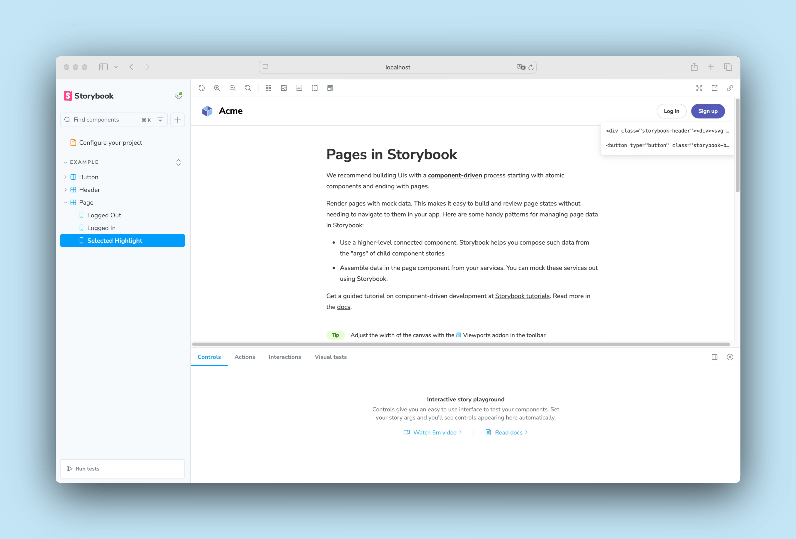

Storybook's Highlight feature is a helpful tool for visually debugging your components, allowing you to highlight specific DOM nodes within your story when used directly or enhancing addons such as the [Accessibility addon](https://storybook.js.org/addons/@storybook/addon-a11y/) to inform you of accessibility issues within your components.


## Highlighting DOM Elements

To highlight DOM elements with the feature, you'll need to emit the `HIGHLIGHT` event from within a story or an addon. The event payload must contain a `selectors` property assigned to an array of selectors matching the elements you want to highlight. For example:

{/* prettier-ignore-start */}

<CodeSnippets path="component-story-highlight.md" />

{/* prettier-ignore-end */}

<Callout variant="info" icon="💡">
  We recommend choosing the most specific selector possible to avoid highlighting elements other addons use. This is because the feature tries to match selectors against the entire DOM tree.
</Callout>

### Remove highlights

To be able to remove a highlight, provide an `id` property when creating the highlight. Then, emit the `REMOVE_HIGHLIGHT` event with the same `id` to remove it. For example:

{/* prettier-ignore-start */}

<CodeSnippets path="highlight-remove.md" />

{/* prettier-ignore-end */}

<Callout variant="info">
  The `emit` function derived from the `useChannel` API hook creates a communication channel in Storybook's UI to listen for events and update the UI accordingly. The Highlight feature uses this channel to listen to custom events and update the highlighted elements (if any) accordingly.
</Callout>

### Reset highlighted elements

Out of the box, Storybook automatically removes highlighted elements when transitioning between stories. However, if you need to clear them manually, you can emit the `RESET_HIGHLIGHT` event from within a story or an addon. This removes all highlights, even ones created by other addons. For example:

{/* prettier-ignore-start */}

<CodeSnippets path="highlight-reset.md" />

{/* prettier-ignore-end */}

### Scroll element into view

To scroll an element into view, emit the `SCROLL_INTO_VIEW` event from within a story or an addon. The event payload must contain a single `selector` property to target the element you want to scroll into view. For example:

{/* prettier-ignore-start */}

<CodeSnippets path="highlight-scroll-into-view.md" />

{/* prettier-ignore-end */}

The element will briefly be highlighted in addition to being scrolled into view.

## Customize style

By default, highlights receive a basic outline style. However, you can provide custom CSS styles using the `styles`, `hoverStyles`, `focusStyles`, and `keyframes` properties. For example:

{/* prettier-ignore-start */}

<CodeSnippets path="highlight-custom-style.md" />

{/* prettier-ignore-end */}

Each of these are optional. In general, you should use `hoverStyles` and `focusStyles` in conjunction with `selectable: true` or the `menu` property. Note that pseudo-classes and pseudo-elements are not supported.

## Selectable elements and menu items

Highlights can be made selectable, which reveals the element's HTML when clicked. This is useful for debugging. To make a highlight selectable, set the `selectable` property to `true`.

{/* prettier-ignore-start */}

<CodeSnippets path="highlight-selectable.md" />

{/* prettier-ignore-end */}

When multiple highlights are present at the clicked location, a list of targets is shown:



This menu can be extended with custom menu items. To do so, provide an array of menu items in the `menu` property. Each menu item must at least have an `id` and `title` property. For example:

{/* prettier-ignore-start */}

<CodeSnippets path="highlight-menu.md" />

{/* prettier-ignore-end */}

Menu items are displayed underneath the element's HTML, and can be used to reveal more information about the element or trigger actions. See the API section below for details on handling menu item clicks.


You can use the `selectors` property to specify which elements the menu item should be shown for. This should be a subset of the `selectors` property used to create the highlight.

## API

### Parameters

This feature contributes the following [parameters](../writing-stories/parameters.mdx) to Storybook, under the `highlight` namespace:

#### `disable`

Type: `boolean`

Disable this feature's behavior. If you wish to disable this feature for the entire Storybook, you should [do so in your main configuration file](./index.mdx#disabling-features).

This parameter is most useful to allow overriding at more specific levels. For example, if this parameter is set to `true` at the project level, it could be re-enabled by setting it to `false` at the meta (component) or story level.

### Exports

This feature contributes the following exports to Storybook:

```js
import { HIGHLIGHT, REMOVE_HIGHLIGHT, RESET_HIGHLIGHT, SCROLL_INTO_VIEW } from 'storybook/highlight';
```

#### `HIGHLIGHT`

An event that highlights DOM elements. The event payload must contain a `selectors` property assigned to an array of selectors matching the elements you want to highlight. See the [usage example](#highlighting-dom-elements), above.

```ts
channel.emit(HIGHLIGHT, /* HighlightOptions */ options);
```

```ts
interface HighlightOptions {
  /** Unique identifier for the highlight, required if you want to remove the highlight later */
  id?: string;
  /** HTML selectors of the elements */
  selectors: string[];
  /** Priority of the highlight, higher takes precedence, defaults to 0 */
  priority?: number;
  /** Whether the highlight is selectable (reveals the element's HTML) */
  selectable?: boolean;
  /** CSS styles to apply to the highlight */
  styles?: Record<string, string>;
  /** CSS styles to apply to the highlight when it is hovered */
  hoverStyles?: Record<string, string>;
  /** CSS styles to apply to the highlight when it is focused or selected */
  focusStyles?: Record<string, string>;
  /** Keyframes required for animations */
  keyframes?: string;
  /** Menu items to show when the highlight is selected (implies selectable: true) */
  menu?: {
    /** Unique identifier for the menu item */
    id: string;
    /** Title of the menu item */
    title: string;
    /** Description of the menu item */
    description?: string;
    /** Name for a channel event to trigger when the menu item is clicked */
    clickEvent?: string;
    /** HTML selectors for which this menu item should show (subset of `selectors`) */
    selectors?: string[];
  }[];
}
```

Menu items can specify a `clickEvent` to be emitted on the channel when the item is clicked. The channel event will receive two arguments: the menu item `id` and a `ClickEventDetails` object:

```ts
interface ClickEventDetails {
  // Position and dimensions of the element on the page
  top: number;
  left: number;
  width: number;
  height: number;
  // Selector(s) which matched the element
  selectors: string[];
  // DOM element details
  element: {
    attributes: Record<string, string>;
    localName: string;
    tagName: string;
    outerHTML: string;
  };
}
```

To listen for this event (assuming `clickEvent: 'MY_CLICK_EVENT'`):

```ts
import type { ClickEventDetails } from 'storybook/highlight';

const handleClickEvent = (itemId: string, details: ClickEventDetails) => {
  // do things
}

channel.on('MY_CLICK_EVENT', handleSelect)

// Or with `useChannel`:
useChannel({
  MY_CLICK_EVENT: handleSelect,
}, [handleSelect])
```

#### `REMOVE_HIGHLIGHT`

An event to remove a previously created highlight. The event payload must contain an `id` property assigned to the id of the highlight you want to remove. See the [usage example](#remove-highlights), above.

```ts
channel.emit(REMOVE_HIGHLIGHT, /* string */ id);
```

#### `RESET_HIGHLIGHT`

An event to clear all highlights from highlighted elements. See the [usage example](#reset-highlighted-elements), above.

```ts
channel.emit(RESET_HIGHLIGHT);
```

#### `SCROLL_INTO_VIEW`

An event to scroll a DOM element into view, and briefly highlight it. The event payload must contain a `selector` property assigned to the selector of the element you want to scroll into view. You may optionally provide an `options` object to customize the scroll behavior. See the [usage example](#scroll-into-view), above.

```ts
channel.emit(SCROLL_INTO_VIEW, /* string */ selector, /* ScrollIntoViewOptions */ options);
```

See the [MDN documentation](https://developer.mozilla.org/en-US/docs/Web/API/Element/scrollIntoView#scrollintoviewoptions) for more information on the `ScrollIntoViewOptions` type.
