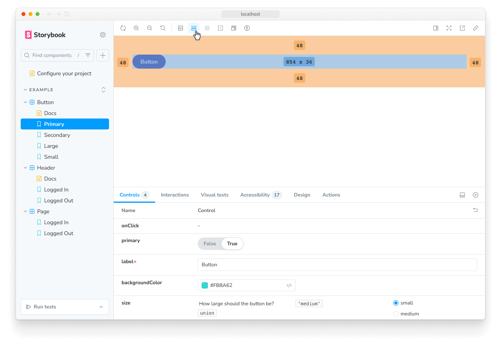
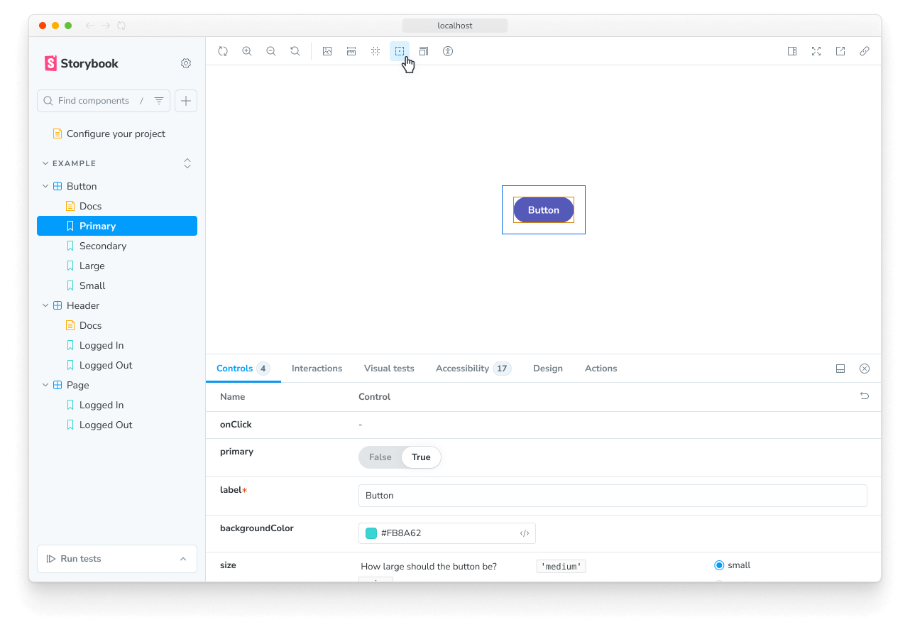

Storybook's measure and outline features give you the necessary tooling to inspect and visually debug CSS layout and alignment issues within your stories. It makes it easy to catch UI bugs early in development.

## Measure

While working with composite components or page layouts, dealing with whitespace (i.e., `margin`, `padding`, `border`) and individual component measurements can be tedious. It would require that you open up the browser's development tools and manually inspect the DOM tree for issues and UI bugs.

Instead, you can quickly visualize each component's measurements by clicking the measure button in the toolbar. Now when you hover over an element in your story, that element's dimensions and any whitespace (i.e., `margin`, `padding`, `border`) will be shown.

<Callout variant="info" icon="💡">
  Alternatively you can press the `m` key on your keyboard to toggle measure on and off.
</Callout>

## Outline

When building your layouts, checking the visual alignment of all components can be pretty complicated, especially if your components are spread apart or contain unique shapes.

Click the outline button in the toolbar to toggle the outlines associated with all your UI elements, allowing you to spot bugs and broken layouts instantly.

## API

### Parameters

These features contribute the following [parameters](../writing-stories/parameters.mdx) to Storybook, under the `measure` or `outline` namespace:

#### `disable`

Type: `boolean`

Disable the feature's behavior. If you wish to disable the feature for the entire Storybook, you should [do so in your main configuration file](./index.mdx#disabling-features).

This parameter is most useful to allow overriding at more specific levels. For example, if this parameter is set to `true` at the project level, it could then be re-enabled by setting it to `false` at the meta (component) or story level.
