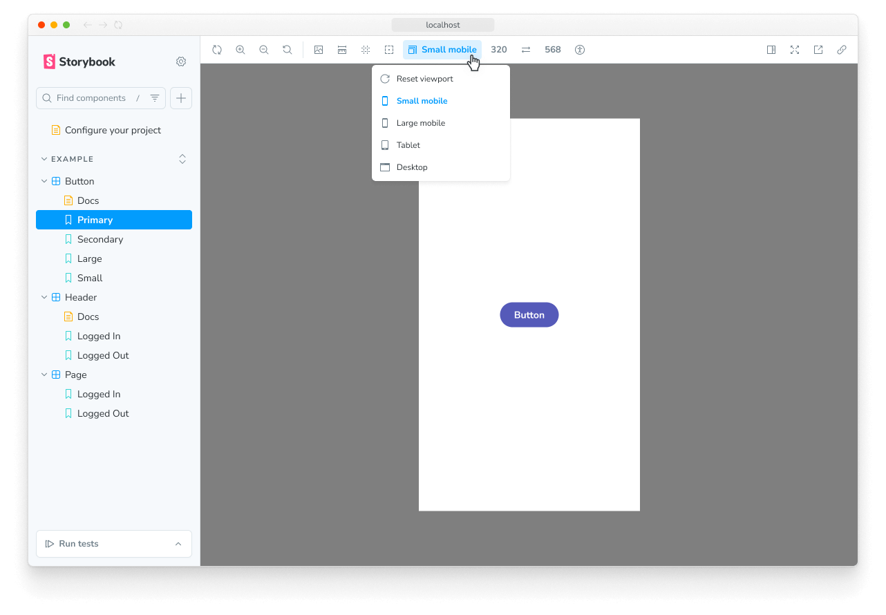

The viewport feature allows you to adjust the dimensions of the iframe your story is rendered in. It makes it easy to develop responsive UIs.



## Configuration

Out of the box, the viewport feature offers you a standard set of viewports that you can use. If you want to change the default set of viewports, you can configure your own viewports with the `viewport` [parameter](../writing-stories/parameters.mdx) in your [`.storybook/preview.js|ts`](../configure/index.mdx#configure-story-rendering).

You can define the available viewports using the [`options` property](#options) and set the initial viewport using the `initialGlobals` property:

{/* prettier-ignore-start */}

<CodeSnippets path="addon-viewport-options-in-preview.md" />

{/* prettier-ignore-end */}

### Use a detailed set of devices

By default, the viewport feature will use a minimal set of viewports, which enables you to test your UI in common responsive scenarios. These are also available in the [`MINIMAL_VIEWPORTS` export](#minimal_viewports) and include the following devices:

| Key       | Description  | Dimensions<br />(<abbr title="width">w</abbr>×<abbr title="height">h</abbr>, px) |
| ----------|------------- | -------------------------------------------------------------------------------- |
| `mobile1` | Small mobile | 320 × 568                                                                        |
| `mobile2` | Large mobile | 414 × 896                                                                        |
| `tablet`  | Tablet       | 834 × 1112                                                                       |
| `desktop` | Desktop      | 1024 × 1280                                                                      |

If you need a more detailed set of devices, you can use the [`INITIAL_VIEWPORTS` export](#initial_viewports), which includes the following devices:

| Key              | Description                                     | Dimensions<br />(<abbr title="width">w</abbr>×<abbr title="height">h</abbr>, px) |
| -----------------| ----------------------------------------------- | -------------------------------------------------------------------------------- |
| `iphone5`        | iPhone 5                                        | 320 × 568                                                                        |
| `iphone6`        | iPhone 6                                        | 375 × 667                                                                        |
| `iphone6p`       | iPhone 6 Plus                                   | 414 × 736                                                                        |
| `iphone8p`       | iPhone 8 Plus                                   | 414 × 736                                                                        |
| `iphonex`        | iPhone X                                        | 375 × 812                                                                        |
| `iphonexr`       | iPhone XR                                       | 414 × 896                                                                        |
| `iphonexsmax`    | iPhone XS Max                                   | 414 × 896                                                                        |
| `iphonese2`      | iPhone SE (2nd generation)                      | 375 × 667                                                                        |
| `iphone12mini`   | iPhone 12 mini                                  | 375 × 812                                                                        |
| `iphone12`       | iPhone 12                                       | 390 × 844                                                                        |
| `iphone12promax` | iPhone 12 Pro Max                               | 428 × 926                                                                        |
| `iphoneSE3`      | iPhone SE 3rd generation                        | 375 × 667                                                                        |
| `iphone13`       | iPhone 13                                       | 390 × 844                                                                        |
| `iphone13pro`    | iPhone 13 Pro                                   | 390 × 844                                                                        |
| `iphone13promax` | iPhone 13 Pro Max                               | 428 × 926                                                                        |
| `iphone14`       | iPhone 14                                       | 390 × 844                                                                        |
| `iphone14pro`    | iPhone 14 Pro                                   | 393 × 852                                                                        |
| `iphone14promax` | iPhone 14 Pro Max                               | 430 × 932                                                                        |
| `galaxys5`       | Galaxy S5                                       | 360 × 640                                                                        |
| `galaxys9`       | Galaxy S9                                       | 360 × 740                                                                        |
| `nexus5x`        | Nexus 5X                                        | 412 × 668                                                                        |
| `nexus6p`        | Nexus 6P                                        | 412 × 732                                                                        |
| `pixel`          | Pixel                                           | 540 × 960                                                                        |
| `pixelxl`        | Pixel XL                                        | 720 × 1280                                                                       |
| `ipad`           | iPad                                            | 768 × 1024                                                                       |
| `ipad10p`        | iPad Pro 10.5-in                                | 834 × 1112                                                                       |
| `ipad11p`        | iPad Pro 11-in                                  | 834 × 1194                                                                       |
| `ipad12p`        | iPad Pro 12.9-in                                | 1024 × 1366                                                                      |

To use the detailed set of devices, you can adjust the `options` property in your configuration to include the `INITIAL_VIEWPORTS` export:

{/* prettier-ignore-start */}

<CodeSnippets path="addon-viewport-options-in-preview.md" />

{/* prettier-ignore-end */}

### Add new devices

If the predefined viewports don't meet your needs, you can add new devices to the list of viewports. For example, let's add two Kindle devices to the default set of minimal viewports:

{/* prettier-ignore-start */}

<CodeSnippets path="addon-viewport-add-viewport-in-preview.md" />

{/* prettier-ignore-end */}

### Configuring per component or story

In some cases, it's not practical for you to use a specific visual viewport on a global scale, and you need to adjust it to an individual story or set of stories for a component.

[Parameters](../writing-stories/parameters.mdx) can be applied at the project, component, and story levels, which allows you to specify the configuration where needed. For example, you can set the available viewports for all of the stories for a component like so:

{/* prettier-ignore-start */}

<CodeSnippets path="addon-viewport-configuration-in-meta.md" usesCsf3 />

{/* prettier-ignore-end */}

## Defining the viewport for a story

The Viewport module enables you to change the viewport applied to a story by selecting from the list of predefined viewports in the toolbar. If needed, you can set a story to default to a specific viewport by using the `globals` option:

{/* prettier-ignore-start */}

<CodeSnippets path="addon-viewport-define-globals.md" usesCsf3 />

{/* prettier-ignore-end */}

<Callout variant="info">

When you specify a viewport for a story (or a component's stories) using `globals`, the viewport is applied and cannot be changed using the toolbar. This is useful to ensure a story is always rendered on a specific viewport.

</Callout>

## API

### Keyboard shortcuts

If you need, you can edit these on the shortcuts page.

* Next viewport: <kbd>alt</kbd> + <kbd>v</kbd>
* Previous viewport: <kbd>alt</kbd> + <kbd>shift</kbd> + <kbd>v</kbd>
* Reset viewport: <kbd>alt</kbd> + <kbd>control</kbd> + <kbd>v</kbd>

### Globals

This module contributes the following globals to Storybook, under the `viewport` namespace:

#### `value`

Type: `string`

When set, the viewport is applied and cannot be changed using the toolbar. Must match the key of one of the [available viewports](#options).

#### `isRotated`

Type: `boolean`

When true, the viewport applied will be rotated 90°, e.g., from portrait to landscape orientation.

### Parameters

This module contributes the following [parameters](../writing-stories/parameters.mdx) to Storybook, under the `viewport` namespace:

#### `disable`

Type: `boolean`

Turn off this module's behavior. This parameter is most useful to allow overriding at more specific levels. For example, if this parameter is set to `true` at the project level, it could be re-enabled by setting it to `false` at the meta (component) or story level.

#### `options`

Type:

```ts
{
  [key: string]: {
    name: string;
    styles: { height: string, width: string };
    type: 'desktop' | 'mobile' | 'tablet' | 'other';
  };
}
```

Specify the available viewports. See [usage example](#add-new-devices) above. The `width` and `height` values must include the unit, e.g. `'320px'`.


### Exports

This module contributes the following exports to Storybook:

```js
import { INITIAL_VIEWPORTS, MINIMAL_VIEWPORTS } from 'storybook/viewport';
```

#### `INITIAL_VIEWPORTS`

Type: `object`

The full set of initial viewports provided by the Viewport module [listed above](#use-a-detailed-set-of-devices).

#### `MINIMAL_VIEWPORTS`

Type: `object`

A minimal set of viewports provided by the Viewport module [listed above](#use-a-detailed-set-of-devices). These are used by default.

