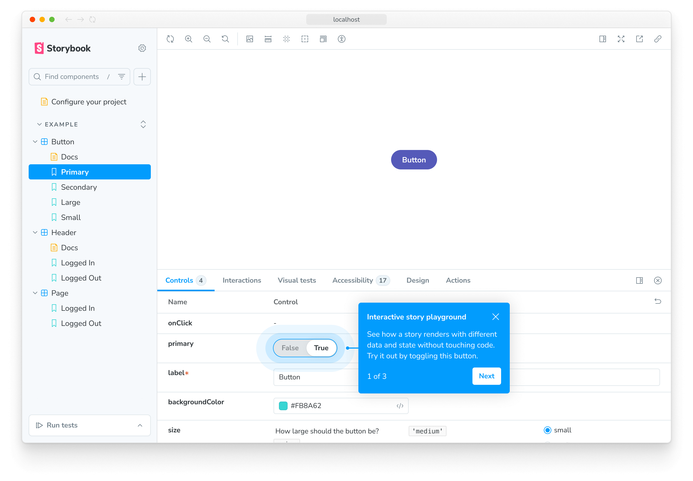

Storybook for Next.js (Vite) is the **recommended** [framework](../../contribute/framework.mdx) for developing and testing UI components in isolation for [Next.js](https://nextjs.org/) applications. It uses [Vite](https://vitejs.dev/) for faster builds and better performance. It includes:

* 🔀 Routing
* 🖼 Image optimization
* ⤵️ Absolute imports
* 🎨 Styling
* ⚡ Vite-powered builds
* 💫 and more!

This Vite-based framework offers several advantages over the Webpack-based [`@storybook/nextjs`](./nextjs.mdx) framework:

* ⚡ **Faster builds** - Vite's build system is significantly faster than Webpack
* 🔧 **Modern tooling** - Uses the latest build tools and optimizations
* 🧪 **Better test support** - Full support for the [Vitest addon](../../writing-tests/integrations/vitest-addon/index.mdx) and other testing features
* 📦 **Simpler configuration** - No need for Babel or complex Webpack configurations
* 🎯 **Better development experience** - Faster HMR (Hot Module Replacement) and dev server startup

## Requirements

* Next.js ≥ 14.1

## Getting started

### In a project without Storybook

When you run `storybook init` in your Next.js project, Storybook will automatically detect your project and select the `@storybook/nextjs-vite` framework **unless** your project has custom Webpack or Babel configurations that may be incompatible with Vite.

Follow the prompts after running this command in your Next.js project's root directory:

{/* prettier-ignore-start */}

<CodeSnippets path="create-command.md" />

{/* prettier-ignore-end */}

[More on getting started with Storybook.](../install.mdx)

<Callout variant="info">

If your project has a custom `webpack.config.js` or `.babelrc` file, `storybook init` will prompt you to choose between:

- **`@storybook/nextjs-vite`** (recommended) - Faster, more modern, supports latest testing features
- **`@storybook/nextjs`** (Webpack 5) - Better compatibility with custom Webpack/Babel configurations

Choose `nextjs-vite` if you're willing to migrate your custom configurations to Vite. Choose `nextjs` (Webpack 5) if you need to keep your existing Webpack/Babel setup.

</Callout>

### In a project with Storybook

This framework is designed to work with Storybook 10+. If you're not already using v10, upgrade with this command:

{/* prettier-ignore-start */}

<CodeSnippets path="storybook-upgrade.md" />

{/* prettier-ignore-end */}

#### Automatic migration

When running the `upgrade` command above, you should get a prompt asking you to migrate to `@storybook/nextjs-vite`, which should handle everything for you. In case that auto-migration does not work for your project, refer to the manual migration below.

You can also use the [`nextjs-to-nextjs-vite` automigration](#migrating-from-webpack) to migrate from the Webpack-based `@storybook/nextjs` framework to this Vite-based framework.

#### Manual migration

First, install the framework:

{/* prettier-ignore-start */}

<CodeSnippets path="nextjs-vite-install.md" />

{/* prettier-ignore-end */}

Then, update your `.storybook/main.js|ts` to change the framework property:

{/* prettier-ignore-start */}

<CodeSnippets path="nextjs-vite-add-framework.md" />

{/* prettier-ignore-end */}

<Callout variant="info">

If your Storybook configuration contains custom Webpack operations in [`webpackFinal`](../../api/main-config/main-config-webpack-final.mdx), you will likely need to create equivalents in [`viteFinal`](../../api/main-config/main-config-vite-final.mdx).

For more information, see the [Vite builder documentation](../../builders/vite.mdx#migrating-from-webpack).

</Callout>

Finally, if you were using Storybook plugins to integrate with Next.js, those are no longer necessary when using this framework and can be removed:

{/* prettier-ignore-start */}

<CodeSnippets path="nextjs-remove-addons.md" />

{/* prettier-ignore-end */}

#### Migrating from Webpack

Storybook provides a migration tool for migrating to this framework from the Webpack-based Next.js framework, `@storybook/nextjs`. To migrate, run this command:

```bash
npx storybook automigrate nextjs-to-nextjs-vite
```

This automigration tool performs the following actions:

1. Updates `package.json` files to replace `@storybook/nextjs` with `@storybook/nextjs-vite`
2. Updates `.storybook/main.js|ts` to change the framework property
3. Scans and updates import statements in your story files and configuration files

<Callout variant="info">

If your project has custom Webpack configurations in `.storybook/main.js|ts` (via `webpackFinal`), you'll need to migrate those to Vite configuration (via `viteFinal`) after running this automigration. See the [Vite builder documentation](../builders/vite.mdx#migrating-from-webpack) for more information.

</Callout>

## Run the Setup Wizard

If all goes well, you should see a setup wizard that will help you get started with Storybook introducing you to the main concepts and features, including how the UI is organized, how to write your first story, and how to test your components' response to various inputs utilizing [controls](../../essentials/controls.mdx).



If you skipped the wizard, you can always run it again by adding the `?path=/onboarding` query parameter to the URL of your Storybook instance, provided that the example stories are still available.

## Next.js's Image component

This framework allows you to use Next.js's [next/image](https://nextjs.org/docs/pages/api-reference/components/image) with no configuration.

### Local images

[Local images](https://nextjs.org/docs/pages/building-your-application/optimizing/images#local-images) are supported.

```jsx title="index.jsx"
import Image from 'next/image';
import profilePic from '../public/me.png';

function Home() {
  return (
    <>
      <h1>My Homepage</h1>
      <Image
        src={profilePic}
        alt="Picture of the author"
        // width={500} automatically provided
        // height={500} automatically provided
        // blurDataURL="../public/me.png" set to equal the image itself (for this framework)
        // placeholder="blur" // Optional blur-up while loading
      />
      <p>Welcome to my homepage!</p>
    </>
  );
}
```

### Remote images

[Remote images](https://nextjs.org/docs/pages/building-your-application/optimizing/images#remote-images) are also supported.

```jsx title="index.jsx"
import Image from 'next/image';

export default function Home() {
  return (
    <>
      <h1>My Homepage</h1>
      <Image src="/me.png" alt="Picture of the author" width={500} height={500} />
      <p>Welcome to my homepage!</p>
    </>
  );
}
```

## Next.js font optimization

[next/font](https://nextjs.org/docs/pages/building-your-application/optimizing/fonts) is partially supported in Storybook. The packages `next/font/google` and `next/font/local` are supported.

### `next/font/google`

You don't have to do anything. `next/font/google` is supported out of the box.

### `next/font/local`

For local fonts you have to define the [src](https://nextjs.org/docs/pages/building-your-application/optimizing/fonts#local-fonts) property.
The path is relative to the directory where the font loader function is called.

If the following component defines your localFont like this:

```js title="src/components/MyComponent.js"
import localFont from 'next/font/local';

const localRubikStorm = localFont({ src: './fonts/RubikStorm-Regular.ttf' });
```

The Vite-based framework automatically handles font path mapping, so you don't need to configure `staticDirs` for fonts like you would with the Webpack-based framework.

### Not supported features of `next/font`

The following features are not supported (yet). Support for these features might be planned for the future:

* [Support font loaders configuration in next.config.js](https://nextjs.org/docs/pages/building-your-application/optimizing/fonts#local-fonts)
* [fallback](https://nextjs.org/docs/pages/api-reference/components/font#fallback) option
* [adjustFontFallback](https://nextjs.org/docs/pages/api-reference/components/font#adjustfontfallback) option
* [preload](https://nextjs.org/docs/pages/api-reference/components/font#preload) option gets ignored. Storybook handles Font loading its own way.
* [display](https://nextjs.org/docs/pages/api-reference/components/font#display) option gets ignored. All fonts are loaded with display set to "block" to make Storybook load the font properly.

### Mocking fonts during testing

Occasionally fetching fonts from Google may fail as part of your Storybook build step. It is highly recommended to mock these requests, as those failures can cause your pipeline to fail as well. Next.js [supports mocking fonts](https://github.com/vercel/next.js/blob/725ddc7371f80cca273779d37f961c3e20356f95/packages/font/src/google/fetch-css-from-google-fonts.ts#L36) via a JavaScript module located where the env var `NEXT_FONT_GOOGLE_MOCKED_RESPONSES` references.

For example, using [GitHub Actions](https://www.chromatic.com/docs/github-actions):

```yaml title=".github/workflows/ci.yml"
- uses: chromaui/action@latest
  env:
    #👇 the location of mocked fonts to use
    NEXT_FONT_GOOGLE_MOCKED_RESPONSES: ${{ github.workspace }}/mocked-google-fonts.js
  with:
    projectToken: ${{ secrets.CHROMATIC_PROJECT_TOKEN }}
    token: ${{ secrets.GITHUB_TOKEN }}
```

Your mocked fonts will look something like this:

```js title="mocked-google-fonts.js"
//👇 Mocked responses of google fonts with the URL as the key
module.exports = {
  'https://fonts.googleapis.com/css?family=Inter:wght@400;500;600;800&display=block': `
    /* cyrillic-ext */
    @font-face {
      font-family: 'Inter';
      font-style: normal;
      font-weight: 400;
      font-display: block;
      src: url(https://fonts.gstatic.com/s/inter/v12/UcCO3FwrK3iLTeHuS_fvQtMwCp50KnMw2boKoduKmMEVuLyfAZJhiJ-Ek-_EeAmM.woff2) format('woff2');
      unicode-range: U+0460-052F, U+1C80-1C88, U+20B4, U+2DE0-2DFF, U+A640-A69F, U+FE2E-FE2F;
    }
    /* more font declarations go here */
    /* latin */
    @font-face {
      font-family: 'Inter';
      font-style: normal;
      font-weight: 400;
      font-display: block;
      src: url(https://fonts.gstatic.com/s/inter/v12/UcCO3FwrK3iLTeHuS_fvQtMwCp50KnMw2boKoduKmMEVuLyfAZ9hiJ-Ek-_EeA.woff2) format('woff2');
      unicode-range: U+0000-00FF, U+0131, U+0152-0153, U+02BB-02BC, U+02C6, U+02DA, U+02DC, U+0304, U+0308, U+0329, U+2000-206F, U+2074, U+20AC, U+2122, U+2191, U+2193, U+2212, U+2215, U+FEFF, U+FFFD;
    }`,
};
```

## Next.js routing

[Next.js's router](https://nextjs.org/docs/pages/building-your-application/routing) is automatically stubbed for you so that when the router is interacted with, all of its interactions are automatically logged to the [Actions panel](../../essentials/actions.mdx).

<Callout>

You should only use `next/router` in the `pages` directory. In the `app` directory, it is necessary to use `next/navigation`.

</Callout>

### Overriding defaults

Per-story overrides can be done by adding a `nextjs.router` property onto the story [parameters](../../writing-stories/parameters.mdx). The framework will shallowly merge whatever you put here into the router.

{/* prettier-ignore-start */}

<CodeSnippets path="nextjs-router-override-in-story.md" />

{/* prettier-ignore-end */}

<Callout>

These overrides can also be applied to [all stories for a component](../../api/parameters.mdx#meta-parameters) or [all stories in your project](../../api/parameters.mdx#project-parameters). Standard [parameter inheritance](../../api/parameters.mdx#parameter-inheritance) rules apply.

</Callout>

### Default router

The default values on the stubbed router are as follows (see [globals](../../essentials/toolbars-and-globals.mdx#globals) for more details on how globals work).

```ts
// Default router
const defaultRouter = {
  // The locale should be configured globally: https://storybook.js.org/docs/essentials/toolbars-and-globals#globals
  locale: globals?.locale,
  asPath: '/',
  basePath: '/',
  isFallback: false,
  isLocaleDomain: false,
  isReady: true,
  isPreview: false,
  route: '/',
  pathname: '/',
  query: {},
};
```

Additionally, the [`router` object](https://nextjs.org/docs/pages/api-reference/functions/use-router#router-object) contains all of the original methods (such as `push()`, `replace()`, etc.) as mock functions that can be manipulated and asserted on using [regular mock APIs](https://vitest.dev/api/mock.html).

To override these defaults, you can use [parameters](../../writing-stories/parameters.mdx) and [`beforeEach`](../../writing-stories/mocking-data-and-modules/mocking-modules.mdx#setting-up-and-cleaning-up):

```ts title=".storybook/preview.js|ts"
import type { Preview } from '@storybook/nextjs-vite';

// 👇 Must include the `.mock` portion of filename to have mocks typed correctly
import { getRouter } from "@storybook/nextjs-vite/router.mock";

const preview: Preview = {
  parameters: {
    nextjs: {
      // 👇 Override the default router properties
      router: {
        basePath: '/app/',
      },
    },
  },
  async beforeEach() {
    // 👇 Manipulate the default router method mocks
    getRouter().push.mockImplementation(() => {
      /* ... */
    });
  },
};
```

## Next.js navigation

<Callout>

Please note that [`next/navigation`](https://nextjs.org/docs/app/building-your-application/routing) can only be used in components/pages in the `app` directory.

</Callout>

### Set `nextjs.appDirectory` to `true`

If your story imports components that use `next/navigation`, you need to set the parameter `nextjs.appDirectory` to `true` in for that component's stories:

{/* prettier-ignore-start */}

<CodeSnippets path="nextjs-app-directory-in-meta.md" />

{/* prettier-ignore-end */}

If your Next.js project uses the `app` directory for every page (in other words, it does not have a `pages` directory), you can set the parameter `nextjs.appDirectory` to `true` in the [`.storybook/preview.js|ts`](../../configure/index.mdx#configure-story-rendering) file to apply it to all stories.

{/* prettier-ignore-start */}

<CodeSnippets path="nextjs-app-directory-in-preview.md" />

{/* prettier-ignore-end */}

### Overriding defaults

Per-story overrides can be done by adding a `nextjs.navigation` property onto the story [parameters](../../writing-stories/parameters.mdx). The framework will shallowly merge whatever you put here into the router.

{/* prettier-ignore-start */}

<CodeSnippets path="nextjs-navigation-override-in-story.md" />

{/* prettier-ignore-end */}

<Callout>

These overrides can also be applied to [all stories for a component](../../api/parameters.mdx#meta-parameters) or [all stories in your project](../../api/parameters.mdx#project-parameters). Standard [parameter inheritance](../../api/parameters.mdx#parameter-inheritance) rules apply.

</Callout>

### `useSelectedLayoutSegment`, `useSelectedLayoutSegments`, and `useParams` hooks

The `useSelectedLayoutSegment`, `useSelectedLayoutSegments`, and `useParams` hooks are supported in Storybook. You have to set the `nextjs.navigation.segments` parameter to return the segments or the params you want to use.

{/* prettier-ignore-start */}

<CodeSnippets path="nextjs-navigation-segments-override-in-meta.md" />

With the above configuration, the component rendered in the stories would receive the following values from the hooks:

```js title="NavigationBasedComponent.js"
import { useSelectedLayoutSegment, useSelectedLayoutSegments, useParams } from 'next/navigation';

export default function NavigationBasedComponent() {
  const segment = useSelectedLayoutSegment(); // dashboard
  const segments = useSelectedLayoutSegments(); // ["dashboard", "analytics"]
  const params = useParams(); // {}
  // ...
}
```

{/* prettier-ignore-end */}

To use `useParams`, you have to use a segments array where each element is an array containing two strings. The first string is the param key and the second string is the param value.

{/* prettier-ignore-start */}

<CodeSnippets path="nextjs-navigation-segments-for-use-params-override-in-meta.md" />

{/* prettier-ignore-end */}

With the above configuration, the component rendered in the stories would receive the following values from the hooks:

```js title="ParamsBasedComponent.js"
import { useSelectedLayoutSegment, useSelectedLayoutSegments, useParams } from 'next/navigation';

export default function ParamsBasedComponent() {
  const segment = useSelectedLayoutSegment(); // hello
  const segments = useSelectedLayoutSegments(); // ["hello", "nextjs"]
  const params = useParams(); // { slug: "hello", framework: "nextjs" }
  ...
}
```

<Callout>

These overrides can also be applied to [a single story](../../api/parameters.mdx#story-parameters) or [all stories in your project](../../api/parameters.mdx#project-parameters). Standard [parameter inheritance](../../api/parameters.mdx#parameter-inheritance) rules apply.

</Callout>

The default value of `nextjs.navigation.segments` is `[]` if not set.

### Default navigation context

The default values on the stubbed navigation context are as follows:

```ts
// Default navigation context
const defaultNavigationContext = {
  pathname: '/',
  query: {},
};
```

Additionally, the [`router` object](https://nextjs.org/docs/app/api-reference/functions/use-router#userouter) contains all of the original methods (such as `push()`, `replace()`, etc.) as mock functions that can be manipulated and asserted on using [regular mock APIs](https://vitest.dev/api/mock.html).

To override these defaults, you can use [parameters](../../writing-stories/parameters.mdx) and [`beforeEach`](../../writing-stories/mocking-data-and-modules/mocking-modules.mdx#setting-up-and-cleaning-up):

```ts title=".storybook/preview.js|ts"
import type { Preview } from '@storybook/nextjs-vite';

// 👇 Must include the `.mock` portion of filename to have mocks typed correctly
import { getRouter } from '@storybook/nextjs-vite/navigation.mock';

const preview: Preview = {
  parameters: {
    nextjs: {
      // 👇 Override the default navigation properties
      navigation: {
        pathname: '/app/',
      },
    },
  },
  async beforeEach() {
    // 👇 Manipulate the default navigation method mocks
    getRouter().push.mockImplementation(() => {
      /* ... */
    });
  },
};
```

## Next.js Head

[`next/head`](https://nextjs.org/docs/pages/api-reference/components/head) is supported out of the box. You can use it in your stories like you would in your Next.js application. Please keep in mind, that the Head `children` are placed into the head element of the iframe that Storybook uses to render your stories.

## Sass/Scss

[Global Sass/Scss stylesheets](https://nextjs.org/docs/pages/building-your-application/styling/sass) are supported without any additional configuration as well. Just import them into [`.storybook/preview.js|ts`](../../configure/index.mdx#configure-story-rendering)

```js title=".storybook/preview.js|ts"
import '../styles/globals.scss';
```

This will automatically include any of your [custom Sass configurations](https://nextjs.org/docs/pages/building-your-application/styling/sass#customizing-sass-options) in your `next.config.js` file.

```js title="next.config.js"
import * as path from 'path';

export default {
  // Any options here are included in Sass compilation for your stories
  sassOptions: {
    includePaths: [path.join(process.cwd(), 'styles')],
  },
};
```

## CSS/Sass/Scss Modules

[CSS modules](https://nextjs.org/docs/pages/building-your-application/styling/css-modules) work as expected.

```jsx title="src/components/Button.jsx"
// This import will work in Storybook
import styles from './Button.module.css';
// Sass/Scss is also supported
// import styles from './Button.module.scss'
// import styles from './Button.module.sass'

export function Button() {
  return (
    <button type="button" className={styles.error}>
      Destroy
    </button>
  );
}
```

## PostCSS

Next.js lets you [customize PostCSS config](https://nextjs.org/docs/pages/building-your-application/configuring/post-css). Thus this framework will automatically handle your PostCSS config for you.

This allows for cool things like zero-config Tailwind! (See [Next.js' example](https://github.com/vercel/next.js/tree/canary/packages/create-next-app/templates/default-tw))

## Absolute imports

[Absolute imports](https://nextjs.org/docs/pages/building-your-application/configuring/absolute-imports-and-module-aliases#absolute-imports) from the root directory are supported.

```jsx title="index.jsx|tsx"
// All good!
import Button from 'components/button';
// Also good!
import styles from 'styles/HomePage.module.css';

export default function HomePage() {
  return (
    <>
      <h1 className={styles.title}>Hello World</h1>
      <Button />
    </>
  );
}
```

Also OK for global styles in `.storybook/preview.js|ts`!

```js title=".storybook/preview.js|ts"
import 'styles/globals.scss';

// ...
```

<Callout variant="warning">

Absolute imports **cannot** be mocked in stories/tests. See the [Mocking modules](#mocking-modules) section for more information.

</Callout>

## Module aliases

[Module aliases](https://nextjs.org/docs/app/building-your-application/configuring/absolute-imports-and-module-aliases#module-aliases) are also supported.

```jsx title="index.jsx|tsx"
// All good!
import Button from '@/components/button';
// Also good!
import styles from '@/styles/HomePage.module.css';

export default function HomePage() {
  return (
    <>
      <h1 className={styles.title}>Hello World</h1>
      <Button />
    </>
  );
}
```

## Subpath imports

As an alternative to [module aliases](#module-aliases), you can use [subpath imports](https://nodejs.org/api/packages.html#subpath-imports) to import modules. This follows Node package standards and has benefits when [mocking modules](#mocking-modules).

To configure subpath imports, you define the `imports` property in your project's `package.json` file. This property maps the subpath to the actual file path. The example below configures subpath imports for all modules in the project:

```json title="package.json"
{
  "imports": {
    "#*": ["./*", "./*.ts", "./*.tsx"]
  }
}
```

<Callout variant="info">

Because subpath imports replace module aliases, you can remove the path aliases from your TypeScript configuration.

</Callout>

Which can then be used like this:

```jsx title="index.jsx|tsx"
import Button from '#components/button';
import styles from '#styles/HomePage.module.css';

export default function HomePage() {
  return (
    <>
      <h1 className={styles.title}>Hello World</h1>
      <Button />
    </>
  );
}
```

## Mocking modules

Components often depend on modules that are imported into the component file. These can be from external packages or internal to your project. When rendering those components in Storybook or testing them, you may want to [mock those modules](../../writing-stories/mocking-data-and-modules/mocking-modules.mdx) to control and assert their behavior.

### Built-in mocked modules

This framework provides mocks for many of Next.js' internal modules:

1. [`@storybook/nextjs-vite/cache.mock`](#storybooknextjs-vitecachemock)
2. [`@storybook/nextjs-vite/headers.mock`](#storybooknextjs-viteheadersmock)
3. [`@storybook/nextjs-vite/navigation.mock`](#storybooknextjs-vitenavigationmock)
4. [`@storybook/nextjs-vite/router.mock`](#storybooknextjs-viteroutermock)

### Mocking other modules

To mock other modules, use [automocking](../../writing-stories/mocking-data-and-modules/mocking-modules.mdx#automocking) or one of the [alternative methods](../../writing-stories/mocking-data-and-modules/mocking-modules.mdx#alternative-methods) documented in the mocking modules guide.

## Runtime config

Next.js allows for [Runtime Configuration](https://nextjs.org/docs/pages/api-reference/next-config-js/runtime-configuration) which lets you import a handy `getConfig` function to get certain configuration defined in your `next.config.js` file at runtime.

In the context of Storybook with this framework, you can expect Next.js's [Runtime Configuration](https://nextjs.org/docs/pages/api-reference/next-config-js/runtime-configuration) feature to work just fine.

Note, because Storybook doesn't server render your components, your components will only see what they normally see on the client side (i.e. they won't see `serverRuntimeConfig` but will see `publicRuntimeConfig`).

For example, consider the following Next.js config:

```js title="next.config.js"
module.exports = {
  serverRuntimeConfig: {
    mySecret: 'secret',
    secondSecret: process.env.SECOND_SECRET, // Pass through env variables
  },
  publicRuntimeConfig: {
    staticFolder: '/static',
  },
};
```

Calls to `getConfig` would return the following object when called within Storybook:

```jsonc
// Runtime config
{
  "serverRuntimeConfig": {},
  "publicRuntimeConfig": {
    "staticFolder": "/static"
  }
}
```

## Custom Vite configuration

You can customize the [Vite configuration](../../builders/vite.mdx#configuration) used by Storybook in your `.storybook/main.js|ts` file. By default, Storybook's configuration extends the Vite configuration used by your project, but you can configure it to not do so.

Not all Vite modifications are copy/paste-able between `next.config.js` and `.storybook/main.js|ts`. It is recommended to do your research on how to properly make your modification to Storybook's Vite config and on how [Vite works](https://vitejs.dev/guide/).

## Typescript

Storybook handles most [Typescript](https://www.typescriptlang.org/) configurations, but this framework adds additional support for Next.js's support for [Absolute Imports and Module path aliases](https://nextjs.org/docs/pages/building-your-application/configuring/absolute-imports-and-module-aliases). In short, it takes into account your `tsconfig.json`'s [baseUrl](https://www.typescriptlang.org/tsconfig#baseUrl) and [paths](https://www.typescriptlang.org/tsconfig#paths). Thus, a `tsconfig.json` like the one below would work out of the box.

```json title="tsconfig.json"
{
  "compilerOptions": {
    "baseUrl": ".",
    "paths": {
      "@/components/*": ["components/*"]
    }
  }
}
```

## React Server Components (RSC)

(⚠️ **Experimental**)

If your app uses [React Server Components (RSC)](https://nextjs.org/docs/app/building-your-application/rendering/server-components), Storybook can render them in stories in the browser.

To enable this set the `experimentalRSC` feature flag in your `.storybook/main.js|ts` config:

{/* prettier-ignore-start */}

<CodeSnippets path="rsc-feature-flag.md" />

{/* prettier-ignore-end */}

Setting this flag automatically wraps your story in a [Suspense](https://react.dev/reference/react/Suspense) wrapper, which is able to render asynchronous components in NextJS's version of React.

If this wrapper causes problems in any of your existing stories, you can selectively disable it using the `react.rsc` [parameter](https://storybook.js.org/docs/writing-stories/parameters) at the global/component/story level:

{/* prettier-ignore-start */}

<CodeSnippets path="rsc-parameter-in-meta.md" />

{/* prettier-ignore-end */}

Note that wrapping your server components in Suspense does not help if your server components access server-side resources like the file system or Node-specific libraries. To work around this, you'll need to mock out your data access layer using [Vite aliases](https://vitejs.dev/config/shared-options.html#resolve-alias) or an addon like [storybook-addon-module-mock](https://storybook.js.org/addons/storybook-addon-module-mock).

If your server components access data via the network, we recommend using the [MSW Storybook Addon](https://storybook.js.org/addons/msw-storybook-addon) to mock network requests.

In the future we will provide better mocking support in Storybook and support for [Server Actions](https://nextjs.org/docs/app/api-reference/functions/server-actions).

## FAQ

### Stories for pages/components which fetch data

Next.js pages can fetch data directly within server components in the `app` directory, which often include module imports that only run in a node environment. This does not (currently) work within Storybook, because if you import from a Next.js page file containing those node module imports in your stories, your Storybook's Vite build will crash because those modules will not run in a browser. To get around this, you can extract the component in your page file into a separate file and import that pure component in your stories. Or, if that's not feasible for some reason, you can [configure Vite to handle those modules](https://vitejs.dev/config/dep-optimization-options.html#optimizedeps-exclude) in your Storybook's [`viteFinal` configuration](../../builders/vite.mdx#configuration).

**Before**

```jsx title="app/my-page/index.jsx"
async function getData() {
  const res = await fetch(...);
  // ...
}

// Using this component in your stories will break the Storybook build
export default async function Page() {
  const data = await getData();

  return // ...
}
```

**After**

```jsx title="app/my-page/index.jsx"
// Use this component in your stories
import MyPage from './components/MyPage';

async function getData() {
  const res = await fetch(...);
  // ...
}

export default async function Page() {
  const data = await getData();

  return <MyPage {...data} />;
}
```

### Statically imported images won't load

Make sure you are treating image imports the same way you treat them when using `next/image` in normal development.

Before using this framework, image imports would import the raw path to the image (e.g. `'static/media/stories/assets/logo.svg'`). Now image imports work the "Next.js way", meaning that you now get an object when importing an image. For example:

```jsonc
// Image import object
{
  "src": "static/media/stories/assets/logo.svg",
  "height": 48,
  "width": 48,
  "blurDataURL": "static/media/stories/assets/logo.svg"
}
```

Therefore, if something in Storybook isn't showing the image properly, make sure you expect the object to be returned from an import instead of only the asset path.

See [local images](https://nextjs.org/docs/pages/building-your-application/optimizing/images#local-images) for more detail on how Next.js treats static image imports.

### Error: You are importing avif images, but you don't have sharp installed. You have to install sharp in order to use image optimization features in Next.js.

`sharp` is a dependency of Next.js's image optimization feature. If you see this error, you need to install `sharp` in your project.

```bash
npm install sharp
```

```bash
yarn add sharp
```

```bash
pnpm add sharp
```

You can refer to the [Install `sharp` to Use Built-In Image Optimization](https://nextjs.org/docs/messages/install-sharp) in the Next.js documentation for more information.

### Should I use the Vite or Webpack version?

We recommend using `@storybook/nextjs-vite` (this framework) for most projects because it offers:

* Faster builds and development server startup
* Better support for modern testing features like the [Vitest addon](../../writing-tests/integrations/vitest-addon/index.mdx)
* Simpler configuration without Babel
* Better developer experience with faster HMR

However, if your project has custom Webpack configurations that are incompatible with Vite, or you need specific Webpack features, you should use [`@storybook/nextjs`](./nextjs.mdx) (Webpack 5) instead.

## API

### Modules

The `@storybook/nextjs-vite` package exports several modules that enable you to [mock](#mocking-modules) Next.js's internal behavior.

#### `@storybook/nextjs-vite/cache.mock`

Type: `typeof import('next/cache')`

This module exports mocked implementations of the `next/cache` module's exports. You can use it to create your own mock implementations or assert on mock calls in a story's [play function](../../writing-stories/play-function.mdx).

{/* prettier-ignore-start */}

<CodeSnippets path="nextjs-cache-mock.md" />

{/* prettier-ignore-end */}

#### `@storybook/nextjs-vite/headers.mock`

Type: [`cookies`](https://nextjs.org/docs/app/api-reference/functions/cookies#cookiessetname-value-options), [`headers`](https://nextjs.org/docs/app/api-reference/functions/headers) and [`draftMode`](https://nextjs.org/docs/app/api-reference/functions/draft-mode) from Next.js

This module exports *writable* mocked implementations of the `next/headers` module's exports. You can use it to set up cookies or headers that are read in your story, and to later assert that they have been called.

Next.js's default [`headers()`](https://nextjs.org/docs/app/api-reference/functions/headers) export is read-only, but this module exposes methods allowing you to write to the headers:

* **`headers().append(name: string, value: string)`**: Appends the value to the header if it exists already.
* **`headers().delete(name: string)`**: Deletes the header
* **`headers().set(name: string, value: string)`**: Sets the header to the value provided.

For cookies, you can use the existing API to write them. E.g., `cookies().set('firstName', 'Jane')`.

Because `headers()`, `cookies()` and their sub-functions are all mocks you can use any [mock utilities](https://vitest.dev/api/mock.html) in your stories, like `headers().getAll.mock.calls`.

{/* prettier-ignore-start */}

<CodeSnippets path="nextjs-headers-mock.md" />

{/* prettier-ignore-end */}

#### `@storybook/nextjs-vite/navigation.mock`

Type: `typeof import('next/navigation') & getRouter: () => ReturnType<typeof import('next/navigation')['useRouter']>`

This module exports mocked implementations of the `next/navigation` module's exports. It also exports a `getRouter` function that returns a mocked version of [Next.js's `router` object from `useRouter`](https://nextjs.org/docs/app/api-reference/functions/use-router#userouter), allowing the properties to be manipulated and asserted on. You can use it mock implementations or assert on mock calls in a story's [play function](../../writing-stories/play-function.mdx).

{/* prettier-ignore-start */}

<CodeSnippets path="nextjs-navigation-mock.md" />

{/* prettier-ignore-end */}

#### `@storybook/nextjs-vite/router.mock`

Type: `typeof import('next/router') & getRouter: () => ReturnType<typeof import('next/router')['useRouter']>`

This module exports mocked implementations of the `next/router` module's exports. It also exports a `getRouter` function that returns a mocked version of [Next.js's `router` object from `useRouter`](https://nextjs.org/docs/pages/api-reference/functions/use-router#router-object), allowing the properties to be manipulated and asserted on. You can use it mock implementations or assert on mock calls in a story's [play function](../../writing-stories/play-function.mdx).

{/* prettier-ignore-start */}

<CodeSnippets path="nextjs-router-mock.md" />

{/* prettier-ignore-end */}

### Options

You can pass an options object for additional configuration if needed:

```js title=".storybook/main.js"
import * as path from 'path';

export default {
  // ...
  framework: {
    name: '@storybook/nextjs-vite',
    options: {
      image: {
        loading: 'eager',
      },
      nextConfigPath: path.resolve(process.cwd(), 'next.config.js'),
    },
  },
};
```

The available options are:

#### `builder`

Type: `Record<string, any>`

Configure options for the [framework's builder](../../api/main-config/main-config-framework.mdx#optionsbuilder). For Next.js with Vite, available options can be found in the [Vite builder docs](../../builders/vite.mdx).

#### `image`

Type: `object`

Props to pass to every instance of `next/image`. See [next/image docs](https://nextjs.org/docs/pages/api-reference/components/image) for more details.

#### `nextConfigPath`

Type: `string`

The absolute path to the `next.config.js` file. This is necessary if you have a custom `next.config.js` file that is not in the root directory of your project.

### Parameters

This framework contributes the following [parameters](../../writing-stories/parameters.mdx) to Storybook, under the `nextjs` namespace:

#### `appDirectory`

Type: `boolean`

Default: `false`

If your story imports components that use `next/navigation`, you need to set the parameter `nextjs.appDirectory` to `true`. Because this is a parameter, you can apply it to a [single story](../../api/parameters.mdx#story-parameters), [all stories for a component](../../api/parameters.mdx#meta-parameters), or [every story in your Storybook](../../api/parameters.mdx#project-parameters). See [Next.js Navigation](#nextjs-navigation) for more details.

#### `navigation`

Type:

```ts
{
  asPath?: string;
  pathname?: string;
  query?: Record<string, string>;
  segments?: (string | [string, string])[];
}
```

Default value:

```js
{
  segments: [];
}
```

The router object that is passed to the `next/navigation` context. See [Next.js's navigation docs](https://nextjs.org/docs/app/building-your-application/routing) for more details.

#### `router`

Type:

```ts
{
  asPath?: string;
  pathname?: string;
  query?: Record<string, string>;
}
```

The router object that is passed to the `next/router` context. See [Next.js's router docs](https://nextjs.org/docs/pages/building-your-application/routing) for more details.

