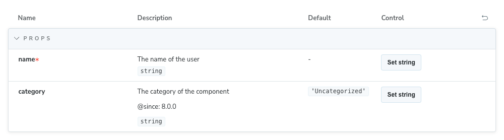
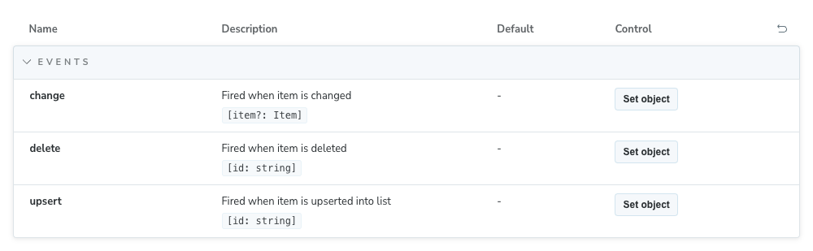
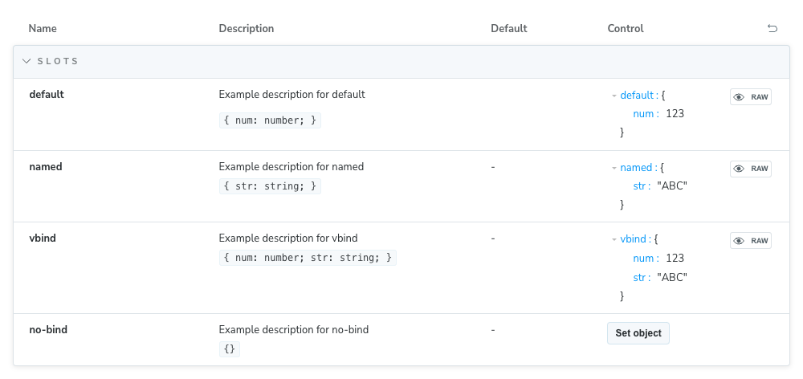
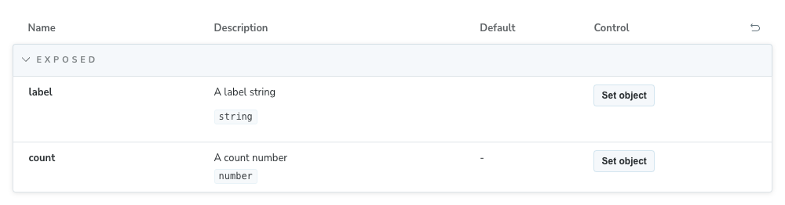

Storybook for Vue & Vite is a [framework](../../contribute/framework.mdx) that makes it easy to develop and test UI components in isolation for [Vue](https://vuejs.org/) applications built with [Vite](https://vitejs.dev/).

## Install

To install Storybook in an existing Vue project, run this command in your project's root directory:

<CodeSnippets path="create-command.md" variant="new-users" />

You can then get started [writing stories](/docs/get-started/whats-a-story/), [running tests](/docs/writing-tests/) and [documenting your components](/docs/writing-docs/). For more control over the installation process, refer to the [installation guide](/docs/install/).

### Compatible versions

<GetStartedVersions versions={[{
  name: 'Vue',
  range: '≥ 3',
  icon: '/images/logos/renderers/logo-vue.svg'
}, {
  name: 'Vite',
  range: '≥ 5',
  icon: '/images/logos/builders/vite.svg'
}]} />

## Run Storybook

To run Storybook for a particular project, run the following:

<CodeSnippets path="storybook-run-dev.md" />

To build Storybook, run:

<CodeSnippets path="build-storybook-production-mode.md" />

You will find the output in the configured `outputDir` (default is `storybook-static`).


## Configure

Storybook for Vue 3 with Vite is designed to work out of the box with minimal configuration. This section covers configuration options for the framework.

### Extending the Vue application

Storybook creates a [Vue 3 application](https://vuejs.org/api/application.html#application-api) for your component preview. When using global custom components (`app.component`), directives (`app.directive`), extensions (`app.use`), or other application methods, you will need to configure those in the `./storybook/preview.js|ts` file.

Therefore, Storybook provides you with a `setup` function exported from this package. This function receives your Storybook instance as a callback, which you can interact with and add your custom configuration.

```js title=".storybook/preview.js|ts"
import { setup } from '@storybook/vue3-vite';

setup((app) => {
  app.use(MyPlugin);
  app.component('my-component', MyComponent);
  app.mixin({
    // My mixin
  });
});
```

### Using `vue-component-meta`

<Callout variant="info">
  `vue-component-meta` is only available in Storybook ≥ 8. It is currently an opt-in, but it will become the default in a future version of Storybook.
</Callout>

[`vue-component-meta`](https://github.com/vuejs/language-tools/tree/master/packages/component-meta) is a tool maintained by the Vue team that extracts metadata from Vue components. Storybook can use it to generate the [controls](../../essentials/controls.mdx) for your stories and documentation. It's a more full-featured alternative to `vue-docgen-api` and is recommended for most projects.

If you want to use `vue-component-meta`, you can configure it in your `.storybook/main.js|ts` file:

```ts title=".storybook/main.ts"
import type { StorybookConfig } from '@storybook/vue3-vite';

const config: StorybookConfig = {
  framework: {
    name: '@storybook/vue3-vite',
    options: {
      docgen: 'vue-component-meta',
    },
  },
};

export default config;
```

`vue-component-meta` comes with many benefits and enables more documentation features, such as:

#### Support for multiple component types

`vue-component-meta` supports all types of Vue components (including SFC, functional, composition/options API components) from `.vue`, `.ts`, `.tsx`, `.js`, and `.jsx` files.

It also supports both default and named component exports.

#### Prop description and JSDoc tag annotations

To describe a prop, including tags, you can use JSDoc comments in your component's props definition:

```html title="YourComponent.vue"
<script setup lang="ts">
  interface MyComponentProps {
    /** The name of the user */
    name: string;
    /**
      * The category of the component
      *
      * @since 8.0.0
      */
    category?: string;
  }

  withDefaults(defineProps<MyComponentProps>(), {
    category: 'Uncategorized',
  });
</script>
```

The props definition above will generate the following controls:



#### Events types extraction

To provide a type for an emitted event, you can use TypeScript types (including JSDoc comments) in your component's `defineEmits` call:

```html title="YourComponent.vue"
<script setup lang="ts">
  type MyChangeEvent = 'change';

  interface MyEvents {
    /** Fired when item is changed */
    (event: MyChangeEvent, item?: Item): void;
    /** Fired when item is deleted */
    (event: 'delete', id: string): void;
    /** Fired when item is upserted into list */
    (e: 'upsert', id: string): void;
  }

  const emit = defineEmits<MyEvents>();
</script>
```

Which will generate the following controls:



#### Slots types extraction

The slot types are automatically extracted from your component definition and displayed in the controls panel.

```html title="YourComponent.vue"
<template>
  <slot :num="123"></slot>
  <br />
  <slot name="named" str="str"></slot>
  <br />
  <slot name="no-bind"></slot>
  <br />
  <slot name="vbind" v-bind="{ num: 123, str: 'str' }"></slot>
</template>

<script setup lang="ts"></script>
```

If you use `defineSlots`, you can describe each slot using JSDoc comments in your component's slots definition:

```ts
defineSlots<{
  /** Example description for default */
  default(props: { num: number }): any;
  /** Example description for named */
  named(props: { str: string }): any;
  /** Example description for no-bind */
  noBind(props: {}): any;
  /** Example description for vbind */
  vbind(props: { num: number; str: string }): any;
}>();
```

The definition above will generate the following controls:



#### Exposed properties and methods

The properties and methods exposed by your component are automatically extracted and displayed in the [Controls](../../essentials/controls.mdx) panel.

```html title="YourComponent.vue"
<script setup lang="ts">
  import { ref } from 'vue';

  const label = ref('Button');
  const count = ref(100);

  defineExpose({
    /** A label string */
    label,
    /** A count number */
    count,
  });
</script>
```

The definition above will generate the following controls:



#### Override the default configuration

If you're working with a project that relies on [`tsconfig references`](https://www.typescriptlang.org/docs/handbook/project-references.html) to link to other existing configuration files (e.g., `tsconfig.app.json`, `tsconfig.node.json`), we recommend that you update your [`.storybook/main.js|ts`](../../configure/index.mdx) configuration file and add the following:

```ts title=".storybook/main.ts"
import type { StorybookConfig } from '@storybook/vue3-vite';

const config: StorybookConfig = {
  framework: {
    name: '@storybook/vue3-vite',
    options: {
      docgen: {
        plugin: 'vue-component-meta',
        tsconfig: 'tsconfig.app.json',
      },
    },
  },
};

export default config;
```

<Callout variant="info">
  This is not a limitation of Storybook, but how `vue-component-meta` works. For more information, refer to the appropriate [GitHub issue](https://github.com/vuejs/language-tools/issues/3896).
</Callout>

Otherwise, you might face missing component types/descriptions or unresolvable import aliases like `@/some/import`.


## FAQ

### How do I manually install the Vue framework?

First, install the framework:

{/* prettier-ignore-start */}

<CodeSnippets path="vue3-vite-install.md" />

{/* prettier-ignore-end */}

Then, update your `.storybook/main.js|ts` to change the framework property:

{/* prettier-ignore-start */}

<CodeSnippets path="vue3-vite-add-framework.md" />

{/* prettier-ignore-end */}

### Storybook doesn't work with my Vue 2 project

[Vue 2 entered End of Life](https://v2.vuejs.org/lts/) (EOL) on December 31st, 2023, and is no longer maintained by the Vue team. As a result, Storybook no longer supports Vue 2. We recommend you upgrade your project to Vue 3, which Storybook fully supports. If that's not an option, you can still use Storybook with Vue 2 by installing the latest version of Storybook 7 with the following command:

{/* prettier-ignore-start */}

<CodeSnippets path="storybook-init-v7.md" />

{/* prettier-ignore-end */}


## API

### Options

You can pass an options object for additional configuration if needed:

{/* prettier-ignore-start */}

<CodeSnippets path="vue-vite-framework-options.md" />

{/* prettier-ignore-end */}

#### `builder`

Type: `Record<string, any>`

Configure options for the [framework's builder](../../api/main-config/main-config-framework.mdx#optionsbuilder). For this framework, available options can be found in the [Vite builder docs](../../builders/vite.mdx).

#### `docgen`

Type: `'vue-docgen-api' | 'vue-component-meta' | boolean`

Default: `'vue-docgen-api'`

Since: `8.0`

Choose which docgen tool to use when generating controls for your components. See [Using `vue-component-meta`](#using-vue-component-meta) for more information.

Set to `false` to disable docgen processing entirely for improved build performance.

```ts title=".storybook/main.ts"
import type { StorybookConfig } from '@storybook/vue3-vite';

const config: StorybookConfig = {
  framework: {
    name: '@storybook/vue3-vite',
    options: {
      docgen: false, // Disable docgen for better performance
    },
  },
};

export default config;
```

##### When to disable docgen

Disabling docgen can improve build performance for large projects, but [argTypes won't be inferred automatically](../../api/arg-types.mdx#automatic-argtype-inference), which will prevent features like [Controls](../../essentials/controls.mdx) and [docs](../../writing-docs/autodocs.mdx) from working as expected. To use those features, you will need to [define `argTypes` manually](../../api/arg-types.mdx#manually-specifying-argtypes).
