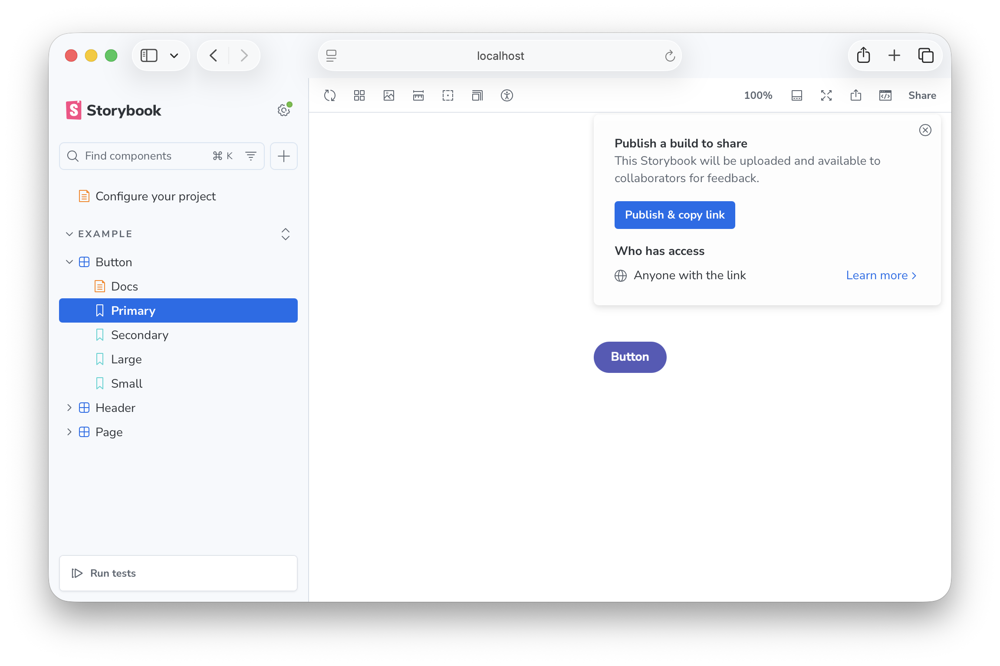

Once your components are built and tested, sharing your Storybook helps the rest of your team see how they work. You can publish your Storybook online, embed individual stories on other sites, integrate with design tools like Figma, or compose multiple Storybooks together.

## Quick sharing

The easiest way to share your Storybook is the Share button in the Storybook UI, which generates a link to your Storybook that you can share with anyone without needing to set up a hosting solution. Sharing is provided by Chromatic's [Visual Tests addon](https://storybook.js.org/addons/@chromatic-com/storybook).

## Publish

If you need more control over how your Storybook is shared, you can build Storybook as a static web app and deploy it anywhere you host static sites. A published Storybook gives developers, designers, PMs, and other stakeholders a shared URL to review work in progress without a local dev environment. You can host it for free on [Chromatic](https://www.chromatic.com/features/publish?utm_source=storybook_website&utm_medium=link&utm_campaign=storybook) for review and visual testing workflows, or on services like GitHub Pages, Netlify, or AWS S3.

Read more in [Publish Storybook](./publish-storybook.mdx).

## Embed

Once your Storybook is published and publicly accessible, you can embed individual stories in other pages. Storybook supports `<iframe>` embeds out of the box, and Storybooks published to Chromatic also work with the oEmbed standard, so stories render inline in Notion, Medium, and other oEmbed-compatible platforms.

Read more in [Embed stories](./embed.mdx).

## Design integrations

Storybook integrates with design tools to tighten the loop between design and implementation. Embed Storybook stories in Figma to compare designs against the real components, or embed Figma frames in Storybook to reference designs alongside the components that implement them.

Read more in [Design integrations](./design-integrations.mdx).

## Composition

Composition lets you browse components from any other Storybook—published or running locally—inside your own Storybook's sidebar. It works across renderers and tech stacks, which makes it useful for referencing a design system, auditing component usage across projects, or viewing multiple Storybooks in one place.

Design system and component library authors can [configure their package](./package-composition.mdx) so that consumers automatically see the library's stories alongside their own when they install it. That gives consumers usage documentation in context, without leaving their Storybook.

Read more in [Storybook Composition](./storybook-composition.mdx).