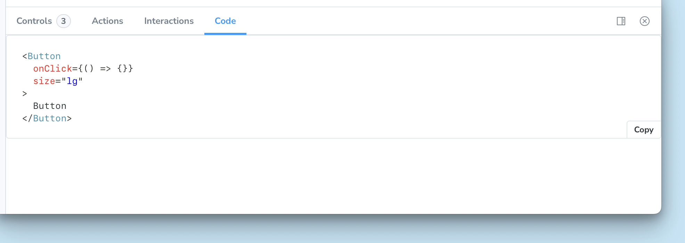

<Callout variant="info">

Code Panel is a replacement for the [Storysource addon](https://storybook.js.org/addons/@storybook/addon-storysource), which was [discontinued in Storybook 9](https://github.com/storybookjs/storybook/blob/next/MIGRATION.md#storysource-addon-removed).

</Callout>

The Code panel renders a story’s source code when viewing that story in the canvas. Any [args](../writing-stories/args.mdx) defined in the story are replaced with their values in the output.

## Usage

To enable the Code panel, set `parameters.docs.codePanel` to `true`. For most projects, this is best done in the `.storybook/preview.js|ts` file, to apply to all stories.

<CodeSnippets path="code-panel-enable-in-preview.md" />

You can also enable it at the component or story level:

<CodeSnippets path="code-panel-in-meta-and-story.md" />

## Configuration

Code panel renders the same snippet as the [Source docs block](../api/doc-blocks/doc-block-source.mdx), which is also used in [Autodocs](./autodocs.mdx) pages. The snippet is customizable and reuses the [Source configuration parameters](../api/doc-blocks/doc-block-source.mdx#source).
