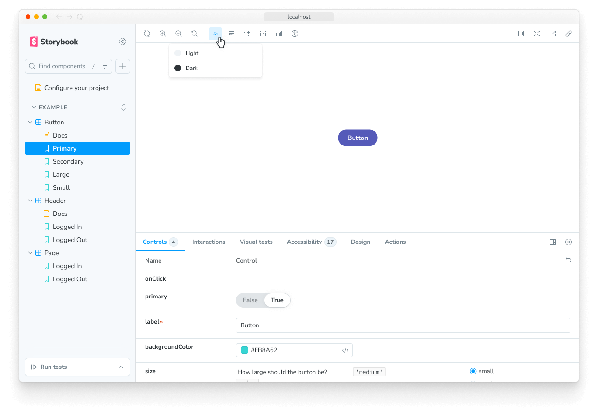

A story captures the rendered state of a UI component. It's an object with annotations that describe the component's behavior and appearance given a set of arguments.

Storybook uses the generic term arguments (args for short) when talking about React's `props`, Vue's `props`, Angular's `@Input`, and other similar concepts.

## Where to put stories

A component's stories are defined in a story file that lives alongside the component file. The story file is for development-only, and it won't be included in your production bundle. In your filesystem, it looks something like this:

```
components/
├─ Button/
│  ├─ Button.js | ts | jsx | tsx | vue | svelte
│  ├─ Button.stories.js | ts | jsx | tsx | svelte
```

## Component Story Format

<If renderer="svelte">

We define stories according to the [Component Story Format](../api/csf/index.mdx) (CSF), an ES6 module-based standard that is easy to write and portable between tools. You can also use the community-led [`Svelte CSF`](https://storybook.js.org/addons/@storybook/addon-svelte-csf) project, which provides a native Svelte authoring experience.

With Svelte CSF, the essential elements are the `defineMeta` function, which describes the component, and the `Story` component, which describes the stories. This pattern is different from the standard CSF, which uses a [default export](https://developer.mozilla.org/en-US/docs/Web/JavaScript/Reference/Statements/export#Using_the_default_export) and [named exports](https://developer.mozilla.org/en-US/docs/Web/JavaScript/Reference/Statements/export#Using_named_exports) to apply the same concepts.

</If>

<If notRenderer="svelte">

We define stories according to the [Component Story Format](../api/csf/index.mdx) (CSF), an ES6 module-based standard that is easy to write and portable between tools.

The key ingredients are the meta (or [default export](https://developer.mozilla.org/en-US/docs/Web/JavaScript/Reference/Statements/export#Using_the_default_export)) that describes the component, and [named exports](https://developer.mozilla.org/en-US/docs/Web/JavaScript/Reference/Statements/export#Using_named_exports) that describe the stories.

</If>

### Default export

<If renderer="svelte">

The `defineMeta` function in Svelte CSF controls how Storybook lists your stories and provides information used by addons. If you're using standard CSF instead, use the _default_ export to achieve the same result:

<CodeSnippets path="button-story-default-export-with-component.md" />

</If>

<If notRenderer="svelte">

The _default_ export metadata controls how Storybook lists your stories and provides information used by addons. For example, here's the meta for a story file `Button.stories.js|ts`:

<CodeSnippets path="button-story-default-export-with-component.md" />

<Callout variant="info">

Starting with Storybook version 7.0, story titles are analyzed statically as part of the build process. The _default_ export must contain a `title` property that can be read statically or a `component` property from which an automatic title can be computed. Using the `id` property to customize your story URL must also be statically readable.

</Callout>

</If>

### Defining stories

<If renderer="svelte">

If you're using Svelte CSF, define your stories with the `Story` component, otherwise use the named exports of a standard CSF file. We recommend you use UpperCamelCase for your story exports. Here's how to render `Button` in the "primary" state and export a story called `Primary`:

</If>

<If notRenderer="svelte">

Use the _named_ exports of a CSF file to define your component's stories. We recommend you use UpperCamelCase for your story exports. Here's how to render `Button` in the "primary" state and export a story called `Primary`:

</If>

<CodeSnippets path="button-story-with-args.md" />

<If renderer="svelte">

Unlike regular CSF, when using Svelte CSF, you cannot use [`args`](./args.mdx) for children. Instead, you pass children in-between the opening and closing `Story` tags and it will be passed to the component as the `children` snippet prop.

```svelte title="Alert.stories.svelte"
<script module>
  import { defineMeta } from '@storybook/addon-svelte-csf';

  import Alert from './Alert.svelte';

  const { Story } = defineMeta({
    component: Alert,
  });
</script>

{/* Renders <Alert>Alert text</Alert> */}
<Story name="Alert with children">
  Alert text
</Story>
```

If you want to render the children as the entire story itself, you can use the `asChild` prop of the `Story` component, which will ignore the default component rendering and render the children directly.

```svelte title="Button.stories.svelte"
<Story
  name="Default Button in alert"
  asChild
/>
  <Alert>
    Alert text
    <Button />
  </Alert>
</Story>
```

<Callout variant="warning">

Features which require `args`, like [Controls](../essentials/controls.mdx), will not work when using `asChild`. You can customize the rendering of a story and retain the ability to use `args` by using a [custom render function](#custom-rendering).

</Callout>

</If>

### Custom rendering

<If renderer="svelte">

By default, stories will render the component defined in the `defineMeta` call (for Svelte CSF) or in the default export (for CSF), with the `args` passed to it.

If you need to customize the rendering of your story, you can provide a snippet (for Svelte CSF) or a `render` function (for CSF) that accepts `args` and renders whatever you need.

For example, if you want to render a `Button` inside an `Alert`:

```svelte title="Button.stories.svelte"
<Story
  name="Primary in alert"
  args={{
    label: 'Button',
    primary: true,
  }}>
  {#snippet template(args)}
    <Alert>
      Alert text
      <Button {...args} />
    </Alert>
  {/snippet}
</Story>
```

<Callout variant="info">

The template snippet or `render` function spreads `args` onto the Button component. This ensures that features like [Controls](../essentials/controls.mdx) will work as expected, allowing you to dynamically change the Button's properties in the Storybook UI.

</Callout>

You can re-use the same render function across stories by applying it at the meta level. For Svelte CSF, define the template snippet outside of the story and assign it to the `render` property of the `defineMeta` function. For CSF, define a `render` function in the meta (or default export).

```svelte title="Button.stories.svelte"
<script module>
  import { defineMeta } from '@storybook/addon-svelte-csf';
  import Button from './Button.svelte';

  const { Story } = defineMeta({
    component: Button,
    render: template,
  });
</script>

{#snippet template(args)}
  <Alert>
    Alert text
    <Button {...args} />
  </Alert>
{/snippet}

<Story name="Default in alert" args={{ label: 'Button' }} />

<Story name="Primary in alert" args={{ label: 'Button', primary: true }} />
```

Whatever you define at the meta level can be overridden at the story level, so you can still customize the rendering of individual stories if needed.

Finally, `render` functions and template snippets receive a second `context` argument, which contains all other details for the story, including [`parameters`](./parameters.mdx), [`globals`](../essentials/toolbars-and-globals.mdx), and more.

</If>

<If notRenderer="svelte">

By default, stories will render the component defined in the meta (or default export), with the `args` passed to it. If you need to render something else, you can provide a function to the `render` property that returns the desired output.

For example, if you want to render a `Button` inside an `Alert`, you can define a custom render function like this:

<CodeSnippets path="render-custom-in-story.md" />

<Callout variant="info">

The `render` function spreads `args` onto the Button component. This ensures that features like [Controls](../essentials/controls.mdx) will work as expected, allowing you to dynamically change the Button's properties in the Storybook UI.

</Callout>

You can re-use the same render function across stories by applying it at the meta level:

<CodeSnippets path="render-custom-in-meta.md" />

Whatever you define at the meta level can be overridden at the story level, so you can still customize the rendering of individual stories if needed.

Finally, `render` functions receive a second `context` argument, which contains all other details for the story, including [`parameters`](./parameters.mdx), [`globals`](../essentials/toolbars-and-globals.mdx), and more.

</If>

<If renderer="react">

#### Working with React Hooks

[React Hooks](https://react.dev/reference/react) are convenient helper methods to create components using a more streamlined approach. You can use them while creating your component's stories if you need them, although you should treat them as an advanced use case. We **recommend** [args](./args.mdx) as much as possible when writing your own stories. As an example, here's a story that uses React Hooks to change the button's state:

<CodeSnippets path="button-story.md" />

</If>

<If renderer="solid">

#### Working with Solid Signals

[Solid Signals](https://docs.solidjs.com/concepts/intro-to-reactivity) are convenient helper methods to create components using a more streamlined approach. You can use them while creating your component's stories if you need them, although you should treat them as an advanced use case. We **recommend** [args](./args.mdx) as much as possible when writing your own stories. As an example, here's a story that uses Solid Signals to change the button's state:

<CodeSnippets path="button-story.md" />

</If>

### Rename stories

You can customize the display name of a story by adding a `name` property to the story object. Storybook uses the export name by default.

<If renderer="svelte">

With Svelte CSF, the `name` property is typically descriptive enough. However, because `name` determines the export name (which must be unique within a file), you may occasionally need the `exportName` property to resolve conflicts or to provide a more useful named export for [portable stories](../api/portable-stories/portable-stories-vitest.mdx).

</If>

<CodeSnippets path="button-story-rename-story.md" />

{/* Maintaining a prior heading */}

<a id="using-args" />
<a id="custom-rendering" />

## Writing stories with args

You can have multiple stories per component, and those stories can build upon one another. For example, we can add Secondary and Tertiary stories based on our Primary story from above.

<CodeSnippets path="button-story-using-args.md" />

You can also import args to reuse when writing stories for other components. This is helpful when building composite components. For example, if we make a `ButtonGroup` story, we might remix two stories from its child component `Button`:

<CodeSnippets path="button-group-story.md" />

When Button's signature changes, you only need to change Button's stories to reflect the new schema, and ButtonGroup's stories will automatically be updated. This pattern allows you to reuse your data definitions across the component hierarchy, making your stories more maintainable.

Each of the args from the story function are live editable using Storybook's [Controls](../essentials/controls.mdx) panel. Your team can dynamically change components in Storybook to stress test and find edge cases.

<Video src="../_assets/writing-stories/addon-controls-demo-optimized.mp4" />

You can also use the Controls panel to edit or save a new story after adjusting its control values.

<Video src="../_assets/get-started/edit-story-from-controls-optimized.mp4" />

<If renderer="svelte">

<Callout variant="info">

Editing and saving stories from the Controls panel is not supported with Svelte CSF. To use this feature with Svelte, you must use Storybook's [Component Story Format](../api/csf/index.mdx).

</Callout>

</If>

Addons can enhance args. For instance, [Actions](../essentials/actions.mdx) auto-detects which args are callbacks and appends a logging function to them. That way, interactions (like clicks) get logged in the actions panel.

<Video src="../_assets/writing-stories/addon-actions-demo-optimized.mp4" />

## Using the play function

Storybook's `play` function lets you test component scenarios that otherwise require user intervention. It's a small code snippet that executes once your story renders. For example, if you want to validate a form component, you could write the following story using the `play` function to check how the component responds when filling in the inputs with information:

<CodeSnippets path="login-form-with-play-function.md" />

You can interact with and debug your story's play function in the [interactions panel](../writing-tests/interaction-testing.mdx#debugging-interaction-tests).

For more details, see [Play function](./play-function.mdx).

## Using parameters

Parameters are Storybook's method of defining static metadata for stories. A story's parameters can be used to provide configuration to various addons at the level of a story or group of stories.

For instance, suppose you want to test your Button component against a different set of backgrounds than the other components in your app. You might add a component-level `backgrounds` parameter:

<CodeSnippets path="parameters-in-meta.md" />



This parameter instructs the backgrounds feature to reconfigure itself whenever a Button story is selected. Most features and addons are configured via a parameter-based API and can be influenced at a [global](./parameters.mdx#global-parameters), [component](./parameters.mdx#component-parameters), and [story](./parameters.mdx#story-parameters) level.

For more details, see [Parameters](./parameters.mdx).

## Using decorators

Decorators are a mechanism to wrap a component in arbitrary markup when rendering a story. Components are often created with assumptions about 'where' they render. Your styles might expect a theme or layout wrapper, or your UI might expect specific context or data providers.

A simple example is adding padding to a component's stories. Accomplish this using a decorator that wraps the stories in a `div` with padding, like so:

<CodeSnippets path="button-story-component-decorator.md" />

Decorators [can be more complex](./decorators.mdx#context-for-mocking) and are often provided by [addons](../configure/user-interface/storybook-addons.mdx). You can also configure decorators at the [story](./decorators.mdx#story-decorators), [component](./decorators.mdx#component-decorators), and [global](./decorators.mdx#global-decorators) level.

For more details, see [Decorators](./decorators.mdx).

## Stories for two or more components

Sometimes you may have two or more components created to work together. For instance, if you have a parent `List` component, it may require child `ListItem` components.

<CodeSnippets path="list-story-starter.md" />

In such cases, it makes sense to [customize the rendering](#custom-rendering) to output the `List` component with different numbers of `ListItem` children.

<CodeSnippets path="list-story-expanded.md" />

You can also reuse _story data_ from the child `ListItem` in your `List` component. That's easier to maintain because you don't have to update it in multiple places.

<CodeSnippets path="list-story-reuse-data.md" />

<Callout variant="info" icon="💡">

There are disadvantages in writing stories like this as you cannot take full advantage of the args mechanism and composing args as you build even more complex composite components. For more discussion, see the [multi component stories](./stories-for-multiple-components.mdx) workflow documentation.

</Callout>

## Next steps

Now that you understand the basics of writing stories, explore the rest of the story APIs:

- [**Args**](./args.mdx) to learn how args work in detail
- [**TypeScript**](./typescript.mdx) to write type-safe stories
- [**Choosing the right API**](./choosing-the-right-api.mdx) to pick the right approach for your use case
- [**Naming and hierarchy**](./naming-components-and-hierarchy.mdx) to organize your stories in the sidebar
- [**Tags**](./tags.mdx) to control which stories appear where
- [**Mocking**](./mocking-data-and-modules/index.mdx) to isolate components from external dependencies
