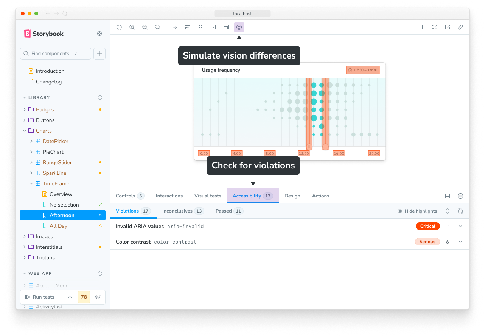

Web accessibility is the practice of making websites and apps accessible and inclusive to all people, regardless of ability or the technology they’re using. That means supporting requirements such as keyboard navigation, screen reader support, sufficient color contrast, etc.

Accessibility is not only the right thing to do, but it is increasingly mandated. For example, the [European accessibility act](https://ec.europa.eu/social/main.jsp?catId=1202) is scheduled to go into law in June 2025. Similarly in the US, laws like the [Americans with Disabilities Act (ADA)](https://www.ada.gov/) and [Section 508 of the Rehabilitation Act](https://www.section508.gov/) apply to many public-facing services. Many of these laws are based on [WCAG](https://www.w3.org/WAI/standards-guidelines/wcag/), a standardized guideline for making web content accessible.

Accessibility tests audit the rendered DOM against a set of heuristics based on WCAG rules and other industry-accepted best practices. They act as the first line of QA to catch blatant accessibility violations.

## Install the addon

Storybook provides an Accessibility (a11y) addon to help ensure the accessibility of your components. It is built on top of Deque’s [axe-core library](https://github.com/dequelabs/axe-core), which automatically catches [up to 57% of WCAG issues](https://www.deque.com/blog/automated-testing-study-identifies-57-percent-of-digital-accessibility-issues/).

Run this command to install and configure the addon in your project:

{/* prettier-ignore-start */}

<CodeSnippets path="addon-a11y-add.md" />

{/* prettier-ignore-end */}

<Callout variant="info">

Storybook's [`add`](../api/cli-options.mdx#add) command automates the addon's installation and setup. To install it manually, see our [documentation](../addons/install-addons.mdx#manual-installation) on how to install addons.

</Callout>

Your Storybook will now include some features to check the accessibility of your components, including a button in the toolbar to simulate different vision impairments and an Accessibility addon panel to check for violations.



### Integration with Vitest addon

The accessibility addon is designed to integrate with the [Vitest addon](./integrations/vitest-addon.mdx), so that you can [run accessibility tests](#run-accessibility-tests) alongside your component tests.

**Automatic configuration:**

When you run `npx storybook add @storybook/addon-vitest` in a project that already has `@storybook/addon-a11y` installed, the `addon-a11y-addon-test` automigration will automatically:

1. Update `.storybook/vitest.setup.ts` to include the Accessibility addon's annotations
2. Configure accessibility tests to run alongside component tests

This allows you to run accessibility tests automatically with your component tests in both the Storybook UI and in CI environments.

**Manual configuration:**

If you need to configure this manually (for example, if the automigration was skipped), you can add the following to your `.storybook/vitest.setup.ts`:

```ts
import * as previewAnnotations from '@storybook/preview-api';
// Replace your-renderer with the renderer you are using, e.g. react, svelte, vue3, etc.
import { setProjectAnnotations } from '@storybook/your-renderer';
import * as a11yAddonAnnotations from '@storybook/addon-a11y/preview';

const annotations = setProjectAnnotations([
  previewAnnotations,
  a11yAddonAnnotations,
]);

// Run Storybook's beforeAll hook
beforeAll(annotations.beforeAll);
```

<If renderer="react">

<Callout variant="info">

If you are using [CSF Factories](../api/csf/csf-next.mdx) for _all_ of the stories in your Storybook, you do not need to update `.storybook/vitest.setup.ts`.

</Callout>

</If>

## Check for violations

When you navigate to a story, automated accessibility checks are run and the results are reported in the Accessibility addon panel. 

The results are broken down into three sub-tabs:

- **Violations** are known violations of WCAG rules and best practices
- **Passes** are known non-violations
- **Incomplete** highlights areas that you should confirm manually because they could not be checked automatically

## Configure

Because the addon is built on top of `axe-core`, much of the configuration available maps to its available options:

| Property                  | Default     | Description                                                                                                                                                                         |
| ------------------------- | ----------- | ----------------------------------------------------------------------------------------------------------------------------------------------------------------------------------- |
| `parameters.a11y.context` | `'body'`    | [Context](https://github.com/dequelabs/axe-core/blob/develop/doc/API.md#context-parameter) passed to `axe.run`. Defines which elements to run checks against.                       |
| `parameters.a11y.config`  | (see below) | Configuration passed to [`axe.configure()`](https://github.com/dequelabs/axe-core/blob/develop/doc/API.md#api-name-axeconfigure). Most commonly used to [configure individual rules](#individual-rules). |
| `parameters.a11y.options` | `{}`        | [Options](https://github.com/dequelabs/axe-core/blob/develop/doc/API.md#options-parameter) passed to `axe.run`. Can be used to adjust the rulesets checked against.                 |
| `parameters.a11y.test`    | `undefined` | Determines test behavior when run with the Vitest addon. [More details below](#test-behavior).                                                                                      |
| `globals.a11y.manual`     | `undefined` | Set to `true` to prevent stories from being automatically analyzed when visited. [More details below](#disable-automated-checks)                                                    |

<details>
<summary>Default `parameters.a11y.config`</summary>

By default, Storybook disables the [region rule](https://dequeuniversity.com/rules/axe/4.10/region?application=RuleDescription), which does not typically apply to components in stories and can lead to false negatives.

```js
{
  rules: [
    {
      id: 'region',
      enabled: false,
    }
  ]
}
```

</details>

We’ll share examples to show how to use some of these configuration properties.

Here, they are applied to all stories in a project, in `.storybook/preview.ts`:

<CodeSnippets path="addon-a11y-config-in-preview.md" />

You can also apply the configuration for all stories in a file (in the `meta`) or an individual story:

<CodeSnippets path="addon-a11y-config-in-meta-and-story.md" />

### Rulesets

The addon uses the `axe-core` library to run accessibility checks. By default, it runs a set of rules that are based on the WCAG 2.0 and 2.1 guidelines, as well as some best practices:

- [WCAG 2.0 Level A & AA Rules](https://github.com/dequelabs/axe-core/blob/develop/doc/rule-descriptions.md#wcag-20-level-a--aa-rules)
- [WCAG 2.1 Level A & AA Rules](https://github.com/dequelabs/axe-core/blob/develop/doc/rule-descriptions.md#wcag-21-level-a--aa-rules)
- [Best Practices Rules](https://github.com/dequelabs/axe-core/blob/develop/doc/rule-descriptions.md#best-practices-rules)

You can find a breakdown of these rulesets, as well as the other rulesets available in [axe-core’s documentation](https://github.com/dequelabs/axe-core/blob/develop/doc/rule-descriptions.md#wcag-2x-level-aaa-rules).

To change the rules that are checked against (e.g. to check against WCAG 2.2 AA or WCAG 2.x AAA rules), use the [`runOnly` option](https://github.com/dequelabs/axe-core/blob/develop/doc/API.md#options-parameter-examples):

<CodeSnippets path="addon-a11y-config-rulesets-in-preview.md" />

### Individual rules

You can also enable, disable, or configure individual rules. This can be done in the `config` property of the `parameters.a11y` object. For example:

<CodeSnippets path="addon-a11y-config-rules-in-story.md" />

### Test behavior

You can configure accessibility tests with the `parameters.a11y.test` [parameter](../writing-stories/parameters.mdx), which determines the behavior of accessibility tests for a story when run with either the [Vitest addon](./integrations/vitest-addon.mdx) or the [test-runner](./integrations/test-runner.mdx). The parameter accepts three values:

| Value     | Description                                                                              |
| --------- | ---------------------------------------------------------------------------------------- |
| `'off'`   | Do not run accessibility tests (you can still manually verify via the addon panel)       |
| `'todo'`  | Run accessibility tests; violations return a warning in the Storybook UI                 |
| `'error'` | Run accessibility tests; violations return a failing test in the Storybook UI and CLI/CI |

Like other parameters, you can define it at the project level in `.storybook/preview.js|ts`, the component level in the default export of the story file, or the individual story level. For example, to fail on accessibility tests for all stories in a file except one:

<CodeSnippets path="addon-a11y-parameter-example.md" />

<Callout variant="info">

Why is the value called "todo" instead of "warn"? This value is intended to serve as a literal `TODO` in your codebase. It can be used to mark stories that you know have accessibility issues but are not ready to fix yet. This way, you can keep track of them and address them later.

The `'off'` value should only be used for stories that do not need to be tested for accessibility, such as one used to demonstrate an antipattern in a component's usage.

You can also [disable individual rules](#individual-rules) when they are not applicable to your use case.

</Callout>

### Excluded elements

Sometimes, it may be necessary to exclude certain elements from the accessibility checks. For this, you can define a custom [context](https://github.com/dequelabs/axe-core/blob/develop/doc/API.md#context-parameter) to select which elements are included (or excluded) when running checks. For example, this story will ignore elements with the class `no-a11y-check`:

<CodeSnippets path="addon-a11y-config-context-in-story.md" />

### Disable automated checks

When you disable automated accessibility checks, the addon will not run any tests when you navigate to a story or when you [run the tests with the Vitest addon](#run-accessibility-tests). You can still manually trigger checks in the Accessibility addon panel. This is useful for stories that are not meant to be accessible, such as those demonstrating an antipattern or a specific use case.

<If renderer="svelte">

  If you are using Svelte CSF, you can turn off automated accessibility checks for stories or components by adding globals to your story or adjusting the `defineMeta` function with the required configuration. With a regular CSF story, you can add the following to your story's export or component's default export:

</If>

<If notRenderer={['svelte']}>

  Disable automated accessibility checks for stories or components by adding the following globals to your story's export or component's default export:

</If>

<CodeSnippets path="addon-a11y-disable.md" />

## Run accessibility tests

### With the Vitest addon

If you're using the [Vitest addon](./integrations/vitest-addon.mdx), you can run your accessibility tests, as part of component tests, in these ways:

- [In the Storybook UI](./integrations/vitest-addon.mdx#storybook-ui)
- [In CI environments](./integrations/vitest-addon.mdx#in-ci)

To run accessibility tests in the Storybook UI, first expand the testing widget in the sidebar and check the Accessibility checkbox. Now, when you press the Run component tests button, the accessibility tests will be run along with any other tests you have configured.


After running the tests, you will see the results in the sidebar, which will add a test status indicator next to each story that was tested. You can press on these indicators to open a menu with the Accessibility test result. Pressing on that result will navigate to that story and open the Accessibility panel, where you view details about each violation and suggestions toward how to fix them.


If any of your tests have warnings or failures, the testing widget will show the number of warnings and failures. You can press on these to filter the stories in the sidebar to only show those with warnings or failures.

In CI, accessibility tests are run automatically for stories with [`parameters.a11y.test = 'error'`](#test-behavior) when you run the Vitest tests.

### With the test-runner

If you're using the [test-runner](./integrations/test-runner.mdx), you can run your accessibility tests in the terminal or in CI environments.

Accessibility tests are included in your test run when you have the Accessibility addon installed and [`parameters.a11y.test`](#test-behavior) is set to a value other than `'off'`.

## Debug accessibility violations

When you run accessibility tests, the results are reported in the Storybook UI. You can click on a violation to see more details about it, including the rule that was violated and suggestions for how to fix it.

You can also toggle on highlighting in the Storybook UI to see which elements are causing the violation, and click on a highlighted element to see the violations details in a popover menu.


## Automate with CI

When you run your accessibility tests with the Vitest addon, automating them is as simple as running them in your CI environment. For more information, please see the [testing in CI guide](./in-ci.mdx).

<Callout variant="warning">

Accessibility tests will only produce errors in CI if you have set [`parameters.a11y.test`](#test-behavior) to `'error'`. If you set it to `'todo'`, there will be no accessibility-related errors, warnings, or output in CI, but you can still see the results as warnings in the Storybook UI when you run the tests locally.

</Callout>

If you cannot use the Vitest addon, you can still run your tests in CI using the [test-runner](./integrations/test-runner.mdx).

## Recommended workflow

You can use configuration to progressively work toward a more accessible UI by combining multiple test behaviors. For example, you can start with `'error'` to fail on accessibility violations, then switch to `'todo'` to mark components that need fixing, and finally remove the todos once all stories pass accessibility tests:

1. Update your project configuration to fail on accessibility violations by setting [`parameters.a11y.test`](#test-behavior) to `'error'`. This ensures that all new stories are tested to meet accessibility standards.
    
   <CodeSnippets path="addon-a11y-parameter-error-in-preview.md" />
    
2. You will likely find that many components have accessibility failures (and maybe feel a bit overwhelmed!).
3. Take note of the components with accessibility issues and temporarily reduce their failures to warnings by applying the `'todo'` parameter value. This keeps accessibility issues visible while not blocking development. This is also a good time to commit your work as a baseline for future improvements.
    
   <CodeSnippets path="addon-a11y-parameter-todo-in-meta.md" />
    
4. Pick a good starting point from the components you just marked `'todo'` (we recommend something like Button, for its simplicity and likelihood of being used within other components). Fix the issues in that component using the suggestions in the addon panel to ensure it passes accessibility tests, then remove the parameter.
    
   <CodeSnippets path="addon-a11y-parameter-remove.md" />
    
5. Pick another component and repeat the process until you've covered all your components and you're an accessibility hero!

## FAQ

### What’s the difference between browser-based and linter-based accessibility tests?

Browser-based accessibility tests, like those found in Storybook, evaluate the rendered DOM because that gives you the highest accuracy. Auditing code that hasn't been compiled yet is one step removed from the real thing, so you won't catch everything the user might experience.

### Why are my tests failing in different environments?

With the [Vitest addon](./integrations/vitest-addon.mdx), your tests run in Vitest using your project's configuration with Playwright's Chromium browser. This can lead to inconsistent test results reported in the Storybook UI or CLI. The inconsistency can be due to `axe-core` reporting different results in different environments, such as browser versions or configurations. If you encounter this issue, we recommend reaching out using the default communication channels (e.g., [GitHub discussions](https://github.com/storybookjs/storybook/discussions/new?category=help), [Github issues](https://github.com/storybookjs/storybook/issues/new?template=bug_report.yml)).

### The addon panel does not show expected violations

Modern React components often use asynchronous techniques like [Suspense](https://react.dev/reference/react/Suspense) or [React Server Components (RSC)](https://react.dev/reference/rsc/server-components) to handle complex data fetching and rendering. These components don’t immediately render their final UI state. Storybook doesn’t inherently know when an async component has fully rendered. As a result, the a11y checks sometimes run too early, before the component finishes rendering, leading to false negatives (no reported violations even if they exist).

To address this issue, we have introduced a feature flag: `developmentModeForBuild`. This feature flag allows you to set `process.env.NODE_ENV` to `'development'` in built Storybooks, enabling development-related optimizations that are typically disabled in production builds. One of those development optimizations is React’s [`act` utility](https://react.dev/reference/react/act), which helps ensure that all updates related to a test are processed and applied before making assertions, like a11y checks.

To enable this feature flag, add the following configuration to your `.storybook/main.js|ts` file:

<CodeSnippets path="main-config-features-development-mode-for-build.md" />

**More testing resources**

* [Vitest addon](./integrations/vitest-addon.mdx) for running tests in Storybook
* [Interaction testing](./interaction-testing.mdx) for user behavior simulation
* [Visual testing](./visual-testing.mdx) for appearance
* [Snapshot testing](./snapshot-testing.mdx) for rendering errors and warnings
* [Test coverage](./test-coverage.mdx) for measuring code coverage
* [CI](./in-ci.mdx) for running tests in your CI/CD pipeline
* [End-to-end testing](./integrations/stories-in-end-to-end-tests.mdx) for simulating real user scenarios
* [Unit testing](./integrations/stories-in-unit-tests.mdx) for functionality
* [Test runner](./integrations/test-runner.mdx) to automate test execution
