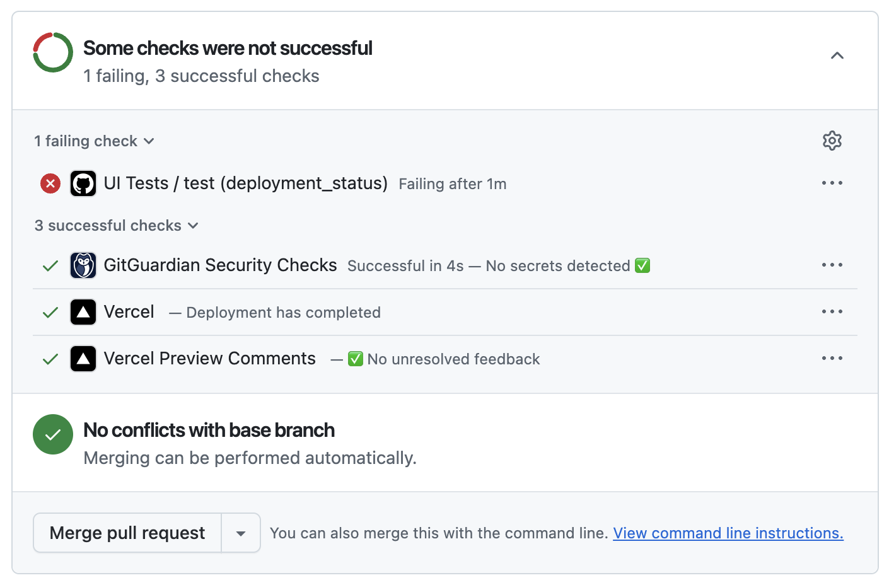
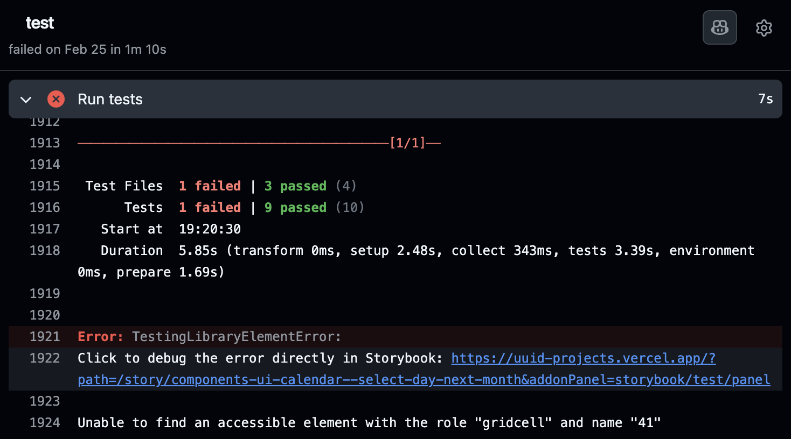

The [Vitest addon](./integrations/vitest-addon/index.mdx) is great for automating your UI tests within Storybook. To have full confidence in your work, backed by tests, you need to run those automated tests in your continuous integration (CI) environment.

Thankfully, that’s quite easy!

<Callout variant="info">

If you cannot use the Vitest addon in your project, you can still run your stories as tests in CI using the test-runner. Follow the instructions in the [test-runner documentation](./integrations/test-runner.mdx#set-up-ci-to-run-tests) to set up the test-runner to run in CI in your project.

</Callout>

## Set up Storybook tests in CI

Running Storybook tests in CI is very similar to running them via CLI on your local machine: you run the same command, just in a different place.

Let’s go step-by-step to set things up.

### 1. Define `package.json` script

For convenience, define a script in your `package.json` to run the Storybook tests. This is the same command you would run locally, but it’s useful to have it in your CI workflow.

```json title="package.json"
{ 
  "scripts": {
    "test-storybook": "vitest --project=storybook"
  }
}
```

This script calls the `vitest` CLI command and restricts it to the “storybook” project defined in your Vitest config, which was created when you installed the Vitest addon. (If you’ve renamed the project, adjust the script above accordingly.) You can also pass any additional `vitest` [CLI options](https://vitest.dev/guide/cli.html#options) you may require.

### 2. Add a new CI workflow

Next, we’ll create a new “UI Tests” workflow to run in our CI environment. You may also adjust an existing workflow, if you prefer.

Here are some example configurations for popular CI providers:

<details>
<summary>GitHub Actions</summary>
    
Create a file in the root of your repo, `.github/workflow/test-ui.yml`:

```yaml title=".github/workflows/test-ui.yml"
name: UI Tests

on: [push]

jobs:
  test:
    runs-on: ubuntu-latest
    container:
      # Make sure to grab the latest version of the Playwright image
      # https://playwright.dev/docs/docker#pull-the-image
      image: mcr.microsoft.com/playwright:v1.52.0-noble
    steps:
      - uses: actions/checkout@v4
      
      - name: Setup Node
        uses: actions/setup-node@v4
        with:
          node-version: 22.12.0
      
      - name: Install dependencies
        run: npm ci
      
      - name: Run tests
        run: npm run test-storybook
```
</details>

<details>
<summary>GitLab Pipelines</summary>

Create a file in the root of your repo, `.gitlab-ci.yml`:

```yaml title=".gitlab-ci.yml"    
image: node:jod

stages:
  - UI_Tests

cache:
  key: $CI_COMMIT_REF_SLUG-$CI_PROJECT_DIR
  paths:
    - .npm/

before_script:
  # Install dependencies
  - npm ci
Test:
  stage: UI_Tests
  # Make sure to grab the latest version of the Playwright image
  # https://playwright.dev/docs/docker#pull-the-image
  image: mcr.microsoft.com/playwright:v1.52.0-noble
  script:
    - npm run test-storybook
```
</details>

<details>
<summary>Bitbucket Pipelines</summary>

Create a file in the root of your repo, `bitbucket-pipelines.yml`:

```yaml title="bitbucket-pipelines.yml"
image: node:jod

definitions:
  caches:
    npm: $HOME/.npm

pipelines:
  default:
    - stage:
        name: "UI Tests"
        steps:
          - step:
              name: "Run Tests"
              # Make sure to grab the latest version of the Playwright image
              # https://playwright.dev/docs/docker#pull-the-image
              image: mcr.microsoft.com/playwright:v1.52.0-noble
              caches:
                - npm
                - node
              script:
                # Install dependencies
                - npm ci
                - npm run test-storybook
```
</details>

<details>
<summary>Circle CI</summary>

Create a file in the root of your repo, `.circleci/config.yml`:

```yaml title=".circleci/config.yml"
version: 2.1
    
executors:
  ui-testing:
    docker:
      # Make sure to grab the latest version of the Playwright image
      # https://playwright.dev/docs/docker#pull-the-image
      - image: mcr.microsoft.com/playwright:v1.52.0-noble
    working_directory: ~/repo

jobs:
  Test:
    executor: ui-testing
    steps:
      - checkout
      - restore_cache:
          keys:
            - v1-dependencies-{{ checksum "package-lock.json" }}
            - v1-dependencies-
      # Install dependencies
      - run: npm ci
      - run: npm run test-storybook
      - save_cache:
          name: Save NPM cache
          paths:
            - ~/.npm
          key: v1-dependencies-{{ checksum "package-lock.json" }}

workflows:
  UI_Tests:
    jobs:
      - Test
```
</details>

<details>
<summary>Travis CI</summary>

Create a file in the root of your repo, `.travis.yml`:

```yaml title=".travis.yml"
language: node_js
os: linux
dist: jammy

node_js:
  - 20

before_script:
  # Install dependencies and Playwright browsers so Vitest browser mode can run story tests
  - npm ci && npm run playwright install chromium --with-deps

cache: npm

jobs:
  include:
    - stage: "UI Tests"
      name: "Run tests"
      script: npm run test-storybook
```
</details>

<details>
<summary>Jenkins</summary>

Create a file in the root of your repo, `JenkinsFile`:

```groovy title="JenkinsFile"
pipeline {
  agent any
  tools {nodejs "node"}

  stages {
    stage('UI Tests'){
      agent {
        docker {
          /*
           * Make sure to grab the latest version of the Playwright image
           * https://playwright.dev/docs/docker#pull-the-image
           */
          image 'mcr.microsoft.com/playwright:v1.52.0-noble'
          reuseNode true
        }
      }
      steps {
        /* Install dependencies */
        sh 'npm ci'
        sh "npm run test-storybook"
      }
    }
  }
}
```
</details>

<details>
<summary>Azure Pipelines</summary>

Create a file in the root of your repo, `azure-pipelines.yml`:

```yaml title="azure-pipelines.yml"
trigger:
  - main

pool:
  vmImage: "ubuntu-latest"

stages:
  - stage: UI_Tests
    displayName: "UI Tests"
    jobs:
      - job: Test
        displayName: "Storybook tests"
        # Make sure to grab the latest version of the Playwright image
        # https://playwright.dev/docs/docker#pull-the-image
        container: mcr.microsoft.com/playwright:v1.52.0-noble
        variables:
          npm_config_cache: $(Pipeline.Workspace)/.npm
        steps:
          - task: UseNode@1
            displayName: "Install Node.js"
            inputs:
              version: "22.12.0"
          - task: Cache@2
            displayName: "Install and cache dependencies"
            inputs:
              key: 'npm | "$(Agent.OS)" | package-lock.json'
              restoreKeys: |
                npm | "$(Agent.OS)"
              path: $(npm_config_cache)
          - script: npm ci
            condition: ne(variables.CACHE_RESTORED, 'true')
          - task: CmdLine@2
            displayName: "Run tests"
            inputs:
              script: npm run test-storybook
```
</details> 

<Callout variant="info">

Storybook Test uses Playwright to render your stories by default. For the fastest experience, you should use [a machine image that has Playwright already installed](https://playwright.dev/docs/docker#pull-the-image) (as in most of the snippets above).

</Callout>

#### 2.1 Debug test failures

When a Storybook test fails, the failure output includes a link to the failing story. When running locally, this points to your local Storybook running at `localhost:6006`. But in CI, there is no active Storybook. Instead, you must first build and publish your Storybook, then inform the Vitest addon where your Storybook is published so that it can print useful story links.

Here's an example using GitHub Actions. The steps are similar for other CI providers, though details in the syntax or configuration may vary.

When deployments for services like Vercel, GitHub Pages, and others are performed, they follow a pattern of emitting a `deployment_status` event containing the newly generated URL under `deployment_status.environment_url`. This is the URL to the published Storybook instance.

We can pass that URL to the command using an environment variable, `SB_URL`.

```diff title=".github/workflows/test-storybook.yml"
name: Storybook Tests

+ # 👇 Update this to only run when a deployment status is emitted
+ on: deployment_status
- on: [push]

jobs:
  test:
    runs-on: ubuntu-latest
    container:
      image: mcr.microsoft.com/playwright:v1.52.0-noble
+   # 👇 Only run on successful deployments
+   if: github.event_name == 'deployment_status' && github.event.deployment_status.state == 'success'
    steps:
      - uses: actions/checkout@v4

      - name: Setup Node
        uses: actions/setup-node@v4
        with:
          node-version: 22.12.0
          
      - name: Install dependencies
        run: npm ci

      - name: Run tests
        run: npm run test-storybook
+       # 👇 Pass the Storybook URL as an environment variable
+       env:
+         SB_URL: '${{ github.event.deployment_status.environment_url }}'
```

Finally, we update the plugin configuration to use that environment variable in the [`storybookUrl` plugin option](./integrations/vitest-addon/index.mdx#storybookurl).

{/* prettier-ignore-start */}

<CodeSnippets path="vitest-plugin-vitest-debug-option-ci.md" />

{/* prettier-ignore-end */}

Now, when a test fails in CI, the printed story URL will point to the published Storybook, making debugging that failure a breeze!

#### 2.2 Calculate code coverage

<Callout variant="info">

For more details on code coverage, check the [full guide](./test-coverage.mdx).

</Callout>

You can calculate code coverage of your Storybook tests by passing the `--coverage` flag to the `vitest` command. Coverage is most useful when calculated comprehensively across all tests in your project, but you can also calculate it for just the Storybook tests.

You can either adjust the command in your `package.json` scripts:

**For all tests:**

```diff title="package.json"
{ 
  "scripts": {
+   "test": "vitest --coverage"
-   "test": "vitest"
  }
}
```

**For only Storybook tests:**

```diff title="package.json"
{ 
  "scripts": {
+   "test-storybook": "vitest --project=storybook --coverage"
-   "test-storybook": "vitest --project=storybook"
  }
}
```

Or, if you only want to calculate coverage when running tests in CI, adjust your CI configuration like so:

**For all tests:**

```diff title="CI workflow file"
+ npm run test -- --coverage
- npm run test
```

**For only Storybook tests:**

```diff title="CI workflow file"
+ npm run test-storybook -- --coverage
- npm run test-storybook
```

### 3. Run your workflow

Assuming your CI is configured to run when you push your work to a pull request, you can test your new workflow by creating a new pull request (perhaps to fix an accessibility issue found by Storybook Test).

When you do so, you should see the test result as a status check on the pull request screen. For example, in GitHub, a failing test run would look something like this:



Clicking on the failure will take you to the full test output, including the link to the failing story (if you've [set up the `SB_URL` environment variable](#21-debug-test-failures)).



## FAQs

### How do I run other Vitest tests alongside my Storybook tests?

Some projects have other tests run via Vitest, e.g. unit tests, in addition to those defined in Storybook.

You can run these tests independently by specifying the project filter in a separate script. For example, for a Vitest project called “unit”:

```json title="package.json"
{ 
  "scripts": {
    "test-storybook": "vitest --project=storybook",
    "test-unit": "vitest --project=unit"
  }
}
```

Then, in your workflow, call this script alongside the Storybook one:

```yaml title=".github/workflows/test.yml"
- name: Run tests
  run: |
    npm run test-unit
    npm run test-storybook
```

You may also choose to run all tests together by simply omitting the `--project=storybook` filter from the `package.json` script:

```json title="package.json"
{ 
  "scripts": {
    "test": "vitest"
  }
}
```

The workflow would then look like:

```yaml title=".github/workflows/test.yml"
- name: Run tests
  run: |
    npm run test
```

**More testing resources**

* [Vitest addon](./integrations/vitest-addon/index.mdx) for running tests in Storybook
* [Interaction testing](./interaction-testing.mdx) for user behavior simulation
* [Accessibility testing](./accessibility-testing.mdx) for accessibility
* [Visual testing](./visual-testing.mdx) for appearance
* [Snapshot testing](./snapshot-testing.mdx) for rendering errors and warnings
* [Test coverage](./test-coverage.mdx) for measuring code coverage
* [End-to-end testing](./integrations/stories-in-end-to-end-tests.mdx) for simulating real user scenarios
* [Unit testing](./integrations/stories-in-unit-tests.mdx) for functionality
* [Test runner](./integrations/test-runner.mdx) to automate test execution
