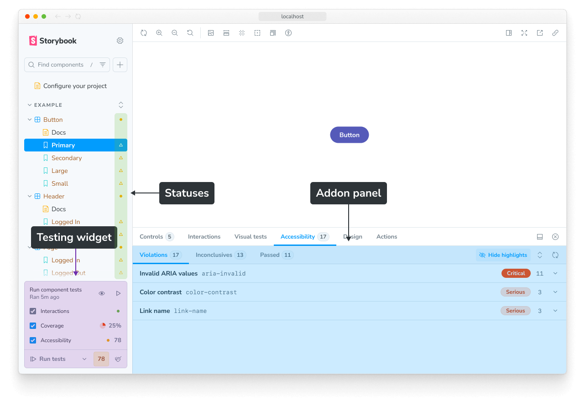
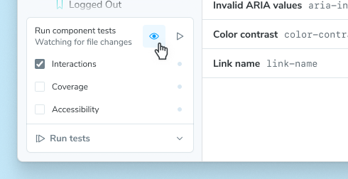
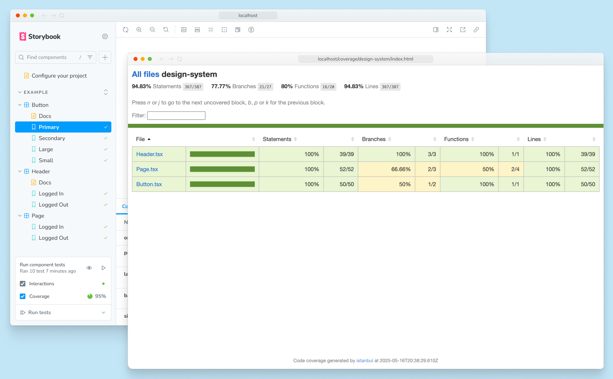
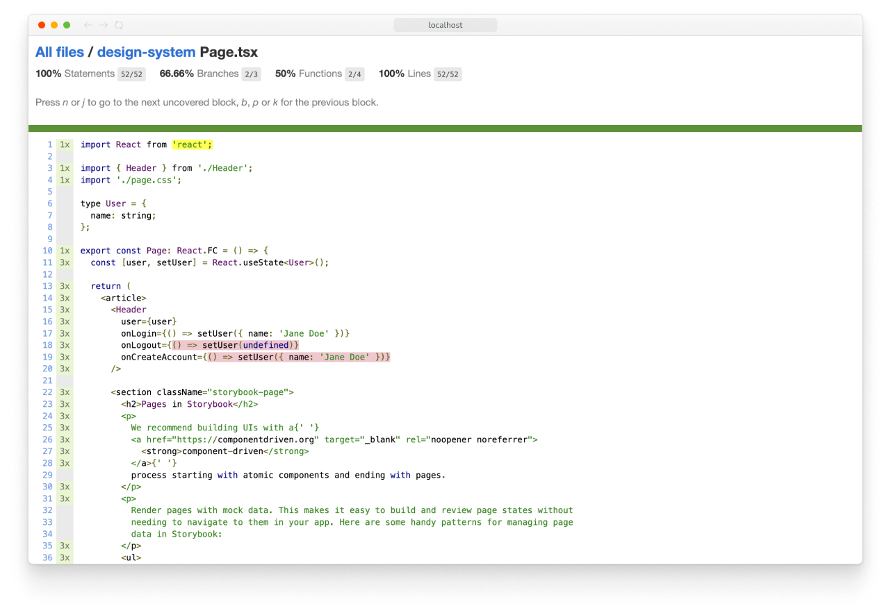
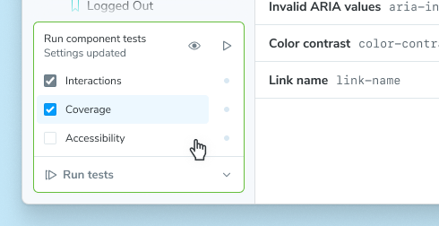
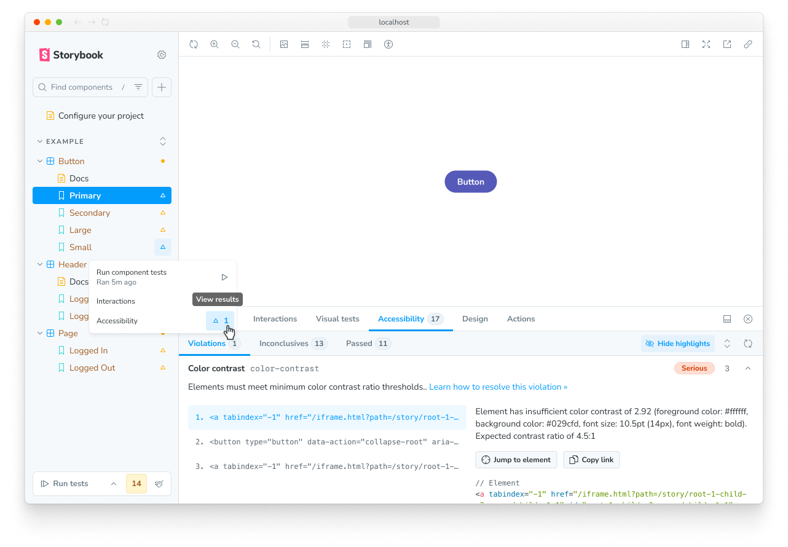
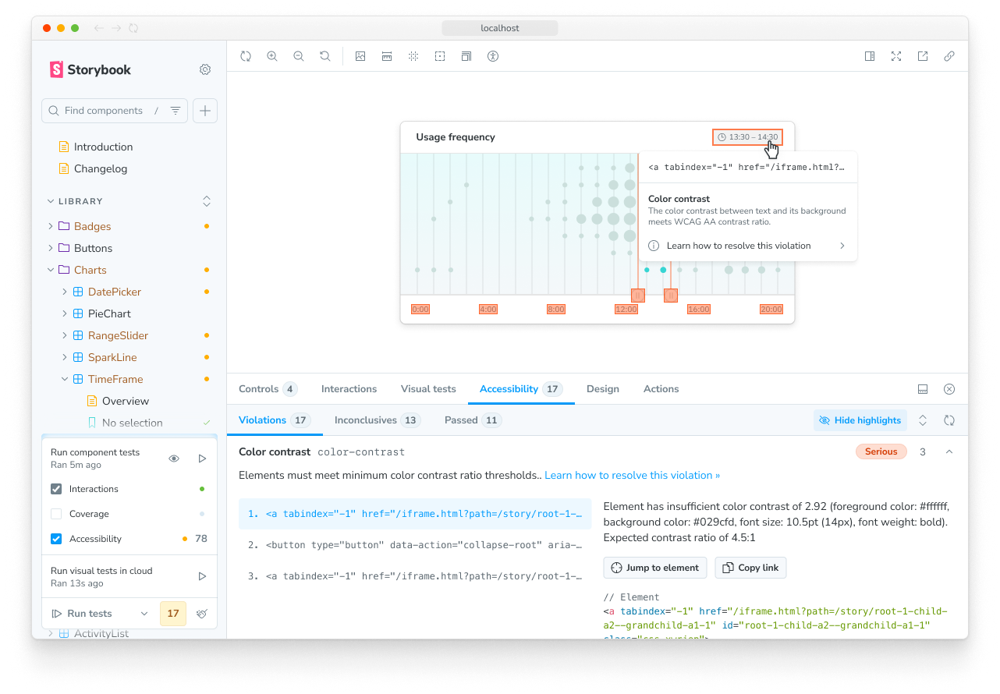

Storybook [stories](../writing-stories/index.mdx) are test cases for your UI components in their various states and configurations. With Storybook, you can develop and test your components at the same time, in multiple ways, with instant feedback.

Storybook tackles UI component testing from a holistic perspective, ensuring that you can not only execute component tests quickly and reliably, but that you also have well established patterns to develop, debug, maintain, and even collaborate on these tests across the development lifecycle.

## Get started

If your project is using Vite, you can likely use the [Vitest addon](./integrations/vitest-addon.mdx) to run your component tests in Storybook. This addon is built on top of [Vitest](https://vitest.dev/), a fast and lightweight test runner that works seamlessly with Vite.

Run this command, which will install and configure the Vitest addon and Vitest:

<CodeSnippets path="addon-test-install.md" />

The full installation instructions, including project requirements, are available in the [Vitest addon documentation](./integrations/vitest-addon.mdx#install-and-set-up).

Once your project is set up, you will see a testing widget in the bottom of your sidebar. After running tests, you will also see test status indicators on sidebar items. Additionally, many tests can be debugged with an addon panel.



If you cannot use the Vitest addon in your project, you can still run tests using the [test-runner](./integrations/test-runner.mdx).

Next, we’ll cover some key concepts of testing in Storybook.

## Key concepts

Testing in Storybook is similar to other testing environments. Most of the knowledge and techniques you’ve been using apply here, too. But there are also some significant improvements.

### Component tests

A component test is a test which:

- Renders a component in the browser for high fidelity
- Simulates a user interacting with actual UI, like an end-to-end (E2E) test
- Only tests a unit (e.g. a single component) of UI, **and** can reach into the implementation to mock things or manipulate data, like a unit test

This combination of using a real browser, simulating behavior, and mocking provides a powerful means of testing the functional aspects of your UI.

In Storybook, the entire testing experience is built around component tests. This means that you can run your tests in the same environment as your stories, with the same tools and techniques.

### Storybook Test

Storybook Test enables real time testing of your stories, through the [Vitest addon](./integrations/vitest-addon.mdx). It uses a Vitest plugin to automatically transform your stories into real Vitest tests, which are then run with Vitest’s browser mode.

### Watch mode

Get instant test feedback as you develop with watch mode. It will watch your code—either the component source or the tests—for changes and automatically re-run only the relevant tests. It’s perfect for test-driven development, where you write your tests first and then the component.

To activate watch mode, press the watch mode button (the eye icon) in the testing widget:



### CI

If you’re not running Storybook Test as part of your CI, you’re missing out on the biggest benefit it provides: catching bugs on PRs before you merge them.

If you are already running `vitest` as part of your CI then your stories should automatically run as tests “for free” when you commit your changes to Git.

If you’re not yet running Vitest in CI, you should set that up. First by adding a new script to your `package.json`:

```json title="package.json"
{ 
  "scripts": {
    "test-storybook": "vitest --project=storybook"
  }
}  
```

Note that this assumes you have a Vitest project called “storybook” for your stories, which is the default configuration when you install Storybook Test. If you’ve renamed it, adjust the script accordingly.

Next, add a new CI workflow. 

<details>
<summary>If you use Github Actions that would look like:</summary>
    
  ```yaml title=".github/workflows/test-storybook.yml"
  name: Storybook Tests
  
  on: [push]
  
  jobs:
    test:
      runs-on: ubuntu-latest
      container:
        # Make sure to grab the latest version of the Playwright image
        # https://playwright.dev/docs/docker#pull-the-image
        image: mcr.microsoft.com/playwright:v1.52.0-noble
      steps:
        - uses: actions/checkout@v4
        
        - name: Setup Node
          uses: actions/setup-node@v4
          with:
            node-version: 22.12.0
        
        - name: Install dependencies
          run: npm ci
        
        - name: Run tests
          run: npm run test-storybook
  ```
</details>

If you are using a different CI provider, please consult our full [CI guide](./in-ci.mdx) for more information.

Storybook Test uses Playwright to render your stories by default. For the fastest experience, you should use [a machine image that has Playwright already installed](https://playwright.dev/docs/docker#pull-the-image) (as in the snippet above).

### Coverage

Code coverage provides insight into which code is tested or not. It functions as a guardrail as you develop, to help be sure your work is covered by the proper tests.

In Storybook Test, you can see the coverage provided by your stories in two ways. First, a summary is displayed in the testing widget. Second, clicking that coverage summary will open a full, interactive report.



In the report, clicking through to a specific component shows the exact branches of code that are covered or not covered:



Each project’s coverage report will look different, but the important things to note are:

1. **The overall line/branch coverage**, which serves as a high-level health check.
2. **Specific lines/branches** that are not covered, which are potential test gaps.

In our point of view, the goal is not to get 100% coverage and fill every gap, but rather to have a barometer to help you judge code/test changes, and for the gaps to inform you of key states or interactions that are untested. For example, if you’re building a prototype you might skip testing altogether, whereas in a critical app you might want to dot every i and cross every t.

Running coverage analysis can slow down your test runs, so it is turned off by default. To activate coverage, check the coverage checkbox in the testing widget.



#### Coverage in CI

And while we’re looking at coverage, update your CI workflow to include it:

```diff
- yarn test
+ yarn test --coverage
```

<Callout variant="info" icon="💡">

Why are we running all tests (`yarn test`) instead of just the Storybook tests (`yarn test-storybook`)? Because a coverage report is most accurate when accounting for all tests in your project, not just the stories you've written.

Seeing [Storybook-specific coverage](./test-coverage.mdx#storybook-ui) can be helpful, but in CI output, you want to see the comprehensive coverage of your project.

</Callout>

This way we can track the coverage change in every PR.

Those are the key concepts you’ll need to test in Storybook. Now, let’s look at the different types of tests you can perform.

## Types of tests

Storybook Test supports a variety of testing types to help you validate your work in multiple dimensions.

### Render tests

The most important tool for testing your components in Storybook is stories that render your components in various states. 

However, you might not be aware that a basic story is also a [smoke test](https://en.wikipedia.org/wiki/Smoke_testing_(software)), which we call a **render test**. The test passes when the story renders successfully and fails when it errors.


Depending on the complexity of your components, you might be able to capture many of your key UI states this way.

### [Interaction tests](./interaction-testing.mdx)

Render tests are a very basic kind of interaction test. To test stateful components or verify interactive behavior, you define a play function for your story:

<CodeSnippets path="interaction-test-simple.md" />

But `play` functions can also be used for setting up state, creating spies, mocking out the network, simulating user interactions with your components, asserting output, and more. They are the meat and potatoes of testing and are the foundation for the rest of your testing journey in Storybook. 

Here’s a more complex example, which includes [spying and mocking](./interaction-testing.mdx#spying-on-functions-with-fn) via the `fn` utility.

<CodeSnippets path="interaction-test-complex.md" />

For more information on how to write interaction tests and mocks using the `play` function, please see the [interaction testing guide](./interaction-testing.mdx#writing-interaction-tests).

### [Accessibility tests](./accessibility-testing.mdx)

Storybook’s [Accessibility (A11y) addon](https://storybook.js.org/addons/@storybook/addon-a11y/) runs a set of automated checks on your stories to help ensure your components can be used by all users, regardless of ability or technology they're using. That means supporting requirements such as: keyboard navigation, screen reader support, usable color contrast, etc.

Accessibility is not only the right thing to do, but it is increasingly mandated. For example, the [European accessibility act](https://ec.europa.eu/social/main.jsp?catId=1202) is scheduled to go into law in June 2025. Similarly in the US, laws like the [Americans with Disabilities Act (ADA)](https://www.ada.gov/) and [Section 508 of the Rehabilitation Act](https://www.section508.gov/) apply to many public-facing services.

To activate accessibility checks alongside your component tests, check the Accessibility checkbox in the testing widget.


Once activated, you will see accessibility failures in the sidebar.



Any failures can be debugged in the Accessibility addon panel.



### [Visual tests](./visual-testing.mdx)

Visual tests are the most efficient way to test your components. With the click of a button you can take snapshots of every story in your Storybook and compare those snapshots to baselines — last known “good” snapshots. Not only does this allow you to check the appearance of your components, but they are also able to check a large subset of component functionality [without having to write or maintain any test code](https://storybook.js.org/blog/visual-testing-is-the-greatest-trick-in-ui-development/)!

Storybook supports cross-browser visual testing natively using [Chromatic](https://www.chromatic.com/storybook/?ref=storybook_site), a cloud service made by the Storybook team. When you enable visual testing, every story is automatically turned into a test. This gives you instant feedback on UI bugs directly in Storybook.


### [Snapshot tests](./snapshot-testing.mdx)

In most cases, the other testing types will provide more coverage with less effort. But there are scenarios where it can be helpful to compare the rendered markup of a story against a known baseline. For example, it can help identify markup changes that trigger rendering errors.

## Reusing stories in other testing tools

Stories are made to be reusable, so you can use them as test cases in popular testing tools.

### [End-to-end](./integrations/stories-in-end-to-end-tests.mdx)

Sometimes you need to test a full workflow, with the full running stack. In those cases, you can still use your stories by importing them within your Playwright or Cypress end-to-end (E2E) tests.

### [Unit](./integrations/stories-in-unit-tests.mdx)

If you prefer, you can reuse your Storybook stories in a traditional testing environment, like Vitest or Jest.

**More testing resources**

* [Vitest addon](./integrations/vitest-addon.mdx) for running tests in Storybook
* [Interaction testing](./interaction-testing.mdx) for user behavior simulation
* [Accessibility testing](./accessibility-testing.mdx) for accessibility
* [Visual testing](./visual-testing.mdx) for appearance
* [Snapshot testing](./snapshot-testing.mdx) for rendering errors and warnings
* [Test coverage](./test-coverage.mdx) for measuring code coverage
* [CI](./in-ci.mdx) for running tests in your CI/CD pipeline
* [End-to-end testing](./integrations/stories-in-end-to-end-tests.mdx) for simulating real user scenarios
* [Unit testing](./integrations/stories-in-unit-tests.mdx) for functionality
* [Test runner](./integrations/test-runner.mdx) to automate test execution
