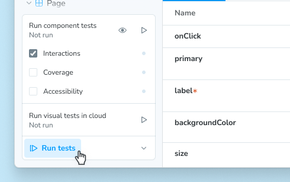

The [test-runner](../test-runner.mdx) was created back in 2021 to enable users to run stories as tests. It is a solution that uses Jest as a runner and Playwright as a browser environment. Over the years, Storybook has evolved and introduced many testing-related concepts, including a [Vitest-based testing solution](./index.mdx), a spiritual successor to the test-runner. Alongside it, we released a testing widget, allowing users to run tests directly from Storybook's UI and get reports such as a11y and coverage.

You **do not** have to change how you write your stories between the test-runner and the Vitest addon.



This guide explains how to migrate an existing project using `@storybook/test-runner` to the `@storybook/addon-vitest`.

## Why migrate?

Migrating to the Vitest addon replaces the previous Jest-based test-runner with a modern, browser-friendly testing stack. It's designed to run stories as tests directly in [Storybook's UI](./index.mdx#storybook-ui) while also integrating with Vitest's CLI and [IDE](./index.mdx#editor-extension) integrations — reducing setup complexity and bringing built-in support for accessibility and coverage. The main benefits are summarized below.

- Vitest is used as a runner instead of Jest, offering faster test execution and better integration with modern JavaScript tooling.
- Stories seamlessly integrate as tests in your Vitest setup, significantly simplifying your component test configuration.
- There is no need to build and run Storybook to run tests, which makes the setup faster and more portable.
- Tests are still tested in a Playwright environment, but in [Vitest's Browser mode](https://vitest.dev/guide/browser/).
- Accessibility testing comes out of the box and integrates with the Storybook testing widget and Accessibility addon panel.
- Code coverage is enabled via Vitest's built-in coverage support. You no longer need instrumentation from the `@storybook/addon-coverage` package, which can make your stories render faster.

For more, please refer to the comparison table in the [Vitest addon guide](./index.mdx#comparison-to-the-test-runner).

## Is my project eligible to upgrade?

The [Vitest addon](./index.mdx) is supported and recommended for React, Preact, Vue, Svelte, and Web Components projects, which use the [Vite builder](../../../builders/vite.mdx) (or the [Next.js framework with Vite](../../../get-started/frameworks/nextjs-vite.mdx)).

If you are using a different renderer (such as Angular) or the Webpack builder, you should continue to use the [test runner](../test-runner.mdx) to test your stories.

## Migration steps

Below you will find the essential steps to migrate from the test-runner to the Vitest addon. Additionally, you can use the [following commit](https://github.com/yannbf/test-runner-migration-example/commit/cb0ddd5137021a7ed25d15f8d23c6c5e2d01513e) as a reference for an example project being migrated.

### 1. Remove test-runner dependencies

Remove the following dependencies:

- `@storybook/test-runner` dependency
- `@storybook/addon-coverage` dependency (if present)

### 2. Remove test-runner related files

Remove the following files:

- `test-runner-jest.config.js` file (if present)
- `.storybook/test-runner.ts` file (if present)
  - If you had configured accessibility testing, this is now done out of the box with the Vitest addon.
  - If you had configured image snapshot testing, check [this FAQ](#what-if-i-am-doing-image-snapshot-testing).
  - If you had configuration for custom, advanced use cases such as using [the `prepare` hook](https://github.com/storybookjs/test-runner#prepare), please reach out on [Discord](https://discord.gg/storybook) or open a [discussion on GitHub](https://github.com/storybookjs/storybook/discussions/new/choose) so we can assist you with the migration.

### 3. Set up `@storybook/addon-vitest`

- Run this command, which will set up all the necessary code for you.
  
  <CodeSnippets path="addon-test-install.md" />
  
- Update the `package.json` script for Storybook tests, replacing the test-runner binary and using Vitest instead:

  ```diff title="package.json"
  {
    "scripts": {
  -    "test-storybook": "test-storybook"
  +    "test-storybook": "vitest --project=storybook"
    }
  }

### 4. Update your CI to run Vitest instead of the test-runner

If you're using the Storybook test-runner in CI, replace its build/serve/wait flow with a single Vitest command. For example, in GitHub Actions:

```diff title=".github/workflows/storybook-tests.yml"
name: 'Storybook Tests'

on: push

jobs:
  test:
    timeout-minutes: 60
    runs-on: ubuntu-latest
    steps:
      - uses: actions/checkout@v4
      - uses: actions/setup-node@v4
        with:
          node-version-file: '.nvmrc'
      - name: Install dependencies
        run: npm ci
      - name: Install Playwright
        run: npx playwright install --with-deps
-      - name: Build Storybook
-        run: npm run build-storybook --quiet
-      - name: Serve Storybook and run tests
-        run: |
-          npx concurrently -k -s first -n "SB,TEST" -c "magenta,blue" \
-            "npx http-server storybook-static --port 6006 --silent" \
-            "npx wait-on tcp:127.0.0.1:6006 && npm run test-storybook --coverage"
+      - name: Run storybook tests
+        run: |
+          npm run test-storybook
```

If you want to generate coverage reports in CI, use the `--coverage` flag with the test script: `npm run test-storybook -- --coverage`.

For other CI providers and for more detailed configuration info, check the [testing in CI guide](../../in-ci.mdx#2-add-a-new-ci-workflow).

## FAQ

### What if I am using Storybook with Webpack or RsPack?

The Vitest addon relies on Vite to transform and run your stories as tests. Which means it only works with Storybook frameworks that use Vite.

If your Storybook project uses a non-Vite builder like Webpack or RsPack, you will need to keep using the `@storybook/test-runner` for your component testing.

Most Webpack-based Storybook projects which do not have complex configurations can [migrate to Vite](../../../builders/vite#migrating-from-webpack) relatively easily. If you are using Next.js, you can use the [`@storybook/nextjs-vite` framework](../../../get-started/frameworks/nextjs-vite.mdx) to use Vite with Storybook.

### What if I am using Jest for my unit tests?

You can still migrate to use Vitest, but if you believe you won't benefit from it, you can keep using the `@storybook/test-runner`.

### What if I am doing image snapshot testing?

There are solutions for image snapshot testing that integrate with the Storybook testing widget:

- On the cloud with the [Visual tests addon](../../visual-testing.mdx)
- Locally with [`storybook-addon-vis`](https://github.com/repobuddy/visual-testing)