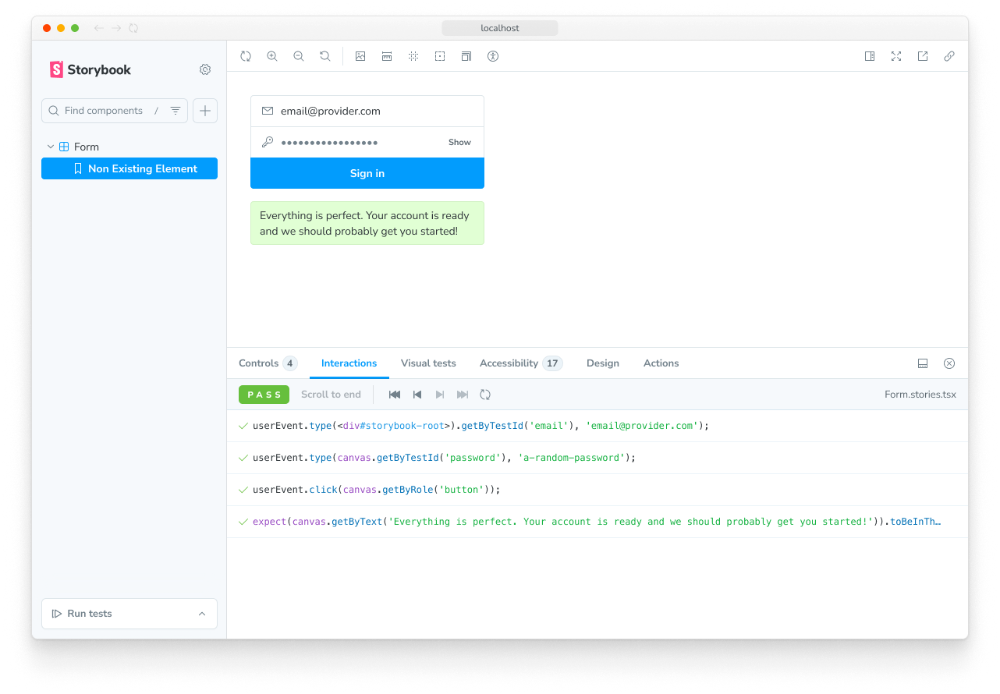
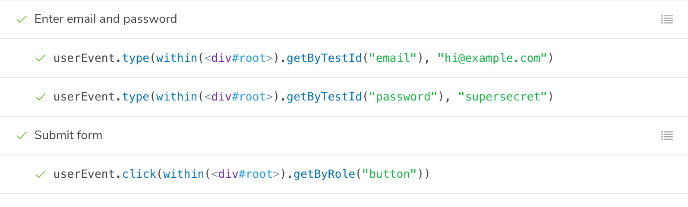
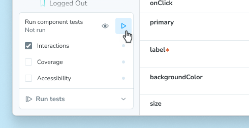
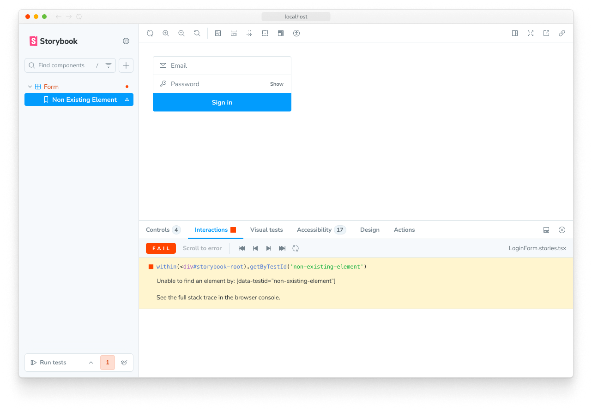

In Storybook, interaction tests are built as part of a [story](../writing-stories/index.mdx). That story renders the component with the necessary props and context to place it in an initial state. You then use a [play function](../writing-stories/play-function.mdx) to simulate user behavior like clicks, typing, and submitting a form and then assert on the end result.

You can preview and debug your interaction tests using the Interactions panel in the Storybook UI. They can be automated using the Vitest addon, allowing you to run tests for your project in Storybook, terminal, or CI environments.

<Video src="../_assets/writing-tests/component-interaction-testing.mp4" />

## Writing interaction tests

Every story you write can be render tested. A **render test** is a simple version of an interaction test that only tests the ability of a component to render successfully in a given state. That works fine for relatively simple, static components like a Button. But for more complex, interactive components, you can go farther.

You can simulate user behavior and assert on functional aspects like DOM structure or function calls using the `play` function. When a component is tested, the play function is ran and any assertions within it are validated.

In this example, the EmptyForm story tests the render of the LoginForm component and the FilledForm story tests the form submission:

<CodeSnippets path="login-form-with-play-function.md" />



There’s a lot going on in that code sample, so let’s walk through the APIs one-by-one.

### Querying the `canvas`

`canvas` is a queryable element containing the story under test, which is provided as a parameter of your play function. You can use `canvas` to find specific elements to interact with or assert on. All query methods come directly from Testing Library and take the form of `<type><subject>`.

The available types are summarized in this table and fully documented in the [Testing Library docs](https://testing-library.com/docs/queries/about#types-of-queries):

| Type of Query         | 0 Matches     | 1 Match        | >1 Matches   | Awaited |
| --------------------- | ------------- | -------------- | ------------ | ------- |
| **Single Element**    |               |                |              |         |
| `getBy...`            | Throw error   | Return element | Throw error  | No      |
| `queryBy...`          | Return `null` | Return element | Throw error  | No      |
| `findBy...`           | Throw error   | Return element | Throw error  | Yes     |
| **Multiple Elements** |               |                |              |         |
| `getAllBy...`         | Throw error   | Return array   | Return array | No      |
| `queryAllBy...`       | Return `[]`   | Return array   | Return array | No      |
| `findAllBy...`        | Throw error   | Return array   | Return array | Yes     |

The subjects are listed here, with links to their full Testing Library documentation:

1. [`ByRole`](https://testing-library.com/docs/queries/byrole) — Find elements by their accessible role
2. [`ByLabelText`](https://testing-library.com/docs/queries/bylabeltext) — Find elements by their associated label text
3. [`ByPlaceholderText`](https://testing-library.com/docs/queries/byplaceholdertext) — Find elements by their placeholder value
4. [`ByText`](https://testing-library.com/docs/queries/bytext) — Find elements by the text they contain
5. [`ByDisplayValue`](https://testing-library.com/docs/queries/bydisplayvalue) — Find `input`, `textarea`, or `select` elements by their current value
6. [`ByAltText`](https://testing-library.com/docs/queries/byalttext) — Find elements with the given `alt` attribute value
7. [`ByTitle`](https://testing-library.com/docs/queries/bytitle) — Find elements with the given `title` attribute value
8. [`ByTestId`](https://testing-library.com/docs/queries/bytestid) — Find elements with the given `data-testid` attribute value

<Callout variant="info" icon="💡">

Note the order of this list! We (and [Testing Libary](https://testing-library.com/docs/queries/about#priority)) highly encourage you to query for elements in a way that resembles the way a real person would interact with your UI. For example, finding elements by their accessible role helps ensure that the most people can use your component. While using `data-testid` should be a last resort, only after trying every other approach.

</Callout>

Putting that altogether, some typical queries might look like:

```js
// Find the first element with a role of button with the accessible name "Submit"
await canvas.findByRole('button', { name: 'Submit' });

// Get the first element with the text "An example heading"
canvas.getByText('An example heading');

// Get all elements with the role of listitem
canvas.getAllByRole('listitem');
```

<If renderer="web-components">

#### Querying within shadow DOM

If your components use the shadow DOM, you can query elements within a shadow root with the help of [`shadow-dom-testing-library`](https://github.com/konnorrogers/shadow-dom-testing-library), which provides versions of the queries above that can pierce the shadow boundary. For example, `findByRole` → `findByShadowRole`, `getByText` → `getByShadowText`, and so on.

With a bit of configuration, you can use these queries in your play function. Add the following code to your `.storybook/preview.js|ts` file:

<CodeSnippets path="shadow-dom-testing-library-in-preview.md" />

Now, those queries are available on the `canvas` object in your `play` function:

<CodeSnippets path="shadow-dom-testing-library-in-story.md" />

{/* END only web-components */}
</If>

### Simulating behavior with `userEvent`

After querying for elements, you will likely need to interact with them to test your component’s behavior. For this we use the `userEvent` utility, which is provided as a parameter of your play function. This utility simulates user interactions with the component, such as clicking buttons, typing in inputs, and selecting options.

There are many methods available on `userEvent`, which are detailed in the [`user-event` documentation](https://testing-library.com/docs/user-event/intro#writing-tests-with-userevent). This table will highlight some of the commonly-used methods.

| Method            | Description                                                                                                              |
| ----------------- | ------------------------------------------------------------------------------------------------------------------------ |
| `click`           | Clicks the element, calling a click() function<br />`await userEvent.click(<element>)`                                   |
| `dblClick`        | Clicks the element twice<br />`await userEvent.dblClick(<element>)`                                                      |
| `hover`           | Hovers an element<br />`await userEvent.hover(<element>)`                                                                 |
| `unhover`         | Unhovers out of element<br />`await userEvent.unhover(<element>)`                                                         |
| `tab`             | Presses the tab key<br />`await userEvent.tab()`                                                                         |
| `type`            | Writes text inside inputs or textareas<br />`await userEvent.type(<element>, 'Some text');`                              |
| `keyboard`        | Simulates keyboard events<br />`await userEvent.keyboard('{Shift}');`                                                    |
| `selectOptions`   | Selects the specified option(s) of a select element<br />`await userEvent.selectOptions(<element>, ['1','2']);`          |
| `deselectOptions` | Removes the selection from a specific option of a select element<br />`await userEvent.deselectOptions(<element>, '1');` |
| `clear`           | Selects the text inside inputs or textareas and deletes it<br />`await userEvent.clear(<element>);`                      |

<Callout variant="warning">

`userEvent` methods should *always* be `await`ed inside of the play function. This ensures they can be properly logged and debugged in the Interactions panel.

</Callout>

### Asserting with `expect`

Finally, after querying for elements and simulating behavior, you can make assertions on the result which are validated when running the test. For this we use the `expect` utility, which is available via the `storybook/test` module:

```js
import { expect } from 'storybook/test';
```

The `expect` utility here combines the methods available in [Vitest’s `expect`](https://vitest.dev/api/expect.html) as well as those from [`@testing-library/jest-dom`](https://github.com/testing-library/jest-dom#custom-matchers) (which, despite the name, also work in Vitest tests). There are many, many methods available. This table will highlight some of the commonly-used methods.

| Method                                                                                 | Description                                                                                                                          |
| -------------------------------------------------------------------------------------- | ------------------------------------------------------------------------------------------------------------------------------------ |
| [`toBeInTheDocument()`](https://github.com/testing-library/jest-dom#tobeinthedocument) | Checks if the element is in the DOM<br />`await expect(<element>).toBeInTheDocument()`                                               |
| [`toBeVisible()`](https://github.com/testing-library/jest-dom#tobevisible)             | Checks if the element is visible to the user<br />`await expect(<element>).toBeVisible()`                                            |
| [`toBeDisabled()`](https://github.com/testing-library/jest-dom#tobedisabled)           | Checks if an element is disabled<br />`await expect(<element>).toBeDisabled()`                                                       |
| [`toHaveBeenCalled()`](https://vitest.dev/api/expect.html#tohavebeencalled)            | Checks that a spied function was called<br />`await expect(<function-spy>).toHaveBeenCalled()`                                       |
| [`toHaveBeenCalledWith()`](https://vitest.dev/api/expect.html#tohavebeencalledwith)    | Checks that a spied function was called with specific parameters<br />`await expect(<function-spy>).toHaveBeenCalledWith('example')` |

<Callout variant="warning">

`expect` calls should *always* be `await`ed inside of the play function. This ensures they can be properly logged and debugged in the Interactions panel.

</Callout>

### Spying on functions with `fn`

When your component calls a function, you can spy on that function to make assertions on its behavior using the `fn` utility from Vitest, available via the `storybook/test` module:

```js
import { fn } from 'storybook/test'
```

Most of the time, you will use `fn` as an `arg` value when writing your story, then access that `arg` in your test:

<CodeSnippets path="interaction-test-fn-mock-spy.md" />

### Run code before the component gets rendered

<If notRenderer="angular">

You can execute code before rendering by using the `mount` function in the `play` method.

Here's an example of using the [`mockdate`](https://github.com/boblauer/MockDate) package to mock the [`Date`](https://developer.mozilla.org/en-US/docs/Web/JavaScript/Reference/Global_Objects/Date), a useful way to make your story render in a consistent state.

<CodeSnippets path="mount-basic.md" />

<Callout variant="warning">

There are two requirements to use the `mount` function:

1. You *must* destructure the mount property from the `context` (the argument passed to your play function). This makes sure that Storybook does not start rendering the story before the play function begins.
2. Your Storybook framework or builder must be configured to transpile to ES2017 or newer. This is because destructuring statements and async/await usages are otherwise transpiled away, which prevents Storybook from recognizing your usage of `mount`.

</Callout>

<If renderer={['react', 'vue', 'svelte']}>

#### Create mock data before rendering

You can also use `mount` to create mock data that you want to pass to the component. To do so, first create your data in the play function and then call the `mount` function with a component configured with that data. In this example, we create a mock `note` and pass its `id` to the Page component, which we call `mount` with.

<CodeSnippets path="mount-advanced.md" />

<Callout variant="info">

When you call `mount()` with no arguments, the component is rendered using the story’s render function, whether the [implicit default](../api/csf/index.mdx#default-render-functions) or the [explicit custom definition](../api/csf/index.mdx#custom-render-functions).

When you mount a specific component inside the `mount` function like in the example above, the story’s render function will be ignored. This is why you must forward the `args` to the component.

</Callout>

</If>
{/* END React, Vue, Svelte-only */}

</If>
{/* END non-Angular-only */}

<If renderer="angular">

You can execute code before the component is rendered by defining an asynchronous [`beforeEach` function](#beforeeach) for the story.

</If>

### Run code before each story in a file

Sometimes you might need to run the same code before each story in a file. For instance, you might need to set up the initial state of the component or modules. You can do this by adding an asynchronous `beforeEach` function to the component meta.

You can return a cleanup function from the `beforeEach` function, which will run **after** each story, when the story is remounted or navigated away from.

<Callout variant="info">

Generally, you should reset component and module state in the [preview file's `beforeAll` or `beforeEach` functions](#set-up-or-reset-state-for-all-tests), to ensure it applies to your entire project. However, if a component's needs are particularly unique, you can use the returned cleanup function in the component meta `beforeEach` to reset the state as needed.

</Callout>

<CodeSnippets path="before-each-in-meta-mock-date.md" />

### Set up or reset state for all tests

When you [alter a component's state](#run-code-before-the-component-gets-rendered), it's important to reset that state before rendering another story to maintain isolation between tests.

There are two options for resetting state, `beforeAll` and `beforeEach`.

#### `beforeAll`

The `beforeAll` function in the preview file (`.storybook/preview.js|ts`) will run once before any stories in the project and will _not_ re-run between stories. Beyond its initial run when kicking off a test run, it will not run again unless the preview file is updated. This is a good place to bootstrap your project or run any setup that your entire project depends on, as in the example below.

You can return a cleanup function from the `beforeAll` function, which will run before re-running the `beforeAll` function or during the teardown process in the test runner.

<CodeSnippets path="before-all-in-preview.md" />

#### `beforeEach`

Unlike `beforeAll`, which runs only once, the `beforeEach` function in the preview file (`.storybook/preview.js|ts`) will run before each story in the project. This is best used for resetting state or modules that are used by all or most of your stories. In the example below, we use it to reset the mocked Date.

You can return a cleanup function from the `beforeEach` function, which will run **after** each story, when the story is remounted or navigated away from.

<CodeSnippets path="before-each-in-preview.md" />

<Callout variant="info">

It is _not_ necessary to restore `fn()` mocks, as Storybook will already do that automatically before rendering a story. See the [`parameters.test.restoreMocks` API](../api/parameters.mdx#restoremocks) for more information.

</Callout>

### Make assertions after interactions

Sometimes, you may need to make assertions or run code after the component has been rendered and interacted with.

#### `afterEach`

`afterEach` runs after the story is rendered and the play function has completed. It can be used at the project level in the preview file (`.storybook/preview.js|ts`), at the component level in the component meta, or at the story level in the story definition. This is useful for making assertions after the component has been rendered and interacted with, such as running checks on the final rendered output or logging information.

Like the `play` function, `afterEach` receives the `context` object, which contains the `args`, `canvas`, and other properties related to the story. You can use this to make assertions or run code after the story has been rendered.

<CodeSnippets path="after-each-in-meta.md" />

<Callout variant="info">

You should not use `afterEach` to reset state in your tests. Because it runs after the story, resetting state here could prevent you from seeing the correct end state of your story. Instead, use the [`beforeEach`'s returned cleanup function](#beforeeach) to reset state, which will run only when navigating between stories to preserve the end state.

</Callout>

### Group interactions with the step function

For complex flows, it can be worthwhile to group sets of related interactions together using the step function. This allows you to provide a custom label that describes a set of interactions:

<CodeSnippets path="storybook-interactions-step-function.md" />

This will show your interactions nested in a collapsible group:



### Mocked modules

If your component depends on modules that are imported into the component file, you can mock those modules to control and assert on their behavior. This is detailed in the [mocking modules guide](../writing-stories/mocking-data-and-modules/mocking-modules.mdx).
You can then import the mocked module (which has all of the helpful methods of a [Vitest mocked function](https://vitest.dev/api/mock.html)) into your story and use it to assert on the behavior of your component:

<CodeSnippets path="storybook-test-fn-mock-spy.md" />

## Running interaction tests

If you're using the [Vitest addon](./integrations/vitest-addon/index.mdx), you can run your interaction tests in these ways:

- [In the Storybook UI](./integrations/vitest-addon/index.mdx#storybook-ui)
- [In your editor](./integrations/vitest-addon/index.mdx#editor-extension)
- [Via the CLI](./integrations/vitest-addon/index.mdx#cli)
- [In CI environments](./integrations/vitest-addon/index.mdx#in-ci)

In the Storybook UI, you can run interaction tests by clicking the **Run component tests** button in the expanded testing widget in the sidebar or by opening the context menu (three dots) on a story or folder and selecting **Run component tests**.



If you're using the [test-runner](./integrations/test-runner.mdx), you can run your interaction tests in the terminal or in CI environments.

## Debugging interaction tests

If you check the Interactions panel, you'll see the step-by-step flow defined in your play function for each story. It also offers a handy set of UI controls to pause, resume, rewind, and step through each interaction.

Any test failures will also show up here, making it easy to quickly pinpoint the exact point of failure. In this example, the logic is missing to set the `submitted` state after pressing the Log in button.

<Video src="../_assets/writing-tests/interactions-debug.mp4" />

### Permalinks for reproductions

Because Storybook is a webapp, anyone with the URL can reproduce the failure with the same detailed information without any additional environment configuration or tooling required.



Streamline interaction testing further by automatically [publishing Storybook](../sharing/publish-storybook.mdx) in pull requests. That gives teams a universal reference point to test and debug stories.

## Automate with CI

When you run your tests with the Vitest addon, automating those tests is as simple as running your tests in your CI environment. Please see the [testing in CI guide](./in-ci.mdx) for more information.

If you cannot use the Vitest addon, you can still run your tests in CI using the [test-runner](./integrations/test-runner.mdx).

## Troubleshooting

#### What’s the difference between interaction tests and visual tests?

Interaction tests can be expensive to maintain when applied wholesale to every component. We recommend combining them with other methods like visual testing for comprehensive coverage with less maintenance work.

#### What's the difference between interaction tests and using Vitest + Testing Library alone?

Interaction tests integrate Vitest and Testing Library into Storybook. The biggest benefit is the ability to view the component you're testing in a real browser. That helps you debug visually, instead of getting a dump of the (fake) DOM in the command line or hitting the limitations of how JSDOM mocks browser functionality. It's also more convenient to keep stories and tests together in one file than having them spread across files.

**More testing resources**

* [Vitest addon](./integrations/vitest-addon/index.mdx) for running tests in Storybook
* [Accessibility testing](./accessibility-testing.mdx) for accessibility
* [Visual testing](./visual-testing.mdx) for appearance
* [Snapshot testing](./snapshot-testing.mdx) for rendering errors and warnings
* [Test coverage](./test-coverage.mdx) for measuring code coverage
* [CI](./in-ci.mdx) for running tests in your CI/CD pipeline
* [End-to-end testing](./integrations/stories-in-end-to-end-tests.mdx) for simulating real user scenarios
* [Unit testing](./integrations/stories-in-unit-tests.mdx) for functionality
* [Test runner](./integrations/test-runner.mdx) to automate test execution
