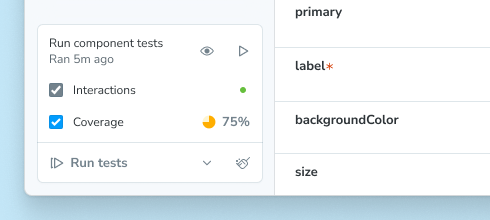
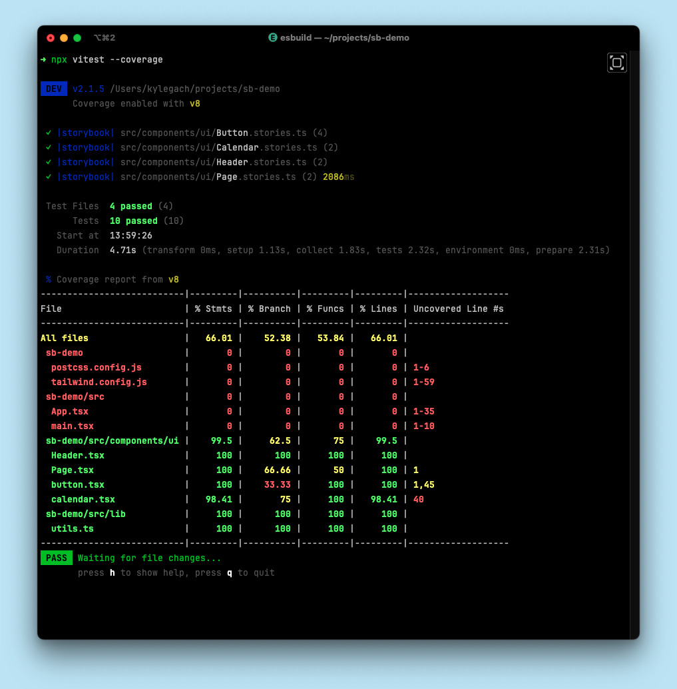
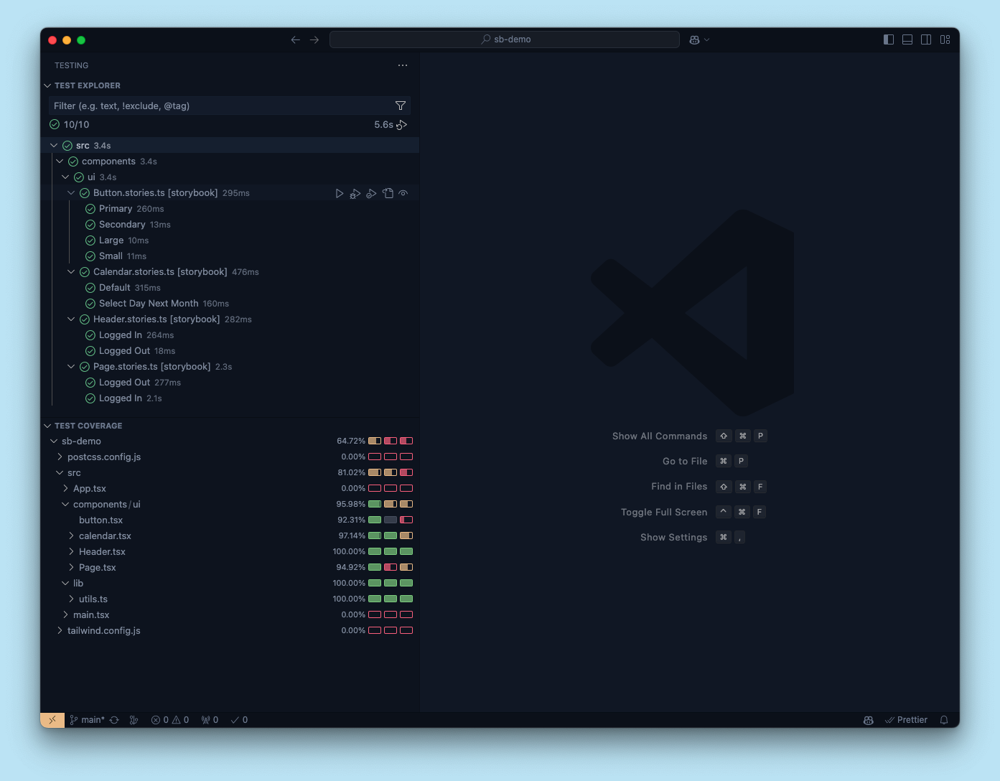

Test coverage is the practice of measuring whether existing tests fully cover your code. It marks which conditions, logic branches, functions and variables in your code are and are not being tested.

Coverage tests examine the instrumented code against a set of industry-accepted best practices. They act as the last line of QA to improve the quality of your test suite.

Each project’s coverage report will look different, but the important things to note are:

1. **The overall line/branch coverage**, which serves as a high-level health check.
2. **Specific lines/branches** that are not covered, which are potential test gaps.

When you run component tests with the [Vitest addon](./integrations/vitest-addon/index.mdx), it can generate a coverage report. The result is summarized in the testing widget, showing the percentage of statements covered by your tested stories.



<Callout variant="info">

If you cannot use the Vitest addon in your project, you can still generate code coverage using the test-runner. Follow the instructions in the [test-runner documentation](./integrations/test-runner.mdx#generate-code-coverage) to set up the test-runner with code coverage in your project.

</Callout>

## Set up

Coverage is included in the [Vitest addon](./integrations/vitest-addon/index.mdx) and, when enabled, will be calculated when running component tests for your project. To enable coverage, check the coverage checkbox in the testing widget.


Before coverage can be calculated, you may need to install a support package corresponding to your [coverage provider](#coverage-provider):

<CodeSnippets path="vitest-plugin-install-coverage-support-packages.md" />

## Usage

Because coverage is built into the Vitest addon, you can use it everywhere you run your tests.

### Storybook UI

When you enable coverage in the Storybook UI, the coverage report will be generated and summarized in the testing widget after you run your tests. You can see the percentage of statements covered by your tested stories, as well as whether the coverage meets the [watermarks](#watermarks).

Additionally, the full coverage report will be served at the `/coverage/index.html` route of your running Storybook.


The report is interactive. You can click through to a component to view its source and see which parts of your code are covered by tests or not:


<Callout variant="info" icon="⚠️">

It's important to understand that the coverage reported in the Storybook UI has three important limitations:

1. Coverage is calculated using the stories you've written, not the entire codebase. In other words, it will not include any other Vitest tests.
2. Coverage can only be calculated for all stories in your project, not for an individual story or a group of stories.
3. Coverage is not calculated while watch mode is activated. When coverage is enabled, enabling watch mode will disable coverage.

</Callout>

### CLI

Like the rest of Storybook Test, coverage is built on top of Vitest. Which means you can generate a coverage report using the [Vitest CLI](https://vitest.dev/guide/cli.html).

Assuming you run your tests with a package script like this:

```json title="package.json"
{
  "scripts": {
    "test-storybook": "vitest --project=storybook"
  }
}
```

Then you can generate a coverage report with:

<CodeSnippets path="vitest-plugin-run-with-coverage.md" />



The coverage report will be saved to the [configured coverage reports directory](https://vitest.dev/config/#coverage-reportsdirectory) (`./coverage`, by default) in your project.

<Callout variant="info">

The above command will only calculate coverage for the stories you've written, not the entire codebase.

Because coverage is most accurate when accounting for all tests in your project, you can also run coverage for all tests in your project with:

```sh
npx vitest --coverage
```

</Callout>

### Editor extension

Coverage is also available through Vitest's [IDE integrations](https://vitest.dev/guide/ide.html). You can calculate and display coverage results directly in your editor.



<Callout variant="info">

Note that this coverage will include *all* tests in your project, not just the stories you've written.

</Callout>

### CI

To generate coverage reports in your CI pipeline, you can use the [CLI](#cli).

For example, here's a simplified GitHub Actions workflow that runs your tests and generates a coverage report:

```yaml title=".github/workflows/test-storybook.yml"
name: Storybook Tests
on: push
jobs:
  test:
    steps:
      - uses: actions/checkout@v4
      - uses: actions/setup-node@v4
        with:
          node-version: '20.x'
      - name: Install dependencies
        run: yarn
        # 👇 This will run all Vitest tests, including Storybook tests
      - name: Run tests
        run: yarn test --coverage
```

<Callout variant="info" icon="💡">

Why are we running all tests (`yarn test`) instead of just the Storybook tests (`yarn test-storybook`)? Because a coverage report is most accurate when accounting for all tests in your project, not just the stories you've written.

Seeing [Storybook-specific coverage](#storybook-ui) can be helpful, but in CI output, you want to see the comprehensive coverage of your project.

</Callout>

For more on testing in CI, see the [dedicated guide](./in-ci.mdx).

## Configuration

### Coverage provider

You can choose which provider, [v8](https://v8.dev/blog/javascript-code-coverage) (default) or [Istanbul](https://istanbul.js.org/), to use for coverage calculation by setting the `coverage.provider` option in your Vitest config:

```ts title="vitest.config.ts"
import { defineConfig } from 'vitest/config';

export default defineConfig({
  // ...
  test: {
    // ...
    coverage: {
      // ...
      provider: 'istanbul', // 'v8' is the default
    },
  },
});
```

### Watermarks

Both coverage providers support [watermarks](https://vitest.dev/config/#coverage-watermarks), which are threshold values for coverage. The low watermark is the minimum coverage required to pass the test, and the high watermark is the minimum coverage required to be considered good. A coverage percentage between the low and high watermarks will be considered acceptable but not ideal.

In the testing widget, the coverage summary will show the percentage of statements covered by your tested stories, as well as whether the coverage meets the watermarks. Below the low watermark, the icon will be red, between the low and high watermarks, it will be orange, and above the high watermark, it will be green.


To configure the watermarks, you can adjust the Vitest config:

```ts title="vitest.config.ts"
import { defineConfig } from 'vitest/config';
 
export default defineConfig({
  // ...
  test: {
    // ...
    coverage: {
      // ...
      watermarks: {
        // These are the default values
        statements: [50, 80],
      },
    },
  },
});
```

### Additional configuration

You can find more configuration options for coverage in the [Vitest documentation](https://vitest.dev/config/#coverage).

When calculating coverage in the Storybook UI, the following options are always ignored:

- `enabled`
- `clean`
- `cleanOnRerun`
- `reportOnFailure`
- `reporter`
- `reportsDirectory`

**More testing resources**

* [Vitest addon](./integrations/vitest-addon/index.mdx) for running tests in Storybook
* [Interaction testing](./interaction-testing.mdx) for user behavior simulation
* [Accessibility testing](./accessibility-testing.mdx) for accessibility
* [Visual testing](./visual-testing.mdx) for appearance
* [Snapshot testing](./snapshot-testing.mdx) for rendering errors and warnings
* [CI](./in-ci.mdx) for running tests in your CI/CD pipeline
* [End-to-end testing](./integrations/stories-in-end-to-end-tests.mdx) for simulating real user scenarios
* [Unit testing](./integrations/stories-in-unit-tests.mdx) for functionality
* [Test runner](./integrations/test-runner.mdx) to automate test execution
