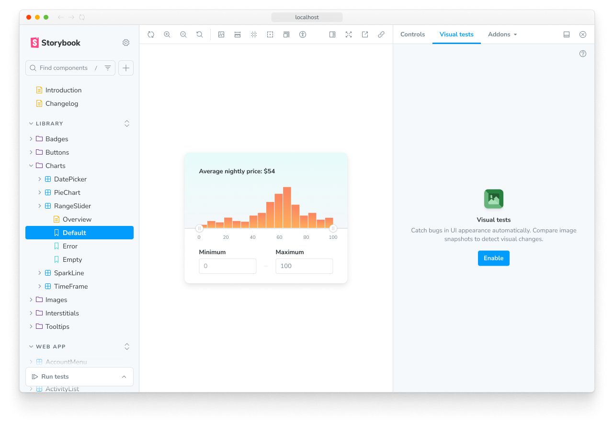
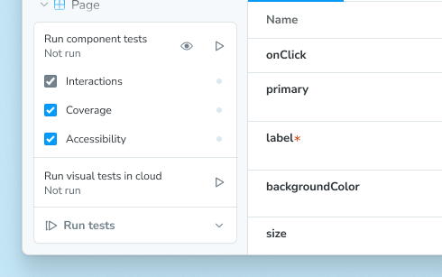
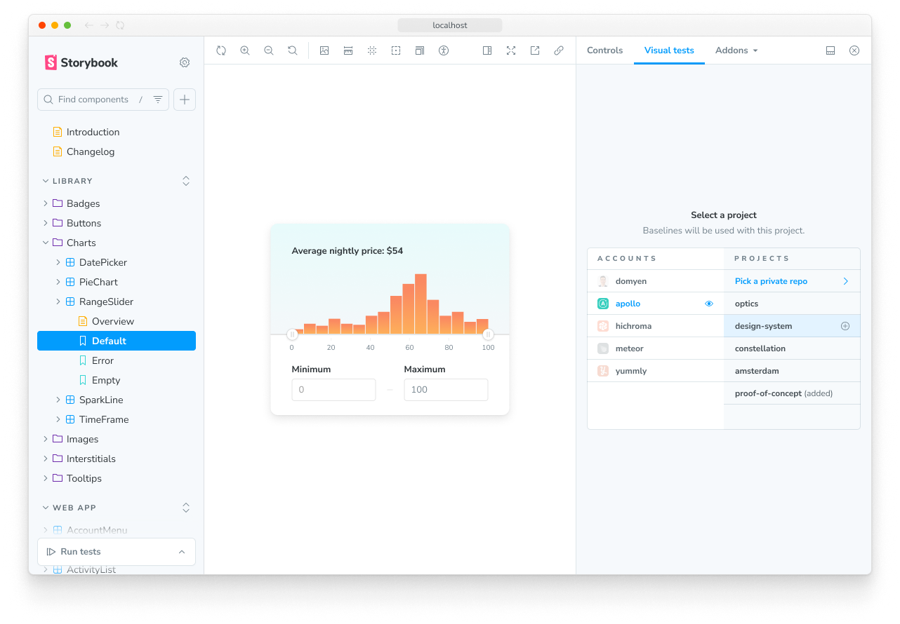
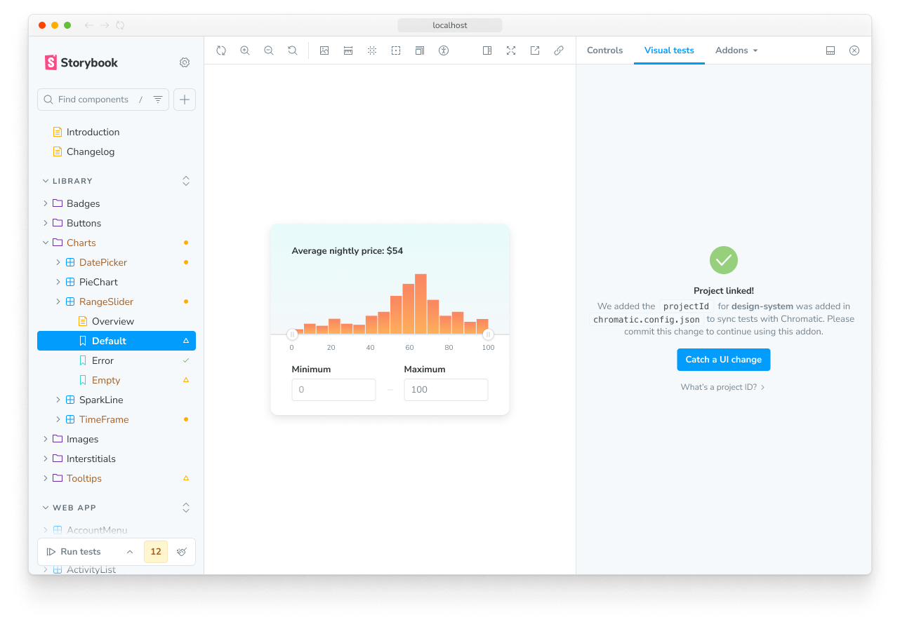
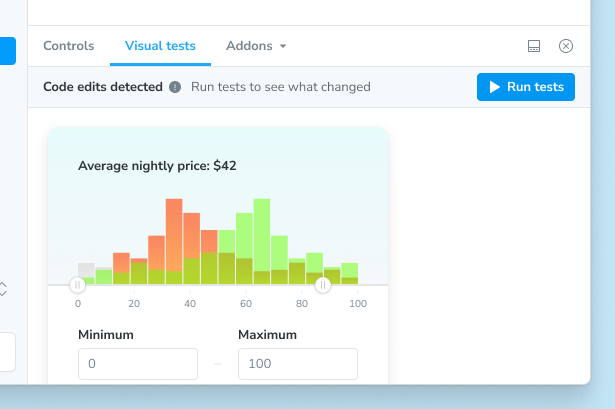
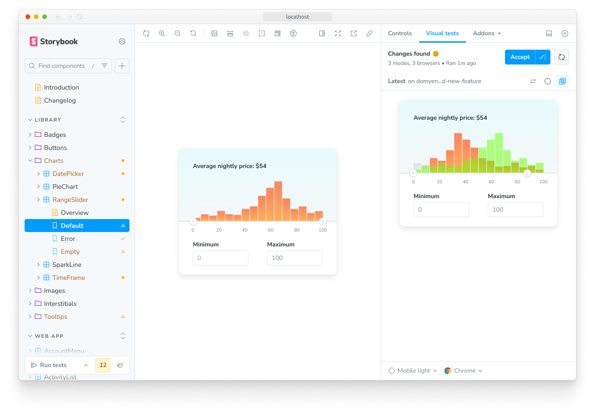
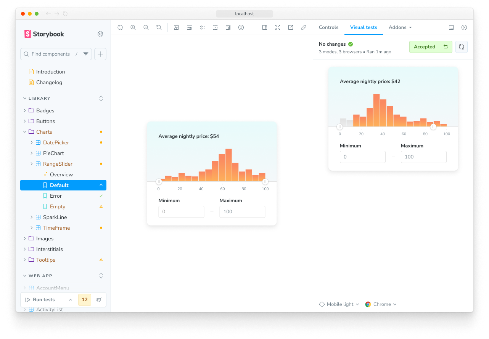

Visual tests are the most efficient way to test your components. With the click of a button you can take snapshots of every story in your Storybook and compare those snapshots to baselines — last known “good” snapshots. Not only does this allow you to check the appearance of your components, but they are also able to check a large subset of component functionality [without having to write or maintain any test code](https://storybook.js.org/blog/visual-testing-is-the-greatest-trick-in-ui-development/)!

Storybook supports cross-browser visual testing natively using [Chromatic](https://www.chromatic.com/storybook/?ref=storybook_site), a cloud service made by the Storybook team. When you enable visual testing, every story is automatically turned into a test. This gives you instant feedback on UI bugs directly in Storybook.

<Video src="../_assets/writing-tests/component-visual-testing-optimized.mp4" />

## Install the addon

Add visual tests to your project by installing `@chromatic-com/storybook`, the official addon by Storybook maintainers:

<CodeSnippets path="chromatic-storybook-add.md" />

## Enable visual tests

When you start Storybook, you'll see a new addon panel for Visual Tests where you can run tests and view results.



<Callout variant="info">

Already using the [Vitest addon](./integrations/vitest-addon/index.mdx)? In the expanded testing widget, you’ll now see a Visual tests section:



Clicking the Run tests button at the bottom will run *all* tests, both component and visual.

</Callout>

First, sign in to your Chromatic account. If you do not have an account, you can create one as part of the sign in process.

Once signed in, you will see your Chromatic account(s) and their projects. Either select one from the list or create a new one.



Now that you have linked your project to the addon, you can press the “Catch a UI change” button to run your first build of visual tests.



That first build will create the baseline snapshots for your stories, which will be compared against when you run visual tests again.

## Run visual tests

After you have made a code change, there are two ways to run visual tests in Storybook.

In the expanded testing widget in the sidebar, press the run button in the Visual tests section.


Or, in the Visual tests addon panel, press the run button in the top right corner of the panel.



Either method will send your stories to the cloud to take snapshots and detect visual changes.

## Review changes

If there are visual changes in your stories, they will be 🟡 highlighted in the sidebar. Click the story and go to the Visual Tests addon panel to see which pixels changed.

If the changes are intentional, ✅ accept them as baselines locally. If the changes aren't intentional, fix the story and rerun the tests using the rerun button.



When you finish accepting changes as baselines in the addon, you're ready to push the code to your remote repository. This will sync baselines to the cloud for anyone who checks out your branch.



## Automate with CI

The addon is designed to be used in tandem with CI. We recommend using the addon to check for changes during development and then running visual tests in CI as you get ready to merge.

Changes you accept as baselines in the addon will get auto-accepted as baselines in CI so you don’t have to review twice.

1. Add a step to your CI workflow to run Chromatic.
   - [GitHub Actions](https://chromatic.com/docs/github-actions?ref=storybook_docs)
   - [GitLab Pipelines](https://chromatic.com/docs/gitlab?ref=storybook_docs)
   - [Bitbucket Pipelines](https://chromatic.com/docs/bitbucket-pipelines?ref=storybook_docs)
   - [CircleCI](https://chromatic.com/docs/circleci?ref=storybook_docs)
   - [Travis CI](https://chromatic.com/docs/travisci?ref=storybook_docs)
   - [Jenkins](https://chromatic.com/docs/jenkins?ref=storybook_docs)
   - [Azure Pipelines](https://chromatic.com/docs/azure-pipelines?ref=storybook_docs)
   - [Custom CI provider](https://chromatic.com/docs/custom-ci-provider?ref=storybook_docs)
2. Configure your CI to include environment variables to authenticate with Chromatic (project token).

## PR checks

Once you successfully set up Chromatic in CI, your pull/merge requests will be badged with a UI Tests check. The badge notifies you of test errors or UI changes that need to be verified by your team. Make the check required in your Git provider to prevent accidental UI bugs from being merged.


## Configure

The addon includes configuration options covering most use cases by default. You can also fine-tune the addon configuration to match your project's requirements via the [`./chromatic.config.json`](https://www.chromatic.com/docs/visual-tests-addon/#configure) file. Below is a shortlist of addon-specific options and examples of how to use them. View the full list of [options](https://www.chromatic.com/docs/configure/#options).

| Option            | Description                                                                                                                            |
| ----------------- | -------------------------------------------------------------------------------------------------------------------------------------- |
| `projectId`       | Automatically configured. Sets the value for the project identifier<br />`"projectId": "Project:64cbcde96f99841e8b007d75"`             |
| `buildScriptName` | Optional. Defines the custom Storybook build script<br />`"buildScriptName": "deploy-storybook"`                                       |
| `debug`           | Optional. Output verbose debugging information to the console.<br />`"debug": true`                                                    |
| `zip`             | Optional. Recommended for large projects. Configures the addon to deploy your Storybook to Chromatic as a zip file.<br />`"zip": true` |

```json title="./chromatic.config.json"
{
  "buildScriptName": "deploy-storybook",
  "debug": true,
  "projectId": "Project:64cbcde96f99841e8b007d75",
  "zip": true
}
```

## FAQs

### What’s the difference between visual tests and snapshot tests?

[Snapshot tests](./snapshot-testing.mdx) compare the rendered markup of every story against known baselines. This means the test compares blobs of HTML and not what the user actually sees. Which in turn, can lead to an increase in false positives as code changes don’t always yield visual changes in the component.

Visual tests compare the rendered pixels of every story against known baselines. Because you're testing the same thing your users actually experience, your tests will be richer and easier to maintain.

**More testing resources**

* [Vitest addon](./integrations/vitest-addon/index.mdx) for running tests in Storybook
* [Interaction testing](./interaction-testing.mdx) for user behavior simulation
* [Accessibility testing](./accessibility-testing.mdx) for accessibility
* [Snapshot testing](./snapshot-testing.mdx) for rendering errors and warnings
* [Test coverage](./test-coverage.mdx) for measuring code coverage
* [CI](./in-ci.mdx) for running tests in your CI/CD pipeline
* [End-to-end testing](./integrations/stories-in-end-to-end-tests.mdx) for simulating real user scenarios
* [Unit testing](./integrations/stories-in-unit-tests.mdx) for functionality
* [Test runner](./integrations/test-runner.mdx) to automate test execution
