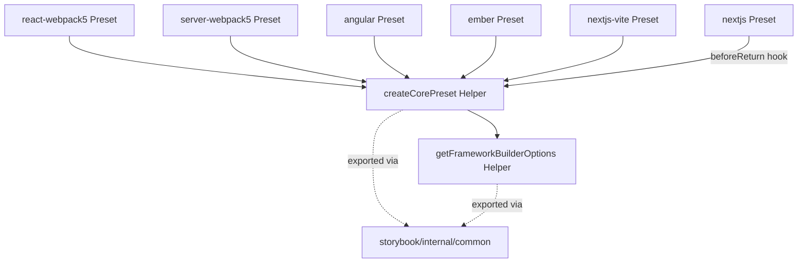
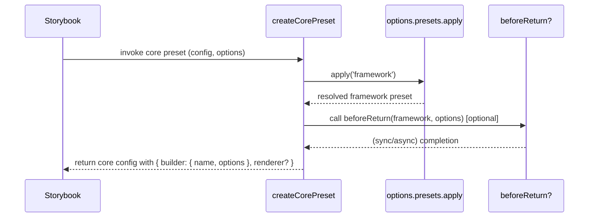

# Issue Report: Extract Shared Core Preset Factory

## Issue

> **Project:** [Storybook](https://github.com/storybookjs/storybook)
> **Issue:** [#34258 — Duplicate Code: Framework core Preset Builder Options Pattern](https://github.com/storybookjs/storybook/issues/34258)  
> **Status:** Implemented, tested locally, pull request submitted.

The Storybook repo contains one `core` preset handler per framework package. Every such handler is responsible for:

1. Resolving the active framework preset value from the preset system.
2. Setting the builder (name + forwarded builder options).
3. Optionally declaring a renderer.

At the time this issue was filed, six framework packages contained an identical structural block:

```ts
export const core: PresetProperty<'core'> = async (config, options) => {
  const framework = await options.presets.apply('framework');
  return {
    ...config,
    builder: {
      name: <BUILDER_NAME>,
      options: typeof framework === 'string' ? {} : framework.options.builder || {},
    },
    renderer: <RENDERER_NAME>, // optional
  };
};
```

The duplicated inline ternary `typeof framework === 'string' ? {} : framework.options.builder || {}` was the primary concern raised in the issue. However, the broader structural duplication, the full `core` preset handler pattern, is a deeper maintainability problem where any future change to how the `core` preset is constructed (e.g., adding a new field, changing how the framework is resolved, or changing the builder options merge strategy) must be applied to six separate files.

This is a **maintainability issue**, not a functional defect. All six implementations were equivalent at the time of discovery, but that equivalence is accidental and fragile.

## Requirements

- The resolved builder options must remain identical to the pre-refactor values for all supported framework configurations.
- The duplicated builder-options resolution logic must be extracted into a shared helper function.
- The full `core` preset handler pattern must be extractable into a factory function usable by all six framework packages.
- The factory must support an optional async hook for frameworks that require additional side effects before returning (e.g. Next.js loading webpack config).
- The helper must safely handle `null`/`undefined` framework values without throwing.
- All six framework `core` preset handlers must use the shared factory.
- Both helpers must be covered by automated unit tests.
- All helpers must be placed in the existing shared utility layer (`storybook/internal/common`) following project conventions.

## Source Code Files

### Directly involved files

- `code/frameworks/react-webpack5/src/preset.ts`: Webpack 5 preset for React. Declares `core` with duplicated structure.
  - Replacing full `core` handler with `createCorePreset(...)` call.

- `code/frameworks/server-webpack5/src/preset.ts`: Webpack 5 preset for Server renderer. Same pattern.
  - Replacing full `core` handler with `createCorePreset(...)` call.

- `code/frameworks/angular/src/preset.ts`: Webpack 5 preset for Angular. Same pattern, no renderer.
  - Replacing full `core` handler with `createCorePreset(...)` call.

- `code/frameworks/ember/src/preset.ts`: Webpack 5 preset for Ember. Same pattern, no renderer.
  - Extending existing import, replacing `core` with `createCorePreset(...)`.

- `code/frameworks/nextjs-vite/src/preset.ts`: Vite preset for Next.js. Same pattern.
  - Replacing full `core` handler with `createCorePreset(...)` call.

- `code/frameworks/nextjs/src/preset.ts`: Webpack 5 preset for Next.js. Same pattern + async `configureConfig` side effect.
  - Using `createCorePreset(...)` with `beforeReturn` hook.

- `code/core/src/common/utils/get-builder-options.ts`: Shared common utility. Exports `getBuilderOptions(options)`.
  - Adding `getFrameworkBuilderOptions`, `CreateCorePresetOptions`, and `createCorePreset`.

### Indirectly involved files (no changes required)

- `code/core/src/common/index.ts`: Re-exports everything from `get-builder-options.ts` via `export * from './utils/get-builder-options'`. All new exports are automatically included.

- `code/core/src/types/modules/core-common.ts`: Defines `Preset`, `CoreConfig`, `Options`, and `PresetPropertyFn`, the types used by the new helpers.

### New files

- `code/core/src/common/utils/get-builder-options.test.ts`: Unit tests for `getFrameworkBuilderOptions` (2 cases) and `createCorePreset` (4 cases).
  - 6 tests total.

## Design of the Fix

### Strategy

Two helpers are introduced, both in `code/core/src/common/utils/get-builder-options.ts`:

1. **`getFrameworkBuilderOptions(framework: Preset)`** — a pure synchronous function that extracts builder options from a resolved framework preset value. This solves the inline ternary duplication.

2. **`createCorePreset(options: CreateCorePresetOptions)`** — a factory function that encapsulates the entire `core` preset handler pattern. It calls `getFrameworkBuilderOptions` internally. Framework packages use this factory instead of writing the full async function, expressing only what is unique to them: the builder name, an optional renderer name, and an optional async hook.

Placing both in `get-builder-options.ts` is appropriate because:

- The file already handles the closely related concern of resolving builder options.
- `createCorePreset` depends directly on `getFrameworkBuilderOptions`.
- The existing barrel re-export in `index.ts` includes both automatically.
- All six framework packages can already import from `storybook/internal/common`.

### The `beforeReturn` hook

Most framework presets map cleanly onto the `{ builderName, rendererName }` pattern. The Next.js webpack preset is an exception: it must call `configureConfig(...)` after resolving the framework but before returning. Rather than leaving Next.js outside the factory (which would create an inconsistency), the `beforeReturn` hook allows this side effect to be expressed as part of the factory call while keeping the factory itself generic.

### Diagrams

#### Dependency diagram



#### Sequence Diagram



## Fix Source Code

### `get-builder-options.ts`

```ts
import type {
  CoreConfig,
  Options,
  Preset,
  PresetPropertyFn,
} from "storybook/internal/types";

// --- existing getBuilderOptions function unchanged ---

export function getFrameworkBuilderOptions(
  framework: Preset,
): Record<string, any> {
  return typeof framework === "string"
    ? {}
    : (framework?.options?.builder ?? {});
}

export interface CreateCorePresetOptions {
  builderName: string;
  rendererName?: string;
  beforeReturn?: (framework: Preset, options: Options) => Promise<void> | void;
}

export function createCorePreset({
  builderName,
  rendererName,
  beforeReturn,
}: CreateCorePresetOptions): PresetPropertyFn<"core"> {
  return async (config, options) => {
    const framework = await options.presets.apply("framework");

    if (beforeReturn) {
      await beforeReturn(framework, options);
    }

    return {
      ...config,
      builder: {
        name: builderName,
        options: getFrameworkBuilderOptions(framework),
      },
      ...(rendererName !== undefined ? { renderer: rendererName } : {}),
    };
  };
}
```

### Framework preset files — before / after

**Simpler cases:** react-webpack5, server-webpack5, angular, ember, nextjs-vite

```diff
-export const core: PresetProperty<'core'> = async (config, options) => {
-  const framework = await options.presets.apply('framework');
-  return {
-    ...config,
-    builder: {
-      name: fileURLToPath(import.meta.resolve('@storybook/builder-webpack5')),
-      options: typeof framework === 'string' ? {} : framework.options.builder || {},
-    },
-    renderer: fileURLToPath(import.meta.resolve('@storybook/react/preset')),
-  };
-};
+export const core = createCorePreset({
+  builderName: fileURLToPath(import.meta.resolve('@storybook/builder-webpack5')),
+  rendererName: fileURLToPath(import.meta.resolve('@storybook/react/preset')),
+});
```

**Special case:** nextjs - uses `beforeReturn` hook

```diff
-export const core: PresetProperty<'core'> = async (config, options) => {
-  const framework = await options.presets.apply<StorybookConfig['framework']>('framework');
-  // Load the Next.js configuration before we need it in webpackFinal...
-  await configureConfig({
-    baseConfig: {},
-    nextConfigPath: typeof framework === 'string' ? undefined : framework.options.nextConfigPath,
-  });
-  return {
-    ...config,
-    builder: {
-      name: fileURLToPath(import.meta.resolve('@storybook/builder-webpack5')),
-      options: { ...(typeof framework === 'string' ? {} : framework.options.builder || {}) },
-    },
-    renderer: fileURLToPath(import.meta.resolve('@storybook/react/preset')),
-  };
-};
+export const core = createCorePreset({
+  builderName: fileURLToPath(import.meta.resolve('@storybook/builder-webpack5')),
+  rendererName: fileURLToPath(import.meta.resolve('@storybook/react/preset')),
+  // Load the Next.js configuration before we need it in webpackFinal...
+  beforeReturn: async (framework) => {
+    await configureConfig({
+      baseConfig: {},
+      nextConfigPath: typeof framework === 'string' ? undefined : framework.options?.nextConfigPath,
+    });
+  },
+});
```

### Validation results

| Check                                  | Result                      |
| -------------------------------------- | --------------------------- |
| `get-builder-options.test.ts`          | **6/6 tests pass** (141 ms) |
| Linter on all 8 modified/created files | **No errors**               |
| Behaviour change                       | **None** - pure refactor    |

## Submit the Fix

This Pull Request [storybook!34310](https://github.com/storybookjs/storybook/pull/34310) was submitted to Storybook project's Github.
