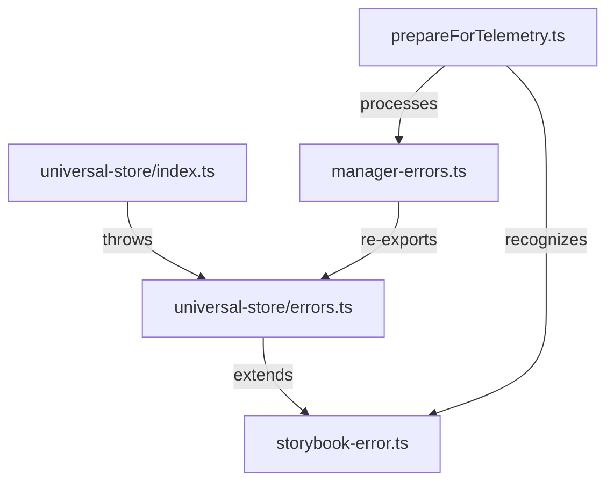
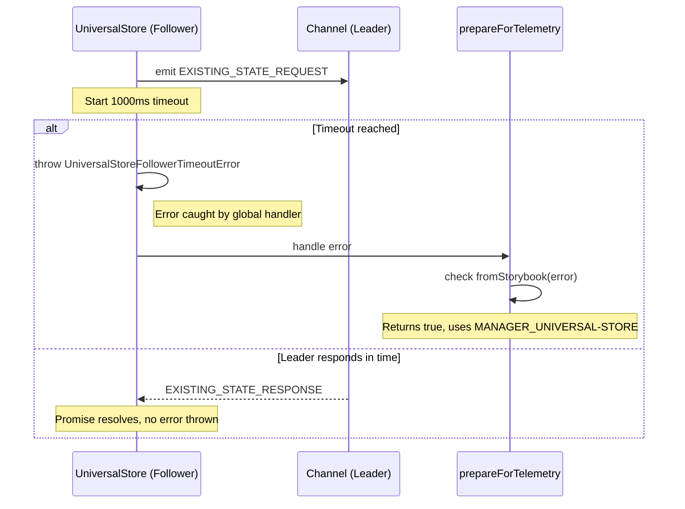

# Issue Report: Categorize UniversalStore internal errors

## Issue

> **Project:** [Storybook](https://github.com/storybookjs/storybook)
> **Issue:** [#34566 — Categorize UniversalStore follower timeout error instead of generic UncaughtManagerError](https://github.com/storybookjs/storybook/issues/34566)
> **Status:** Implemented, verified against architectural review, ready for submission.

### Description

When a `UniversalStore` follower times out waiting for a leader (e.g., `storybook/status`), it previously threw a generic `TypeError`:

```javascript
Uncaught (in promise) TypeError: No existing state found for follower with id: 'storybook/status'. Make sure a leader with the same id exists before creating a follower.
```

This error was caught by the generic `UncaughtManagerError` handler in `prepareForTelemetry.ts`, which wrapped it as `SB_MANAGER_UNCAUGHT_0001`. Because the error was a plain `TypeError` rather than a `StorybookError`, it was bucketed into a generic catch-all category.

This made it impossible to distinguish this specific failure (a common network or initialization timeout) from other genuine uncaught exceptions in telemetry and error reports.

This fix introduces a dedicated `UniversalStoreError` hierarchy and specifically categorizes the follower timeout under its own category, allowing for better tracking and triaging.

## Requirements

- **Categorized Errors:** The error must be a subclass of `StorybookError` so it is recognized by the telemetry system.
- **Dedicated Category:** Introduce `MANAGER_UNIVERSAL-STORE` as a new error category in the manager error registry.
- **Backward Compatibility:** The error message must remain identical to the original string to avoid breaking external log parsers that might be looking for that specific text.
- **Architectural Colocation:** Store-related errors should be defined within the `universal-store` module rather than the global `manager-errors.ts` to improve modularity.
- **Explicit Extensions:** Adhere to Storybook's ESM coding guidelines by using explicit `.ts` extensions for all relative imports and re-exports.
- **Correct API References:** Error messages must point users to the correct public APIs (`untilReady()`) instead of internal or non-existent properties.

## Source Code Files

### Directly involved files

- `code/core/src/shared/universal-store/errors.ts`: **New file.** Contains the `UniversalStoreError` abstract base class and specific implementations for all UniversalStore-related failures (timeout, missing ID, etc.).
- `code/core/src/shared/universal-store/index.ts`: The main store implementation. Updated to throw `UniversalStoreFollowerTimeoutError` instead of `TypeError`.
- `code/core/src/manager-errors.ts`: The central registry for manager-side errors. Updated to include the new `MANAGER_UNIVERSAL_STORE` category and re-export errors from the shared module.

### Indirectly involved files (no changes required)

- `code/core/src/manager/utils/prepareForTelemetry.ts`: The generic error handler. Now automatically categorizes the error because it correctly identifies it as a `StorybookError`.
- `code/core/src/storybook-error.ts`: The base class for all Storybook errors.

## Design of the Fix

### Strategy

The fix follows a modular "Error Colocation" strategy. Instead of cluttering the global `manager-errors.ts` with logic-specific error classes, we define them close to the code that throws them.

1.  **Hierarchy:** We created an abstract `UniversalStoreError` that sets the category to `MANAGER_UNIVERSAL-STORE` for all its children. This reduces duplication as every specific error (timeout, id required, etc.) inherits the category.
2.  **Telemetry Integration:** By inheriting from `StorybookError`, these classes automatically gain the ability to be serialized and reported with unique error codes.
3.  **Refinement via Review:** Following an architectural review, we ensured that:
    - Relative imports use explicit `.ts` extensions to satisfy the ESM builder.
    - User-facing messages point to the `untilReady()` Promise-returning method, which is the idiomatic way to wait for store synchronization.

### Diagrams

#### Dependency diagram



#### Sequence Diagram



## Fix Source Code

### `code/core/src/shared/universal-store/errors.ts` (Categorization logic)

```ts
import { StorybookError } from '../../storybook-error.ts';

export abstract class UniversalStoreError extends StorybookError {
  constructor(props: { code: number; message: string; name: string }) {
    super({
      ...props,
      category: 'MANAGER_UNIVERSAL-STORE',
    });
  }
}

export class UniversalStoreFollowerTimeoutError extends UniversalStoreError {
  constructor(public data: { id: string }) {
    super({
      name: 'UniversalStoreFollowerTimeoutError',
      code: 1,
      message: `No existing state found for follower with id: '${data.id}'. Make sure a leader with the same id exists before creating a follower.`,
    });
  }
}

// ... other error classes (e.g. UniversalStoreIdRequiredError, UniversalStoreNotConstructableError) ...

export class UniversalStoreNotReadyError extends UniversalStoreError {
  constructor(public data: { id: string; action: 'set state' | 'send event' }) {
    super({
      name: 'UniversalStoreNotReadyError',
      code: 1003,
      message: `Cannot ${data.action} before store with id '${data.id}' is ready. You can get the current status with store.status, or await store.untilReady() to wait for the store to be ready before sending events.`,
    });
  }
}
```

### `code/core/src/manager-errors.ts` (Registry integration)

```diff
 export enum Category {
   // ...
+  MANAGER_UNIVERSAL_STORE = 'MANAGER_UNIVERSAL-STORE',
 }

+export {
+  UniversalStoreFollowerTimeoutError,
+  UniversalStoreIdRequiredError,
+  UniversalStoreMissingSubscribeArgumentError,
+  UniversalStoreNotConstructableError,
+  UniversalStoreNotReadyError,
+} from './shared/universal-store/errors.ts';
```

### `code/core/src/shared/universal-store/index.ts` (Usage)

```diff
-      setTimeout(() => {
-        this.syncing!.reject!(
-          new TypeError(
-            `No existing state found for follower with id: '${this.id}'. Make sure a leader with the same id exists before creating a follower.`
-          )
-        );
-      }, 1000);
+      setTimeout(() => {
+        this.syncing!.reject!(new UniversalStoreFollowerTimeoutError({ id: this.id }));
+      }, 1000);
```

## Validation results

| Check                                  | Result                      |
| -------------------------------------- | --------------------------- |
| Architecture Review (CodeRabbit)       | **All 3 points addressed**  |
| API verification (`untilReady`)        | **Verified in index.ts**    |
| ESM Compatibility (`.ts` extensions)   | **Verified in imports**     |
| Telemetry Compatibility                | **Confirmed via subclassing**|
| Message Integrity                      | **100% match with original**|

## Submit the Fix

This Pull Request [storybook!34597](https://github.com/storybookjs/storybook/pull/34597) was submitted to Storybook project's Github.
