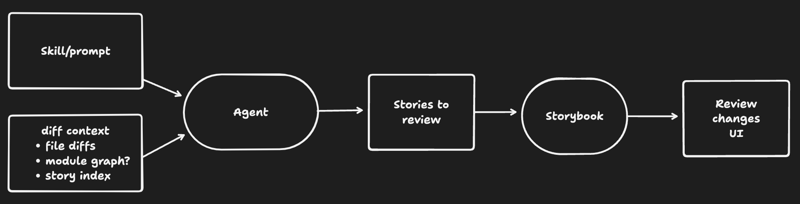

# SB inner loop agentic diff

Appetite: Large Batch
Teams: DX, Design, Storybook
Status: Scheduled
Objective: Chromatic is Integral to the Agentic Workflow (https://www.notion.so/Chromatic-is-Integral-to-the-Agentic-Workflow-3186e816203480fcaca6f0d14fd5506a?pvs=21)
Betting Periods: SC168
Betting Priority: Time Sensitive
Accountable: Michael Shilman
Assignees: Yann Braga, Gert Hengeveld
Contributors: Valentin Palkovic, Gert Hengeveld, Michael Arestad, Dominic Nguyen
Supercycle: SC168

**_🛗 Elevator Pitch:_** _Storybook adds a focused review page for agentic UI changes, where the agent highlights the stories most worth checking and the developer can zoom out to the broader changeset. This gives teams a faster inner-loop review experience without committing to local visual diffing or pretending the signal is perfect._

# ⚠️ **Problem**

> As a developer using an agent to change UI, I want Storybook to point me to the stories most likely to matter, so that I can judge the agent's work without having to hunt for them.

Today, Storybook can show a broad set of stories that may have been affected by a code change and this generates noise for the reviewer.

For example, if I change a single UI state of a component, it will show me all of the stories for that component regardless of whether they have changed visually. There are also more pathological changes where I change an underlying utility function whose library (e.g. `date_helpers.ts`) that’s referenced but not used by many components and all of those components’ stories get shown.

It’s worth noting that both of these failure modes are more useful than having to browse through the app to find the changes, and also somewhat more useful than having to hunt through every possible story.

However, it is less than ideal because still requires hunting through stories to find what matters, which can contribute to review fatigue. If we really want to nail inner-loop rapid iteration, we need to do better.

### 🪺 Why now?

We are betting on the inner loop as our core value prop, but the [SB review changes](https://www.notion.so/SB-review-changes-3196e816203480478bdac1ae1576817c?pvs=21) showed that this problem is much harder than anticipated. If we want to have a good inner loop solution for Storybook 11 in September, we should de-risk this now. That will give us one more supercycle if necessary to iterate.

### 🪹 Why not now?

The strongest reason not to do this now is that we may still be guessing. The current feature has not yet produced a clearly persuasive workflow, and an agent-selected shortlist might be better, worse, or simply confusing in a different way.

# 🏕️ Field OKR

**Objective:** Storybook's inner-loop review workflow feels fast, focused, and persuasive for agentic UI changes.

**Key Result:** In user evaluation, end users prefer the new review flow over the current changed-stories baseline.

# 🧮 Solution Proposal

Build a focused Storybook review page for agentic UI changes. Instead of asking the end user to inspect the full changed-stories list first, Storybook opens on an agent-selected shortlist of the stories most likely to matter, with an easy way to zoom out to the broader changeset.

1. The agent reviews the code diff, Storybook metadata, and changed-stories output.
2. The agent selects a short list of stories that are most relevant to inspect.
3. Storybook opens a review page that shows those stories in one place.
4. The review page also allows the user to "zoom out" to the broader changeset, so the end user can get a more complete picture of what might have changed.

### Stretch

- Pair the inner-loop review page with Chromatic as the more reliable CI backstop.

### 📦 Deliverables

- Agent selection workflow: prompt, skill, or context that produces a useful shortlist of stories to review.
- Storybook mechanism for opening a dynamically selected story set, likely through URL params, POST request, or MCP.
- Focused review page that shows the agent-selected stories and the before and after states in one place and provides a zoom-out path to the broader changeset.
- User evaluation comparing the new flow against the current changed-stories baseline.

[Technical Review Meeting Notes](https://www.notion.so/Technical-Review-Meeting-Notes-c5c6e81620348241b54a015217a3ff50?pvs=21)

### 🙅‍♂️ **No-gos**

- No local VRT

### 🚀 Release Plan

- Prototype, test on users, iterate, and ship as experimental in 10.5

### 🎓 DX Deliverables

- Blog post if we feel the feature is good enough to promote after user testing.

### 🧑‍🔬 Research, **Rabbit Holes, and Unknowns**

- Can the agent produce a useful shortlist of stories from the code diff, Storybook metadata, and changed-stories output, and what context does it need to make good selections?
- Should dynamically selected story sets be opened through URL params or MCP?
- What is the right review-page UI for scanning the selected stories and zooming out to the broader changeset?
- Would this be a core Storybook feature or an addon?
- How do we find good users to test with and evaluate this in an unbiased way?
- Can we package this information for Chromatic somehow to use it as an input signal to help make its UI review more useful?

---

# 👣 Kick-Off Meeting

Please try to schedule the meeting in the week prior to the start of the project (typically during cool-down). That way everyone involved has a few days to think about it and raise questions before things actually get started.

# 📼 Meeting Recording

_Replace this text with the meeting recording link and passcode._

# 👥 Attendees

- _Attendee 1_
- _Attendee 2_

# 🗺️ Project Planning

<aside>
❗

The purpose of the meeting is to get alignment from the team, establish clear and actionable milestones, and assign responsibilities to the folks involved.

</aside>

## 🧭 Establishing Alignment

### ✅ **Success Looks Like…**

### 💩 Pre-Mortem

## 🔖 Milestones

<aside>
❗

You may instead write these directly into the Linear project’s overview tab.

</aside>

### Milestone:

**Complete By:**

**Owner:**

-

---

# 🏁 Project Conclusion

<aside>
📣

Please post a link to this conclusion in [#ch-changelog](https://chromaticqa.slack.com/archives/C0A3EACU8G4) with a short customer-facing message.

</aside>

**Wrap-up Video**

_Please embed a Loom walkthrough of the changes here._

**What We Accomplished**

**What Was Not Accomplished**

**What’s Next?**

**Documents Produced**
